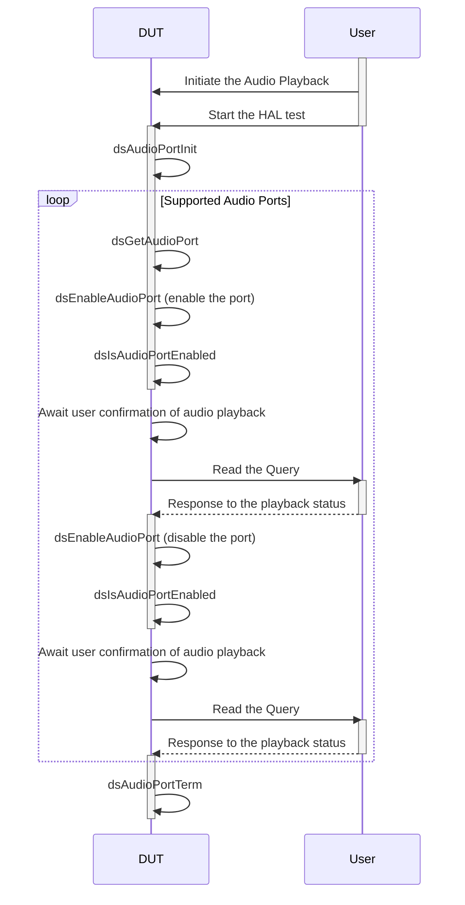
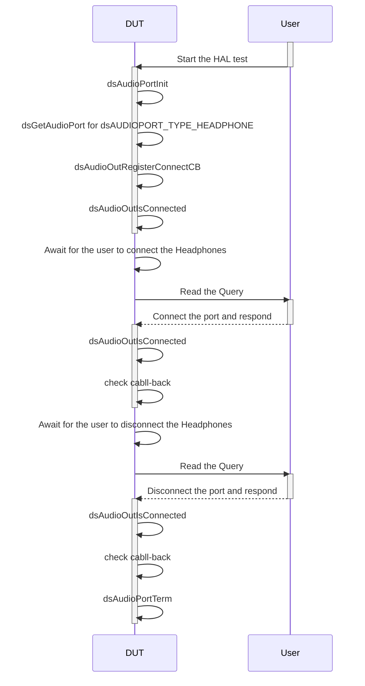
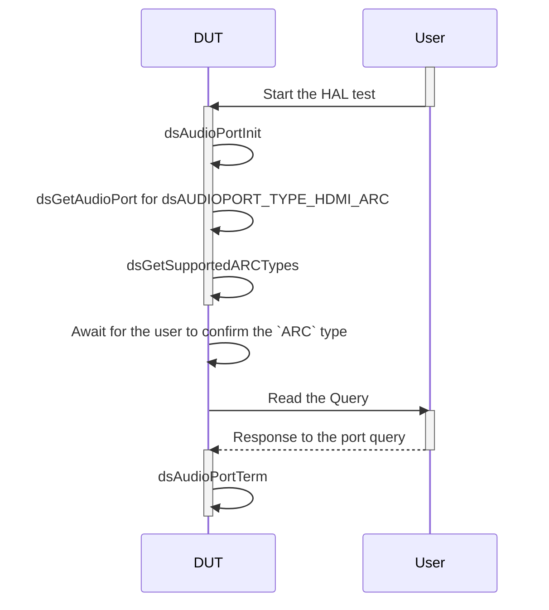
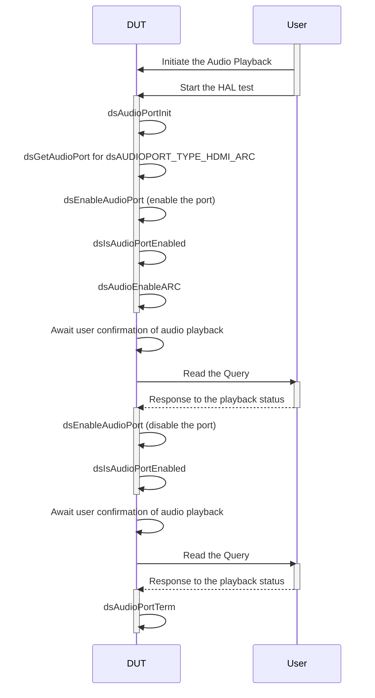

# Audio Settings L3 Low Level Test Specification and Procedure Documentation

## Table of Contents

- [Acronyms, Terms and Abbreviations](#acronyms-terms-and-abbreviations)
- [Overview](#overview)
- [Definitions](#definitions)
- [References](#references)
- [Audio Streams Requirement](#audio-streams-requirement)
- [Level 3 Test Procedure](#level-3-test-procedure)

### Acronyms, Terms and Abbreviations

- `HAL`    - Hardware Abstraction Layer
- `API`    - Application Programming Interface
- `L2`     - Level 2 Testing
- `L3`     - Level 3 Testing
- `DS`     - Device Settings
- `ARC`    - Audio Return Channel
- `HDMI`   - High-Definition Multimedia Interface
- `LE`     - Loudness Equivalence
- `DRC`    - Dynamic Range Control
- `MI`     - Media Intelligent
- `MS12`   - MultiStream 12
- `MS11`   - MultiStream 11
- `DAP`    - Digital Audio Processing
- `PCM`    - Pulse Code Modulation
- `WAV`    - Waveform
- `DUT`    - Device Under Test
- `NA`     - Not Applicable
- `RAFT`   - Rapid Automation Framework for Testing

## Overview

This document describes the Low Level L3 Test Specification and Procedure for the Device Settings Audio module.

## Definitions

- `ut-core` \- Common Testing Framework [ut-core](https://github.com/rdkcentral/ut-core), which wraps a open-source framework that can be expanded to the requirements for future framework.
- `user` \- Refers to either human or the test automation framework like `RAFT`

## References

- dsAudio HAL Interface - [dsAudio.h](https://github.com/rdkcentral/rdk-halif-device_settings/blob/main/include/dsAudio.h)
- High Level Test Specification - [ds-audio_High-Level_TestSpecification.md](https://github.com/rdkcentral/rdk-halif-device_settings/blob/main/docs/pages/ds-audio_High-Level_TestSpecification.md)

## Audio Streams Requirement

|ID|Description|Audio Format|
|--|-----------|------------|
|001|400Hz sine tone|`PCM` with `WAV` header|
|002|AAC stream|aac with `ADTS`|
|003|Vorbis stream|vorbis with `ogg`|
|004|wma stream|wma|
|005|Dolby AC3 (Dolby digital)|ac3|
|006|Dolby EAC3 (Dolby Digital plus)|ac3|
|007|Dolby AC4|ac4|
|008|Dolby MAT||
|009|Dolby TrueHD||
|010|Dolby EAC3 Atmos||
|011|Dolby TRUEHD Atmos||
|012|Dolby MAT Atmos||
|013|Dolby AC4 Atmos||

## Level 3 Test Procedure

The following functions are expecting to test the module operates correctly.

### Test 1

|Title|Details|
|-----|-------|
|Function Name|`test_l3_EnableDisableAndVerifyAudioPortStatus`|
|Description|Enable/disable audio ports and verifY the status|
|Test Group|03|
|Test Case ID|001|
|Priority|High|

**Pre-Conditions :**

- Copy and Playback of audio stream ID `001` [audio-streams-requirement](#audio-streams-requirement) on `DUT`
  - Example Playback command:
`gst-play-1.0 audo_stream_001.wav`

**Dependencies :**
None

**User Interaction :**

- If user chose to run the test in interactive mode, then the test case has to be selected via console.

- Audio Verification - Different ways to validate the audio playback through the ports:

  - Listen to the audio played in different audio ports
  - Tap the audio data on `DUT` and verify

#### Test Procedure - Test 1

|Variation / Steps|Description|Test Data|Expected Result|Notes|
|-----------------|-----------|---------|---------------|-----|
|01|Initialize audio port using `dsAudioPortInit`|None|`dsERR_NONE`|Should be successful|
|02|Loop through supported audio ports and get audio port using `dsGetAudioPort`|supported number of audio ports = `dsAudio/Number_of_supported_ports` field and port id = `dsAudio/Port/[port number]/Typeid` of configuration file|`dsERR_NONE`|Should be successful|
|03|Enable audio port using `dsEnableAudioPort`|handle = obtained from `dsGetAudioPort`, enabled = true|`dsERR_NONE`|Should be successful|
|04|Check if audio port is enabled using `dsIsAudioPortEnabled`|handle = obtained from `dsGetAudioPort`|`dsERR_NONE`, enabled = `true`|Should be successful|
|05|Await `user` confirmation of audio playback on the specified port|Waiting Query: `Is the audio functioning correctly on the port? [y/n]:`|`NA`|`user` has to respond with `y` if audio is ok, `n` otherwise|
|06|Disable audio port using `dsEnableAudioPort`|handle = obtained from `dsGetAudioPort`, enabled = `false`|`dsERR_NONE`|Should be successful|
|07|Check if audio port is disabled using `dsIsAudioPortEnabled`|handle = obtained from `dsGetAudioPort`|`dsERR_NONE`, enabled = `false`|Should be successful|
|08|Await `user` confirmation of audio playback on the specified port|Waiting Query: `Is there no audio output on the specified port? [y/n]:`|`NA`|`user` has to respond with `y` if audio is not played, `n` otherwise|
|09|Terminate audio port using `dsAudioPortTerm`|None|`dsERR_NONE`|Should be successful|

### Test 2

|Title|Details|
|-----|-------|
|Function Name|`test_l3_CheckHeadphoneConnectionStatus_sink`|
|Description|Check the connection status of Headphone port|
|Test Group|03|
|Test Case ID|002|
|Priority|High|

**Pre-Conditions :**
Make sure that the Headphone port is not connected to `DUT`

**Dependencies :**
None

**User Interaction :**

- If user chose to run the test in interactive mode, then the test case has to be selected via console.
- Connecting and Disconnecting of Headphone port

#### Test Procedure - Test 2

|Variation / Steps|Description|Test Data|Expected Result|Notes|
|-----------------|-----------|---------|---------------|-----|
|01|Initialize the audio port using `dsAudioPortInit`|None|`dsERR_NONE`|Should be successful|
|02|Loop through supported audio ports and get audio port handle for port type `dsAUDIOPORT_TYPE_HEADPHONE` using `dsGetAudioPort`|supported number of audio ports = `dsAudio/Number_of_supported_ports` field and port id = `dsAudio/Port/[port number]/Typeid` of configuration file|`dsERR_NONE`|Should be successful|
|03|Register a call-back using `dsAudioOutRegisterConnectCB`|CBFunc = call-back function|`dsERR_NONE`|Should be successful|
|04|Check the connection status using `dsAudioOutIsConnected`|handle = obtained from `dsGetAudioPort`|`dsERR_NONE`, isConnected=false|Should be successful|
|05|Await for the `user` to connect the Headphones to the port|Waiting Query: `Connect the Headphones and Press Any Key...`|`NA`|`user` has to connect the Headphones to `DUT` audio port and press the any key|
|06|Check the connection status using `dsAudioOutIsConnected`|handle = obtained from `dsGetAudioPort`|`dsERR_NONE`, isConnected=true|Should be successful|
|07|Check the connection status using Call-back function|Call-back registered in step:03 should be triggered|isPortCon=true|Should be successful|
|08|Await for the `user` to disconnect the Headphones from the port|Waiting Query: `Disconnect the Headphones and Press Any Key...`|`NA`|`user` has to disconnect the Headphones to `DUT` audio port and press the any key|
|09|Check the connection status using `dsAudioOutIsConnected`|handle = obtained from `dsGetAudioPort`|`dsERR_NONE`, isConnected=false|Should be successful|
|10|Check the connection status using Call-back function|Call-back registered in step:03 should be triggered|isPortCon=false|Should be successful|
|11|Terminate the audio port using `dsAudioPortTerm`|None|`dsERR_NONE`|Should be successful|

### Test 3

|Title|Details|
|-----|-------|
|Function Name|`test_l3_CheckArcType_sink`|
|Description|Check the connected `ARC` type|
|Test Group|03|
|Test Case ID|003|
|Priority|High|

**Pre-Conditions :**
Make sure that the `ARC` port is connected to `DUT`

**Dependencies :**
None

**User Interaction :**

- If user chose to run the test in interactive mode, then the test case has to be selected via console.
- Verify the `ARC` port and confirm to the test

#### Test Procedure - Test 3

|Variation / Steps|Description|Test Data|Expected Result|Notes|
|-----------------|-----------|---------|---------------|-----|
|01|Initialize the audio port using `dsAudioPortInit`|None|`dsERR_NONE`|Should be successful|
|02|Loop through supported audio ports and get audio port handle for port type `dsAUDIOPORT_TYPE_HDMI_ARC` using `dsGetAudioPort`|supported number of audio ports = `dsAudio/Number_of_supported_ports` field and port id = `dsAudio/Port/[port number]/Typeid` of configuration file|`dsERR_NONE`|Should be successful|
|03|Get the `ARC` type of connected device using `dsGetSupportedARCTypes`|handle = obtained from `dsGetAudioPort`|`dsERR_NONE`|Should be successful|
|04|Wait for the `user` to confirm the `ARC` type of connected device|Waiting Query: `Is the ARC type of connected device <type>? [y/n]:`|`dsERR_NONE`|`user` has to respond with `y` if the the test gives correct `ARC` type, `n` otherwise|
|05|Terminate the audio port using `dsAudioPortTerm`|None|`dsERR_NONE`|Should be successful|

### Test 4

|Title|Details|
|-----|-------|
|Function Name|`test_l3_EnableArcPort_sink`|
|Description|Enable `ARC` port and check the connection status|
|Test Group|03|
|Test Case ID|004|
|Priority|High|

**Pre-Conditions :**

- Make sure that the `ARC` port is connected to `DUT`
- Copy and Playback of audio stream ID `001` [audio-streams-requirement](#audio-streams-requirement) on `DUT`
  - Example Playback command:
`gst-play-1.0 audo_stream_001.wav`

**Dependencies :**
None

**User Interaction :**

- If user chose to run the test in interactive mode, then the test case has to be selected via console.
- Audio Verification - Different ways to validate the audio playback through the ports:

  - Listen to the audio played in different audio ports
  - Tap the audio data on `DUT` and verify

#### Test Procedure - Test 4

|Variation / Steps|Description|Test Data|Expected Result|Notes|
|-----------------|-----------|---------|---------------|-----|
|01|Initialize the audio port using `dsAudioPortInit`|None|`dsERR_NONE`|Should be successful|
|02|Loop through supported audio ports and get audio port handle for port type `dsAUDIOPORT_TYPE_HDMI_ARC` using `dsGetAudioPort`|supported number of audio ports = `dsAudio/Number_of_supported_ports` field and port id = `dsAudio/Port/[port number]/Typeid` of configuration file|`dsERR_NONE`|Should be successful|
|03|Enable audio port using `dsEnableAudioPort`|handle = obtained from `dsGetAudioPort`, enabled = true|`dsERR_NONE`|Should be successful|
|04|Check if audio port is enabled using `dsIsAudioPortEnabled`|handle = obtained from `dsGetAudioPort`|`dsERR_NONE`, enabled = `true`|Should be successful|
|05|Enable `ARC` feature using `dsAudioEnableARC`|handle = obtained from `dsGetAudioPort`, arcStatus.type=`dsAUDIOARCSUPPORT_ARC`, arcStatus.status=`True`|`dsERR_NONE`|Should be successful|
|06|Await `user` confirmation of audio playback on the specified port|Waiting Query: `Is the audio functioning correctly on the port? [y/n]:`|`NA`|`user` has to respond with `y` if audio is ok, `n` otherwise|
|07|Disable audio port using `dsEnableAudioPort`|handle = obtained from `dsGetAudioPort`, enabled = `false`|`dsERR_NONE`|Should be successful|
|08|Check if audio port is disabled using `dsIsAudioPortEnabled`|handle = obtained from `dsGetAudioPort`|`dsERR_NONE`, enabled = `false`|Should be successful|
|09|Await `user` confirmation of audio playback on the specified port|Waiting Query: `Is there no audio output on the specified port? [y/n]:`|`NA`|`user` has to respond with `y` if audio is not played, `n` otherwise|
|10|Terminate the audio port using `dsAudioPortTerm`|None|`dsERR_NONE`|Should be successful|

