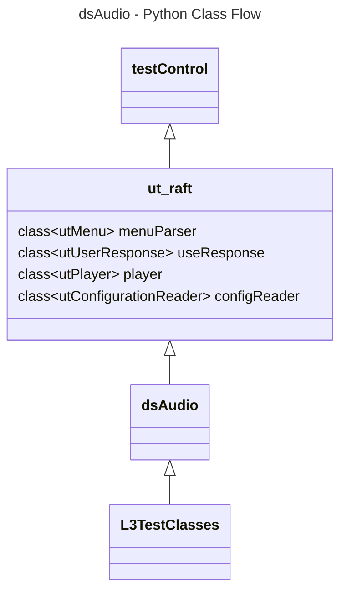

# Audio Settings L3 Python Test Specification

## Table of Contents

- [Acronyms, Terms and Abbreviations](#acronyms-terms-and-abbreviations)
- [Overview](#overview)
- [References](#references)
- [Level 3 Python Tests](#level-3-python-test-cases-high-level-overview)

### Acronyms, Terms and Abbreviations

- `HAL`    - Hardware Abstraction Layer
- `API`    - Application Programming Interface
- `L2`     - Level 2 Testing
- `L3`     - Level 3 Testing
- `DS`     - Device Settings
- `DUT`    - Device Under Test
- `NA`     - Not Applicable
- `RAFT`   - Rapid Automation Framework for Testing

## Overview

This document describes the L3 Test Procedure for the Device Settings Audio module.

## References

- dsAudio HAL Interface - [dsAudio.h](https://github.com/rdkcentral/rdk-halif-device_settings/blob/main/include/dsAudio.h)
- High Level Test Specification - [ds-audio_High-Level_TestSpecification.md](https://github.com/rdkcentral/rdk-halif-device_settings/blob/main/docs/pages/ds-audio_High-Level_TestSpecification.md)
- `RAFT` - [`RAFT`](https://github.com/rdkcentral/python_raft/)
- ut_raft - [ut_raft](https://github.com/rdkcentral/ut-raft)

## Level 3 Python Test Cases High Level Overview

The class diagram below illustrates the flow of dsAudio L3 Python test cases:



- **testControl**: Test Control Module for running rack Testing. This module configures the `DUT` based on the rack configuration file provided to the test. This class is defined in `RAFT` framework. For more details refer [RAFT](https://github.com/rdkcentral/python_raft/blob/master/README.md)
- **ut_raft**: Python based testing framework for writing engineering tests. It provides a modular, config driven, low level testing framework. [ut-raft](https://github.com/rdkcentral/ut-raft). It has below sub-classes

|#|Class Name|Description|
|-|----------|-----------|
|1|UtMenu|Provides the interfaces to Navigate through the C/C++ test menu running on `DUT`|
|2|UtUserResponse|Provides the interfaces to get user responses|
|3|UtPlayer|Provides the interfaces to play the test streams on `DUT`|
|4|utConfigurationReader|Provides the interfaces to parse the configuration files|

- **dsAudio**: This is test helper class which communicates with the `L3` C/C++ test running on the `DUT` through menu
- **L3TestClasses**: These are the L3 test case classes

|#|Class Name|Description|
|-|----------|-----------|
|1|dsAudio_test1_EnableDisableAndVerifyAudioPortStatus|Tests the audio port by enabling and disabling the ports|
|2|dsAudio_test2_PortConnectionStatus|Tests the audio port connection status|
|3|dsAudio_test3_MS12DAPCapabilities|Tests the MS12 `DAP` Capabilities|
|4|dsAudio_test4_ARCPort|Tests the `ARC` Port on sink devices|
|5|dsAudio_test5_ARCPortSAD|Tests the `ARC` Port `SAD` on sink devices|
|6|dsAudio_test6_OutputMode|Tests the ports output mode|
|7|dsAudio_test7_AudioGain|Tests the ports audio gain|
|8|dsAudio_test8_AudioMute|Tests the ports audio Mute|
|9|dsAudio_test9_AudioDelay|Tests the ports audio delay|
|10|dsAudio_test10_AudioFormat|Tests the audio format|
|11|dsAudio_test11_AssociateAudioMixing|Tests the associate audio mixing|
|12|dsAudio_test12_PrimarySecondaryLanguage|Tests the primary secondary language|
|13|dsAudio_test13_AudioMixerLevels|Tests the primary and system mixer levels|

## Configuration Files

**Test Setup Configuration** - This configuration file contains the list of requirements for tests to execute. Eg: Copying the streams, setting environment variables etc. Example configuration file listed below:

```yaml
dsAudio:
  description: "dsAudio Device Settings test setup"
  assets:
    device:
      Common: #List of common requirements for all the tests
        artifacts:
          -  "<URL>/hal_test" #URL Path to the bin files to copy
          -  "<URL>/ut_contol.so" #URL Path to the .so files if any to copy
          -  "<URL>/run.sh"
        execute:
          - ""  #prerequisites commands if required
        streams:
      test1_EnableDisableAndVerifyAudioPortStatus: #Requirements for specific test
        artifacts:
        execute:
        streams:
          - "<URL>/test_3.mp4" #URL path to the test streams
          - "<URL>/test_4.mp4" #URL path to the test streams
      test2_PortConnectionStatus:
        artifacts:
        execute:
        streams:
          - "<URL>/test_3.mp4" #URL path to the test streams
          - "<URL>/test_4.mp4" #URL path to the test streams
    host:
      menu_config: "../../assets/dsAudio_L3_menu.yml" #Menu configuration file
```

**Menu Configuration** - This configuration file contains the list of menu items for C/C++ L3 test running on `DUT`. Example configuration file listed below:

```yaml
dsAudio:
  description: "dsAudio Device Settings testing profile / menu system for UT"
  test:
  control:
    menu:
      type: UT-C # C (UT-C Cunit) / C++ (UT-G (g++ ut-core gtest backend))
      groups: 
          name: "L3 dsAudio - Sink"
          menu_initialize:
            name: "Initialize dsAudio"
          menu_enable:
            name: "Enable Audio Port"
            input: 
                - "Select dsAudio Port"
                - "Select ARC Type"
          menu_disable:
            name: "Disable Audio Port"
            input:
                - "Select dsAudio Port"
```

**Rack Configuration** - This configuration file is used to define the setup your `DUT`. For more details refer [RAFT](https://github.com/rdkcentral/python_raft/blob/master/README.md) and [example_rack_config.yml](https://github.com/rdkcentral/python_raft/blob/master/examples/configs/example_rack_config.yml)

**Device Configuration** - This configuration is used to define device types. For more details refer [RAFT](https://github.com/rdkcentral/python_raft/blob/master/README.md) and [example_device_config.yml](https://github.com/rdkcentral/python_raft/blob/master/examples/configs/example_device_config.yml)

**`DUT` Capabilities** - This configuration file gives the capabilities of the `DUT`. Example configuration file [dsAudio_Settings](https://github.com/rdkcentral/rdk-halif-test-device_settings/blob/main/profiles/sink/Sink_AudioSettings.yaml)