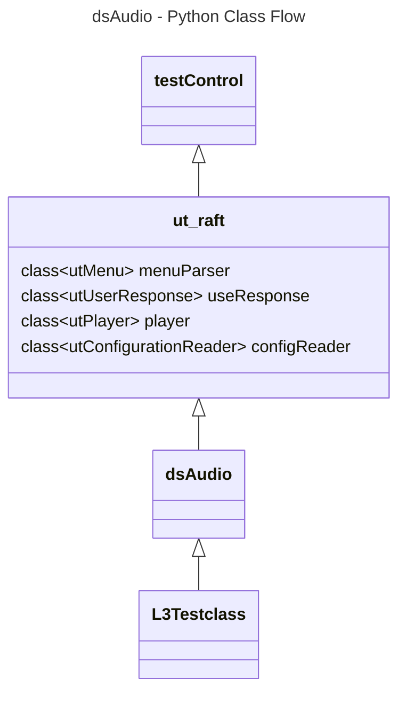

# Audio Settings L3 Python Test Specification

## Table of Contents

- [Acronyms, Terms and Abbreviations](#acronyms-terms-and-abbreviations)
- [Overview](#overview)
- [References](#references)
- [Level 3 Python Tests](#level-3-python-test-cases-high-level-overview)

### Acronyms, Terms and Abbreviations

- `HAL`    - Hardware Abstraction Layer
- `API`    - Application Programming Interface
- `L2`     - Level 2 Testing
- `L3`     - Level 3 Testing
- `DS`     - Device Settings
- `DUT`    - Device Under Test
- `NA`     - Not Applicable
- `RAFT`   - Rapid Automation Framework for Testing

## Overview

This document describes the L3 Test Procedure for the Device Settings Audio module.

## References

- dsAudio HAL Interface - [dsAudio.h](https://github.com/rdkcentral/rdk-halif-device_settings/blob/main/include/dsAudio.h)
- High Level Test Specification - [ds-audio_High-Level_TestSpecification.md](https://github.com/rdkcentral/rdk-halif-device_settings/blob/main/docs/pages/ds-audio_High-Level_TestSpecification.md)

## Level 3 Python Test Cases High Level Overview

The class diagram below illustrates the flow of dsAudio L3 Python test cases:

- **testControl**: Test Control Module for running rack Testing. This class is defined in `RAFT` framework [testControl](https://github.com/rdkcentral/python_raft/blob/master/framework/core/testControl.py)
- **ut_raft**: Python based testing framework for writing engineering tests. It provides a modular, config driven, low level testing framework. [ut-raft](https://github.com/rdkcentral/ut-raft). It has below sub-classes

|#|Class Name|Description|
|-|----------|-----------|
|1|UtMenu|Provides the interfaces to Navigate through the C/C++ test menu running on `DUT`|
|2|UtUserResponse|Provides the interfaces to get user responses|
|3|UtPlayer|Provides the interfaces to play the test streams on `DUT`|
|4|utConfigurationReader|Provides the interfaces to parse the configuration files|

- **dsAudio**: This is test helper class which communicates with the `L3` C/C++ test running on the `DUT`
- **L3Testclass**: These are the L3 test case classes

|#|Class Name|Description|
|-|----------|-----------|
|1|dsAudio_test1_EnableDisableAndVerifyAudioPortStatus|Tests the audio port by enabling and disabling the ports|
|2|dsAudio_test2_PortConnectionStatus|Tests the audio port connection status|
|3|dsAudio_test3_MS12DAPCapabilities|Tests the MS12 `DAP` Capabilities|
|4|dsAudio_test4_ARCPort|Tests the `ARC` Port on sink devices|
|5|dsAudio_test5_ARCPortSAD|Tests the `ARC` Port `SAD` on sink devices|
|6|dsAudio_test6_OutputMode|Tests the ports output mode|
|7|dsAudio_test7_AudioGain|Tests the ports audio gain|
|8|dsAudio_test8_AudioMute|Tests the ports audio Mute|
|9|dsAudio_test9_AudioDelay|Tests the ports audio delay|
|10|dsAudio_test10_AudioFormat|Tests the audio format|
|11|dsAudio_test11_AssociateAudioMixing|Tests the associate audio mixing|
|12|dsAudio_test12_PrimarySecondaryLanguage|Tests the primary secondary language|
|13|dsAudio_test13_AudioMixerLevels|Tests the primary and system mixer levels|
