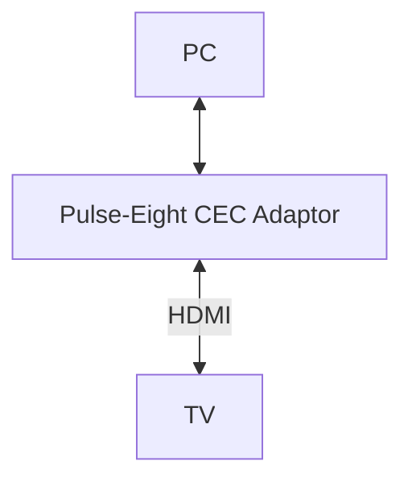
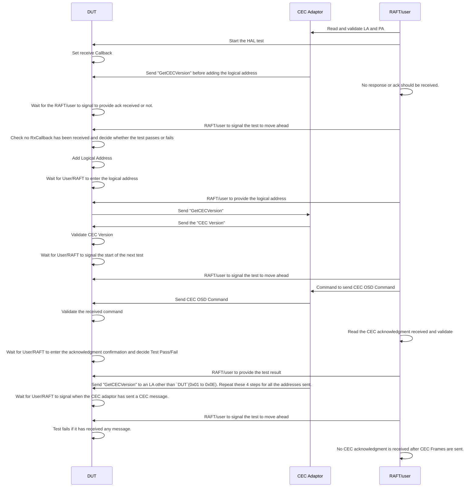
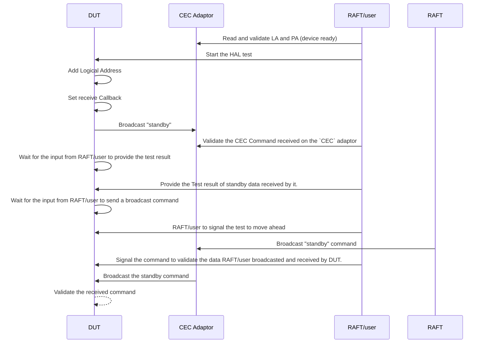
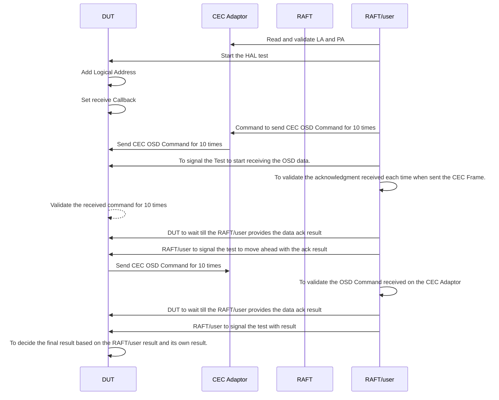

# Front Panel Display L3 Test Document for Sink Devices.

## Table of Contents
- [Acronyms, Terms and Abbreviations](#acronyms-terms-and-abbreviations)
- [Description](#description)
- [Component Runtime Execution Requirements](#component-runtime-execution-requirements)
  - [Initialization and Startup]

## Overview
This document provides an overview of the L3 testing requirements for the module `Front Panel Display`. It outlines the scope of testing, objectives, External devices, specific test requirements,  expected deliverables, and approaches to satisfy the L3 Test requirement.  

## Acronyms, Terms and Abbreviations
- `FP`      - Front Panel
- `FPD`     - Front Panel Display
- `ds`      - Device Settings.
- `LED`     - Light Emitting Devices
- `dsFPD`   - Device Settings Front Panel Display
- `HAL`    -  Hardware Abstraction layer
- `API`    -  Application Program Interface
- `SoC`    -  System on Chip
- `DUT`    -  Device Under Test

## References
- Light detector :
- `HAL` interface file: https://github.com/rdkcentral/rdk-halif-device_settings/blob/main/include/dsFPD.h

## Module Description
`Front Panel Display` provides a set of APIs to control the `FP`discrete `LED`s existing on a platform.
- It facilitates the communication to `FP` `LED`s, aiding in their configuration and utilization within the system. The `LED`s is controlled by the caller based on the platform requirements.
Interface specification is available here: [ds-fdp HAl Spec](https://github.com/rdkcentral/rdk-halif-device_settings/blob/main/docs/pages/ds-front-panel-display_halSpec.md)

### Front Panel Display L3 Test Functionality

## Test Functionalities

#### LED State Test
Note: All the below tests should be carried out on all `LED` indicators.

#### LED Brightness Test
Note: All the below tests should be carried out on all `LED` indicators.
  
#### LED Color Test
Note: All the below tests should be carried out on all `LED` indicators.

# Test 1: Message Transmission and Reception Test - Unicast messages

Functionality: 

| Title                         | Details                                          |
|-------------------------------|--------------------------------------------------|
| Function Name                 | `test_l3_hdmi_cec_sink_tx_rx_test`              |
| Description                   | This test shall validate the Tx, and Rx CEC Commands between the `DUT`and CEC Adaptor connected on a network |
| Test Group                    | 03                                               |
| Test Case ID                  | 002                                              |
| Priority                      | High                                             |

**Pre-Conditions:**

**Dependencies:**

**User Interaction:**

**RAFT Requirements:**
- RAFT shall initiate the test by reading and validating the LA and PA.
- RAFT shall initiate the commands to send the CEC OSD command with the string data as read from the hdmicec_sinktest.yml file.
- RAFT shall provide a means to enter the LA for the test and any other data required during the test.
- RAFT shall consider reading and give input to the test wherever required. 
  
**Sequence Diagram**

#### Test Procedure 

| Variation / Steps | Description | Test Data | Expected Result | Notes |
|-------------------|-------------|-----------|------------------|-------|

# Test 2: Transmit and Receive CEC broadcast Commands 

Functionality: 
| Title                         | Details                                          |
|-------------------------------|--------------------------------------------------|
| Function Name                 | `test_l3_hdmi_cec_sink_broadcast_test`              |
| Description                   | This test shall validate the broadcast CEC Commands between the `DUT`, and the CEC Adaptor connected on a network |
| Test Group                    | 03                                               |
| Test Case ID                  | 003                                              |
| Priority                      | High                                             |

**Pre-Conditions:**

**Dependencies:**

**User Interaction:**

**RAFT Requirements:**
- RAFT shall initiate the commands to send the standby command.
- RAFT shall consider reading and give input to the test wherever required. 
    
**Sequence Diagram**

#### Test Procedure 

| Variation / Steps | Description | Test Data | Expected Result | Notes |
|-------------------|-------------|-----------|------------------|-------|
# Test 3: Stress Test

Functionality: 
| Title                         | Details                                          |
|-------------------------------|--------------------------------------------------|
| Function Name                 | `test_l3_hdmi_cec_tx_rx_osd_cmd_repeatedly`              |
| Description                   | Transmit and Receive CEC OSD Command with buffer data continuously 10 times to prove the robustness of these API.                       |
| Test Group                    | 03                                               |
| Test Case ID                  | 004                                              |
| Priority                      | High                                             |

**Pre-Conditions:**
**Dependencies:**

**User Interaction:**
**RAFT Requirements:**
- RAFT shall initiate the commands to send the OSD command and validate the acknowledgments
- RAFT shall consider reading and give input to the test wherever required. 
  
**Sequence Diagram**

