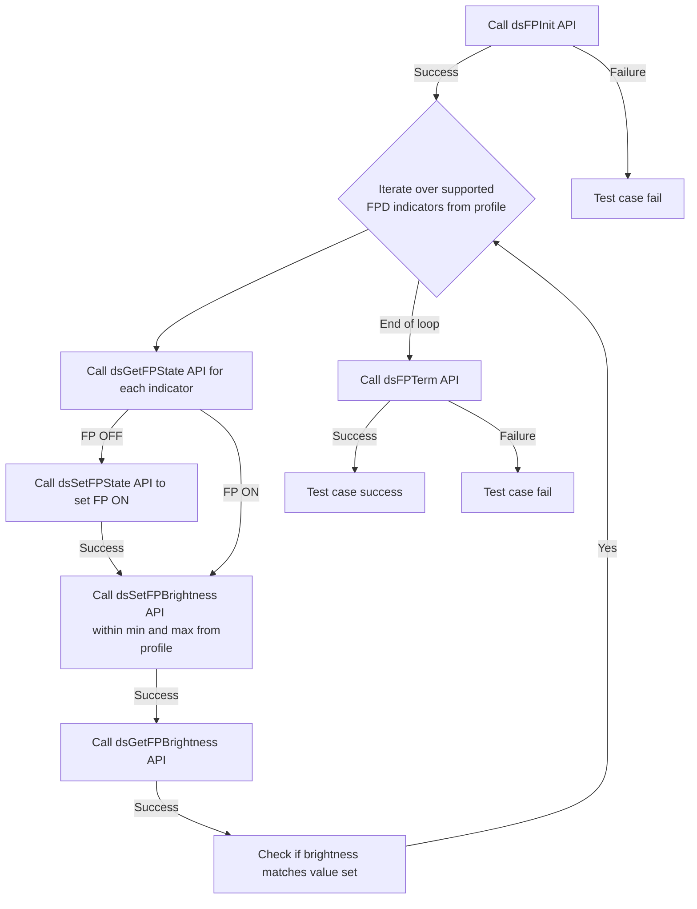
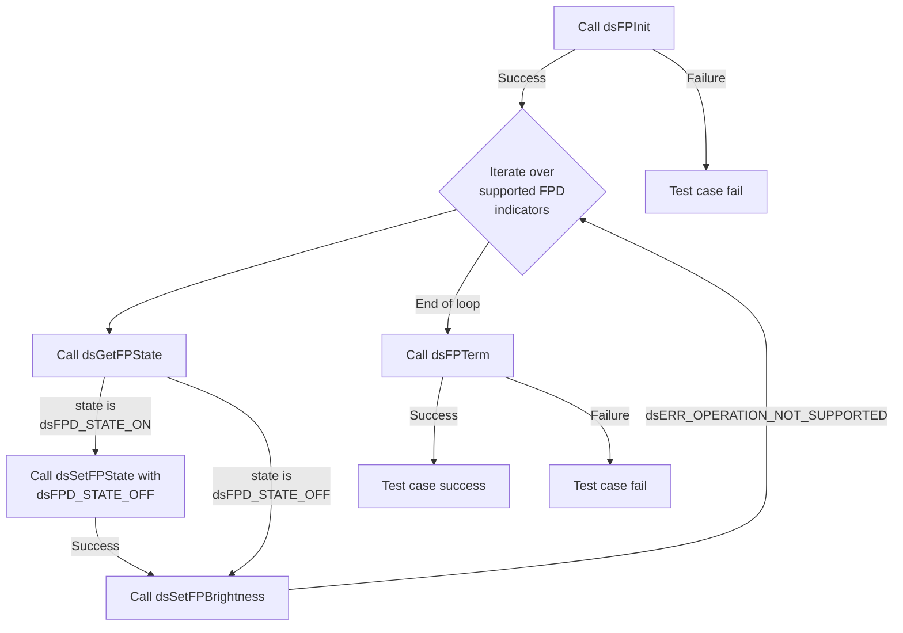
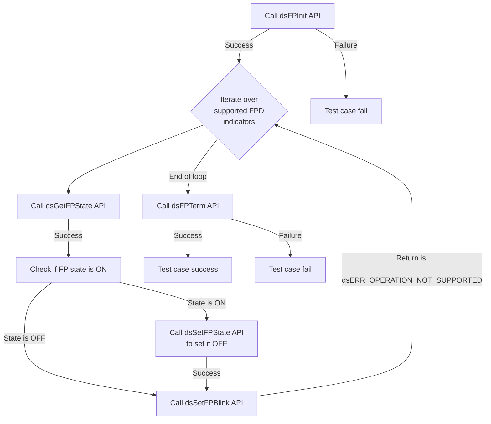
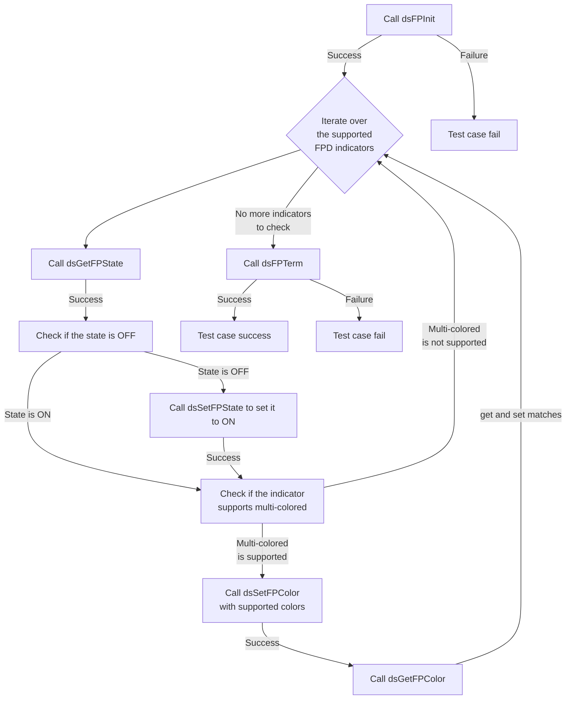
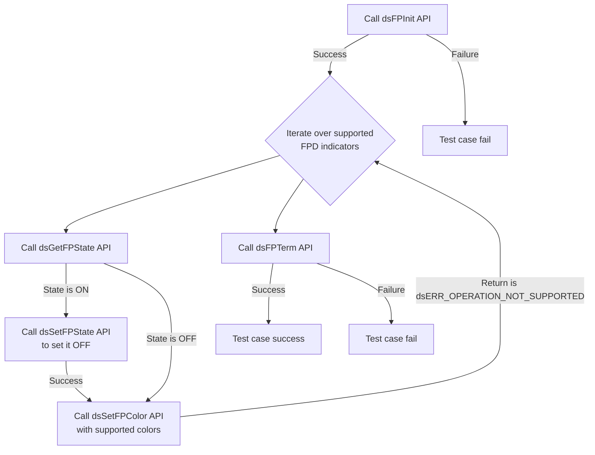
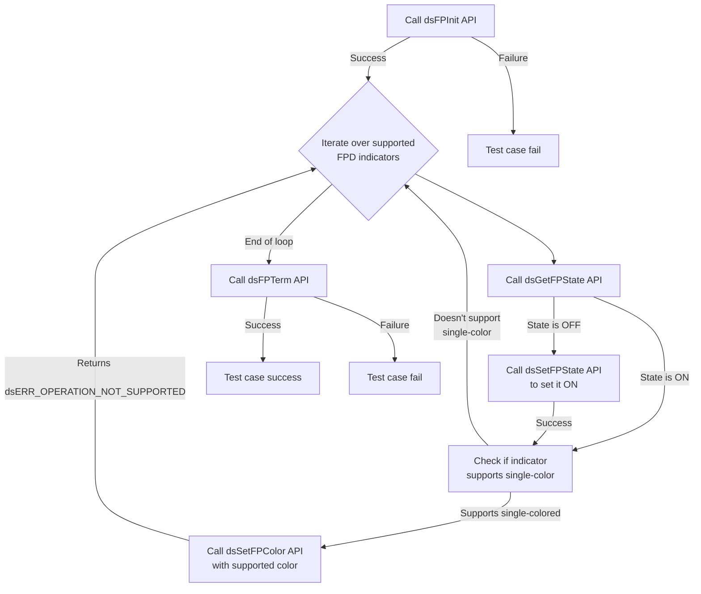
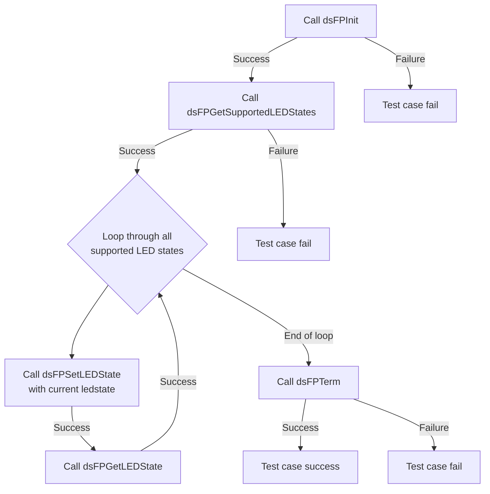

# Device Setting FPD L2 Low Level Test Specification and Procedure Documentation

## Table of Contents

- [Table of Contents](#table-of-contents)
- [Overview](#overview)
- [Acronyms, Terms and Abbreviations](#acronyms-terms-and-abbreviations)
- [Definitions](#definitions)
- [References](#references)
- [Level 2 Test Procedure](#level-2-test-procedure)

## Overview

This document describes the Low level l2 Specification and Procedure Documentation for the DSFPD module.

### Acronyms, Terms and Abbreviations

- `HAL` \- Hardware Abstraction Layer, may include some common components
- `UT`  \- Unit Test(s)
- `OEM`  \- Original Equipment Manufacture
- `SoC`  \- System on a Chip

### Definitions

- `ut-core` \- Common Testing Framework <https://github.com/rdkcentral/ut-core>, which wraps a open-source framework that can be expanded to the requirements for future framework.

### References

- `High Level Test Specification` - [ds-front-panel-display_High-Level_TestSpec.md](ds-front-panel-display_High-Level_TestSpec.md)
- `HAL Interface file` - [dsFPD Header](https://github.com/rdkcentral/rdk-halif-device_settings/blob/main/include/dsFPD.h)

## Level 2 Test Procedure

The following functions are expecting to test the module operates correctly.

### Test 1

|Title|Details|
|--|--|
|Function Name|`test_l2_dsFPD_SetFPstateON_SetBrightness`|
|Description|Iterate over supported `FPD` indicators. For each supported indicator: 1. Check the current state of the `FP`. 2. If it's OFF, set it to ON. 3. Set the brightness of the discrete `LED` within the specified range (min-max) and verify using the get function. Note: 1. For supported `FPD` indicators check profile file using path `dsFPD/SupportedFPDIndicators/[Indicator number]/Indicator_type` 2. for Brightness range checking by profile file using path:`dsFPD/SupportedFPDIndicators/[Indicator number]/MAX_BRIGHTNESS or MIN_BRIGHTNESS` using path:`dsFPD/SupportedFPDIndicators/[Indicator number]/MAX_BRIGHTNESS or MIN_BRIGHTNESS`|
|Test Group|02|
|Test Case ID|001|
|Priority|High|

**Pre-Conditions**
None

**Dependencies**
None

**User Interaction**
If user chose to run the test in interactive mode, then the test case has to be selected via console.

#### Test Procedure - Test 1

| Variation / Steps | Description | Test Data | Expected Result | Notes|
| -- | --------- | ---------- | -------------- | ----- |
| 01 | Initialize the Front Panel Display (FPD) sub-module using dsFPInit() | None | dsERR_NONE | Should be successful |
| 02 | Iterate over the supported FPD indicators from profile file and get the current state of the FP using dsGetFPState() | eIndicator = list of supported FPD indicators | dsERR_NONE, state = current state | Should be successful |
| 03 | If the current state of the FP is OFF, set it to ON using dsSetFPState() |eIndicator = current indicator,  state = dsFPD_STATE_ON | dsERR_NONE | Should be successful |
| 04 | Set the brightness of the LED using dsSetFPBrightness() | eIndicator = current indicator, eBrightness = random value within minimum and maximum brightness from profile| dsERR_NONE | Should be successful |
| 05 | Verify the brightness of the LED using dsGetFPBrightness() | eIndicator = current indicator | dsERR_NONE, brightness = eBrightness | Should be successful |
| 06 | Terminate the Front Panel Display (FPD) sub-module using dsFPTerm() | None | dsERR_NONE | Should be successful |

### Test 2

|Title|Details|
|--|--|
|Function Name|`test_l2_dsFPD_SetFPstateOFF_SetBrightness`|
|Description|Iterate over supported `FPD` indicators. For each supported indicator: 1. Check the current state of the `FP`. 2. If it's ON, set it to OFF. 3. Set the brightness of the discrete `LED` and check it returns `dsERR_OPERATION_NOT_SUPPORTED`. Note: For supported `FPD` indicators check profile file using the path:`dsFPD/SupportedFPDIndicators`|
|Test Group|02|
|Test Case ID|002|
|Priority|High|

**Pre-Conditions**
None

**Dependencies**
None

**User Interaction**
If user chose to run the test in interactive mode, then the test case has to be selected via console.

#### Test Procedure - Test 2

| Variation / Steps | Description | Test Data | Expected Result | Notes|
| -- | --------- | ---------- | -------------- | ----- |
| 01 | Initialize the Front Panel Display (FPD) sub-module using dsFPInit() | None | dsERR_NONE | Should be successful |
| 02 | Iterate over the supported FPD indicators from profile file and check the current state of the FP using dsGetFPState() | eIndicator = eIndicator = list of supported FPD indicators | dsERR_NONE, state = current state | Should be successful |
| 03 | If the state is ON, set it to OFF using dsSetFPState() | eIndicator = current indicator, state = dsFPD_STATE_OFF | dsERR_NONE | Should be successful |
| 04 | Set the brightness of the discrete LED using dsSetFPBrightness() | eIndicator = current indicator, eBrightness = random value 0-100 | dsERR_OPERATION_NOT_SUPPORTED | Should be successful |
| 05 | Terminate the Front Panel Display sub-module using dsFPTerm() | None | dsERR_NONE | Should be successful |

### Test 3

|Title|Details|
|--|--|
|Function Name|`test_l2_dsFPD_SetFPstateOFF_SetBlink`|
|Description|Iterate over supported `FPD` indicators. For each supported indicator: 1. Check the current state of the `FP`. 2. If it's ON, set it to OFF. 3. Set the blink functionality of discrete `LED` and check it returns `dsERR_OPERATION_NOT_SUPPORTED`. Note: For supported `FPD` indicators check profile file using the path:`dsFPD/SupportedFPDIndicators`|
|Test Group|02|
|Test Case ID|003|
|Priority|High|

**Pre-Conditions**
None

**Dependencies**
None

**User Interaction**
If user chose to run the test in interactive mode, then the test case has to be selected via console.

#### Test Procedure - Test 3

| Variation / Steps | Description | Test Data | Expected Result | Notes|
| -- | --------- | ---------- | -------------- | ----- |
| 01 | Initialize the Front Panel Display (FPD) using dsFPInit() | None | dsERR_NONE | Should be successful |
| 02 | Iterate over all FPD indicators from profile and get the current state using dsGetFPState() | eIndicator =  list of supported FPD indicators  | dsERR_NONE , state = current state| Should be successful |
| 03 | If the state is ON, set it to OFF using dsSetFPState() | eIndicator = current indicator, state = dsFPD_STATE_OFF | dsERR_NONE | Should be successful |
| 04 | Set the blink functionality of discrete LED using dsSetFPBlink() | eIndicator = current indicator, uBlinkDuration = 500, uBlinkIterations = 10 | dsERR_OPERATION_NOT_SUPPORTED | Should be successful |
| 05 | Terminate the FPD using dsFPTerm() | None | dsERR_NONE | Should be successful |

### Test 4

|Title|Details|
|--|--|
|Function Name|`test_l2_dsFPD_SetFPstateON_Multi_SetColor`|
|Description|Iterate over supported `FPD` indicators. For each SupportedFPDIndicators: 1. Check the current state of the `FP`. 2. If it's OFF, set it to ON. 3. Check the indicator supports multi-colored 4. set the color functionality of discrete `LED` available by setting and getting different colors supported by the discrete `LED` Note: 1. For supported `FPD` indicators check profile file using path:`dsFPD/SupportedFPDIndicators` 2. for indicator color support check profile file using the path `dsFPD/SupportedFPDIndicators/DEFAULT_COLOR_MODE`) |
|Test Group|02|
|Test Case ID|004|
|Priority|High|

**Pre-Conditions**
None

**Dependencies**
None

**User Interaction**
If user chose to run the test in interactive mode, then the test case has to be selected via console.

#### Test Procedure - Test 4

| Variation / Steps | Description | Test Data | Expected Result | Notes|
| -- | --------- | ---------- | -------------- | ----- |
| 01 | Initialize the Front Panel Display (FPD) using dsFPInit | None | dsERR_NONE | Should be successful |
| 02 | Iterate over all supported FPD indicators from profile | eIndicator = list of supported FPD indicators  | dsERR_NONE | Should be successful |
| 03 | Get the current state of the FPD indicator using dsGetFPState | eIndicator = current indicator, state = valid buffer | dsERR_NONE, state = current state | Should be successful |
| 04 | If the state is OFF, set it to ON using dsSetFPState | eIndicator = current indicator, state = dsFPD_STATE_ON | dsERR_NONE | Should be successful |
| 05 | Set the color of the FPD indicator that supports multi-color using dsSetFPColor  | eIndicator = current indicator, color = supported color from yaml file | dsERR_NONE | Should be successful |
| 06 | Get the color of the FPD indicator using dsGetFPColor | eIndicator = current indicator, getcolor = valid buffer | dsERR_NONE, getcolor = color | Should be successful |
| 07 | Terminate the FPD using dsFPTerm | None | dsERR_NONE | Should be successful |

### Test 5

|Title|Details|
|--|--|
|Function Name|`test_l2_dsFPD_SetFPstateOFF_SetColor`|
|Description|Iterate over supported `FPD` indicators. For each supported indicator: 1. Check the current state of the `FP`. 2. If it's ON, set it to OFF. 3. Set the color functionality of discrete `LED` and check it returns `dsERR_OPERATION_NOT_SUPPORTED`. Note: For supported `FPD` indicators check profile file using the path:`dsFPD/SupportedFPDIndicators`|
|Test Group|02|
|Test Case ID|005|
|Priority|High|

**Pre-Conditions**
None

**Dependencies**
None

**User Interaction**
If user chose to run the test in interactive mode, then the test case has to be selected via console.

#### Test Procedure  - Test 5

| Variation / Steps | Description | Test Data | Expected Result | Notes|
| -- | --------- | ---------- | -------------- | ----- |
| 01 | Initialize the Front Panel Display (FPD) using dsFPInit | None | dsERR_NONE | Should be successful |
| 02 | Iterate over all supported FPD indicators | eIndicator = list of supported FPD indicators | dsERR_NONE | Should be successful |
| 03 | Get the current state of the FPD indicator using dsGetFPState | eIndicator = current indicator, state = address of state variable | dsERR_NONE , state = current state| Should be successful |
| 04 | If the state is ON, set it to OFF using dsSetFPState | eIndicator = current indicator, state = dsFPD_STATE_OFF | dsERR_NONE | Should be successful |
| 05 | Set the color functionality of the discrete LED using dsSetFPColor and check it returns dsERR_OPERATION_NOT_SUPPORTED | eIndicator = current indicator, eColor = supported colors from profile file | dsERR_OPERATION_NOT_SUPPORTED | Should be successful |
| 06 | Terminate the FPD using dsFPTerm | None | dsERR_NONE | Should be successful |

### Test 6

|Title|Details|
|--|--|
|Function Name|`test_l2_dsFPD_SetFPstateON_Single_SetColor`|
|Description|Iterate over supported `FPD` indicators. For each supported indicator: 1. Check the current state of the `FP`. 2. If it's ON, set it to OFF. 3. Check the indicator supports `single-colored` 4. set the color functionality of discrete `LED` and check it returns `dsERR_OPERATION_NOT_SUPPORTED`. Note: For supported `FPD` indicators check profile file using the path:`dsFPD/SupportedFPDIndicators`|
|Test Group|02|
|Test Case ID|006|
|Priority|High|

**Pre-Conditions**
None

**Dependencies**
None

**User Interaction**
If user chose to run the test in interactive mode, then the test case has to be selected via console.

#### Test Procedure  - Test 6

| Variation / Steps | Description | Test Data | Expected Result | Notes|
| -- | --------- | ---------- | -------------- | ----- |
| 01 | Initialize the Front Panel Display (FPD) using dsFPInit() | None | dsERR_NONE | Should be successful |
| 02 | Iterate over all FPD indicators and check if they are supported | eIndicator = list of supported FPD indicators | dsERR_NONE | Should be successful |
| 03 | Get the current state of the FPD indicator using dsGetFPState() | eIndicator = current indicator, state = valid buffer | dsERR_NONE, state = current state | Should be successful |
| 04 | If the state is OFF, set it to ON using dsSetFPState() | eIndicator = current indicator, state = dsFPD_STATE_ON | dsERR_NONE | Should be successful |
| 05 | Set the color of the FPD indicator that supports single-color using dsSetFPColor()  | eIndicator = current indicator, eColor = valid color | dsERR_OPERATION_NOT_SUPPORTED | Should be successful |
| 06 | Terminate the FPD using dsFPTerm() | None | dsERR_NONE | Should be successful |

### Test 7

|Title|Details|
|--|--|
|Function Name|`test_l2_dsFPD_VerifyLEDStateTransitions`|
|Description|Verify the `LED` state transitions 1.Loop through all supported `LED` states. 2. For each state, set the `LED` to that state using dsFPSetLEDState(). 3. Verify the state using dsFPGetLEDState(). 4. Ensure each state transition is valid.|
|Test Group|02|
|Test Case ID|007|
|Priority|High|

**Pre-Conditions**
None

**Dependencies**
None

**User Interaction**
If user chose to run the test in interactive mode, then the test case has to be selected via console.

#### Test Procedure - Test 7

| Variation / Steps | Description | Test Data | Expected Result | Notes|
| -- | --------- | ---------- | -------------- | ----- |
| 01 | Initialize the device using dsFPInit() | None | dsERR_NONE | Should be successful |
| 02 | Loop through all supported LED states and get the supported LED states using dsFPGetSupportedLEDStates() | supportedLEDStates = valid buffer | dsERR_NONE, supportedLEDStates = value from yaml file | Should be successful |
| 03 | For each state, set the LED to that state using dsFPSetLEDState() | setState = current LedState | dsERR_NONE | Should be successful |
| 04 | Verify the state using dsFPGetLEDState() | currentState = valid buffer | dsERR_NONE, currentState = setState | Should be successful |
| 05 | After looping through all states, terminate the device using dsFPTerm() | None | dsERR_NONE | Should be successful |

