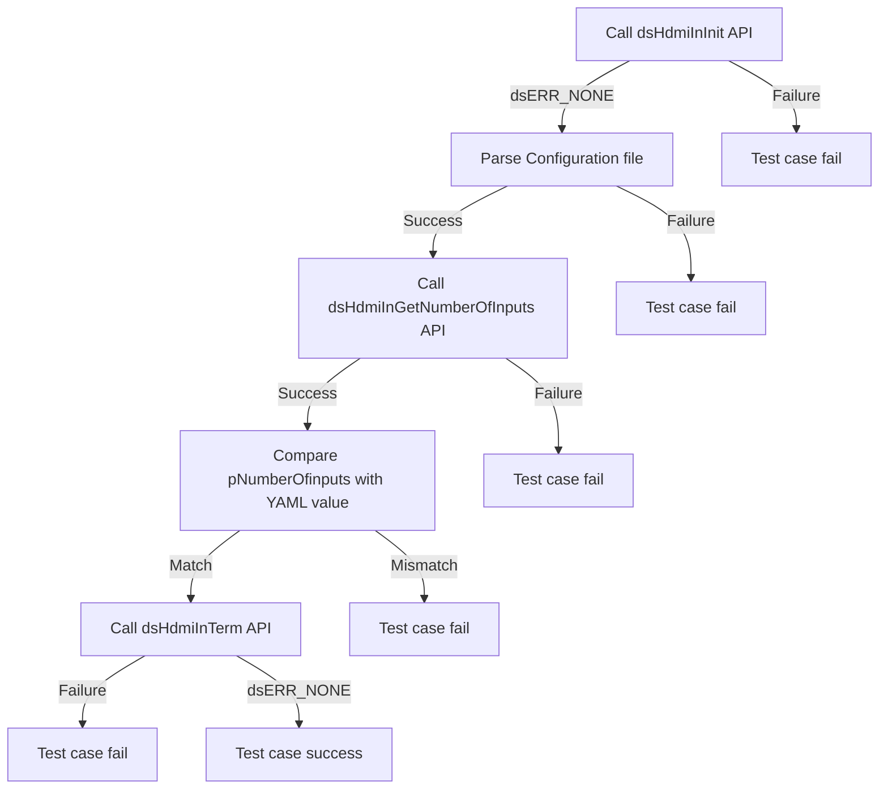
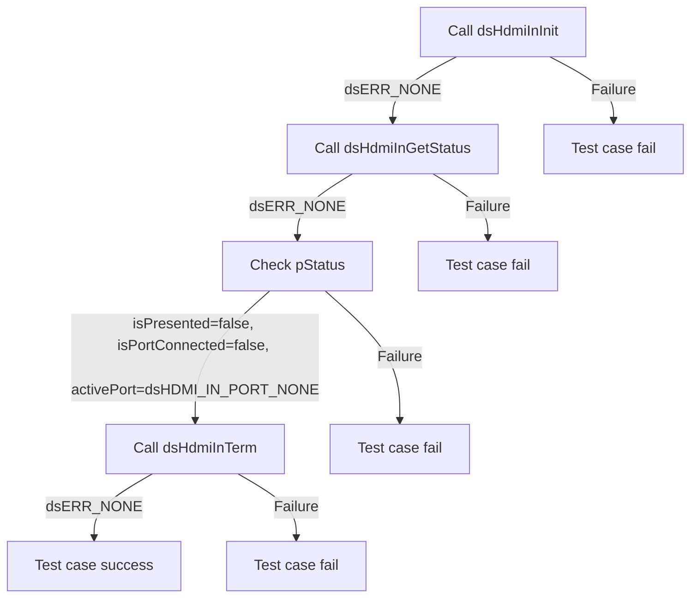
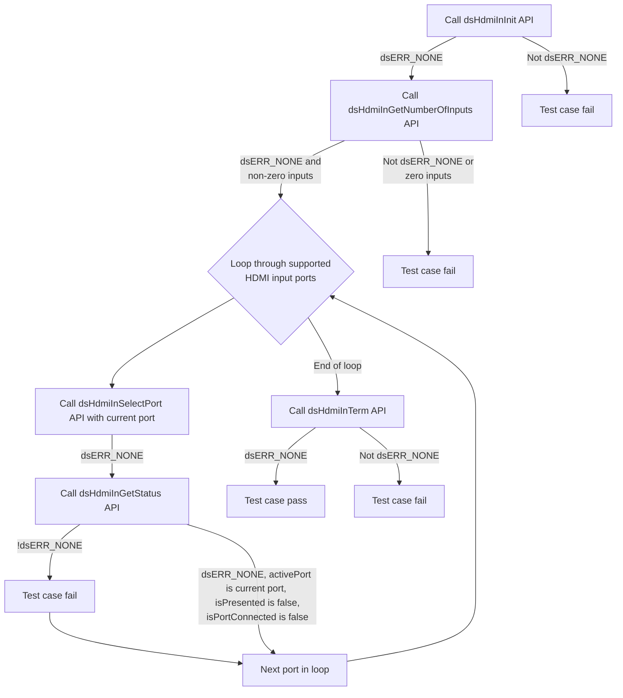
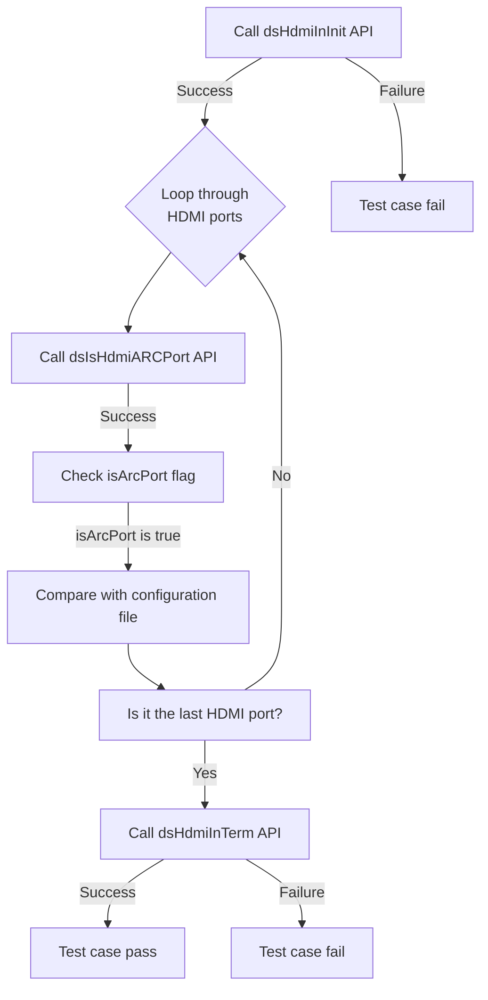
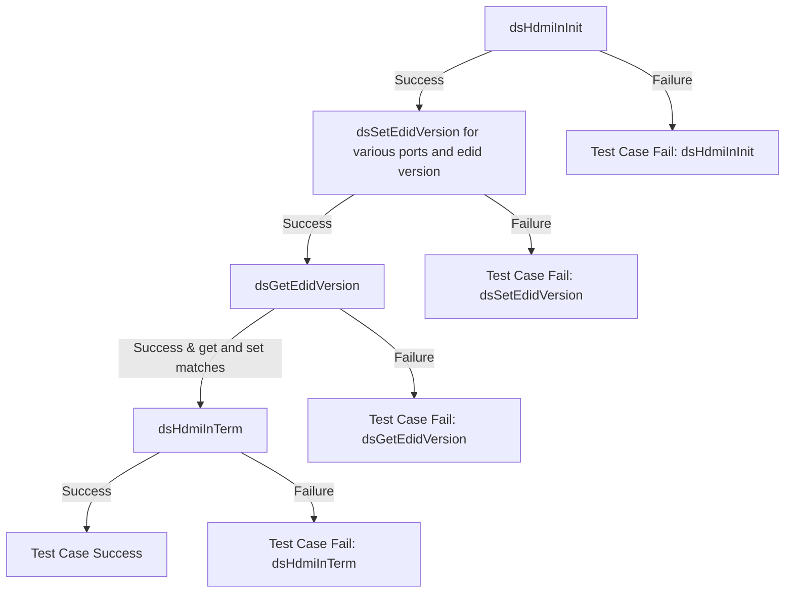
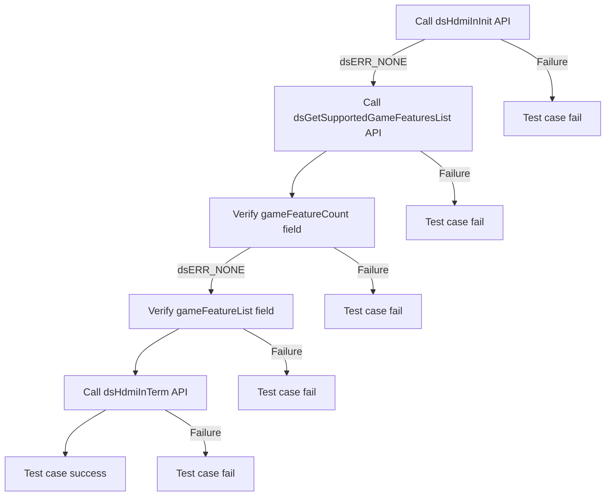
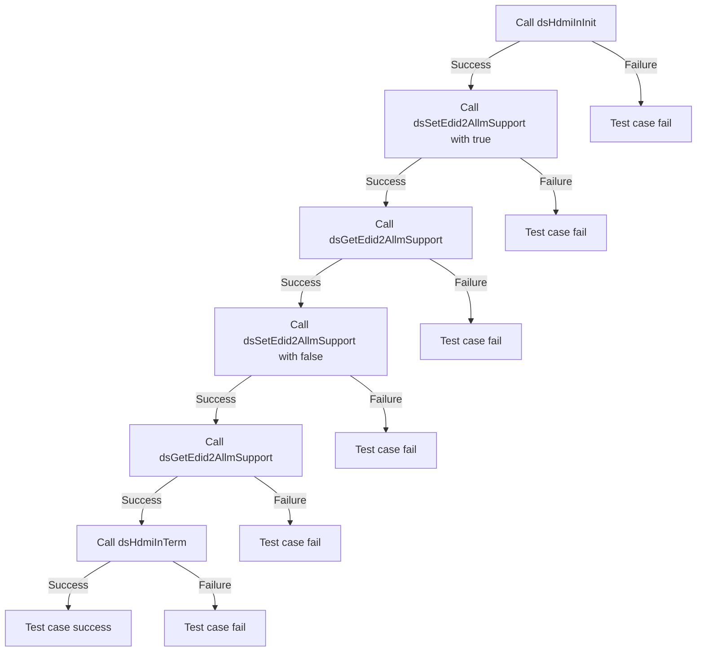
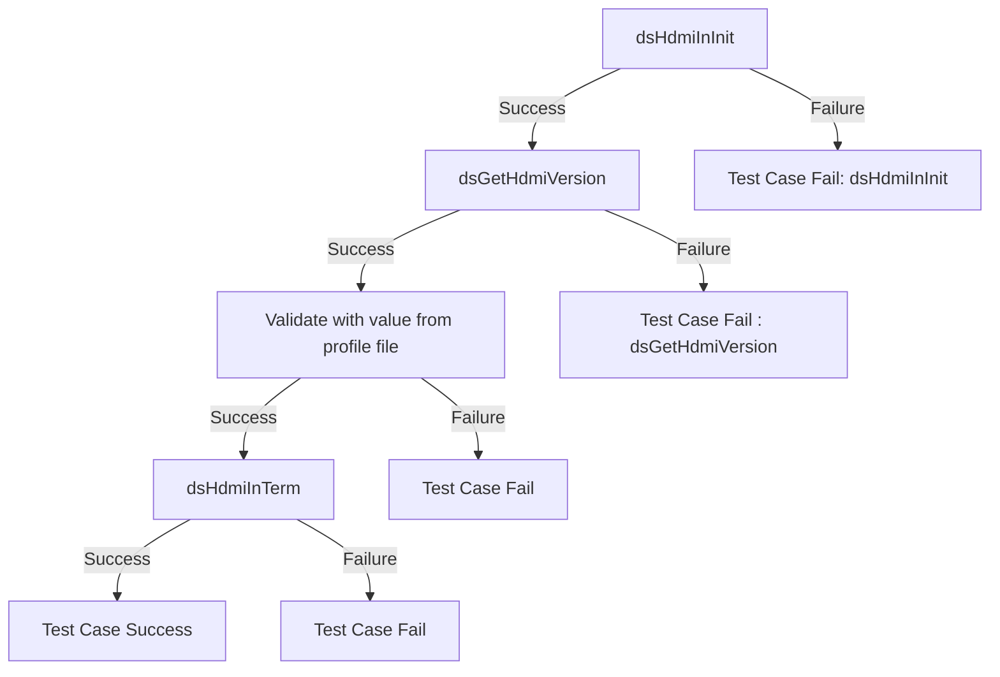

# Device Settings HDMI Input L2 Low Level Test Specification and Procedure Documentation

## Table of Contents

- [Overview](#overview)
- [Acronyms, Terms and Abbreviations](#acronyms-terms-and-abbreviations)
- [Definitions](#definitions)
- [References](#references)
- [Level 2 Test Procedure](#level-2-test-procedure)

## Overview

This document describes the Low Level L2 Test Specification and Procedure Documentation for the Device Settings HDMI Input module.

### Acronyms, Terms and Abbreviations

- `HAL` \- Hardware Abstraction Layer, may include some common components
- `UT`  \- Unit Test(s)
- `OEM`  \- Original Equipment Manufacture
- `SoC`  \- System on a Chip

### Definitions

- `ut-core` \- Common Testing Framework <https://github.com/rdkcentral/ut-core>, which wraps a open-source framework that can be expanded to the requirements for future framework.

### References

- `High Level Test Specification` - [ds-hdmi-in-High-Level_TestSpec.md](https://github.com/rdkcentral/rdk-halif-test-device_settings/blob/main/docs/pages/ds-hdmi-in-High-Level_TestSpec.md)
- `HAL Interface file` - [dsHdmiIn.h](https://github.com/rdkcentral/rdk-halif-device_settings/blob/main/include/dsHdmiIn.h)

## Level 2 Test Procedure

The following functions are expecting to test the module operates correctly.

### Test 1

|Title|Details|
|--|--|
|Function Name|`test_l2_dsHdmiIn_GetNumberOfInputs`|
|Description|Verify that the function returns the expected `HDMI` Input ports. Compare the input port values by parsing the configuration YAML file `dsHdmiIn/numberOfPorts`|
|Test Group|02|
|Test Case ID|001|
|Priority|High|

**Pre-Conditions**
None

**Dependencies**
None

**User Interaction**
If user chose to run the test in interactive mode, then the test case has to be selected via console.

#### Test Procedure - Test 1

| Variation / Steps | Description | Test Data | Expected Result | Notes|
| -- | --------- | ---------- | -------------- | ----- |
| 01 | Initialize `HDMI` input using `dsHdmiInInit` | None | `dsERR_NONE` | Should be successful |
| 02 | Get the number of `HDMI` input ports using `dsHdmiInGetNumberOfInputs` | pNumberOfinputs = valid buffer | `dsERR_NONE` | Should be successful |
| 03 | Compare the number of `HDMI` input ports with the value in the configuration file | pNumberOfinputs = `dsHdmiIn/numberOfPorts` | `dsERR_NONE` | Should be successful |
| 04 | Terminate `HDMI` input using `dsHdmiInTerm` | None | `dsERR_NONE` | Should be successful |

### Test 2

|Title|Details|
|--|--|
|Function Name|`test_l2_dsHdmiIn_GetStatus`|
|Description|Verify the HDMI port with the 'Get status' function when it is disabled, without selecting any port, and without any external devices.|
|Test Group|02|
|Test Case ID|002|
|Priority|High|

**Pre-Conditions**
None

**Dependencies**
None

**User Interaction**
If user chose to run the test in interactive mode, then the test case has to be selected via console.

#### Test Procedure - Test 2

| Variation / Steps | Description | Test Data | Expected Result | Notes|
| -- | --------- | ---------- | -------------- | ----- |
| 01 | Initialize `HDMI` input using `dsHdmiInInit` | None | `dsERR_NONE` | Should be successful |
| 02 | Get the status of `HDMI` input using `dsHdmiInGetStatus` | status = valid buffer | `dsERR_NONE` | Should be successful |
| 03 | Check if `HDMI` input is presented | isPresented = false | false | Should be successful |
| 04 | Check if any `HDMI` input port is active | activePort = `dsHDMI_IN_PORT_NONE` | `dsHDMI_IN_PORT_NONE` | Should be successful |
| 05 | Check if any `HDMI` input port is connected | isPortConnected[i] = false for all i in range 0 to `dsHDMI_IN_PORT_MAX` | false | Should be successful |
| 06 | Terminate `HDMI` input using `dsHdmiInTerm` | None | `dsERR_NONE` | Should be successful |

### Test 3

|Title|Details|
|--|--|
|Function Name|`test_l2_dsHdmiIn_VerifyHdmiInputPortStatus`|
|Description|Loop through all `HDMI` Input port, verify that the function successfully sets the specified `HDMI` Input port without any external device connection and 'Get status' to check the active port is false, port connected is false and presentation is false.|
|Test Group|02|
|Test Case ID|003|
|Priority|High|

**Pre-Conditions**
None

**Dependencies**
None

**User Interaction**
If user chose to run the test in interactive mode, then the test case has to be selected via console.

#### Test Procedure - Test 3

| Variation / Steps | Description | Test Data | Expected Result | Notes|
| -- | --------- | ---------- | -------------- | ----- |
| 01 | Initialize HDMI input using `dsHdmiInInit` | None | `dsERR_NONE` | Should be successful |
| 02 | Get the number of `HDMI` inputs using `dsHdmiInGetNumberOfInputs` | numInputs = valid buffer | `dsERR_NONE`, numInputs > 0 | Should be successful |
| 03 | Loop through supported `HDMI` input ports and select each port using `dsHdmiInSelectPort` | port = `dsHDMI_IN_PORT_0` to numInputs-1, audioMix = false, evideoPlaneType = dsVideoPlane_PRIMARY, topMost = false | `dsERR_NONE` | Should be successful |
| 04 | Get the status of the selected HDMI input port using `dsHdmiInGetStatus` | status = valid buffer | `dsERR_NONE`, activePort = port, isPresented = false, isPortConnected[port] = false | Should be successful |
| 05 | Terminate HDMI input using `dsHdmiInTerm` | None | `dsERR_NONE` | Should be successful |

### Test 4

|Title|Details|
|--|--|
|Function Name|`test_l2_dsHdmiIn_VerifyHdmiArcPort_sink`|
|Description|Loop through supported ports and verify whether the given port is an HDMI ARC port by comparing it with the `dsHdmiIn/HdmiArcPort/numberOfPorts` configuration file.|
|Test Group|02|
|Test Case ID|004|
|Priority|High|

**Pre-Conditions**
None

**Dependencies**
None

**User Interaction**
If user chose to run the test in interactive mode, then the test case has to be selected via console.

#### Test Procedure - Test 4

| Variation / Steps | Description | Test Data | Expected Result | Notes|
| -- | --------- | ---------- | -------------- | ----- |
| 01 | Initialize HDMI input using `dsHdmiInInit` | None | `dsERR_NONE` | Should be successful |
| 02 | Loop through supported HDMI input ports | iPort = `dsHDMI_IN_PORT_0` to number of Hdmi Input ports supported | `dsERR_NONE` | Should be successful |
| 03 | For each port, check if it is an `HDMI` ARC port using `dsIsHdmiARCPort` | iPort = current port in loop, &isArcPort = valid buffer | `dsERR_NONE` | Should be successful |
| 04 | If the port is an `HDMI` ARC port, verify it with the configuration file | iPort = current port, isArcPort = `dsHdmiIn/HdmiArcPortID` from configuration file returned by `dsIsHdmiARCPort` | `dsERR_NONE` | Should be successful |
| 05 | Terminate `HDMI` input using `dsHdmiInTerm` | None | `dsERR_NONE` | Should be successful |

### Test 5

|Title|Details|
|--|--|
|Function Name|`test_l2_dsHdmiIn_SetAndGetEdidVersionAndValidateEdidLength_sink`|
|Description|Setting the `EDID` version for a given port and getting back the `EDID` version and compare with the Set value.|
|Test Group|02|
|Test Case ID|005|
|Priority|High|

**Pre-Conditions**
None

**Dependencies**
None

**User Interaction**
If user chose to run the test in interactive mode, then the test case has to be selected via console.

#### Test Procedure - Test 5

| Variation / Steps | Description | Test Data | Expected Result | Notes|
| -- | --------- | ---------- | -------------- | ----- |
| 01 | Initialize HDMI input module using `dsHdmiInInit` | None | `dsERR_NONE` | Should be successful |
| 02 | Set `EDID` version for each HDMI port using `dsSetEdidVersion` | hdmiPort = `dsHDMI_IN_PORT_0` to `dsHDMI_IN_PORT_2`, edidVersion = Supported `EDID` version from configuration file  `dsHdmiIn/EdidVersion/` | `dsERR_NONE` | Should be successful |
| 03 | Get  and compare the `EDID` version for each `HDMI` port using `dsGetEdidVersion` | hdmiPort  | `dsERR_NONE` | Should be successful |
| 04 | Repeat steps 2 to 4 for all `HDMI` ports and `EDID` versions | | `dsERR_NONE` | Should be successful |
| 05 | Terminate `HDMI` input module using `dsHdmiInTerm` | None | `dsERR_NONE` | Should be successful |

### Test 6

|Title|Details|
|--|--|
|Function Name|`test_l2_dsHdmiIn_GetSupportedGameFeaturesList_sink`|
|Description|Make sure that the functionality can list and get the count of all the game features that are supported. Compare the result by parsing the configuration YAML file `dsHdmiIn/gameFeatures/count`|
|Test Group|02|
|Test Case ID|006|
|Priority|High|

**Pre-Conditions**
None

**Dependencies**
None

**User Interaction**
If user chose to run the test in interactive mode, then the test case has to be selected via console.

#### Test Procedure - Test 6

| Variation / Steps | Description | Test Data | Expected Result | Notes|
| -- | --------- | ---------- | -------------- | ----- |
| 01 | Initialize HDMI input using dsHdmiInInit | None | dsERR_NONE | Should be successful |
| 02 | Get the list of supported game features using dsGetSupportedGameFeaturesList | features = `dsHdmiIn/gameFeatures/feature` | dsERR_NONE | Should be successful |
| 03 | Compare the count of game features with the count in the configuration file | features.gameFeatureCount = value from `dsHdmiIn/gameFeatures/count` | dsERR_NONE | Should be successful |
| 04 | Terminate HDMI input using dsHdmiInTerm | None | dsERR_NONE | Should be successful |

### Test 7

|Title|Details|
|--|--|
|Function Name|`test_l2_dsHdmiIn_SetAndGetAllmSupport_sink`|
|Description|Set and Get the `ALLM` support to `EDID` version 2.0 without connecting any source devices.|
|Test Group|02|
|Test Case ID|007|
|Priority|High|

**Pre-Conditions**
None

**Dependencies**
None

**User Interaction**
If user chose to run the test in interactive mode, then the test case has to be selected via console.

#### Test Procedure - Test 7

| Variation / Steps | Description | Test Data | Expected Result | Notes|
| -- | --------- | ---------- | -------------- | ----- |
| 01 | Initialize `HDMI` input using `dsHdmiInInit` | None | `dsERR_NONE` | Should be successful |
| 02 | Set `EDID` 2.0 ALLM support to true using `dsSetEdid2AllmSupport` | iHdmiPort = `dsHDMI_IN_PORT_0`, allmSupport = true | `dsERR_NONE` | Should be successful |
| 03 | Get `EDID` 2.0 ALLM support using `dsGetEdid2AllmSupport` | iHdmiPort = `dsHDMI_IN_PORT_0`,  number of Hdmi Input ports   | `dsERR_NONE`, allmSupport = true | Should be successful |
| 04 | Set EDID 2.0 ALLM support to false using `dsSetEdid2AllmSupport` | iHdmiPort = dsHDMI_IN_PORT_0, allmSupport = false | `dsERR_NONE` | Should be successful |
| 05 | Get EDID 2.0 ALLM support using `dsGetEdid2AllmSupport` | iHdmiPort = `dsHDMI_IN_PORT_0`, to number of Hdmi Input ports supported | `dsERR_NONE`, allmSupport = false | Should be successful |
| 06 | Terminate HDMI input using `dsHdmiInTerm` | None | `dsERR_NONE` | Should be successful |

### Test 8

|Title|Details|
|--|--|
|Function Name|`test_l2_dsHdmiIn_GetHdmiVersionAndValidate_sink`|
|Description|Getting the `HDMI` compatibility version for a given port version and validate it.|
|Test Group|02|
|Test Case ID|008|
|Priority|High|

**Pre-Conditions**
None

**Dependencies**
None

**User Interaction**
If user chose to run the test in interactive mode, then the test case has to be selected via console.

#### Test Procedure - Test 8

| Variation / Steps | Description | Test Data | Expected Result | Notes|
| -- | --------- | ---------- | -------------- | ----- |
| 01 | Initialize HDMI input module using `dsHdmiInInit` | None | `dsERR_NONE` | Should be successful |
| 02 | Get  and validate the `HDMI` compatibility version by comparing with the YAML file for each `HDMI` port using `dsGetHdmiVersion` | hdmiPort = `dsHDMI_IN_PORT_0` to number of supported ports | `dsERR_NONE` | Should be successful |
| 03 | Terminate `HDMI` input module using `dsHdmiInTerm` | None | `dsERR_NONE` | Should be successful |

