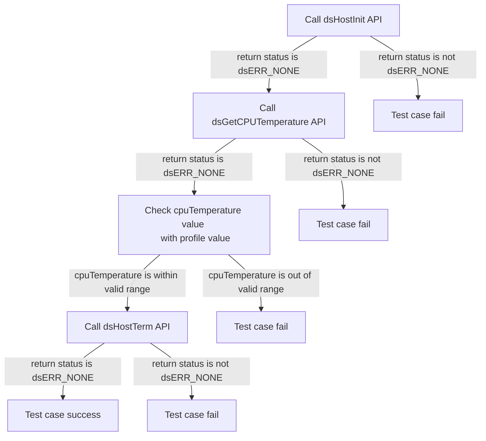
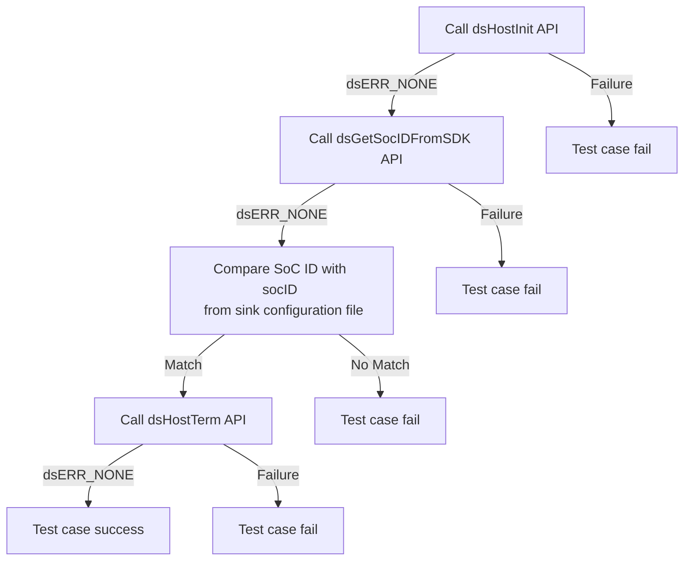
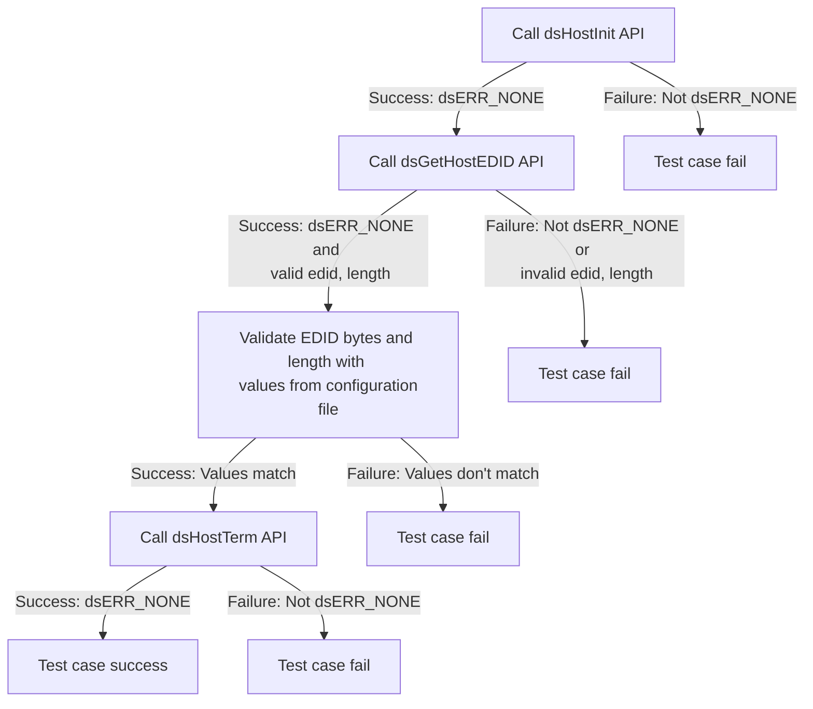

# Device Settings Host L2 Low Level Test Specification and Procedure Documentation

## Table of Contents

- [Overview](#overview)
- [Acronyms, Terms and Abbreviations](#acronyms-terms-and-abbreviations)
- [Definitions](#definitions)
- [References](#references)
- [Level 2 Test Procedure](#level-2-test-procedure)

## Overview

This document describes the Low Level L2 Test Specification and Procedure for the Device Settings Host module.

### Acronyms, Terms and Abbreviations

- `HAL` \- Hardware Abstraction Layer, may include some common components
- `UT`  \- Unit Test(s)
- `SoC`  \- System on a Chip
- `EDID` \- Extended Display Identification
- `CPU` \- Central processing unit
- `dsHost` \- Device Settings Host
- `API` \- Application programming interface

### Definitions

- `ut-core` \- Common Testing Framework <https://github.com/rdkcentral/ut-core>, which wraps a open-source framework that can be expanded to the requirements for future framework.

### References

- `High Level Test Specification` - [dsHost_TestSpecification.md](https://github.com/rdkcentral/rdk-halif-test-device_settings/blob/main/docs/pages/dsHost_TestSpecification.md)
- `HAL Interface Header File` - [dsHost.h](https://github.com/rdkcentral/rdk-halif-device_settings/blob/main/include/dsHost.h)

## Level 2 Test Procedure

The following functions are expecting to test the module operates correctly.

### Test 1

|Title|Details|
|-----|-------|
|Function Name|`test_l2_dsHost_GetCPUTemperature`|
|Description|Get the `CPU` temperature and check whether the temperature falls within valid operating range and ensure the `CPU` is in a normal operating state based on maximum and minimum values of `dsHost/cpuTemperature` in the configuration file|
|Test Group|02|
|Test Case ID|001|
|Priority|High|

**Pre-Conditions**
None

**Dependencies**
None

**User Interaction**
If user chose to run the test in interactive mode, then the test case has to be selected via console.

#### Test Procedure - Test 1

|Variation / Steps|Description|Test Data|Expected Result|Notes|
|-----------------|-----------|---------|---------------|-----|
|01|Initialize the host using `dsHostInit`|No input parameters|`dsERR_NONE`|Should be successful|
|02|Get the `CPU` temperature using `dsGetCPUTemperature`|cpuTemperature = valid buffer|`dsERR_NONE`|Should be successful|
|03|Check the `CPU` temperature against the profile|cpuTemperature = obtained value, profile temperature range = `dsHost/cpuTemperature` of configuration file|Value should fall in the expected range|Should be successful|
|04|Terminate the host using `dsHostTerm`|No input parameters|`dsERR_NONE`|Should be successful|

### Test 2

|Title|Details|
|-----|-------|
|Function Name|`test_l2_dsHost_GetAndVerifySocID`|
|Description|Get the `SoC` ID and verify with `dsHost/socID` value in configuration file|
|Test Group|02|
|Test Case ID|002|
|Priority|High|

**Pre-Conditions**
None

**Dependencies**
None

**User Interaction**
If user chose to run the test in interactive mode, then the test case has to be selected via console.

#### Test Procedure - Test 2

|Variation / Steps|Description|Test Data|Expected Result|Notes|
|-----------------|-----------|---------|---------------|-----|
|01|Initialize the host using `dsHostInit` `API`|No input parameters|`dsERR_NONE`|Should be successful|
|02|Get the `SoC` ID using `dsGetSocIDFromSDK` `API`|socID = valid buffer|`dsERR_NONE`|Should be successful|
|03|Verify the `SoC` ID with the value in the configuration file|socID = value from `dsHost/socID` of configuration file|`dsERR_NONE`|Should be successful|
|04|Terminate the host using `dsHostTerm` `API`|No input parameters|`dsERR_NONE`|Should be successful|

### Test 3

|Title|Details|
|-----|-------|
|Function Name|`test_l2_dsHost_ValidateHostEDID_sink`|
|Description|Get the host `EDID` bytes and validate the `EDID` bytes and length with the `dsHost/edidBytes` and `dsHost/edidbytesLength` values from the configuration file|
|Test Group|02|
|Test Case ID|003|
|Priority|High|

**Pre-Conditions**
None

**Dependencies**
None

**User Interaction**
If user chose to run the test in interactive mode, then the test case has to be selected via console.

#### Test Procedure - Test 3

|Variation / Steps|Description|Test Data|Expected Result|Notes|
|-----------------|-----------|---------|---------------|-----|
|01|Initialize the host using `dsHostInit`|No input parameters|`dsERR_NONE`|Should be successful|
|02|Get the host `EDID` using `dsGetHostEDID`|edid = valid buffer, length = valid pointer|`dsERR_NONE`|Should be successful|
|03|Validate the `EDID` bytes and length|edid = retrieved `EDID` from `dsHost/edidBytes` of configuration file, length = retrieved length from `dsHost/edidbytesLength` of configuration file|edidBytes and edidbytesLength from configuration file matches|Should be successful|
|04|Terminate the host using `dsHostTerm`|No input parameters|`dsERR_NONE`|Should be successful|

