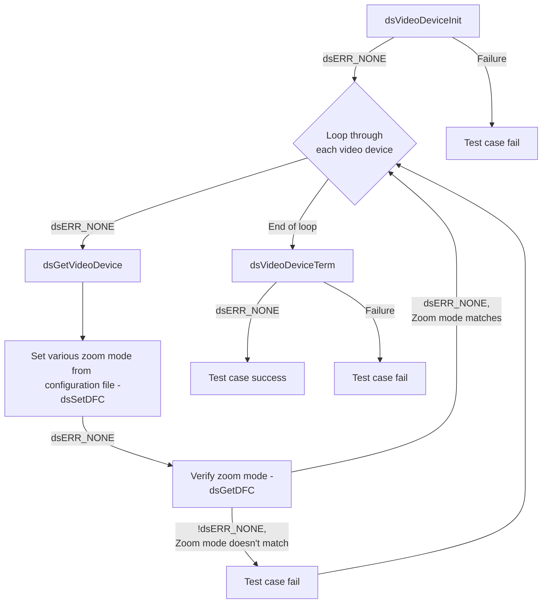
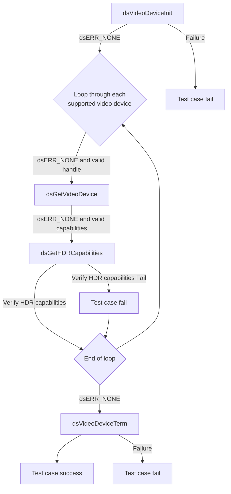
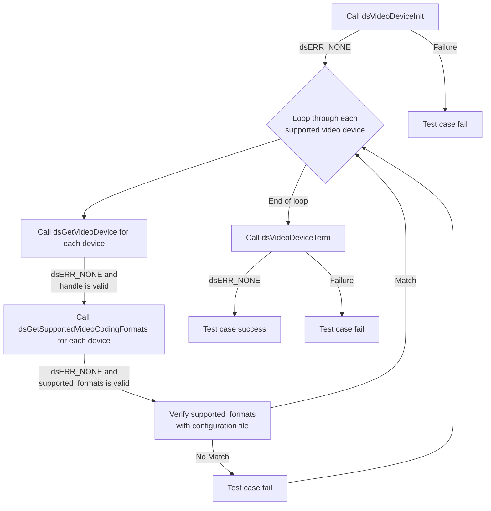
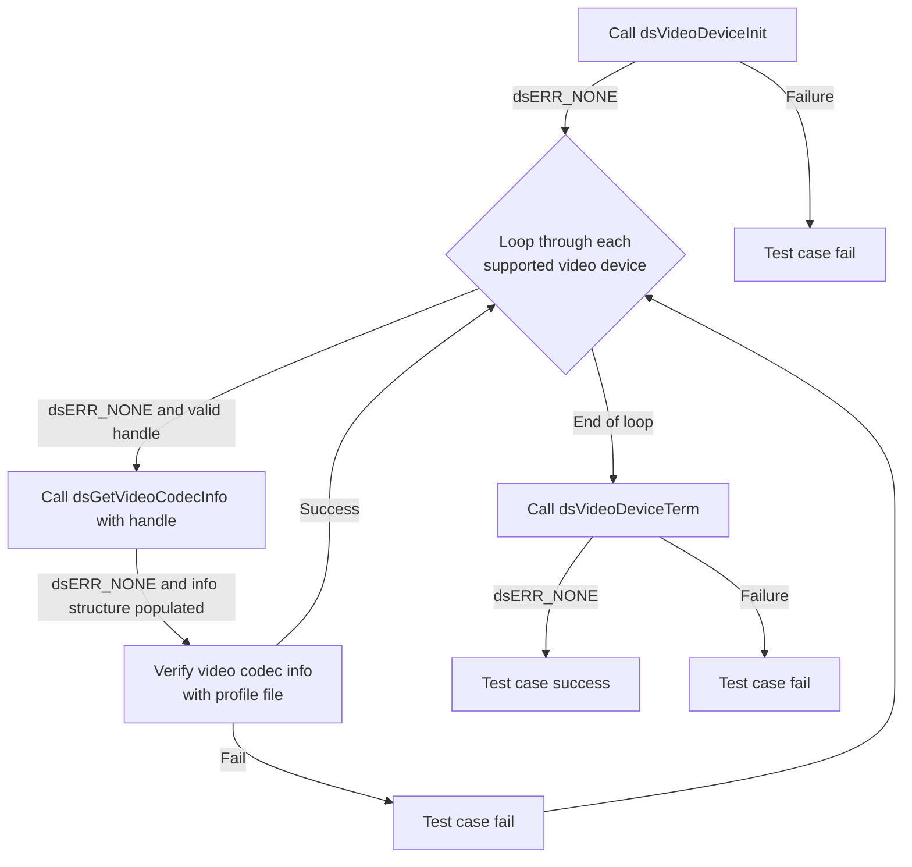
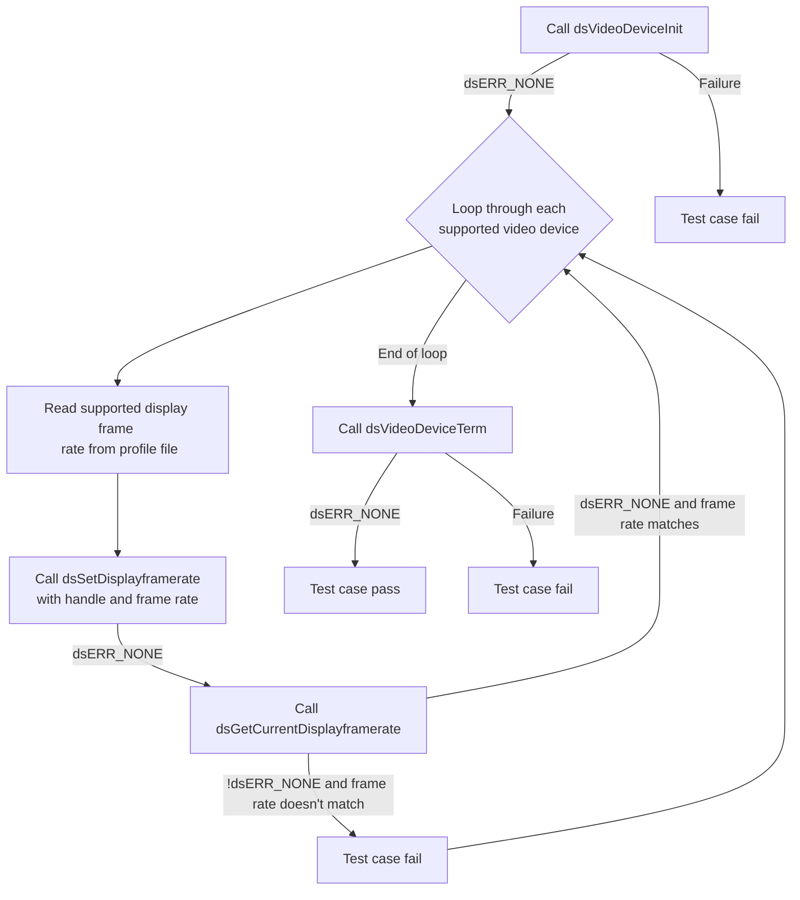

# Device Settings Video Device L2 Low Level Test Specification and Procedure Documentation

## Table of Contents

- [Overview](#overview)
- [Acronyms, Terms and Abbreviations](#acronyms-terms-and-abbreviations)
- [Definitions](#definitions)
- [References](#references)
- [Level 2 Test Procedure](#level-2-test-procedure)

## Overview

This document describes the Low Level L2 Test Specification and Procedure for the Device Settings Video Device module.

### Acronyms, Terms and Abbreviations

- `HAL` \- Hardware Abstraction Layer, may include some common components
- `UT`  \- Unit Test(s)
- `OEM`  \- Original Equipment Manufacture
- `SoC`  \- System on a Chip
- `HDR` \- High Dynamic Range

### Definitions

- `ut-core` \- Common Testing Framework <https://github.com/rdkcentral/ut-core>, which wraps a open-source framework that can be expanded to the requirements for future framework.

### References

- High Level Test Specification [ds-video-device_High-Level_TestSpec.md](ds-video-device_High-Level_TestSpec.md)
- dsVideoDevice `HAL` Interface - [dsVideoDevice.h](https://github.com/rdkcentral/rdk-halif-device_settings/blob/main/include/dsVideoDevice.h)

## Level 2 Test Procedure

The following functions are expecting to test the module operates correctly.

### Test 1

|Title|Details|
|-----|-------|
|Function Name|`test_l2_dsVideoDevice_SetAndGetDFC_source`|
|Description|Loop through each supported video device and the zoom mode can be set using `dsVideoDevice/Device/[Device Number]/SupportedDFCs` field of configuration file and verify using get|
|Test Group|02|
|Test Case ID|001|
|Priority|High|

**Pre-Conditions**
None

**Dependencies**
None

**User Interaction**
If user chose to run the test in interactive mode, then the test case has to be selected via console.

#### Test Procedure - Test 1

|Variation / Steps|Description|Test Data|Expected Result|Notes|
|-----------------|-----------|---------|---------------|-----|
|01|Initialize video device using `dsVideoDeviceInit`|None|`dsERR_NONE`|Should be successful|
|02|Get video device handle using `dsGetVideoDevice`|index = 0 to `dsVideoDevice/NumVideoDevices` from profile file|`dsERR_NONE`|Should be successful|
|03|Loop through each supported video device and set the zoom mode using `dsSetDFC`|handle = obtained handle, dfc = `dsVideoDevice/Device/[Device Number]/SupportedDFCs` of configuration file|`dsERR_NONE`|Should be successful|
|04|Verify the set zoom mode using `dsGetDFC`|handle = obtained handle, dfc_get = buffer to get dfc|`dsERR_NONE`, dfc_get = dfc|Should be successful|
|05|Terminate video device using `dsVideoDeviceTerm`|None|`dsERR_NONE`|Should be successful|

### Test 2

|Title|Details|
|-----|-------|
|Function Name|`test_l2_dsVideoDevice_GetHDRCapabilities`|
|Description|Loop through each supported video device and Get the `HDR` capabilities for each video device and verify with the configuration file|
|Test Group|02|
|Test Case ID|002|
|Priority|High|

**Pre-Conditions**
None

**Dependencies**
None

**User Interaction**
If user chose to run the test in interactive mode, then the test case has to be selected via console.

#### Test Procedure - Test 2

|Variation / Steps|Description|Test Data|Expected Result|Notes|
|-----------------|-----------|---------|---------------|-----|
|01|Initialize the video device using `dsVideoDeviceInit`|None|`dsERR_NONE`|Should be successful|
|02|Loop through each video device using `dsGetVideoDevice`|index = 0 to `dsVideoDevice/NumVideoDevices` from configuration file, handle = valid pointer|`dsERR_NONE`|Should be successful|
|03|Get the `HDR` capabilities for each video device using `dsGetHDRCapabilities`|handle = obtained from previous step, capabilities = valid pointer|`dsERR_NONE`|Should be successful|
|04|Verify the obtained `HDR` capabilities with the configuration file|capabilities = obtained from previous step, configuration field = `dsVideoDevice/Device/[Device Number]/HDRCapabilities`|Value should match with the configuration file|Should be successful|
|05|Terminate the video device using `dsVideoDeviceTerm`|None|`dsERR_NONE`|Should be successful|

### Test 3

|Title|Details|
|-----|-------|
|Function Name|`test_l2_dsVideoDevice_GetSupportedVideoCodingFormats`|
|Description|Loop through each supported video device and get the Video coding format for each video device and verify it with the Configuration file|
|Test Group|02|
|Test Case ID|003|
|Priority|High|

**Pre-Conditions**
None

**Dependencies**
None

**User Interaction**
If user chose to run the test in interactive mode, then the test case has to be selected via console.

#### Test Procedure - Test 3

|Variation / Steps|Description|Test Data|Expected Result|Notes|
|-----------------|-----------|---------|---------------|-----|
|01|Initialize the video device using `dsVideoDeviceInit`|None|`dsERR_NONE`|Should be successful|
|02|Loop through each video device using `dsGetVideoDevice`|index = 0 to `dsVideoDevice/NumVideoDevices` from the configuration file|`dsERR_NONE`|Should be successful|
|03|Get the supported video coding formats for each device using `dsGetSupportedVideoCodingFormats`|handle = obtained from `dsGetVideoDevice`|`dsERR_NONE`|Should be successful|
|04|Verify the obtained supported formats with the configuration file|supported_formats = from previous step, configuration field = `dsVideoDevice/Device/[Device Number]/SupportedVideoCodingFormats`|`dsERR_NONE`|Should be successful|
|05|Terminate the video device using `dsVideoDeviceTerm`|None|`dsERR_NONE`|Should be successful|

### Test 4

|Title|Details|
|-----|-------|
|Function Name|`test_l2_dsVideoDevice_GetVideoCodecInfo_source`|
|Description|Loop through each supported video device and get Video codec information for each video device and verify the with configuration file|
|Test Group|02|
|Test Case ID|004|
|Priority|High|

**Pre-Conditions**
None

**Dependencies**
None

**User Interaction**
If user chose to run the test in interactive mode, then the test case has to be selected via console.

#### Test Procedure - Test 4

|Variation / Steps|Description|Test Data|Expected Result|Notes|
|-----------------|-----------|---------|---------------|-----|
|01|Initialize the video device using `dsVideoDeviceInit`|None|`dsERR_NONE`|Should be successful|
|02|Loop through each supported video device using `dsGetVideoDevice`|index = 0 to `dsVideoDevice/NumVideoDevices` from the configuration file|`dsERR_NONE`|Should be successful|
|03|Get Video codec information for each video device using `dsGetVideoCodecInfo`|handle = handle from `dsGetVideoDevice`, codec = codec|`dsERR_NONE`|Should be successful|
|04|Verify the obtained Video codec information with configuration file|num_entries = `dsVideoDevice/Device/[Device Number]/VideoCodecInfo/num_entries`, level = `dsVideoDevice/Device/[Device Number]/VideoCodecInfo/VideoCodec[number]/level`, profile =  `dsVideoDevice/Device/[Device Number]/VideoCodecInfo/VideoCodec[number]/profile`|`dsERR_NONE`|Should be successful|
|05|Terminate the video device using `dsVideoDeviceTerm`|None|`dsERR_NONE`|Should be successful|

### Test 5

|Title|Details|
|-----|-------|
|Function Name|`test_l2_dsVideoDevice_SetAndVerifyDisplayframerate_sink`|
|Description|Loop through each supported video device and Set the supported display frame rate for each video device using configuration file and verify using get|
|Test Group|02|
|Test Case ID|005|
|Priority|High|

**Pre-Conditions**
None

**Dependencies**
None

**User Interaction**
If user chose to run the test in interactive mode, then the test case has to be selected via console.

#### Test Procedure - Test 5

|Variation / Steps|Description|Test Data|Expected Result|Notes|
|-----------------|-----------|---------|---------------|-----|
|01|Initialize video device using `dsVideoDeviceInit`|None|`dsERR_NONE`|Should be successful|
|02|Get video device handle using `dsGetVideoDevice` with index 0 , Loop through each supported video device|index = 0 to `dsVideoDevice/NumVideoDevices` from the configuration file, handle = valid pointer|`dsERR_NONE`|Should be successful|
|03|Set the supported display frame rate for each video device using `dsSetDisplayframerate`|handle = obtained handle, framerate = `dsVideoDevice/Device/[Device Number]/SupportedDisplayframerate`|dsERR_NONE|Should be successful|
|04|Verify the set frame rate using `dsGetCurrentDisplayframerate`|handle = obtained handle, framerate = valid pointer|`dsERR_NONE`|Should be successful|
|05|Terminate video device using `dsVideoDeviceTerm`|None|`dsERR_NONE`|Should be successful|

