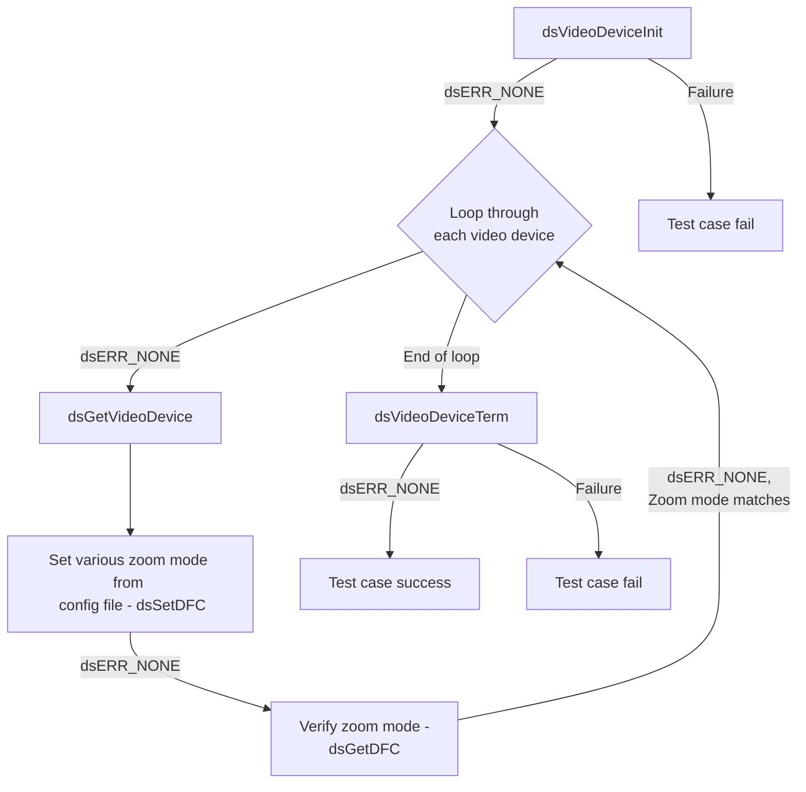
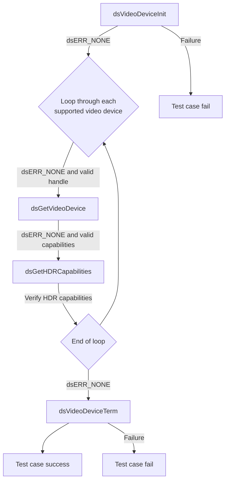
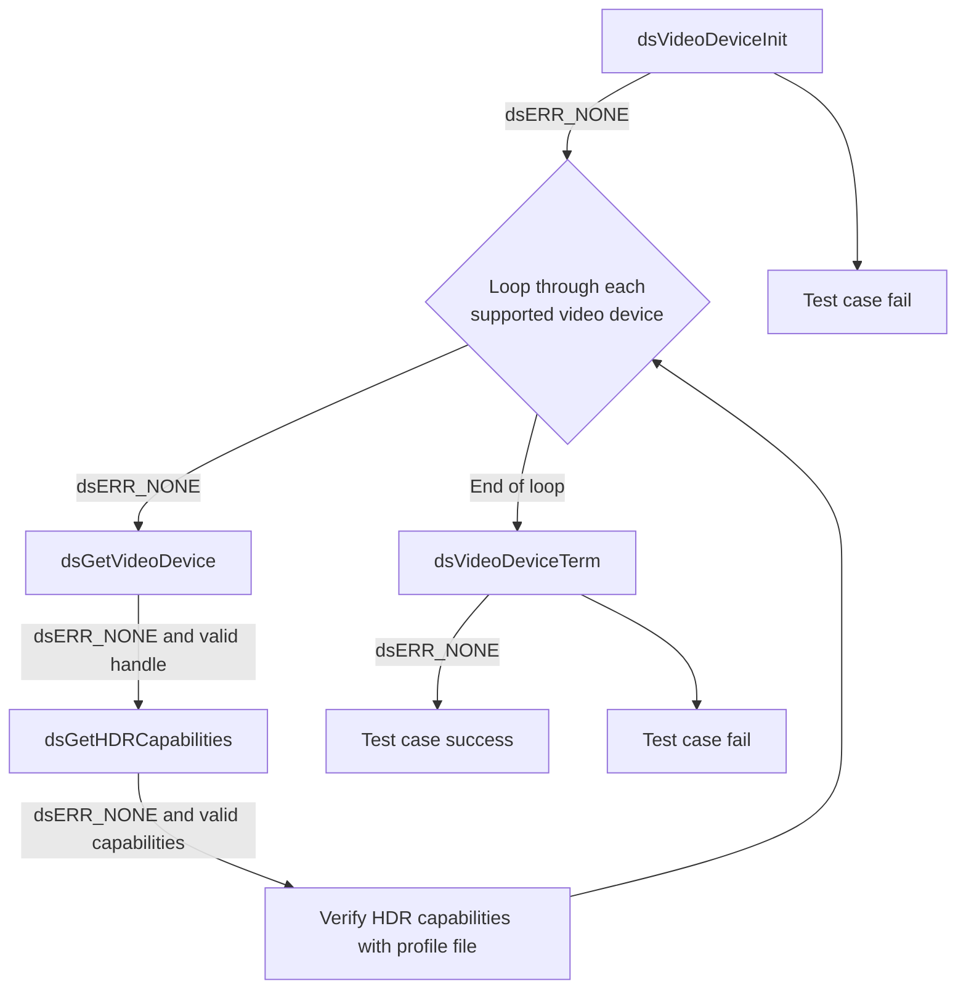
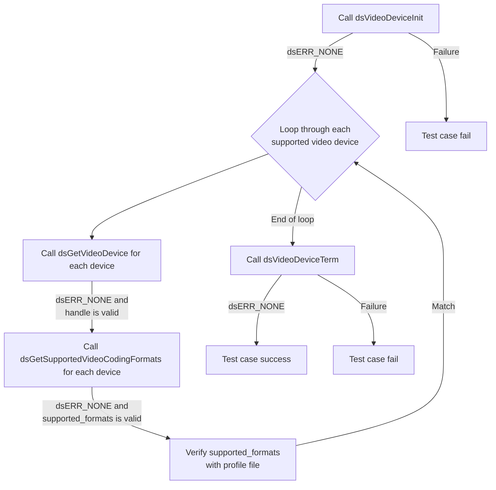
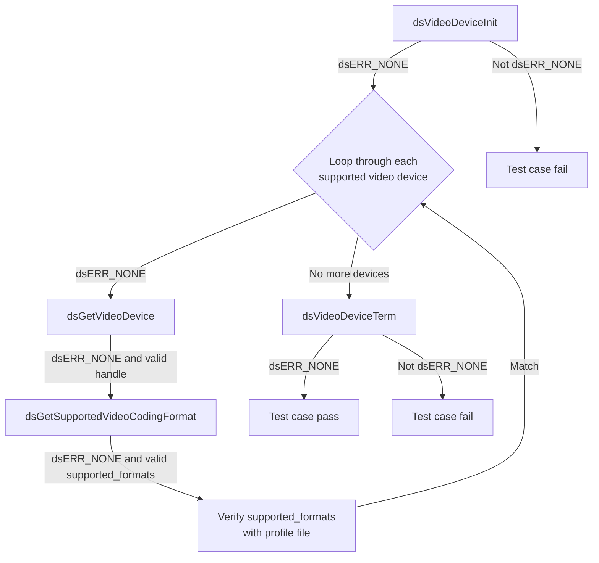
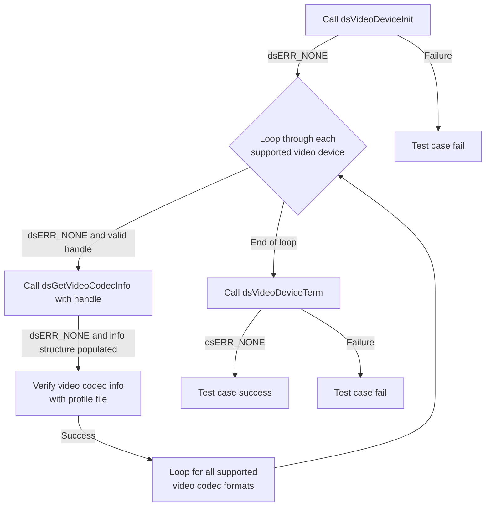
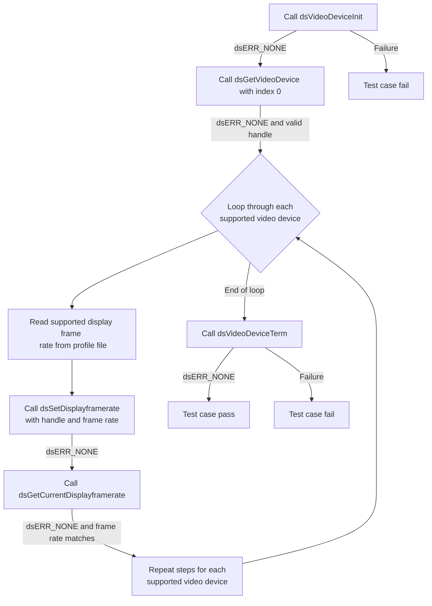

# Device Settings Video Device L2 Low Level Test Specification and Procedure Documentation

## Table of Contents

- [Overview](#overview)
- [Acronyms, Terms and Abbreviations](#acronyms-terms-and-abbreviations)
- [Definitions](#definitions)
- [References](#references)
- [Level 2 Test Procedure](#level-2-test-procedure)

## Overview

This document describes the level 2 testing suite for the Device Settings Video Device module.

### Acronyms, Terms and Abbreviations

- `HAL` \- Hardware Abstraction Layer, may include some common components
- `UT`  \- Unit Test(s)
- `OEM`  \- Original Equipment Manufacture
- `SoC`  \- System on a Chip

### Definitions

- `ut-core` \- Common Testing Framework <https://github.com/rdkcentral/ut-core>, which wraps a open-source framework that can be expanded to the requirements for future framework.

### References

- High Level Test Specification [ds-video-device_High-Level_TestSpec.md](ds-video-device_High-Level_TestSpec.md)

## Level 2 Test Procedure

The following functions are expecting to test the module operates correctly.

### Test 1

|Title|Details|
|--|--|
|Function Name|`test_l2_dsVideoDevice_SetAndGetDFC_source`|
|Description|Loop through each supported video device and the zoom mode can be set using `Source_VideoDevice.yaml(dsVideoDevice/Device/1/SupportedDFCs)` profile file and verify using get|
|Test Group|02|
|Test Case ID|001|
|Priority|High|

**Pre-Conditions :**
None

**Dependencies :**
None

**User Interaction :**
If user chose to run the test in interactive mode, then the test case has to be selected via console.

#### Test Procedure

| Variation / Steps | Description | Test Data | Expected Result | Notes|
| -- | --------- | ---------- | -------------- | ----- |
| 01 | Initialize video device using dsVideoDeviceInit | None | dsERR_NONE | Should be successful |
| 02 | Get video device handle using dsGetVideoDevice | index = 0 to MAX_DEVICES from profile file| dsERR_NONE | Should be successful |
| 03 | Loop through each supported video device and set the zoom mode using dsSetDFC | handle = obtained handle, dfc = dsVIDEO_ZOOM_NONE to dsVIDEO_ZOOM_MAX | dsERR_NONE | Should be successful |
| 04 | Verify the set zoom mode using dsGetDFC | handle = obtained handle, dfc_get = buffer to get dfc | dsERR_NONE, dfc_get = dfc | Should be successful |
| 05 | Terminate video device using dsVideoDeviceTerm | None | dsERR_NONE | Should be successful |

### Test 2

|Title|Details|
|--|--|
|Function Name|`test_l2_dsVideoDevice_GetHDRCapabilities_sink`|
|Description|Loop through each supported video device and Get the `HDR` capabilities for each video device and verify with the profile file for source use this `Source_VideoDevice.yaml(dsVideoDevice/device/1/HDRCapabilities)` and for the sink use this `Sink_VideoDevice.yaml(dsVideoDevice/device/1/HDRCapabilities)`|
|Test Group|02|
|Test Case ID|002|
|Priority|High|

**Pre-Conditions :**
None

**Dependencies :**
None

**User Interaction :**
If user chose to run the test in interactive mode, then the test case has to be selected via console.

**Test Procedure:**

| Variation / Steps | Description | Test Data | Expected Result | Notes|
| -- | --------- | ---------- | -------------- | ----- |
| 01 | Initialize the video device using dsVideoDeviceInit | None | dsERR_NONE | Should be successful |
| 02 | Loop through each video device using dsGetVideoDevice | index = 0 to MAX_DEVICES from profile file, handle = valid pointer | dsERR_NONE | Should be successful |
| 03 | Get the HDR capabilities for each video device using dsGetHDRCapabilities | handle = obtained from previous step, capabilities = valid pointer | dsERR_NONE | Should be successful |
| 04 | Verify the obtained HDR capabilities with the profile file | capabilities = obtained from previous step | Value should match with the profile file | Should be successful |
| 05 | Terminate the video device using dsVideoDeviceTerm | None | dsERR_NONE | Should be successful |

### Test 3

|Title|Details|
|--|--|
|Function Name|`test_l2_dsVideoDevice_GetHDRCapabilities_source`|
|Description|Loop through each supported video device and Get the `HDR` capabilities for each video device and verify with the profile file for source use this `Source_VideoDevice.yaml(dsVideoDevice/device/1/HDRCapabilities)` and for the sink use this `Sink_VideoDevice.yaml(dsVideoDevice/device/1/HDRCapabilities)`|
|Test Group|02|
|Test Case ID|003|
|Priority|High|

**Pre-Conditions :**
None

**Dependencies :**
None

**User Interaction :**
If user chose to run the test in interactive mode, then the test case has to be selected via console.

**Test Procedure:**

| Variation / Steps | Description | Test Data | Expected Result | Notes|
| -- | --------- | ---------- | -------------- | ----- |
| 01 | Initialize the video device using dsVideoDeviceInit | None | dsERR_NONE | Should be successful |
| 02 | Loop through each video device using dsGetVideoDevice | index = 0 to MAX_DEVICES from profile file, handle = valid buffer | dsERR_NONE | Should be successful |
| 03 | Get the HDR capabilities for each video device using dsGetHDRCapabilities | handle = obtained from dsGetVideoDevice, capabilities = valid buffer | dsERR_NONE | Should be successful |
| 04 | Verify the obtained HDR capabilities with the profile file | capabilities = obtained from dsGetHDRCapabilities | Equal to the value in the profile file | Should be successful |
| 05 | Terminate the video device using dsVideoDeviceTerm | None | dsERR_NONE | Should be successful |

### Test 4

|Title|Details|
|--|--|
|Function Name|`test_l2_dsVideoDevice_GetSupportedVideoCodingFormats_sink`|
|Description|Loop through each supported video device and get the Video coding format for each video device and verify it with the profile file. For source use `Source_VideoDevice.yaml(dsVideoDevice/device/1/SupportedVideoCodingFormats)` and for the sink use `Sink_VideoDevice.yaml(dsVideoDevice/device/1/SupportedVideoCodingFormats)`|
|Test Group|02|
|Test Case ID|004|
|Priority|High|

**Pre-Conditions :**
None

**Dependencies :**
None

**User Interaction :**
If user chose to run the test in interactive mode, then the test case has to be selected via console.

**Test Procedure:**

| Variation / Steps | Description | Test Data | Expected Result | Notes|
| -- | --------- | ---------- | -------------- | ----- |
| 01 | Initialize the video device using dsVideoDeviceInit() | None | dsERR_NONE | Should be successful |
| 02 | Loop through each video device using dsGetVideoDevice() | index = 0 to MAX_DEVICES from profile file | dsERR_NONE | Should be successful |
| 03 | Get the supported video coding formats for each device using dsGetSupportedVideoCodingFormats() | handle = obtained from dsGetVideoDevice() | dsERR_NONE | Should be successful |
| 04 | Verify the obtained supported formats with the profile file | supported_formats = obtained from dsGetSupportedVideoCodingFormats() | dsERR_NONE | Should be successful |
| 05 | Terminate the video device using dsVideoDeviceTerm() | None | dsERR_NONE | Should be successful |

### Test 5

|Title|Details|
|--|--|
|Function Name|`test_l2_dsVideoDevice_GetSupportedVideoCodingFormats_source`|
|Description|Loop through each supported video device and the get Video coding format for each video device and verify the with profile file for source use this file `Source_VideoDevice.yaml(dsVideoDevice/device/1/SupportedVideoCodingFormats)` and for the sink use this `Sink_VideoDevice.yaml(dsVideoDevice/device/1/SupportedVideoCodingFormats)`|
|Test Group|02|
|Test Case ID|005|
|Priority|High|

**Pre-Conditions :**
None

**Dependencies :**
None

**User Interaction :**
If user chose to run the test in interactive mode, then the test case has to be selected via console.

**Test Procedure:**

| Variation / Steps | Description | Test Data | Expected Result | Notes|
| -- | --------- | ---------- | -------------- | ----- |
| 01 | Initialize the video device using dsVideoDeviceInit | None | dsERR_NONE | Should be successful |
| 02 | Loop through each video device using dsGetVideoDevice | index = 0 to MAX_DEVICES from profile file | dsERR_NONE | Should be successful |
| 03 | For each device, get the supported video coding formats using dsGetSupportedVideoCodingFormats | handle = handle from dsGetVideoDevice | dsERR_NONE | Should be successful |
| 04 | Verify the supported video coding formats with the profile file | supported_formats = supported_formats from dsGetSupportedVideoCodingFormats | dsVideoDevice/device/1/SupportedVideoCodingFormats from Source_VideoDevice.yaml  | Should be successful |
| 05 | Terminate the video device using dsVideoDeviceTerm | None | dsERR_NONE | Should be successful |

### Test 6

|Title|Details|
|--|--|
|Function Name|`test_l2_dsVideoDevice_GetVideoCodecInfo_source`|
|Description|Loop through each supported video device and get Video codec information for each video device and verify the with `Source_VideoDevice.yaml(dsVideoDevice/device/1/VideoCodecInfo)` profile file|
|Test Group|02|
|Test Case ID|006|
|Priority|High|

**Pre-Conditions :**
None

**Dependencies :**
None

**User Interaction :**
If user chose to run the test in interactive mode, then the test case has to be selected via console.

**Test Procedure:**

| Variation / Steps | Description | Test Data | Expected Result | Notes|
| -- | --------- | ---------- | -------------- | ----- |
| 01 | Initialize the video device using dsVideoDeviceInit | None | dsERR_NONE | Should be successful |
| 02 | Loop through each supported video device using dsGetVideoDevice | index = 0 to MAX_DEVICES from profile file | dsERR_NONE | Should be successful |
| 03 | Get Video codec information for each video device using dsGetVideoCodecInfo | handle = handle from dsGetVideoDevice, codec = codec | dsERR_NONE | Should be successful |
| 04 | Verify the obtained Video codec information with `Source_VideoDevice.yaml(dsVideoDevice/device/1/VideoCodecInfo)` profile file | info.num_entries = num_entries from dsGetVideoCodecInfo, info.entries from dsGetVideoCode | dsERR_NONE | Should be successful |
| 05 | Terminate the video device using dsVideoDeviceTerm | None | dsERR_NONE | Should be successful |

### Test 7

|Title|Details|
|--|--|
|Function Name|`test_l2_dsVideoDevice_SetAndVerifyDisplayframerate_sink`|
|Description|Loop through each supported video device and Set the supported display frame rate for each video device using profile file `Source_VideoDevice.yaml(dsVideoDevice/device/1/SupportedDisplayframerate)` and verify using get|
|Test Group|02|
|Test Case ID|007|
|Priority|High|

**Pre-Conditions :**
None

**Dependencies :**
None

**User Interaction :**
If user chose to run the test in interactive mode, then the test case has to be selected via console.

**Test Procedure:**

| Variation / Steps | Description | Test Data | Expected Result | Notes|
| -- | --------- | ---------- | -------------- | ----- |
| 01 | Initialize video device using dsVideoDeviceInit | None | dsERR_NONE | Should be successful |
| 02 | Get video device handle using dsGetVideoDevice with index 0 , Loop through each supported video device| index = 0 to MAX_DEVICES from profile file, handle = valid pointer | dsERR_NONE | Should be successful |
| 03 | Set the supported display frame rate for each video device using dsSetDisplayframerate | handle = obtained handle, framerate = "dsVideoDevice/device/1/SupportedDisplayframerate" | dsERR_NONE | Should be successful |
| 04 | Verify the set frame rate using dsGetCurrentDisplayframerate | handle = obtained handle, framerate = valid pointer | dsERR_NONE | Should be successful |
| 05 | Terminate video device using dsVideoDeviceTerm | None | dsERR_NONE | Should be successful |

