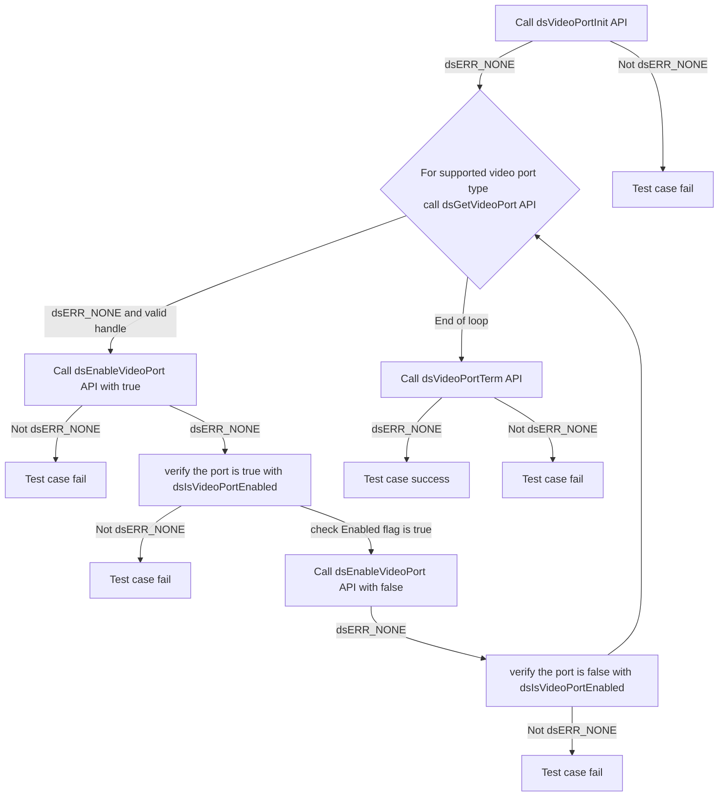
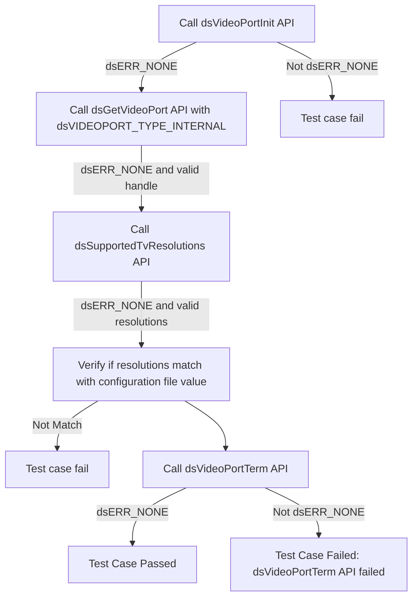
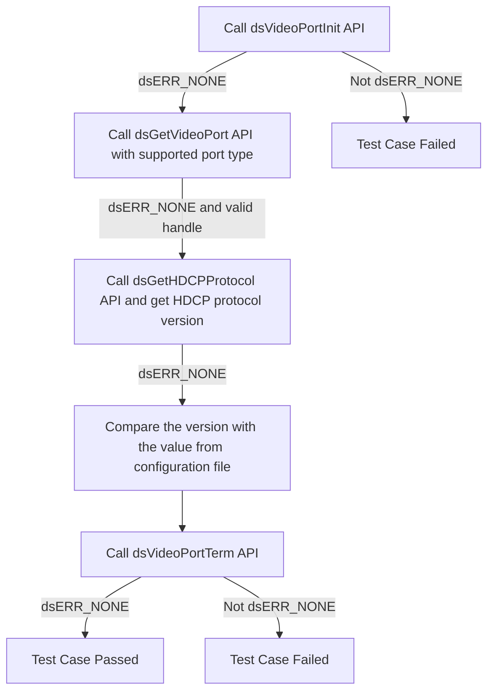
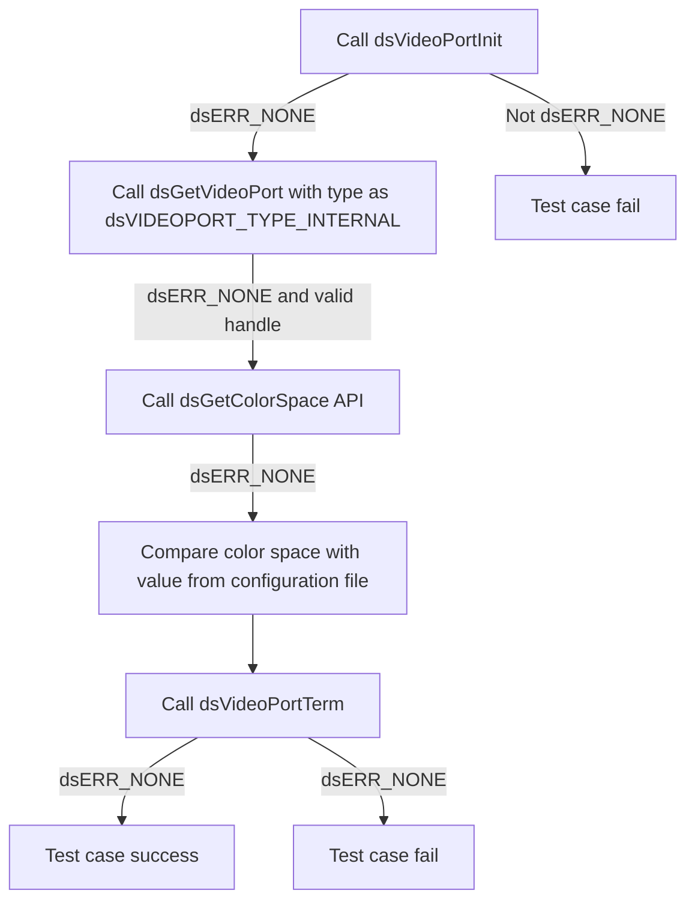
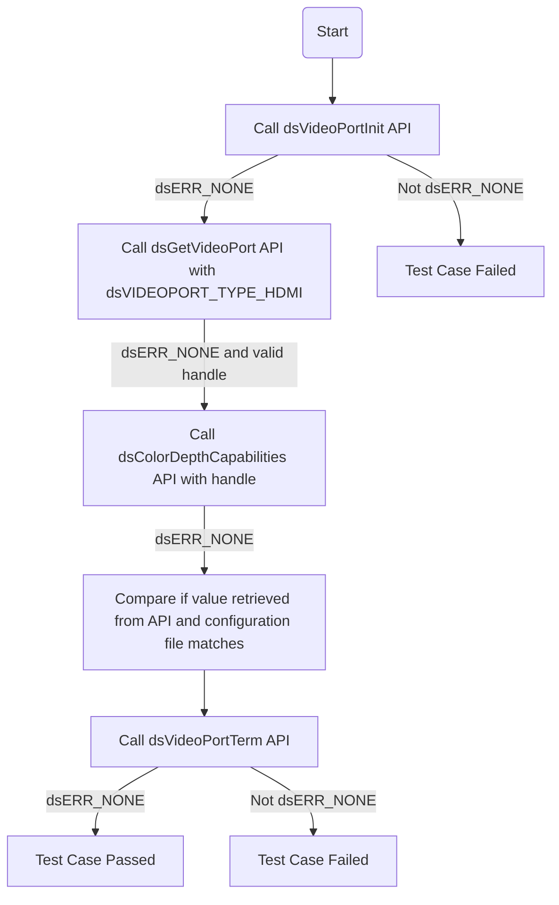
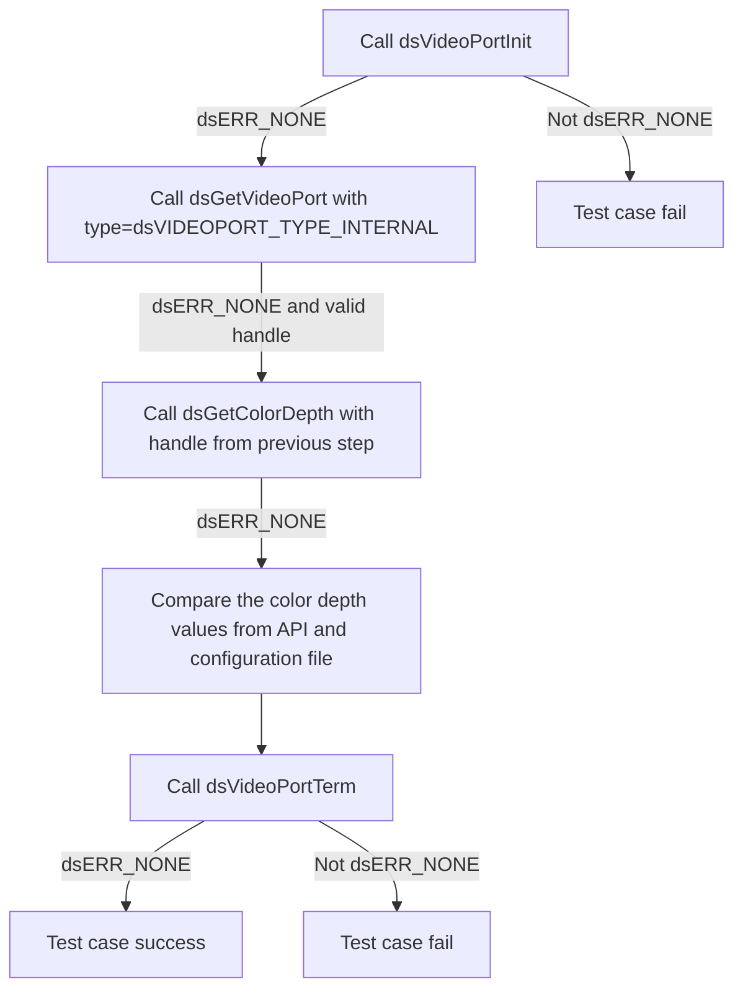
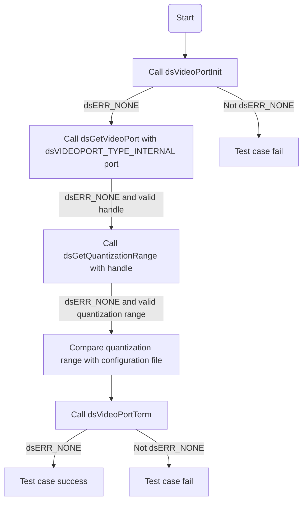
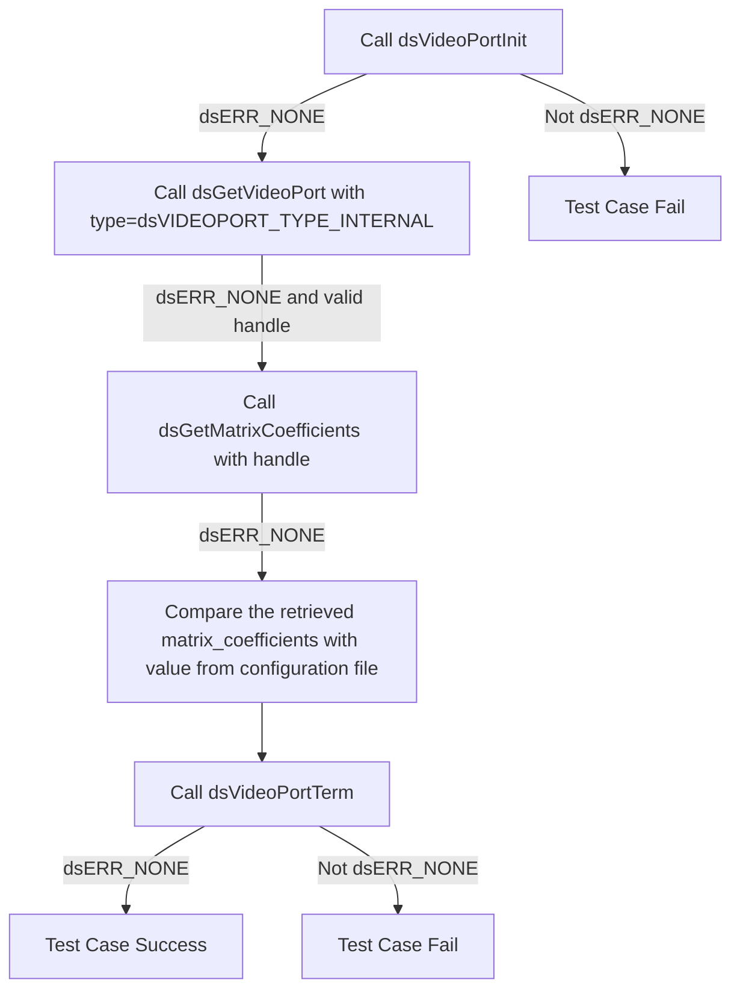

# Device Settings Video Port L2 Low Level Test Specification and Procedure Documentation

## Table of Contents

- [Overview](#overview)
- [Acronyms, Terms and Abbreviations](#acronyms-terms-and-abbreviations)
- [Definitions](#definitions)
- [References](#references)
- [Level 2 Test Procedure](#level-2-test-procedure)

## Overview

This document describes the L2 Low Level Test Specification and Procedure Documentation for the Device Settings Video Port module.

### Acronyms, Terms and Abbreviations

- `HAL` \- Hardware Abstraction Layer, may include some common components
- `UT`  \- Unit Test(s)
- `OEM`  \- Original Equipment Manufacture
- `SoC`  \- System on a Chip
- `HDMI`  \- High-Definition Multimedia Interface
- `HDCP`  \- High-bandwidth Digital Content Protection

### Definitions

- `ut-core` \- Common Testing Framework <https://github.com/rdkcentral/ut-core>, which wraps a open-source framework that can be expanded to the requirements for future framework.

### References

- `High Level Test Specification` - [dsVideoPort High Level TestSpec](ds-video-port_High-Level_TestSpec.md)
- `Interface header` - [dsVideoPort HAL header](https://github.com/rdkcentral/rdk-halif-device_settings/blob/main/include/dsVideoPort.h)

## Level 2 Test Procedure

The following functions are expecting to test the module operates correctly.

### Test 1

|Title|Details|
|-----|-------|
|Function Name|`test_l2_dsVideoPort_EnableDisabledVideoPorts`|
|Description|Get the handle for supported video port from configuration file(`dsVideoPort/Number_of_ports`), check the status of each supported video port type `dsVideoPort/Ports/[port no]/Typeid` to see if it's enabled or disabled. If a port is disabled, enable it, and then verify the status of each port.|
|Test Group|02|
|Test Case ID|001|
|Priority|High|

**Pre-Conditions :**
None

**Dependencies :**
None

**User Interaction :**

If user chose to run the test in interactive mode, then the test case has to be selected via console.

#### Test Procedure - Test 1

|Variation / Steps|Description|Test Data|Expected Result|Notes|
|-----------------|-----------|---------|---------------|-----|
|01|Initialize the video port using `dsVideoPortInit`|None|`dsERR_NONE`|Should be successful|
|02|Get the handle for each supported video port using `dsGetVideoPort`|type = `dsVideoPort/Ports/[port no]/Typeid` index = `dsVideoPort/Ports/[port no]/Index`|`dsERR_NONE`|Should be successful|
|03|enable the video port using `dsEnableVideoPort`|handle = obtained from `dsGetVideoPort`|`dsERR_NONE`|Should be successful|
|04|Verify the status of each port using `dsIsVideoPortEnabled`|handle = obtained from `dsGetVideoPort`|`dsERR_NONE`, enabled = true|Should be successful|
|05|disabled port using `dsEnableVideoPort`|handle = obtained from `dsGetVideoPort`, enabled = false|`dsERR_NONE`|Should be successful|
|06|Verify the status of each port using `dsIsVideoPortEnabled`|handle = obtained from `dsGetVideoPort`|`dsERR_NONE`, enabled = false|Should be successful|
|07|Terminate the video port using `dsVideoPortTerm`|None|`dsERR_NONE`|Should be successful|

### Test 2

|Title|Details|
|-----|-------|
|Function Name|`test_l2_dsVideoPort_VerifyDisplayAndPortStatus`|
|Description|Get the handle for supported video port from configuration file(`dsVideoPort/Number_of_ports`), check the status of each supported video port type `dsVideoPort/Ports/[port no]/Typeid` .Verify the connected/disconnected status of each supported port's display when no video port is connected.|
|Test Group|02|
|Test Case ID|002|
|Priority|High|

**Pre-Conditions :**
None

**Dependencies :**
None

**User Interaction :**
If user chose to run the test in interactive mode, then the test case has to be selected via console.

#### Test Procedure - Test 2

|Variation / Steps|Description|Test Data|Expected Result|Notes|
|-----------------|-----------|---------|---------------|-----|
|01|Initialize the video port using `dsVideoPortInit`|None|`dsERR_NONE`|Should be successful|
|02|Get the video port handle for supported type of video port using `dsGetVideoPort`|type = `dsVideoPort/Ports/[port no]/Typeid` index = `dsVideoPort/Ports/[port no]/Index`|`dsERR_NONE`|Should be successful|
|03|Check if the display is connected for the obtained video port handle using `dsIsDisplayConnected`|handle = obtained from `dsGetVideoPort`|`dsERR_NONE`, connected = false|Should be successful|
|04|Check if the video port is active for the obtained video port handle using `dsIsVideoPortActive`|handle = obtained from `dsGetVideoPort`|`dsERR_NONE`, active = false|Should be successful|
|05|Terminate the video port using `dsVideoPortTerm`|None|`dsERR_NONE`|Should be successful|

### Test 3

|Title|Details|
|-----|-------|
|Function Name|`test_l2_dsVideoPort_RetrieveAndVerifySurroundModeCapabilities`|
|Description|Get the handle for supported video port from configuration file(`dsVideoPort/Number_of_ports`), check the status of each supported video port type `dsVideoPort/Ports/[port no]/Typeid`.Retrieve the surround mode capabilities of each supported port and verify them with the configuration file. If it is a sink device, retrieve the value from 'configuration file using the path `dsVideoPort/Ports/[port no]/Display_surround` since the sink device has only an INTERNAL port. It is not supported for the source devices.|
|Test Group|02|
|Test Case ID|003|
|Priority|High|

**Pre-Conditions :**
None

**Dependencies :**
None

**User Interaction :**
If user chose to run the test in interactive mode, then the test case has to be selected via console.

#### Test Procedure - Test 3

|Variation / Steps|Description|Test Data|Expected Result|Notes|
|-----------------|-----------|---------|---------------|-----|
|01|Initialize the video port using `dsVideoPortInit`|None|`dsERR_NONE`|Should be successful|
|02|Get the video port handle for supported type of video port using `dsGetVideoPort`|type = `dsVideoPort/Ports/[port no]/Typeid` index = `dsVideoPort/Ports/[port no]/Index`|`dsERR_NONE`|Should be successful|
|03|Check if the display is in surround mode using `dsIsDisplaySurround` with the obtained handle|handle = obtained from previous step|`dsERR_NONE`|Should be successful|
|04|Verify if the surround mode from previous step matches with the configuration file|get_surround = `dsVideoPort/Ports/[port no]/Display_surround`|None|Should be successful|
|05|Terminate the video port using `dsVideoPortTerm`|None|`dsERR_NONE`|Should be successful|

### Test 4

|Title|Details|
|-----|-------|
|Function Name|`test_l2_dsVideoPort_SetAndGetResolution_source`|
|Description|Get the handle for supported video port from configuration file(`dsVideoPort/Number_of_ports`), check the status of each supported video port type `dsVideoPort/Ports/[port no]/Typeid`.Set properties for each supported video port, including pixel resolution, aspect ratio, stereoscopic modes, frame rates, and scan modes, looping through supported values. Verify the settings using the get function.|
|Test Group|02|
|Test Case ID|004|
|Priority|High|

**Pre-Conditions :**
None

**Dependencies :**
None

**User Interaction :**
If user chose to run the test in interactive mode, then the test case has to be selected via console.

#### Test Procedure - Test 4

|Variation / Steps|Description|Test Data|Expected Result|Notes|
|------------------|-----------|----------|--------------|-----|
|01|Initialize video port using `dsVideoPortInit`|None|`dsERR_NONE`|Should be successful|
|02|Get the video port handle for supported type of video port using `dsGetVideoPort` Loop through each video port and get the handle using `dsGetVideoPort`| type = `dsVideoPort/Ports/[port no]/Typeid` index = `dsVideoPort/Ports/[port no]/Index`.|`dsERR_NONE`|Should be successful|
|03|Loop through all possible pixel resolutions, aspect ratios, stereoscopic modes, frame rates, and scan modes|pixelResolution = `dsVIDEO_PIXELRES_720x480` to `dsVIDEO_PIXELRES_MAX`, aspectRatio = `dsVIDEO_ASPECT_RATIO_4x3` to `dsVIDEO_ASPECT_RATIO_MAX`, stereoScopicMode = `dsVIDEO_SSMODE_UNKNOWN` to `dsVIDEO_SSMODE_MAX`, frameRate = `dsVIDEO_FRAMERATE_UNKNOWN` to `dsVIDEO_FRAMERATE_MAX`, interlaced = false|`dsERR_NONE`|Should be successful|
|04|Set resolution using `dsSetResolution` with handle and setResolution|handle, &setResolution|`dsERR_NONE`|Should be successful|
|05|Get resolution using `dsGetResolution` with handle and getResolution|handle, &getResolution|`dsERR_NONE`|Should be successful|
|06|Compare setResolution and getResolution|setResolution, getResolution|Equal values for all properties|Should be successful|
|07|Terminate video port using `dsVideoPortTerm`|None|`dsERR_NONE`|Should be successful|

### Test 5

|Title|Details|
|-----|-------|
|Function Name|`test_l2_dsVideoPort_VerifySupportedTvResolutions`|
|Description|Get the handle for supported video port from configuration file(`dsVideoPort/Number_of_ports`), check the status of each supported video port type `dsVideoPort/Ports/[port no]/Typeid`.Gets the supported port Resolutions of TV and verify with the configuration file `dsVideoPort/Ports/[port no]/Supported_tv_resolutions_capabilities`|
|Test Group|02|
|Test Case ID|005|
|Priority|High|

**Pre-Conditions :**
None

**Dependencies :**
None

**User Interaction :**
If user chose to run the test in interactive mode, then the test case has to be selected via console.

#### Test Procedure - Test 5

|Variation / Steps|Description|Test Data|Expected Result|Notes|
|-----------------|-----------|---------|---------------|-----|
|01|Initialize the video port using `dsVideoPortInit`|None|`dsERR_NONE`|Should be successful|
|02|Get the video port handle for supported type of video port using `dsGetVideoPort` Loop through each video port and get the handle using `dsGetVideoPort`| type = `dsVideoPort/Ports/[port no]/Typeid` index = `dsVideoPort/Ports/[port no]/Index`.|`dsERR_NONE`|Should be successful|
|03|Get the supported TV resolutions using `dsSupportedTvResolutions` with the obtained handle|handle = obtained from previous step|`dsERR_NONE`|Should be successful|
|04|Verify the obtained resolutions with the expected resolutions from the configuration file|resolutions = value in `dsVideoPort/Ports/[port no]/Supported_tv_resolutions_capabilities`|`dsERR_NONE`|Should be successful|
|05|Terminate the video port using `dsVideoPortTerm`|None|`dsERR_NONE`|Should be successful|

### Test 6

|Title|Details|
|-----|-------|
|Function Name|`test_l2_dsVideoPort_GetHDRCapabilities`|
|Description|Get the handle for supported video port from configuration file(`dsVideoPort/Number_of_ports`), check the status of each supported video port type `dsVideoPort/Ports/[port no]/Typeid`.Get the each supported port HDR capabilities & verify with the configuration file `dsVideoPort/Ports/[port no]/hdr_capabilities`|
|Test Group|02|
|Test Case ID|006|
|Priority|High|

**Pre-Conditions :**
None

**Dependencies :**
None

**User Interaction :**
If user chose to run the test in interactive mode, then the test case has to be selected via console.

#### Test Procedure - Test 6

|Variation / Steps|Description|Test Data|Expected Result|Notes|
|-----------------|-----------|---------|---------------|-----|
|01|Initialize the video port using `dsVideoPortInit`|None|`dsERR_NONE`|Should be successful|
|02|Get the video port handle for supported type of video port using dsGetVideoPort Loop through each video port and get the handle using `dsGetVideoPort`| type = `dsVideoPort/Ports/[port no]/Typeid` index = `dsVideoPort/Ports/[port no]/Index`.|`dsERR_NONE`|Should be successful|
|03|Get the HDR capabilities of the TV using `dsGetTVHDRCapabilities` with the obtained handle|handle = obtained from previous step|`dsERR_NONE`|Should be successful|
|04|Verify the obtained capabilities with the configuration file `dsVideoPort/Ports/[port no]/hdr_capabilities`|Values should match|capabilities = value in `dsVideoPort/Ports/[port no]/hdr_capabilities`|Should be successful|
|05|Terminate the video port using `dsVideoPortTerm`|None|`dsERR_NONE`|Should be successful|

### Test 7

|Title|Details|
|-----|-------|
|Function Name|`test_l2_dsVideoPort_GetHDCPStatus`|
|Description|Get the handle for supported video port from configuration file(`dsVideoPort/Number_of_ports`), check the status of each supported video port type `dsVideoPort/Ports/[port no]/Typeid`.Check the `HDCP` status of each supported port and verify if `dsHDCP_STATUS_AUTHENTICATED` is returned for sinks and `dsHDCP_STATUS_UNPOWERED`/`dsHDCP_STATUS_PORTDISABLED` is returned for sources.|
|Test Group|02|
|Test Case ID|007|
|Priority|High|

**Pre-Conditions :**
None

**Dependencies :**
None

**User Interaction :**
If user chose to run the test in interactive mode, then the test case has to be selected via console.

#### Test Procedure - Test 7

|Variation / Steps|Description|Test Data|Expected Result|Notes|
|-----------------|-----------|---------|---------------|-----|
|01|Initialize the video port using `dsVideoPortInit`|None|`dsERR_NONE`|Should be successful|
|02|Get the video port handle for supported type of video port using `dsGetVideoPort` Loop through each video port and get the handle using `dsGetVideoPort`| type = `dsVideoPort/Ports/[port no]/Typeid` index = `dsVideoPort/Ports/[port no]/Index`.|`dsERR_NONE`|Should be successful|
|03|Get the `HDCP` status for each handle using `dsGetHDCPStatus`|handle = obtained from dsGetVideoPort()|`dsERR_NONE`|Should be successful|
|04|Check if the `HDCP` status is authenticated|status = obtained from `dsGetHDCPStatus`|`dsHDCP_STATUS_AUTHENTICATED`|Should be successful|
|05|Terminate the video port using `dsVideoPortTerm`|None|`dsERR_NONE`|Should be successful|

### Test 8

|Title|Details|
|-----|-------|
|Function Name|`test_l2_dsVideoPort_VerifyHDCPProtocolStatus`|
|Description|Get the handle for supported video port from configuration file(`dsVideoPort/Number_of_ports`), check the status of each supported video port type `dsVideoPort/Ports/[port no]/Typeid`.Check the `HDCP` protocol status of each supported port and verify it with the configuration file `dsVideoPort/Ports/[port no]/hdcp_protocol_version` supported by `HDMI` port.|
|Test Group|02|
|Test Case ID|008|
|Priority|High|

**Pre-Conditions :**
None

**Dependencies :**
None

**User Interaction :**
If user chose to run the test in interactive mode, then the test case has to be selected via console.

#### Test Procedure - Test 8

|Variation / Steps|Description|Test Data|Expected Result|Notes|
|-----------------|-----------|---------|---------------|-----|
|01|Initialize the video port using `dsVideoPortInit`|None|`dsERR_NONE`|Should be successful|
|02|Get the video port handle for supported type of video port using `dsGetVideoPort` Loop through each video port and get the handle using `dsGetVideoPort`| type = `dsVideoPort/Ports/[port no]/Typeid` index = `dsVideoPort/Ports/[port no]/Index`.|`dsERR_NONE`|Should be successful|
|03|Get the HDCP protocol version using `dsGetHDCPProtocol` with the obtained handle|handle = obtained from previous step|`dsERR_NONE`|Should be successful|
|04|Verify the obtained protocol version with the value from the configuration file|protocolVersion = `dsVideoPort/Ports/[port no]/hdcp_protocol_version`|`dsERR_NONE`|Should be successful|
|05|Terminate the video port using `dsVideoPortTerm`|None|`dsERR_NONE`|Should be successful|

### Test 9

|Title|Details|
|-----|-------|
|Function Name|`test_l2_dsVideoPort_SetAndGetHdmiPreference`|
|Description|Get the handle for supported video port from configuration file(`dsVideoPort/Number_of_ports`), check the status of each supported video port type `dsVideoPort/Ports/[port no]/Typeid`.Set the HDMI preference    for each valid port and verify it using the get function.|
|Test Group|02|
|Test Case ID|009|
|Priority|High|

**Pre-Conditions :**
None

**Dependencies :**
None

**User Interaction :**
If user chose to run the test in interactive mode, then the test case has to be selected via console.

#### Test Procedure - Test 9

|Variation / Steps|Description|Test Data|Expected Result|Notes|
|-----------------|-----------|---------|---------------|-----|
|01|Initialize the video port using `dsVideoPortInit`|None|`dsERR_NONE`|Should be successful|
|02|Get the video port handle for supported type of video port using `dsGetVideoPort` Loop through each video port and get the handle using `dsGetVideoPort`| type = `dsVideoPort/Ports/[port no]/Typeid` index = `dsVideoPort/Ports/[port no]/Index`.|`dsERR_NONE`|Should be successful|
|03|Get the `HDCP` protocol version using `dsGetHDCPProtocol` with the obtained handle|handle = obtained from `dsGetVideoPort`|`dsERR_NONE`|Should be successful|
|04|Verify the `HDCP` protocol version with the value from the configuration file|protocolVersion = value `dsVideoPort/Ports/[port no]/hdcp_protocol_version`|`dsERR_NONE`|Should be successful|
|05|Terminate the video port using `dsVideoPortTerm`|None|`dsERR_NONE`|Should be successful|

### Test 10

|Title|Details|
|-----|-------|
|Function Name|`test_l2_dsVideoPort_GetColorSpace`|
|Description|Get each port Color Space, compare with the configuration file.|
|Test Group|02|
|Test Case ID|010|
|Priority|High|

**Pre-Conditions :**
None

**Dependencies :**
None

**User Interaction :**
If user chose to run the test in interactive mode, then the test case has to be selected via console.

#### Test Procedure - Test 10

|Variation / Steps|Description|Test Data|Expected Result|Notes|
|-----------------|-----------|---------|---------------|-----|
|01|Initialize video port using `dsVideoPortInit`|None|`dsERR_NONE`|Should be successful|
|02|Get video port handle using `dsGetVideoPort` with type as `dsVIDEOPORT_TYPE_INTERNAL` and index as 0|type = `dsVIDEOPORT_TYPE_INTERNAL`, index = 0|`dsERR_NONE`|Should be successful|
|03|Get color space using `dsGetColorSpace` with handle obtained from previous step|handle = handle obtained from step 02|`dsERR_NONE`|Should be successful|
|04|Compare the obtained color space with the value from the configuration file|color_space = value in `dsVideoPort/Ports/[port no]/colorspaces`|Value from the configuration file|Should be successful|
|05|Terminate video port using `dsVideoPortTerm`|None|`dsERR_NONE`|Should be successful|

### Test 11

|Title|Details|
|-----|-------|
|Function Name|`test_l2_dsVideoPort_CheckColorDepthCapabilities_source`|
|Description|Check each port Color Depth Capabilities and compare with the configuration file.|
|Test Group|02|
|Test Case ID|011|
|Priority|High|

**Pre-Conditions :**
None

**Dependencies :**
None

**User Interaction :**
If user chose to run the test in interactive mode, then the test case has to be selected via console.

#### Test Procedure - Test 11

|Variation / Steps|Description|Test Data|Expected Result|Notes|
|-----------------|-----------|---------|---------------|-----|
|01|Initialize the video port using `dsVideoPortInit`|None|`dsERR_NONE`|Should be successful|
|02|Get the video port handle using `dsGetVideoPort` with `dsVIDEOPORT_TYPE_HDMI` and index 0|`dsVIDEOPORT_TYPE_HDMI`, 0|`dsERR_NONE`|Should be successful|
|03|Check the color depth capabilities using `dsColorDepthCapabilities` with the obtained handle|handle|`dsERR_NONE`|Should be successful|
|04|Compare the obtained color depth capability with the value from the configuration file|colorDepthCapability = value in `dsVideoPort/Ports/[port no]/Supported_color_depth_capabilities`|Check if equal|Should be successful|
|05|Terminate the video port using `dsVideoPortTerm`|None|`dsERR_NONE`|Should be successful|

### Test 12

|Title|Details|
|-----|-------|
|Function Name|`test_l2_dsVideoPort_GetColorDepth`|
|Description|Get each port Color Depth and verify with the configuration file.|
|Test Group|02|
|Test Case ID|012|
|Priority|High|

**Pre-Conditions :**
None

**Dependencies :**
None

**User Interaction :**
If user chose to run the test in interactive mode, then the test case has to be selected via console.

#### Test Procedure - Test 12

|Variation / Steps|Description|Test Data|Expected Result|Notes|
|-----------------|-----------|---------|---------------|-----|
|01|Initialize the video port using `dsVideoPortInit`|None|`dsERR_NONE`|Should be successful|
|02|Get the video port handle using `dsGetVideoPort` with type=`dsVIDEOPORT_TYPE_INTERNAL` and index=0|type=`dsVIDEOPORT_TYPE_INTERNAL`, index=0|`dsERR_NONE`|Should be successful|
|03|Get the color depth using `dsGetColorDepth` with the obtained handle|handle=obtained handle|`dsERR_NONE`|Should be successful|
|04|Verify the obtained color depth with the value from the configuration file|color_depth=value in `dsVideoPort/Ports/[port no]/Supported_color_depth_capabilities`|Should be equal|Should be successful|
|05|Terminate the video port using `dsVideoPortTerm`|None|`dsERR_NONE`|Should be successful|

### Test 13

|Title|Details|
|-----|-------|
|Function Name|`test_l2_dsVideoPort_SetAndGetPreferredColorDepth_source`|
|Description|Set preferred color depth for each port and compare get function|
|Test Group|02|
|Test Case ID|013|
|Priority|High|

**Pre-Conditions :**
None

**Dependencies :**
None

**User Interaction :**
If user chose to run the test in interactive mode, then the test case has to be selected via console.

#### Test Procedure - Test 13

|Variation / Steps|Description|Test Data|Expected Result|Notes|
|-----------------|-----------|---------|---------------|-----|
|01|Initialize video port using `dsVideoPortInit`|None|`dsERR_NONE`|Should be successful|
|02|Get video port handle for each port type using `dsGetVideoPort`|type = `dsVIDEOPORT_TYPE_RF` to `dsVIDEOPORT_TYPE_MAX`, index = 0|`dsERR_NONE`|Should be successful|
|03|Set preferred color depth for each color depth type using `dsSetPreferredColorDepth`|handle = from step 02, colorDepthSet = `dsDISPLAY_COLORDEPTH_8BIT` to `dsDISPLAY_COLORDEPTH_AUTO`|`dsERR_NONE`|Should be successful|
|04|Get preferred color depth using `dsGetPreferredColorDepth`|handle = from step 02, colorDepthGet|`dsERR_NONE`|Should be successful|
|05|Compare set and get color depth|colorDepthSet = colorDepthGet|colorDepthSet should be equal to colorDepthGet|Should be successful|
|06|Terminate video port using `dsVideoPortTerm`|None|`dsERR_NONE`|Should be successful|

### Test 14

|Title|Details|
|-----|-------|
|Function Name|`test_l2_dsVideoPort_GetQuantizationRange`|
|Description|Get each port QuantizationRange status and verify with the configuration file.|
|Test Group|02|
|Test Case ID|014|
|Priority|High|

**Pre-Conditions :**
None

**Dependencies :**
None

**User Interaction :**
If user chose to run the test in interactive mode, then the test case has to be selected via console.

#### Test Procedure - Test 14

|Variation / Steps|Description|Test Data|Expected Result|Notes|
|-----------------|-----------|---------|---------------|-----|
|01|Initialize the video port using `dsVideoPortInit`|None|`dsERR_NONE`|Should be successful|
|02|Get the video port handle using `dsGetVideoPort` with `dsVIDEOPORT_TYPE_INTERNAL` as type and 0 as index|type = `dsVIDEOPORT_TYPE_INTERNAL`, index = 0|`dsERR_NONE`|Should be successful|
|03|Get the Quantization Range using `dsGetQuantizationRange` with the handle obtained from previous step|handle = obtained from step 02|`dsERR_NONE`|Should be successful|
|04|Verify the Quantization Range with the value from the configuration file|quantization_range = value in `dsVideoPort/Ports/[port no]/quantization_ranges`|Should be equal|Should be successful|
|05|Terminate the video port using `dsVideoPortTerm`|None|`dsERR_NONE`|Should be successful|

### Test 15

|Title|Details|
|-----|-------|
|Function Name|`test_l2_dsVideoPort_GetMatrixCoefficients`|
|Description|Get each port MatrixCoefficients status and verify return `dsDISPLAY_MATRIXCOEFFICIENT_UNKNOWN` for source and with the configuration file.|
|Test Group|02|
|Test Case ID|015|
|Priority|High|

**Pre-Conditions :**
None

**Dependencies :**
None

**User Interaction :**
If user chose to run the test in interactive mode, then the test case has to be selected via console.

#### Test Procedure - Test 15

|Variation / Steps|Description|Test Data|Expected Result|Notes|
|-----------------|-----------|---------|---------------|-----|
|01|Initialize the video port using `dsVideoPortInit`|None|`dsERR_NONE`|Should be successful|
|02|Get the video port with type=`dsVIDEOPORT_TYPE_INTERNAL` and index=1 using `dsGetVideoPort`|type=`dsVIDEOPORT_TYPE_INTERNAL`, index=1|`dsERR_NONE`|Should be successful|
|03|Get the Matrix Coefficients with handle obtained from `dsGetVideoPort` using `dsGetMatrixCoefficients`|handle=handle obtained from `dsGetVideoPort`|`dsERR_NONE`|Should be successful|
|04|Verify the Matrix Coefficients with the value from the configuration file|matrix_coefficients=`dsVideoPort/Ports/[port no]/matrix_coefficients`|Should be equal|Should be successful|
|05|Terminate the video port using `dsVideoPortTerm`|None|`dsERR_NONE`|Should be successful|

