# Audio Settings L2 Low Level Test Specification and Procedure Documentation

## Table of Contents

- [Acronyms, Terms and Abbreviations](#acronyms-terms-and-abbreviations)
- [Overview](#overview)
- [Definitions](#definitions)
- [References](#references)
- [Level 2 Test Procedure](#level-2-test-procedure)

### Acronyms, Terms and Abbreviations

- `HAL`    - Hardware Abstraction Layer
- `API`    - Application Programming Interface
- `L2`     - Level 2 Testing
- `L3`     - Level 3 Testing
- `DS`     - Device Settings
- `ARC`    - Audio Return Channel
- `HDMI`   - High-Definition Multimedia Interface
- `LE`     - Loudness Equivalence
- `DRC`    - Dynamic Range Control
- `MI`     - Media Intelligent
- `MS12`   - MultiStream 12
- `MS11`   - MultiStream 11
- `DAP`    - Digital Audio Processing

## Overview

This document describes the Low Level L2 Test Specification and Procedure for the Device Settings Audio module.

### Definitions

- `ut-core` \- Common Testing Framework <https://github.com/rdkcentral/ut-core>, which wraps a open-source framework that can be expanded to the requirements for future framework.

### References

- dsAudio HAL Interface - [dsAudio.h](https://github.com/rdkcentral/rdk-halif-device_settings/blob/main/include/dsAudio.h)
- High Level Test Specification - [ds-audio_High-Level_TestSpecification.md](https://github.com/rdkcentral/rdk-halif-device_settings/blob/main/docs/pages/ds-audio_High-Level_TestSpecification.md)

## Level 2 Test Procedure

The following functions are expecting to test the module operates correctly.

### Test 1

|Title|Details|
|-----|-------|
|Function Name|`test_l2_dsAudio_EnableDisableAndVerifyAudioPortStatus`|
|Description|Loop through supported audio ports, enable/disable audio ports and retrieve status for verification|
|Test Group|02|
|Test Case ID|001|
|Priority|High|

**Pre-Conditions :**
None

**Dependencies :**
None

**User Interaction :**
If user chose to run the test in interactive mode, then the test case has to be selected via console.

#### Test Procedure - Test 1

|Variation / Steps|Description|Test Data|Expected Result|Notes|
|-----------------|-----------|---------|---------------|-----|
|01|Initialize audio port using `dsAudioPortInit`|None|`dsERR_NONE`|Should be successful|
|02|Loop through supported audio ports and get audio port using `dsGetAudioPort`|supported number of audio ports = `dsAudio/Number_of_supported_ports` field and port id = `dsAudio/Port/[port number]/Typeid` of configuration file|`dsERR_NONE`|Should be successful|
|03|Enable audio port using `dsEnableAudioPort`|handle = obtained from `dsGetAudioPort`, enabled = true|`dsERR_NONE`|Should be successful|
|04|Check if audio port is enabled using `dsIsAudioPortEnabled`|handle = obtained from `dsGetAudioPort`|`dsERR_NONE`, enabled = `true`|Should be successful|
|05|Disable audio port using `dsEnableAudioPort`|handle = obtained from `dsGetAudioPort`, enabled = `false`|`dsERR_NONE`|Should be successful|
|06|Check if audio port is disabled using `dsIsAudioPortEnabled`|handle = obtained from `dsGetAudioPort`|`dsERR_NONE`, enabled = `false`|Should be successful|
|07|Terminate audio port using `dsAudioPortTerm`|None|`dsERR_NONE`|Should be successful|

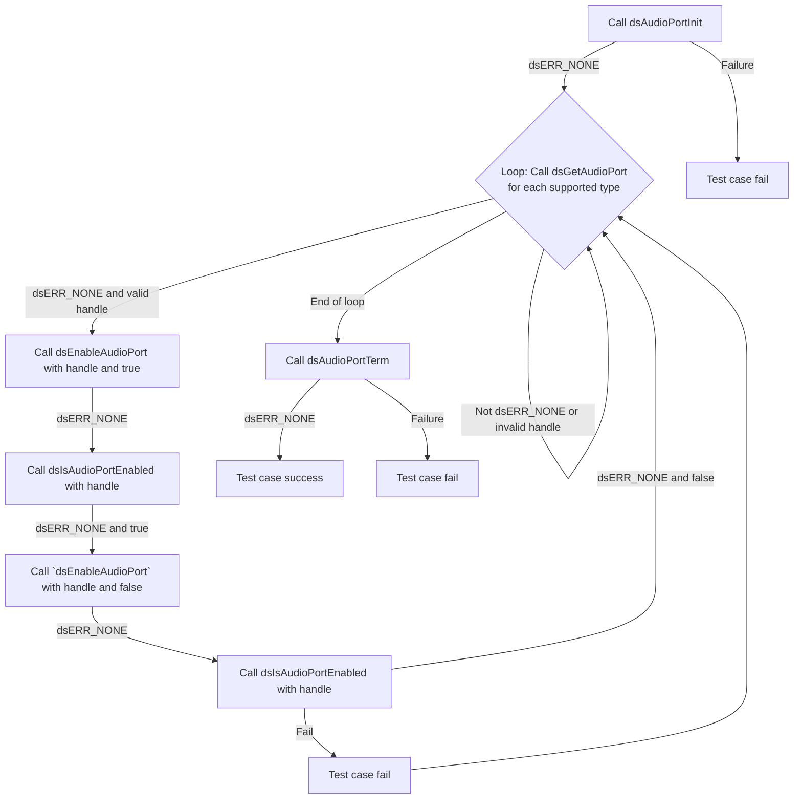
```mermaid
graph TB
    A[Call dsAudioPortInit] -->|dsERR_NONE|B{Loop: Call dsGetAudioPort <br> for each supported type}
    A -->|Failure|A1[Test case fail]
    B -->|dsERR_NONE and valid handle|C[Call dsEnableAudioPort with handle and true]
    B -->|Not dsERR_NONE or invalid handle|B
    C -->|dsERR_NONE|D[Call dsIsAudioPortEnabled with handle]
    D -->|dsERR_NONE and true|E[Call `dsEnableAudioPort` with handle and false]
    E -->|dsERR_NONE|F[Call dsIsAudioPortEnabled with handle]
    F -->|dsERR_NONE and false|B
    F -->|Fail|F1[Test case fail]
    F1 --> B
    B -->|End of loop|G[Call dsAudioPortTerm]
    G -->|dsERR_NONE|H[Test case success]
    G -->|Failure|G1[Test case fail]
```

### Test 2

|Title|Details|
|-----|-------|
|Function Name|`test_l2_dsAudio_CheckHeadphoneConnectionStatus_sink`|
|Description|Loop through supported audio ports, get the handle for `dsAUDIOPORT_TYPE_HEADPHONE` port, check the connection status. Connection status should be false|
|Test Group|02|
|Test Case ID|003|
|Priority|High|

**Pre-Conditions :**
None

**Dependencies :**
None

**User Interaction :**
If user chose to run the test in interactive mode, then the test case has to be selected via console.

#### Test Procedure - Test 2

|Variation / Steps|Description|Test Data|Expected Result|Notes|
|-----------------|-----------|---------|---------------|-----|
|01|Initialize the audio port using `dsAudioPortInit`|None|`dsERR_NONE`|Should be successful|
|02|Loop through supported audio ports and get audio port using `dsGetAudioPort`|supported number of audio ports = `dsAudio/Number_of_supported_ports` field and port id = `dsAudio/Port/[port number]/Typeid` of configuration file|`dsERR_NONE`|Should be successful|
|03|If the port type is `dsAUDIOPORT_TYPE_HEADPHONE`, check the connection status using `dsAudioOutIsConnected`|handle = obtained from `dsGetAudioPort`|`dsERR_NONE`|Should be successful|
|04|Assert that the connection status is false|isConnected = `false`|`false`|Should be successful|
|05|Terminate the audio port using `dsAudioPortTerm`|None|`dsERR_NONE`|Should be successful|

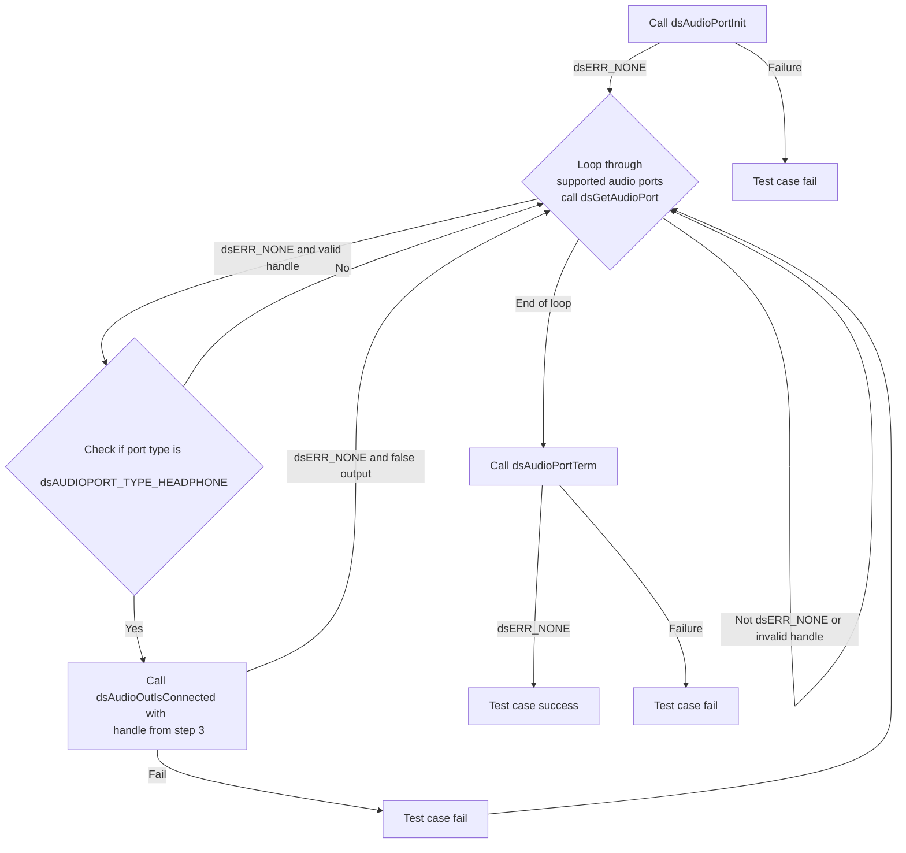
```mermaid
graph TB
    A[Call dsAudioPortInit] -->|dsERR_NONE|B{Loop through <br> supported audio ports <br>call dsGetAudioPort}
    A -->|Failure|A1[Test case fail]
    B -->|dsERR_NONE and valid handle|C{Check if port type is <br> dsAUDIOPORT_TYPE_HEADPHONE}
    B -->|Not dsERR_NONE or invalid handle|B
    C -->|Yes|D[Call dsAudioOutIsConnected with <br> handle from step 3]
    C -->|No|B
    B -->|End of loop|E[Call dsAudioPortTerm]
    D -->|dsERR_NONE and false output|B
    D --> |Fail|D1[Test case fail]
    D1 --> B
    E -->|dsERR_NONE|F[Test case success]
    E -->|Failure|E1[Test case fail]
```

### Test 3

|Title|Details|
|-----|-------|
|Function Name|`test_l2_dsAudio_RetrieveAndVerifyMS12Capabilities`|
|Description|Retrieve the supported MS12 DAP capabilities of the device and verify them with the configuration file|
|Test Group|02|
|Test Case ID|003|
|Priority|High|

**Pre-Conditions :**
None

**Dependencies :**
None

**User Interaction :**
If user chose to run the test in interactive mode, then the test case has to be selected via console.

#### Test Procedure - Test 3

|Variation / Steps|Description|Test Data|Expected Result|Notes|
|-----------------|-----------|---------|---------------|-----|
|01|Initialize the audio port using `dsAudioPortInit`|None|`dsERR_NONE`|Should be successful|
|02|Loop through supported audio ports and get audio port using `dsGetAudioPort`|supported number of audio ports = `dsAudio/Number_of_supported_ports` field and port id = `dsAudio/Port/[port number]/Typeid` of configuration file|`dsERR_NONE`|Should be successful|
|03|Get the MS12 capabilities using `dsGetMS12Capabilities`|handle = obtained from `dsGetAudioPort`|`dsERR_NONE`|Should be successful|
|04|Compare MS12 capabilities from API and value retrieved from configuration file|MS12 capabilities = `dsAudio/Port/[port number]/MS12_Capabilities` of configuration file|Match|Should be successful|
|05|Terminate the audio port using `dsAudioPortTerm`|None|`dsERR_NONE`|Should be successful|

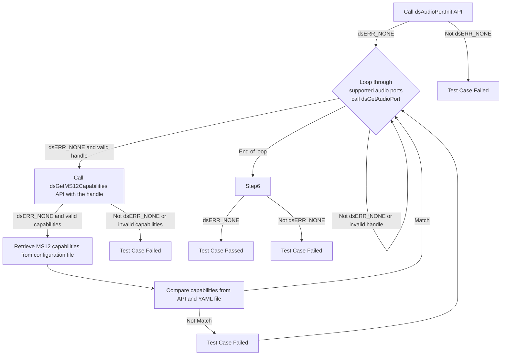
```mermaid
graph TB
    Step1[Call dsAudioPortInit API] -- dsERR_NONE --> Step2{Loop through <br> supported audio ports <br>call dsGetAudioPort}
    Step1 -- Not dsERR_NONE --> Fail1[Test Case Failed]
    Step2 -- dsERR_NONE and valid handle --> Step3[Call dsGetMS12Capabilities API with the handle]
    Step2 -->|End of loop|Step6
    Step2 -->|Not dsERR_NONE or invalid handle|Step2
    Step3 -- dsERR_NONE and valid capabilities --> Step4[Retrieve MS12 capabilities from configuration file]
    Step3 -- Not dsERR_NONE or invalid capabilities --> Fail3[Test Case Failed]
    Step4 --> Step5[Compare capabilities from API and YAML file]
    Step5 -- Match --> Step2
    Step5 -- Not Match --> Fail4[Test Case Failed]
    Fail4 --> Step2
    Step6 -- dsERR_NONE --> End[Test Case Passed]
    Step6 -- Not dsERR_NONE --> Fail5[Test Case Failed]
```

### Test 4

|Title|Details|
|-----|-------|
|Function Name|`test_l2_dsAudio_SetAndGetAudioCompression`|
|Description|Loop through supported audio ports, set various compression levels for supported ports and retrieve compression levels for verification|
|Test Group|02|
|Test Case ID|004|
|Priority|High|

**Pre-Conditions :**
None

**Dependencies :**
None

**User Interaction :**
If user chose to run the test in interactive mode, then the test case has to be selected via console.

#### Test Procedure - Test 4

|Variation / Steps|Description|Test Data|Expected Result|Notes|
|-----------------|-----------|---------|---------------|-----|
|01|Initialize the audio port using `dsAudioPortInit`|None|`dsERR_NONE`|Should be successful|
|02|Loop through supported audio ports and get audio port using `dsGetAudioPort`|supported number of audio ports = `dsAudio/Number_of_supported_ports` field and port id = `dsAudio/Port/[port number]/Typeid` of configuration file|`dsERR_NONE`|Should be successful|
|03|For each port, set various compression levels using `dsSetAudioCompression`|handle = obtained from `dsGetAudioPort`, compression = 0 to 10. supported compressions = `dsAudio/Ports/[port number]/number_of_supported_compressions` from configuration file. compression types = `dsAudio/Ports/[port number]/compressions` of configuration file|`dsERR_NONE`|Should be successful|
|04|Retrieve the set compression level using `dsGetAudioCompression`|handle = obtained from `dsGetAudioPort`|`dsERR_NONE`|Should be successful|
|05|Verify the set and retrieved compression levels are same|compression = set value, getCompression = retrieved value|compression should be equal to getCompression|Should be successful|
|06|Terminate the audio port using `dsAudioPortTerm`|None|`dsERR_NONE`|Should be successful|

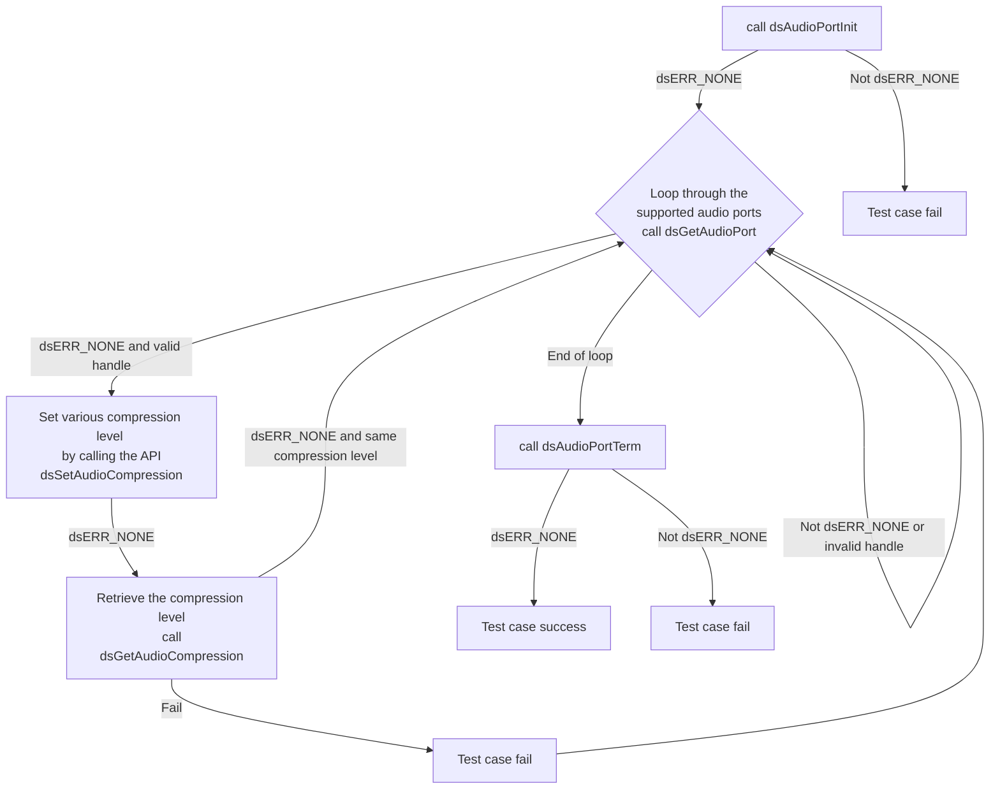
```mermaid
graph TB
    A[call dsAudioPortInit] -->|dsERR_NONE|B{Loop through the <br>supported audio ports <br> call dsGetAudioPort}
    A -->|Not dsERR_NONE|A1[Test case fail]
    B -->|dsERR_NONE and valid handle|C[Set various compression level <br> by calling the API dsSetAudioCompression]
    B -->|Not dsERR_NONE or invalid handle|B
    C -->|dsERR_NONE|E[Retrieve the compression level<br> call dsGetAudioCompression]
    E -->|dsERR_NONE and same compression level|B
    E -->|Fail|E1[Test case fail]
    E1 --> B
    B -->|End of loop|F[ call dsAudioPortTerm]
    F -->|dsERR_NONE|G[Test case success]
    F -->|Not dsERR_NONE|F1[Test case fail]
```

### Test 5

|Title|Details|
|--|--|
|Function Name|`test_l2_dsAudio_SetAndGetDialogEnhancement`|
|Description|Loop through supported audio ports, Set Dialog Enhancement for supported ports and retrieve Dialog Enhancement for verification|
|Test Group|02|
|Test Case ID|005|
|Priority|High|

**Pre-Conditions :**
None

**Dependencies :**
None

**User Interaction :**
If user chose to run the test in interactive mode, then the test case has to be selected via console.

#### Test Procedure - Test 5

|Variation / Steps|Description|Test Data|Expected Result|Notes|
|-----------------|-----------|---------|---------------|-----|
|01|Initialize the audio port using `dsAudioPortInit`|None|`dsERR_NONE`|Should be successful|
|02|Loop through supported audio ports and get audio port using `dsGetAudioPort`|supported number of audio ports = `dsAudio/Number_of_supported_ports` field and port id = `dsAudio/Port/[port number]/Typeid` of configuration file|`dsERR_NONE`|Should be successful|
|03|For each audio port, set the Dialog Enhancement level using `dsSetDialogEnhancement`|handle = obtained from `dsGetAudioPort`, level = 0 to 16|`dsERR_NONE`|Should be successful|
|04|For each audio port, get the Dialog Enhancement level using `dsGetDialogEnhancement`|handle = obtained from `dsGetAudioPort`|`dsERR_NONE`|Should be successful|
|05|Verify the set and get Dialog Enhancement levels are same|getLevel = obtained from `dsGetDialogEnhancement`, level = set in `dsSetDialogEnhancement`|getLevel should be equal to level|Should be successful|
|06|Terminate the audio port using `dsAudioPortTerm`|None|`dsERR_NONE`|Should be successful|

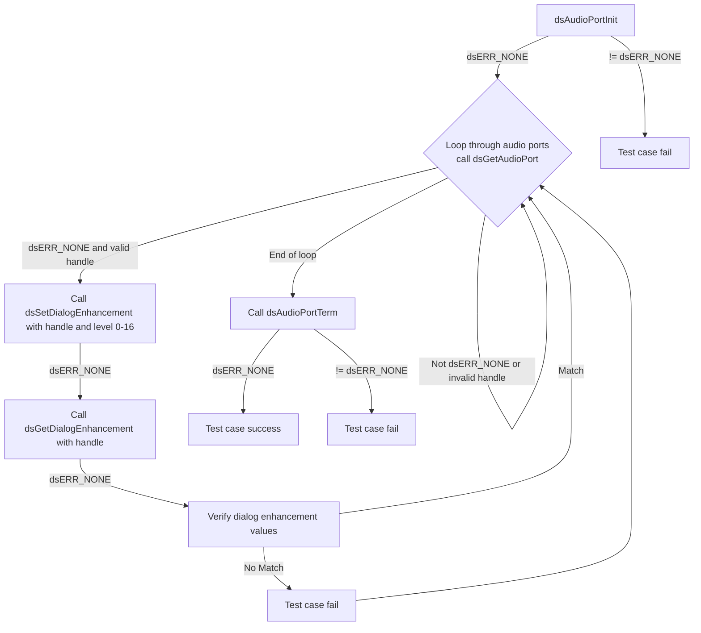
```mermaid
graph TB
    A[dsAudioPortInit] -->|dsERR_NONE|B{Loop through audio ports <br> call dsGetAudioPort}
    A -->|!= dsERR_NONE|A1[Test case fail]
    B -->|Not dsERR_NONE or invalid handle|B
    B -->|dsERR_NONE and valid handle|C[Call dsSetDialogEnhancement with handle and level 0-16]
    C -->|dsERR_NONE|D[Call dsGetDialogEnhancement with handle]
    D -->|dsERR_NONE|E[Verify dialog enhancement values ]
    E -->|Match|B
    E -->|No Match|E1[Test case fail]
    E1 --> B
    B -->|End of loop|F[Call dsAudioPortTerm]
    F -->|dsERR_NONE|G[Test case success]
    F -->|!= dsERR_NONE|F1[Test case fail]
```

### Test 6

|Title|Details|
|-----|-------|
|Function Name|`test_l2_dsAudio_SetAndGetDolbyVolumeMode`|
|Description|Loop through supported audio ports, Set DOLBY Volume Mode for supported ports and retrieve DOLBY Volume Mode for verification|
|Test Group|02|
|Test Case ID|006|
|Priority|High|

**Pre-Conditions :**
None

**Dependencies :**
None

**User Interaction :**
If user chose to run the test in interactive mode, then the test case has to be selected via console.

#### Test Procedure - Test 6

|Variation / Steps|Description|Test Data|Expected Result|Notes|
|-----------------|-----------|---------|---------------|-----|
|01|Initialize the audio port using `dsAudioPortInit`|None|`dsERR_NONE`|Should be successful|
|02|Loop through supported audio ports and get audio port using `dsGetAudioPort`|supported number of audio ports = `dsAudio/Number_of_supported_ports` field and port id = `dsAudio/Port/[port number]/Typeid` of configuration file|`dsERR_NONE`|Should be successful|
|03|Set DOLBY Volume Mode for the retrieved audio port using `dsSetDolbyVolumeMode`|handle = retrieved handle, mode = `true`|`dsERR_NONE`|Should be successful|
|04|Retrieve DOLBY Volume Mode for the set audio port using `dsGetDolbyVolumeMode`|handle = retrieved handle|`dsERR_NONE` and mode = `true`|Should be successful|
|05|Set DOLBY Volume Mode for the retrieved audio port using `dsSetDolbyVolumeMode`|handle = retrieved handle, mode = `false`|`dsERR_NONE`|Should be successful|
|06|Retrieve DOLBY Volume Mode for the set audio port using `dsGetDolbyVolumeMode`|handle = retrieved handle|dsERR_NONE and mode = `false`|Should be successful|
|07|Terminate the audio port using `dsAudioPortTerm`|None|`dsERR_NONE`|Should be successful|

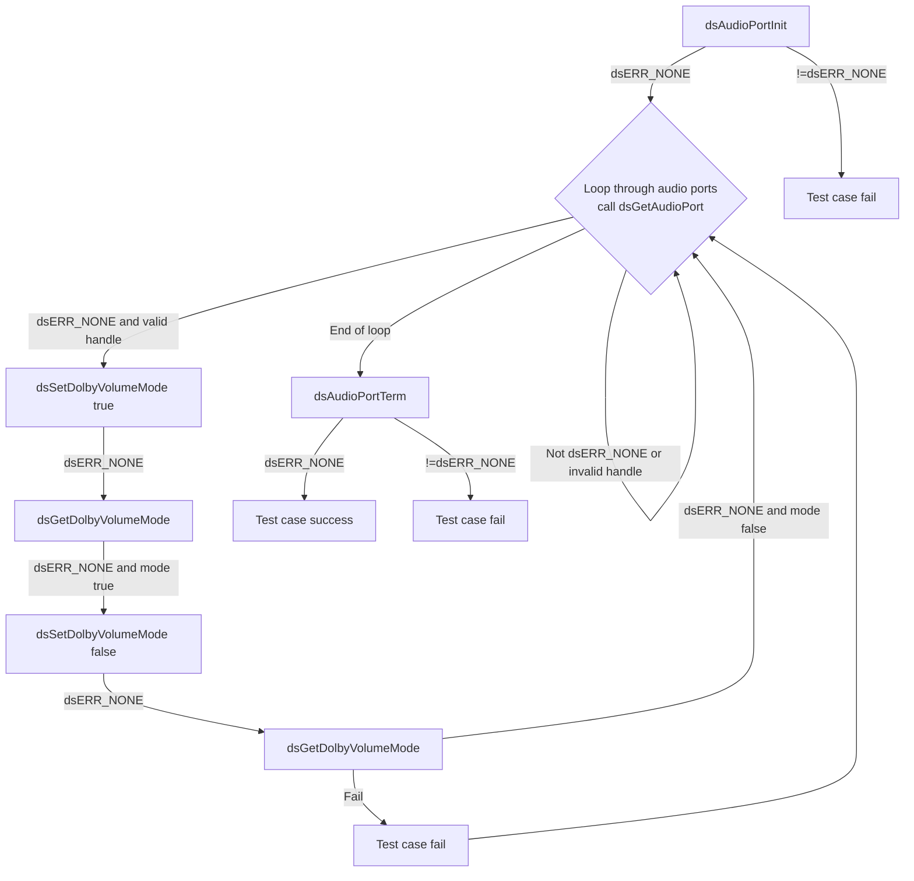
```mermaid
graph TB
    A[dsAudioPortInit] -->|dsERR_NONE|B{Loop through audio ports <br> call dsGetAudioPort}
    A -->|!=dsERR_NONE|A1[Test case fail]
    B -->|dsERR_NONE and valid handle|C[dsSetDolbyVolumeMode true]
    B -->|Not dsERR_NONE or invalid handle|B
    C -->|dsERR_NONE|D[dsGetDolbyVolumeMode]
    D -->|dsERR_NONE and mode true|E[dsSetDolbyVolumeMode false]
    E -->|dsERR_NONE|F[dsGetDolbyVolumeMode]
    F -->|dsERR_NONE and mode false|B
    F -->|Fail|F1[Test case fail]
    F1 --> B
    B -->|End of loop|G[dsAudioPortTerm]
    G -->|dsERR_NONE|H[Test case success]
    G -->|!=dsERR_NONE|G1[Test case fail]
```

### Test 7

|Title|Details|
|-----|-------|
|Function Name|`test_l2_dsAudio_SetAndGetIntelligentEqualizerMode`|
|Description|Loop through supported audio ports, Set Intelligent Equalizer Mode for supported ports and retrieve Intelligent Equalizer Mode for verification|
|Test Group|02|
|Test Case ID|007|
|Priority|High|

**Pre-Conditions :**
None

**Dependencies :**
None

**User Interaction :**
If user chose to run the test in interactive mode, then the test case has to be selected via console.

#### Test Procedure - Test 7

|Variation / Steps|Description|Test Data|Expected Result|Notes|
|-----------------|-----------|---------|---------------|-----|
|01|Initialize the audio port using `dsAudioPortInit`|None|`dsERR_NONE`|Should be successful|
|02|Loop through supported audio ports and get audio port using `dsGetAudioPort`|supported number of audio ports = `dsAudio/Number_of_supported_ports` field and port id = `dsAudio/Port/[port number]/Typeid` of configuration file|`dsERR_NONE`|Should be successful|
|03|Set Intelligent Equalizer Mode for each supported port using `dsSetIntelligentEqualizerMode`|handle = obtained from `dsGetAudioPort`, mode = 0 to 6|`dsERR_NONE`|Should be successful|
|04|Retrieve Intelligent Equalizer Mode for each supported port using `dsGetIntelligentEqualizerMode`|handle = obtained from `dsGetAudioPort`|`dsERR_NONE`|Should be successful|
|05|Verify the set and retrieved Intelligent Equalizer Mode are same|mode = set mode, getMode = retrieved mode|mode should be equal to getMode|Should be successful|
|06|Terminate the audio port using `dsAudioPortTerm`|None|`dsERR_NONE`|Should be successful|

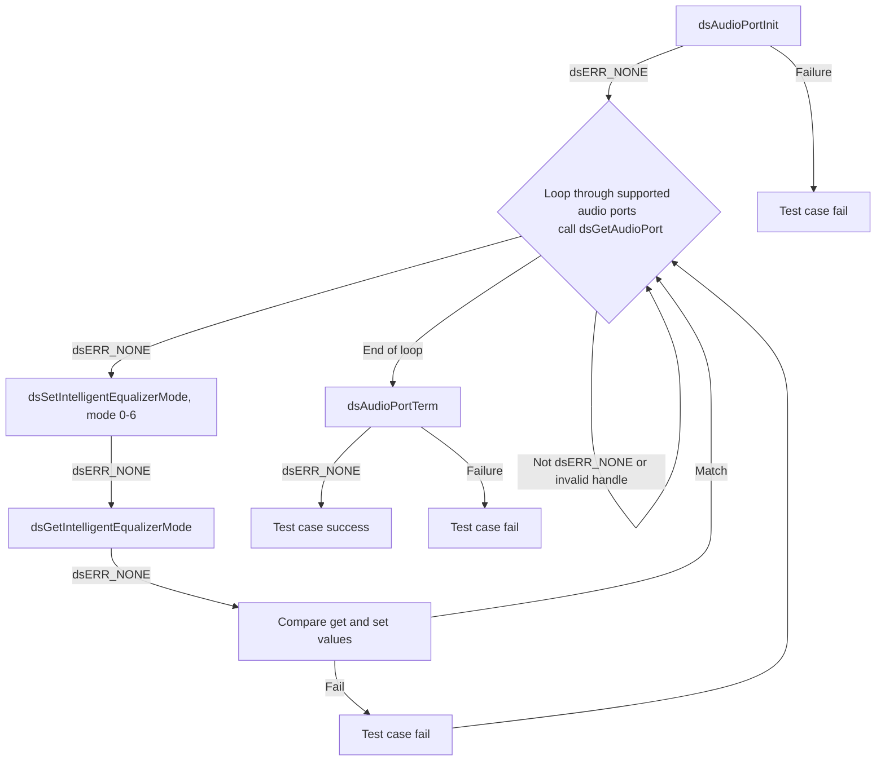
```mermaid
graph TB
A[dsAudioPortInit] -->|dsERR_NONE|B{ Loop through supported audio ports <br> call dsGetAudioPort}
A -->|Failure|A_Fail[Test case fail]
B -->|dsERR_NONE|C[dsSetIntelligentEqualizerMode, mode 0-6]
B -->|Not dsERR_NONE or invalid handle|B
C -->|dsERR_NONE|D[dsGetIntelligentEqualizerMode]
D -->|dsERR_NONE|E[Compare get and set values]
E -->|Match|B
E -->|Fail|E1[Test case fail]
E1 --> B
B -->|End of loop|F[dsAudioPortTerm]
F -->|dsERR_NONE|G[Test case success]
F -->|Failure|F_Fail[Test case fail]
```

### Test 8

|Title|Details|
|-----|-------|
|Function Name|`test_l2_dsAudio_SetAndGetVolumeLeveller`|
|Description|Loop through supported audio ports, set Volume leveller for supported ports and retrieve Volume leveller for verification|
|Test Group|02|
|Test Case ID|008|
|Priority|High|

**Pre-Conditions :**
None

**Dependencies :**
None

**User Interaction :**
If user chose to run the test in interactive mode, then the test case has to be selected via console.

#### Test Procedure - Test 8

|Variation / Steps|Description|Test Data|Expected Result|Notes|
|-----------------|-----------|---------|---------------|-----|
|01|Initialize the audio port using `dsAudioPortInit`|None|`dsERR_NONE`|Should be successful|
|02|Loop through supported audio ports and get audio port using `dsGetAudioPort`|supported number of audio ports = `dsAudio/Number_of_supported_ports` field and port id = `dsAudio/Port/[port number]/Typeid` of configuration file|`dsERR_NONE`|Should be successful|
|03|Set the volume leveller for the retrieved audio port using `dsSetVolumeLeveller`|handle = retrieved handle, volLeveller = {mode: 1, level: 5}|`dsERR_NONE`|Should be successful|
|04|Retrieve the volume leveller for the same audio port using `dsGetVolumeLeveller`|handle = retrieved handle|`dsERR_NONE`|Should be successful|
|05|Verify the set and retrieved volume leveller are same|volLevellerSet.mode = volLevellerGet.mode, volLevellerSet.level = volLevellerGet.level|volLevellerSet.mode, volLevellerSet.level|Should be successful|
|06|Terminate the audio port using `dsAudioPortTerm`|None|`dsERR_NONE`|Should be successful|

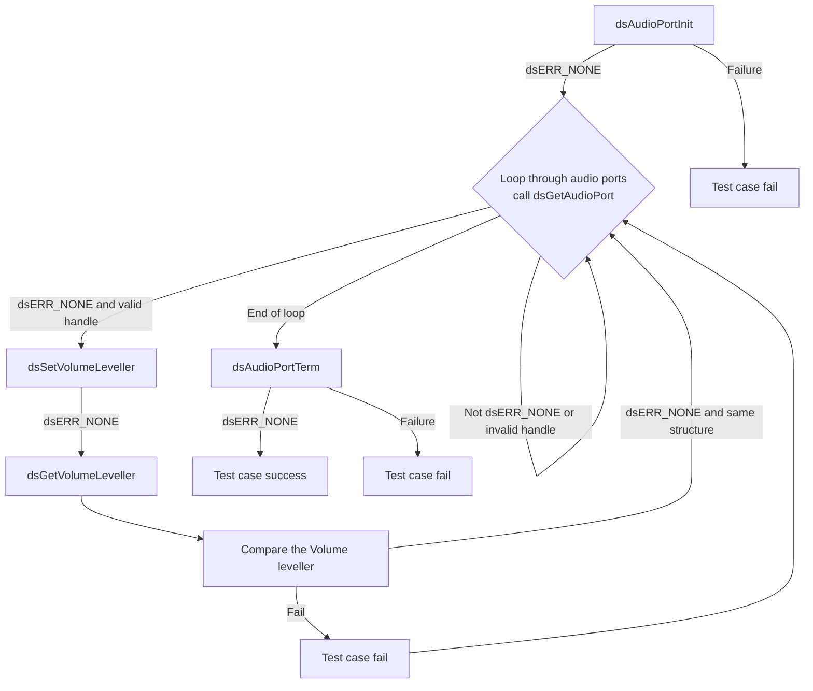
```mermaid
graph TB
    A[dsAudioPortInit] -->|dsERR_NONE|B{Loop through audio ports <br> call dsGetAudioPort}
    A -->|Failure|A1[Test case fail]
    B -->|dsERR_NONE and valid handle|C[dsSetVolumeLeveller]
    B -->|Not dsERR_NONE or invalid handle|B
    C -->|dsERR_NONE|D[dsGetVolumeLeveller]
    D --> D1[Compare the Volume leveller]
    D1 --> |Fail|D2[Test case fail]
    D2 --> B
    D1 -->|dsERR_NONE and same structure|B
    B -->|End of loop|E[dsAudioPortTerm]
    E -->|dsERR_NONE|F[Test case success]
    E -->|Failure|E1[Test case fail]
```

### Test 9

|Title|Details|
|-----|-------|
|Function Name|`test_l2_dsAudio_SetAndGetBassEnhancer`|
|Description|Loop through supported audio ports, Set Bass Enhancer for supported ports and retrieve Bass Enhancer for verification|
|Test Group|02|
|Test Case ID|009|
|Priority|High|

**Pre-Conditions :**
None

**Dependencies :**
None

**User Interaction :**
If user chose to run the test in interactive mode, then the test case has to be selected via console.

#### Test Procedure - Test 9

|Variation / Steps|Description|Test Data|Expected Result|Notes|
|-----------------|-----------|---------|---------------|-----|
|01|Initialize the audio port using `dsAudioPortInit`|None|`dsERR_NONE`|Should be successful|
|02|Loop through supported audio ports and get audio port using `dsGetAudioPort`|supported number of audio ports = `dsAudio/Number_of_supported_ports` field and port id = `dsAudio/Port/[port number]/Typeid` of configuration file|`dsERR_NONE`|Should be successful|
|03|Set Bass Enhancer for the retrieved audio port using `dsSetBassEnhancer`|handle = retrieved handle, boost = 0 to 100|`dsERR_NONE`|Should be successful|
|04|Retrieve Bass Enhancer for the same audio port using `dsGetBassEnhancer`|handle = retrieved handle|`dsERR_NONE`|Should be successful|
|05|Verify the set and retrieved Bass Enhancer values are same|setBoost = retrieved boost|setBoost|Should be successful|
|06|Terminate the audio port using `dsAudioPortTerm`|None|`dsERR_NONE`|Should be successful|

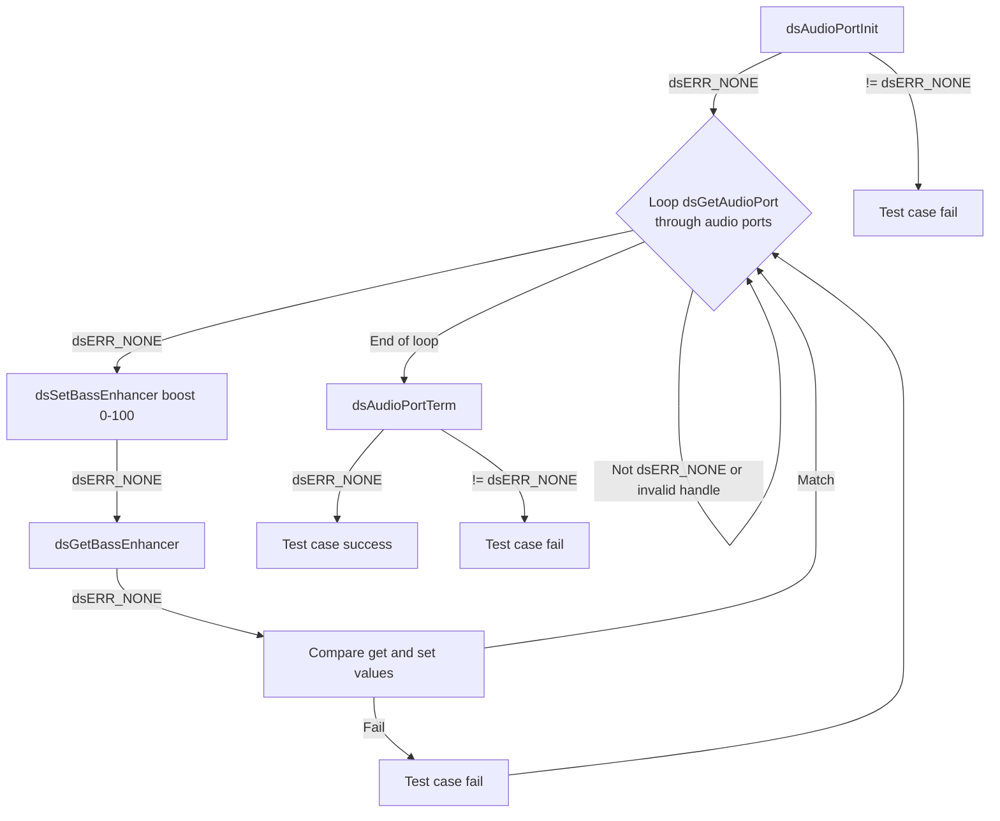
```mermaid
graph TB
    A[dsAudioPortInit] -->|dsERR_NONE|B{Loop dsGetAudioPort <br> through audio ports }
    A -->|!= dsERR_NONE|A1[Test case fail]
    B -->|dsERR_NONE|C[dsSetBassEnhancer boost 0-100]
    B -->|Not dsERR_NONE or invalid handle|B
    C -->|dsERR_NONE|D[dsGetBassEnhancer]
    D -->|dsERR_NONE|E[Compare get and set values]
    E -->|Fail|E1[Test case fail]
    E1 --> B
    E -->|Match|B
    B -->|End of loop|F[dsAudioPortTerm]
    F -->|dsERR_NONE|G[Test case success]
    F -->|!= dsERR_NONE|F1[Test case fail]
```

### Test 10

|Title|Details|
|-----|-------|
|Function Name|`test_l2_dsAudio_EnableAndVerifySurroundDecoder`|
|Description|Loop through supported audio ports, Enable Surround Decoder for supported ports and retrieve Surround Decoder status for verification|
|Test Group|02|
|Test Case ID|010|
|Priority|High|

**Pre-Conditions :**
None

**Dependencies :**
None

**User Interaction :**
If user chose to run the test in interactive mode, then the test case has to be selected via console.

#### Test Procedure - Test 10

|Variation / Steps|Description|Test Data|Expected Result|Notes|
|-----------------|-----------|---------|---------------|-----|
|01|Initialize the audio port using `dsAudioPortInit`|None|`dsERR_NONE`|Should be successful|
|02|Loop through supported audio ports and get audio port using `dsGetAudioPort`|supported number of audio ports = `dsAudio/Number_of_supported_ports` field and port id = `dsAudio/Port/[port number]/Typeid` of configuration file|`dsERR_NONE`|Should be successful|
|03|Enable Surround Decoder for each supported port using `dsEnableSurroundDecoder`|handle = obtained handle, enabled = `true`|`dsERR_NONE`|Should be successful|
|04|Retrieve Surround Decoder status for each port using `dsIsSurroundDecoderEnabled`|handle = obtained handle, enabled = valid buffer|`dsERR_NONE` and enabled = `true`|Should be successful|
|05|Terminate the audio port using `dsAudioPortTerm`|None|`dsERR_NONE`|Should be successful|

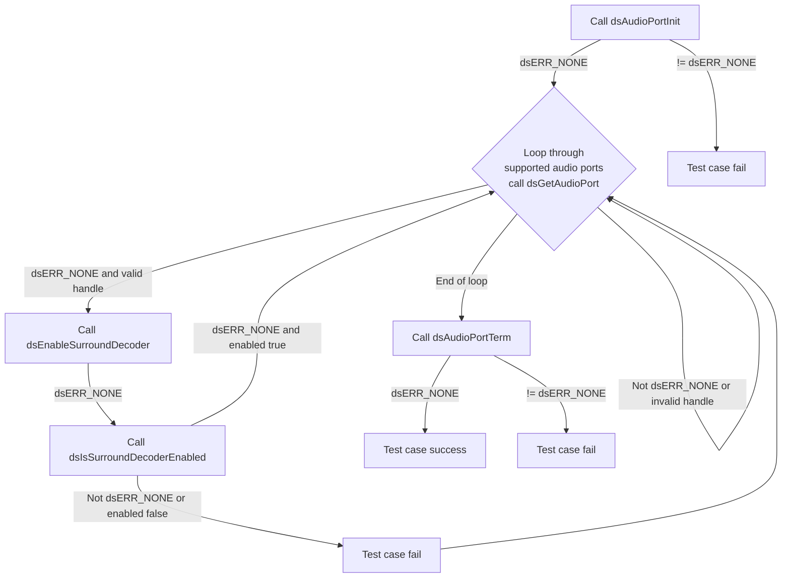
```mermaid
graph TB
    A[Call dsAudioPortInit] -->|dsERR_NONE|B{Loop through <br> supported audio ports <br> call dsGetAudioPort}
    A -->|!= dsERR_NONE|A1[Test case fail]
    B -->|dsERR_NONE and valid handle|C[Call dsEnableSurroundDecoder]
    B -->|Not dsERR_NONE or invalid handle|B
    C -->|dsERR_NONE|D[Call dsIsSurroundDecoderEnabled]
    D -->|Not dsERR_NONE or enabled false|D1[Test case fail]
    D1 --> B
    D -->|dsERR_NONE and enabled true|B
    B -->|End of loop|E[Call dsAudioPortTerm]
    E -->|dsERR_NONE|F[Test case success]
    E -->|!= dsERR_NONE|E1[Test case fail]
```

### Test 11

|Title|Details|
|-----|-------|
|Function Name|`test_l2_dsAudio_SetAndGetDRCMode`|
|Description|Loop through supported audio ports, Set `DRC` Mode for supported ports and retrieve `DRC` Mode for verification|
|Test Group|02|
|Test Case ID|011|
|Priority|High|

**Pre-Conditions :**
None

**Dependencies :**
None

**User Interaction :**
If user chose to run the test in interactive mode, then the test case has to be selected via console.

#### Test Procedure - Test 11

|Variation / Steps|Description|Test Data|Expected Result|Notes|
|-----------------|-----------|---------|---------------|-----|
|01|Initialize the audio port using `dsAudioPortInit`|None|`dsERR_NONE`|Should be successful|
|02|Loop through supported audio ports and get audio port using `dsGetAudioPort`|supported number of audio ports = `dsAudio/Number_of_supported_ports` field and port id = `dsAudio/Port/[port number]/Typeid` of configuration file|`dsERR_NONE`|Should be successful|
|03|For each valid audio port handle, loop through all `DRC` modes (0 and 1), set the `DRC` mode using `dsSetDRCMode`|handle = valid handle, mode = 0 or 1|`dsERR_NONE`|Should be successful|
|04|For each set `DRC` mode, get the `DRC` mode using `dsGetDRCMode`|handle = valid handle|`dsERR_NONE`|Should be successful|
|05|Verify the set and get `DRC` modes are equal|getMode = mode|mode|Should be successful|
|06|Terminate the audio port using `dsAudioPortTerm`|None|`dsERR_NONE`|Should be successful|

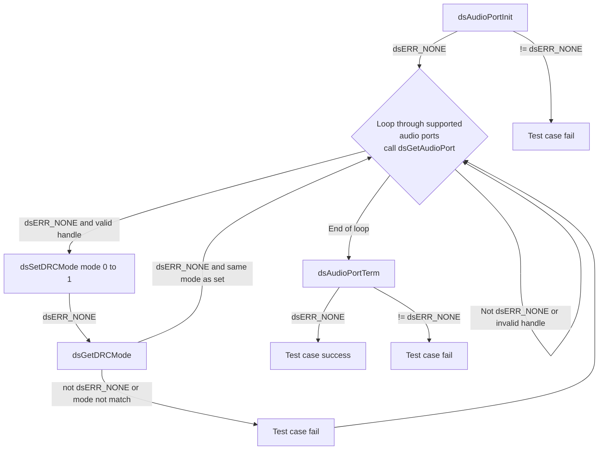
```mermaid
graph TB
    A[dsAudioPortInit] -->|dsERR_NONE|B{Loop through supported <br> audio ports <br> call dsGetAudioPort}
    A -->|!= dsERR_NONE|A1[Test case fail]
    B -->|dsERR_NONE and valid handle|C[dsSetDRCMode mode 0 to 1]
    B -->|Not dsERR_NONE or invalid handle|B
    C -->|dsERR_NONE|D[dsGetDRCMode]
    D -->|dsERR_NONE and same mode as set|B
    D -->|not dsERR_NONE or mode not match|D1[Test case fail]
    D1 --> B
    B -->|End of loop|E[dsAudioPortTerm]
    E -->|dsERR_NONE|F[Test case success]
    E -->|!= dsERR_NONE|E1[Test case fail]
```

### Test 12

|Title|Details|
|-----|-------|
|Function Name|`test_l2_dsAudio_SetAndGetSurroundVirtualizer`|
|Description|Loop through supported audio ports, Set Surround Virtualizer for supported ports and retrieve Surround Virtualizer for verification|
|Test Group|02|
|Test Case ID|012|
|Priority|High|

**Pre-Conditions :**
None

**Dependencies :**
None

**User Interaction :**
If user chose to run the test in interactive mode, then the test case has to be selected via console.

#### Test Procedure - Test 12

|Variation / Steps|Description|Test Data|Expected Result|Notes|
|-----------------|-----------|---------|---------------|-----|
|01|Initialize the audio port using `dsAudioPortInit`|None|`dsERR_NONE`|Should be successful|
|02|Loop through supported audio ports and get audio port using `dsGetAudioPort`|supported number of audio ports = `dsAudio/Number_of_supported_ports` field and port id = `dsAudio/Port/[port number]/Typeid` of configuration file|`dsERR_NONE`|Should be successful|
|03|Set Surround Virtualizer for the retrieved audio port using `dsSetSurroundVirtualizer`|handle = retrieved handle, virtualizer = {mode: (0-1), boost: (0-96 in steps of 16)}|`dsERR_NONE`|Should be successful|
|04|Retrieve Surround Virtualizer for the same audio port using `dsGetSurroundVirtualizer`|handle = retrieved handle|`dsERR_NONE`|Should be successful|
|05|Verify the set and retrieved Surround Virtualizer are same|mode: (0-1), boost: (0-96 in steps of 16)|`dsERR_NONE`|Should be successful|
|06|Terminate the audio port using `dsAudioPortTerm`|None|`dsERR_NONE`|Should be successful|

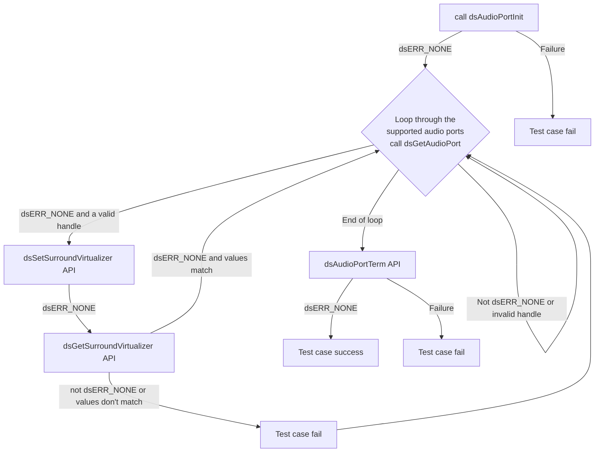
```mermaid
graph TB
    A[call dsAudioPortInit] -->|dsERR_NONE|B{Loop through the <br> supported audio ports <br> call dsGetAudioPort }
    A -->|Failure|A1[Test case fail]
    B -->|dsERR_NONE and a valid handle|C[dsSetSurroundVirtualizer API]
    B -->|Not dsERR_NONE or invalid handle|B
    C -->|dsERR_NONE|D[dsGetSurroundVirtualizer API]
    D -->|dsERR_NONE and values match|B
    D -->|not dsERR_NONE or values don't match|D1[Test case fail]
    D1 --> B
    B -->|End of loop|E[dsAudioPortTerm API]
    E -->|dsERR_NONE|F[Test case success]
    E -->|Failure|E1[Test case fail]
```

### Test 13

|Title|Details|
|-----|-------|
|Function Name|`test_l2_dsAudio_SetAndGetMISteering`|
|Description|Loop through supported audio ports, set `MI` Steering for supported ports and retrieve `MI` Steering for verification|
|Test Group|02|
|Test Case ID|013|
|Priority|High|

**Pre-Conditions :**
None

**Dependencies :**
None

**User Interaction :**
If user chose to run the test in interactive mode, then the test case has to be selected via console.

#### Test Procedure - Test 13

|Variation / Steps|Description|Test Data|Expected Result|Notes|
|-----------------|-----------|---------|---------------|-----|
|01|Initialize the audio port using `dsAudioPortInit`|None|`dsERR_NONE`|Should be successful|
|02|Loop through supported audio ports and get audio port using `dsGetAudioPort`|supported number of audio ports = `dsAudio/Number_of_supported_ports` field and port id = `dsAudio/Port/[port number]/Typeid` of configuration file|`dsERR_NONE`|Should be successful|
|03|Set `MI` Steering for the retrieved audio port using `dsSetMISteering`|handle = retrieved handle, enabled = `true`|`dsERR_NONE`|Should be successful|
|04|Retrieve `MI` Steering for the audio port using `dsGetMISteering`|handle = retrieved handle|`dsERR_NONE`|Should be successful|
|05|Verify the `MI` Steering status|enabled = retrieved status|`true`|Should be successful|
|06|Terminate the audio port using `dsAudioPortTerm`|None|`dsERR_NONE`|Should be successful|

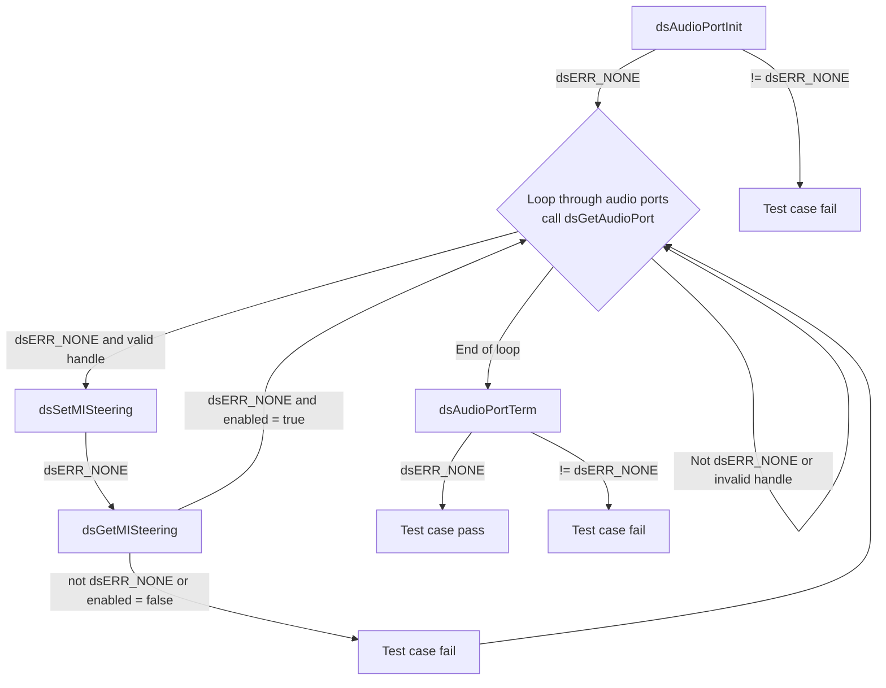
```mermaid
graph TB
    A[dsAudioPortInit] -->|dsERR_NONE|B{Loop through audio ports <br> call dsGetAudioPort}
    A -->|!= dsERR_NONE|AF[Test case fail]
    B -->|dsERR_NONE and valid handle|C[dsSetMISteering]
    B -->|Not dsERR_NONE or invalid handle|B
    C -->|dsERR_NONE|D[dsGetMISteering]
    D -->|dsERR_NONE and enabled = true|B
    D -->|not dsERR_NONE or enabled = false|D1[Test case fail]
    D1 --> B
    B -->|End of loop|E[dsAudioPortTerm]
    E -->|dsERR_NONE|F[Test case pass]
    E -->|!= dsERR_NONE|EF[Test case fail]
```

### Test 14

|Title|Details|
|-----|-------|
|Function Name|`test_l2_dsAudio_SetAndGetGraphicEqualizerMode`|
|Description|Loop through supported audio ports, Set Graphic Equalizer for supported ports and retrieve Graphic Equalizer for verification|
|Test Group|02|
|Test Case ID|014|
|Priority|High|

**Pre-Conditions :**
None

**Dependencies :**
None

**User Interaction :**
If user chose to run the test in interactive mode, then the test case has to be selected via console.

#### Test Procedure - Test 14

|Variation / Steps|Description|Test Data|Expected Result|Notes|
|-----------------|-----------|---------|---------------|-----|
|01|Initialize the audio port using `dsAudioPortInit`|None|`dsERR_NONE`|Should be successful|
|02|Loop through supported audio ports and get audio port using `dsGetAudioPort`|supported number of audio ports = `dsAudio/Number_of_supported_ports` field and port id = `dsAudio/Port/[port number]/Typeid` of configuration file|`dsERR_NONE`|Should be successful|
|03|For each audio port, set the Graphic Equalizer mode using `dsSetGraphicEqualizerMode`|handle = obtained from `dsGetAudioPort`, mode = 0 to 3|`dsERR_NONE`|Should be successful|
|04|For each audio port, get the Graphic Equalizer mode using `dsGetGraphicEqualizerMode`|handle = obtained from `dsGetAudioPort`|`dsERR_NONE`|Should be successful|
|05|Verify the set and get Graphic Equalizer mode are same|mode = set mode, getMode = obtained from `dsGetGraphicEqualizerMode`|mode should be equal to getMode|Should be successful|
|06|Terminate the audio port using `dsAudioPortTerm`|None|`dsERR_NONE`|Should be successful|

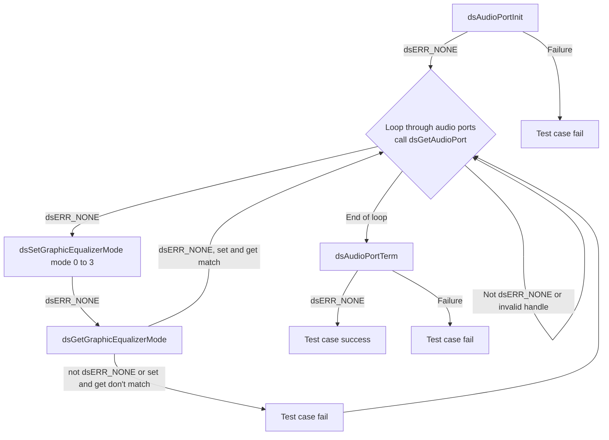
```mermaid
graph TB
    A[dsAudioPortInit] -->|dsERR_NONE|B{Loop through audio ports <br> call dsGetAudioPort}
    A -->|Failure|A1[Test case fail]
    B -->|dsERR_NONE|C[dsSetGraphicEqualizerMode mode 0 to 3]
    B -->|Not dsERR_NONE or invalid handle|B
    C -->|dsERR_NONE|D[dsGetGraphicEqualizerMode]
    D -->|dsERR_NONE, set and get match|B
    D -->|not dsERR_NONE or set and get don't match|D1[Test case fail]
    D1 --> B
    B -->|End of loop|E[dsAudioPortTerm]
    E -->|dsERR_NONE|F[Test case success]
    E -->|Failure|E1[Test case fail]
```

### Test 15

|Title|Details|
|-----|-------|
|Function Name|`test_l2_dsAudio_EnableDisableAndRetrieveLEConfig`|
|Description|Loop through supported audio ports, enable/disable audio loudness equivalence and retrieve audio loudness equivalence status for verification|
|Test Group|02|
|Test Case ID|015|
|Priority|High|

**Pre-Conditions :**
None

**Dependencies :**
None

**User Interaction :**
If user chose to run the test in interactive mode, then the test case has to be selected via console.

#### Test Procedure - Test 15

|Variation / Steps|Description|Test Data|Expected Result|Notes|
|-----------------|-----------|---------|---------------|-----|
|01|Initialize the audio port using `dsAudioPortInit`|None|`dsERR_NONE`|Should be successful|
|02|Loop through supported audio ports and get audio port using `dsGetAudioPort`|supported number of audio ports = `dsAudio/Number_of_supported_ports` field and port id = `dsAudio/Port/[port number]/Typeid` of configuration file|`dsERR_NONE`|Should be successful|
|03|Enable loudness equivalence configuration using `dsEnableLEConfig`|handle = obtained handle, enable = `true`|`dsERR_NONE`|Should be successful|
|04|Retrieve loudness equivalence configuration using `dsGetLEConfig`|handle = obtained handle|`dsERR_NONE` and enable = `true`|Should be successful|
|05|Disable loudness equivalence configuration using `dsEnableLEConfig`|handle = obtained handle, enable = `false`|`dsERR_NONE`|Should be successful|
|06|Retrieve loudness equivalence configuration using `dsGetLEConfig`|handle = obtained handle|`dsERR_NONE` and enable = `false`|Should be successful|
|07|Terminate the audio port using `dsAudioPortTerm`|None|`dsERR_NONE`|Should be successful|

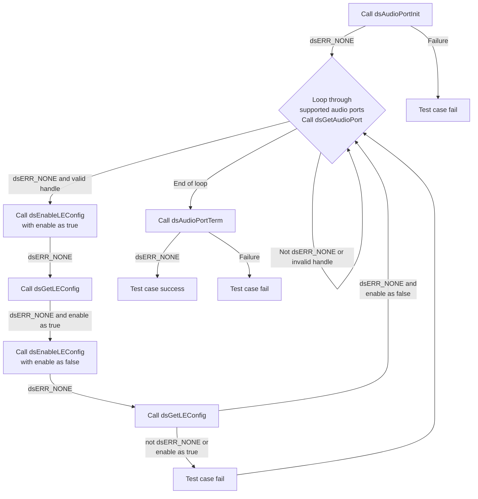
```mermaid
graph TB
    A[Call dsAudioPortInit] -->|dsERR_NONE|B{Loop through <br> supported audio ports <br> Call dsGetAudioPort}
    A -->|Failure|A1[Test case fail]
    B -->|dsERR_NONE and valid handle|C[Call dsEnableLEConfig <br> with enable as true]
    B -->|Not dsERR_NONE or invalid handle|B
    C -->|dsERR_NONE|D[Call dsGetLEConfig]
    D -->|dsERR_NONE and enable as true|E[Call dsEnableLEConfig  <br> with enable as false]
    E -->|dsERR_NONE|F[Call dsGetLEConfig]
    F -->|not dsERR_NONE or <br> enable as true|F1[Test case fail]
    F1 --> B
    F -->|dsERR_NONE and <br> enable as false|B
    B -->|End of loop|G[Call dsAudioPortTerm]
    G -->|dsERR_NONE|H[Test case success]
    G -->|Failure|G1[Test case fail]
```

### Test 16

|Title|Details|
|-----|-------|
|Function Name|`test_l2_dsAudio_CheckMS12DecodeSupport`|
|Description|Loop through the supported audio ports and check whether the port supports `MS12` decode using the configuration file|
|Test Group|02|
|Test Case ID|016|
|Priority|High|

**Pre-Conditions :**
None

**Dependencies :**
None

**User Interaction :**
If user chose to run the test in interactive mode, then the test case has to be selected via console.

#### Test Procedure - Test 16

|Variation / Steps|Description|Test Data|Expected Result|Notes|
|-----------------|-----------|---------|---------------|-----|
|01|Initialize the audio port using `dsAudioPortInit`|None|`dsERR_NONE`|Should be successful|
|02|Loop through supported audio ports and get audio port using `dsGetAudioPort`|supported number of audio ports = `dsAudio/Number_of_supported_ports` field and port id = `dsAudio/Port/[port number]/Typeid` of configuration file|`dsERR_NONE`|Should be successful|
|03|Check if the port supports `MS12` decode using `dsIsAudioMS12Decode`|handle|`dsERR_NONE`|Should be successful|
|04|Compare configuration value with `dsIsAudioMS12Decode` value from API|MS12 support =  `dsAudio/Port/[port number]/IsMS12Decode` of configuration file|Matches|Should be successful|
|05|Terminate the audio port using `dsAudioPortTerm`|None|`dsERR_NONE`|Should be successful|

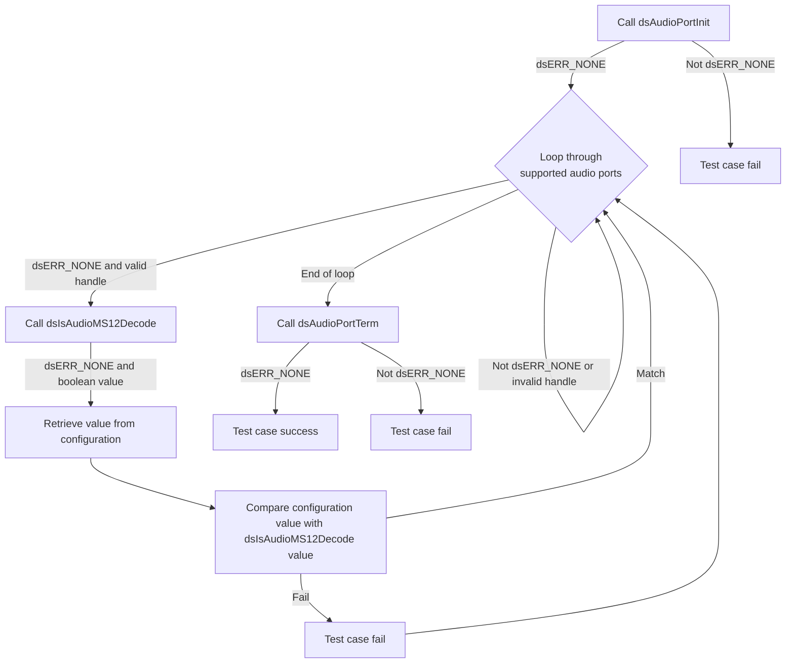
```mermaid
graph TB
    A[Call dsAudioPortInit] -->|dsERR_NONE|B{Loop through <br> supported audio ports}
    B -->|Not dsERR_NONE or invalid handle|B
    B -->|dsERR_NONE and valid handle|D[Call dsIsAudioMS12Decode]
    D -->|dsERR_NONE and boolean value|E[Retrieve value from configuration]
    E --> F[Compare configuration value with dsIsAudioMS12Decode value]
    F -->|Fail| F1[Test case fail]
    F1 --> B
    F -->|Match|B
    B -->|End of loop|I[Call dsAudioPortTerm]
    I -->|dsERR_NONE|J[Test case success]
    A -->|Not dsERR_NONE|K[Test case fail]
    I -->|Not dsERR_NONE|N[Test case fail]
```

### Test 17

|Title|Details|
|-----|-------|
|Function Name|`test_l2_dsAudio_CheckMS11DecodeSupport`|
|Description|Loop through the supported audio ports and check whether the port supports `MS11` decode using the configuration file.|
|Test Group|02|
|Test Case ID|017|
|Priority|High|

**Pre-Conditions :**
None

**Dependencies :**
None

**User Interaction :**
If user chose to run the test in interactive mode, then the test case has to be selected via console.

#### Test Procedure - Test 17

|Variation / Steps|Description|Test Data|Expected Result|Notes|
|-----------------|-----------|---------|---------------|-----|
|01|Initialize the audio port using `dsAudioPortInit`|None|`dsERR_NONE`|Should be successful|
|02|Loop through supported audio ports and get audio port using `dsGetAudioPort`|supported number of audio ports = `dsAudio/Number_of_supported_ports` field and port id = `dsAudio/Port/[port number]/Typeid` of configuration file|`dsERR_NONE`|Should be successful|
|03|Check whether the port supports `MS11` decode using `dsIsAudioMSDecode`|handle = obtained from `dsGetAudioPort`|`dsERR_NONE`|Should be successful|
|04|Compare configuration value with `dsIsAudioMSDecode` value from `API`|MS11 Support =  `dsAudio/Port/[port number]/IsMS11Decode` of configuration file|Matches|Should be successful|
|05|Terminate the audio port using `dsAudioPortTerm`|None|`dsERR_NONE`|Should be successful|

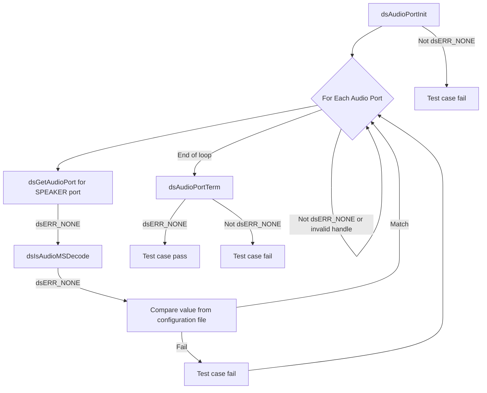
```mermaid
graph TB
A[dsAudioPortInit] --> B{For Each Audio Port}
B --> C[dsGetAudioPort for SPEAKER port]
B -->|Not dsERR_NONE or invalid handle|B
C -->|dsERR_NONE|D[dsIsAudioMSDecode]
D -->|dsERR_NONE|E[Compare value from configuration file]
E -->|Fail|E1[Test case fail]
E1 --> B
E -->|Match|B
B-->|End of loop|F[dsAudioPortTerm]
F -->|dsERR_NONE|H[Test case pass]
F -->|Not dsERR_NONE|F1[Test case fail]
A -->|Not dsERR_NONE|A1[Test case fail]
```

### Test 18

|Title|Details|
|-----|-------|
|Function Name|`test_l2_dsAudio_VerifyMS12AudioProfiles_sink`|
|Description|Get the supported `MS12` audio profiles and verify them with the configuration file|
|Test Group|02|
|Test Case ID|018|
|Priority|High|

**Pre-Conditions :**
None

**Dependencies :**
None

**User Interaction :**
If user chose to run the test in interactive mode, then the test case has to be selected via console.

#### Test Procedure - Test 18

|Variation / Steps|Description|Test Data|Expected Result|Notes|
|-----------------|-----------|---------|---------------|-----|
|01|Initialize the audio port using `dsAudioPortInit`|None|`dsERR_NONE`|Should be successful|
|02|Loop through supported audio ports and get audio port using `dsGetAudioPort`|supported number of audio ports = `dsAudio/Number_of_supported_ports` field and port id = `dsAudio/Port/[port number]/Typeid` of configuration file|`dsERR_NONE`|Should be successful|
|02|Get the MS12 audio profile list using `dsGetMS12AudioProfileList`|handle = valid handle, profiles = valid pointer|`dsERR_NONE`|Should be successful|
|04|Verify the retrieved audio profile list with the expected profile string|MS12 audio profile count = `dsAudio/Port/[port number]/MS12_AudioProfileCount`, MS12 audio profiles =  `dsAudio/Port/[port number]/MS12_AudioProfiles` of configuration file|profiles.audioProfileList = valid profile list|Should be successful|
|05|Terminate the audio port using `dsAudioPortTerm`|None|`dsERR_NONE`|Should be successful|

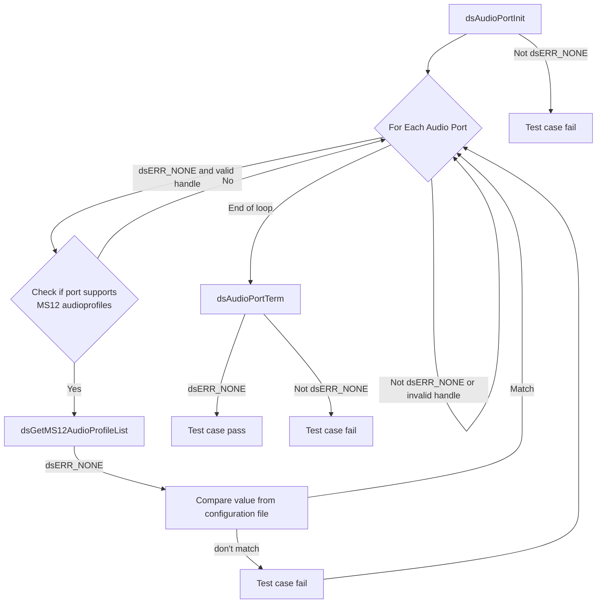
```mermaid
graph TB
A[dsAudioPortInit] --> B{For Each Audio Port}
B -->|Not dsERR_NONE or invalid handle|B
B -->|dsERR_NONE and valid handle|C{Check if port supports <br> MS12 audioprofiles}
C -->|Yes|D[dsGetMS12AudioProfileList]
C -->|No|B
D -->|dsERR_NONE|E[Compare value from configuration file]
E --> |don't match|E1[Test case fail]
E1 --> B
E -->|Match|B
B-->|End of loop|F[dsAudioPortTerm]
F -->|dsERR_NONE|H[Test case pass]
F -->|Not dsERR_NONE|F1[Test case fail]
A -->|Not dsERR_NONE|A1[Test case fail]
```

### Test 19

|Title|Details|
|-----|-------|
|Function Name|`test_l2_dsAudio_SetAndGetMS12AudioProfile_sink`|
|Description|Get Supported `MS12` Audio profiles, loop through supported audio ports, set various audio profiles for supported ports and retrieve audio profile for verification.|
|Test Group|02|
|Test Case ID|019|
|Priority|High|

**Pre-Conditions :**
None

**Dependencies :**
None

**User Interaction :**
If user chose to run the test in interactive mode, then the test case has to be selected via console.

#### Test Procedure - Test 19

|Variation / Steps|Description|Test Data|Expected Result|Notes|
|-----------------|-----------|---------|---------------|-----|
|01|Initialize the audio port using `dsAudioPortInit`|None|`dsERR_NONE`|Should be successful|
|02|Loop through supported audio ports and get audio port using `dsGetAudioPort`|supported number of audio ports = `dsAudio/Number_of_supported_ports` field and port id = `dsAudio/Port/[port number]/Typeid` of configuration file|`dsERR_NONE`|Should be successful|
|03|Get `MS12` audio profile list using `dsGetMS12AudioProfileList`|handle = obtained from `dsGetAudioPort`|`dsERR_NONE`|Should be successful|
|04|Loop through all profiles and set `MS12` audio profile using `dsSetMS12AudioProfile`|handle = obtained from `dsGetAudioPort`, profile = profileName|`dsERR_NONE`|Should be successful|
|05|Get `MS12` audio profile using `dsGetMS12AudioProfile`|handle = obtained from `dsGetAudioPort`|`dsERR_NONE`|Should be successful|
|06|Assert that the set and get profiles are equal|profile = obtained from `dsGetMS12AudioProfile`, profileName = set in `dsSetMS12AudioProfile`|`True`|Should be successful|
|07|Terminate the audio port using `dsAudioPortTerm`|None|`dsERR_NONE`|Should be successful|

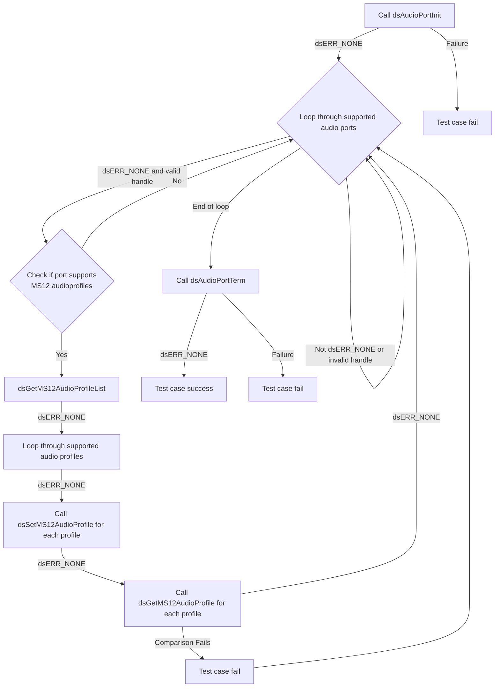
```mermaid
graph TB
A[Call dsAudioPortInit] -->|dsERR_NONE|B{Loop through supported audio ports}
A -->|Failure|A1[Test case fail]
B -->|dsERR_NONE and valid handle|BC{Check if port supports <br> MS12 audioprofiles}
B -->|Not dsERR_NONE or invalid handle|B
BC -->|Yes|C[dsGetMS12AudioProfileList]
BC -->|No|B
C -->|dsERR_NONE|D[Loop through supported audio profiles]
D -->|dsERR_NONE|E[Call dsSetMS12AudioProfile for each profile]
E -->|dsERR_NONE|F[Call dsGetMS12AudioProfile for each profile]
F -->|Comparison Fails|F1[Test case fail]
F1-->B
F -->|dsERR_NONE|B
B -->|End of loop|G[Call dsAudioPortTerm]
G -->|dsERR_NONE|H[Test case success]
G -->|Failure|G1[Test case fail]
```

### Test 20

|Title|Details|
|-----|-------|
|Function Name|`test_l2_dsAudio_SetAndGetStereoMode`|
|Description|Loop through supported audio ports, set Stereo mode for supported ports and retrieve Stereo mode for verification|
|Test Group|02|
|Test Case ID|020|
|Priority|High|

**Pre-Conditions :**
None

**Dependencies :**
None

**User Interaction :**
If user chose to run the test in interactive mode, then the test case has to be selected via console.

#### Test Procedure - Test 20

|Variation / Steps|Description|Test Data|Expected Result|Notes|
|-----------------|-----------|---------|---------------|-----|
|01|Initialize the audio port using `dsAudioPortInit`|None|`dsERR_NONE`|Should be successful|
|02|Loop through supported audio ports and get audio port using `dsGetAudioPort`|supported number of audio ports = `dsAudio/Number_of_supported_ports` field and port id = `dsAudio/Port/[port number]/Typeid` of configuration file|`dsERR_NONE`|Should be successful|
|03|Set the stereo mode for the retrieved audio port handle using `dsSetStereoMode`|handle = retrieved handle, supported Stereo modes = `dsAudio/Port/[port number]/stereo_modes` of configuration file|`dsERR_NONE`|Should be successful|
|04|Get the stereo mode for the same audio port handle using `dsGetStereoMode`|handle = retrieved handle|`dsERR_NONE`|Should be successful|
|05|Assert that the retrieved stereo mode is the same as the set stereo mode|mode = retrieved mode|mode = getmode|Should be successful|
|06|Terminate the audio port using `dsAudioPortTerm`|None|`dsERR_NONE`|Should be successful|

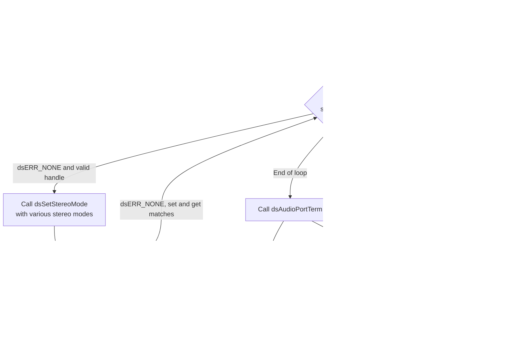
```mermaid
graph TB
    A[Call dsAudioPortInit] -->|dsERR_NONE|B{Loop through <br> supported audio ports}
    A -->|!= dsERR_NONE|A1[Test case fail]
    B -->|dsERR_NONE and valid handle|C[Call dsSetStereoMode <br> with various stereo modes]
    B -->|Not dsERR_NONE or invalid handle|B
    C -->|dsERR_NONE|D[Call dsGetStereoMode with handle]
    D -->|Comparison Fails|D1[Test case fail]
    D1 --> B
    D -->|dsERR_NONE, set and get matches|B
    B -->|End of loop|E[Call dsAudioPortTerm]
    E -->|dsERR_NONE|F[Test case success]
    E -->|!= dsERR_NONE|E1[Test case fail]
```

### Test 21

|Title|Details|
|-----|-------|
|Function Name|`test_l2_dsAudio_SetAndGetStereoAuto_sink`|
|Description|Loop through supported audio ports, set Stereo Auto mode for supported ports and retrieve it for verification|
|Test Group|02|
|Test Case ID|021|
|Priority|High|

**Pre-Conditions :**
None

**Dependencies :**
None

**User Interaction :**
If user chose to run the test in interactive mode, then the test case has to be selected via console.

#### Test Procedure - Test 21

|Variation / Steps|Description|Test Data|Expected Result|Notes|
|-----------------|-----------|---------|---------------|-----|
|01|Initialize the audio port using `dsAudioPortInit`|None|`dsERR_NONE`|Should be successful|
|02|Loop through supported audio ports and get audio port using `dsGetAudioPort`|supported number of audio ports = `dsAudio/Number_of_supported_ports` field and port id = `dsAudio/Port/[port number]/Typeid` of configuration file|`dsERR_NONE`|Should be successful|
|03|Check if the port support Stereo auto mode from the `Port/[port number]/stereo_auto_mode` of configuration file. Set Stereo Auto mode for the retrieved audio port using `dsSetStereoAuto`|handle = retrieved handle, autoMode = 1|`dsERR_NONE`|Should be successful|
|04|Retrieve the Stereo Auto mode for the same audio port using `dsGetStereoAuto`|handle = retrieved handle|`dsERR_NONE`|Should be successful|
|05|Verify the set and retrieved Stereo Auto mode are same|getAutoMode = retrieved auto mode, autoMode = 1|getAutoMode should be equal to autoMode|Should be successful|
|06|Terminate the audio port using `dsAudioPortTerm`|None|`dsERR_NONE`|Should be successful|

```mermaid
graph TB
A[Call dsAudioPortInit] -->|dsERR_NONE|B{Loop through supported <br> audio ports}
B -->|dsERR_NONE|C[Call dsSetStereoAuto <br> with autoMode=true]
B -->|Not dsERR_NONE or invalid handle|B
C -->|dsERR_NONE|D[Call dsGetStereoAuto with handle]
D -->|Comparison Fail|D1[Test case fail]
D1 --> B
D -->|dsERR_NONE & get and set matches|B
B -->|End of loop|E[Call dsAudioPortTerm]
E -->|dsERR_NONE|F[Test case pass]
E -->|Failure|E1[Test case fail]
```

### Test 22

|Title|Details|
|-----|-------|
|Function Name|`test_l2_dsAudio_SetAndGetAudioGain_sink`|
|Description|Loop through supported audio ports, set various Linear Audio Gain Values for supported ports and retrieve Audio Gain for verification|
|Test Group|02|
|Test Case ID|022|
|Priority|High|

**Pre-Conditions :**
None

**Dependencies :**
None

**User Interaction :**
If user chose to run the test in interactive mode, then the test case has to be selected via console.

#### Test Procedure - Test 22

|Variation / Steps|Description|Test Data|Expected Result|Notes|
|-----------------|-----------|---------|---------------|-----|
|01|Initialize the audio port using `dsAudioPortInit`|None|`dsERR_NONE`|Should be successful|
|02|Loop through supported audio ports and get audio port using `dsGetAudioPort`|supported number of audio ports = `dsAudio/Number_of_supported_ports` field and port id = `dsAudio/Port/[port number]/Typeid` of configuration file|`dsERR_NONE`|Should be successful|
|03|Set various Linear Audio Gain Values for supported ports using `dsSetAudioGain`|handle = valid handle, gain = -2080 to 480 in steps of 10|`dsERR_NONE`|Should be successful|
|04|Retrieve Audio Gain for verification using `dsGetAudioGain`|handle = valid handle|`dsERR_NONE`, gain = set gain value|Should be successful|
|05|Terminate the audio port using `dsAudioPortTerm`|None|`dsERR_NONE`|Should be successful|

```mermaid
graph TB
    A[dsAudioPortInit] -->|dsERR_NONE|B{Loop through <br> supported audio ports}
    A -->|Failure|A1[Test case fail]
    B -->|dsERR_NONE|C[dsSetAudioGain with <br>various gain values]
    B -->|Not dsERR_NONE or invalid handle|B
    C -->|dsERR_NONE|D[dsGetAudioGain to <br> retrieve the audio gain value]
    D --> |Comparison Fail|D1[Test case fail]
    D1 --> B
    D -->|dsERR_NONE and <br> gain value matches|B
    B -->|End of loop|E[dsAudioPortTerm]
    E -->|dsERR_NONE|F[Test case success]
    E -->|Failure|E1[Test case fail]
```

### Test 23

|Title|Details|
|-----|-------|
|Function Name|`test_l2_dsAudio_SetAndGetAudioLevel_sink`|
|Description|Loop through supported audio ports, set various Audio Levels for supported ports and retrieve Audio Level for verification|
|Test Group|02|
|Test Case ID|023|
|Priority|High|

**Pre-Conditions :**
None

**Dependencies :**
None

**User Interaction :**
If user chose to run the test in interactive mode, then the test case has to be selected via console.

#### Test Procedure - Test 23

|Variation / Steps|Description|Test Data|Expected Result|Notes|
|-----------------|-----------|---------|---------------|-----|
|01|Initialize the audio port using `dsAudioPortInit`|None|`dsERR_NONE`|Should be successful|
|02|Loop through supported audio ports and get audio port using `dsGetAudioPort`|supported number of audio ports = `dsAudio/Number_of_supported_ports` field and port id = `dsAudio/Port/[port number]/Typeid` of configuration file|`dsERR_NONE`|Should be successful|
|03|Set various Audio Levels for the obtained audio port handle using `dsSetAudioLevel`|handle = obtained handle, level = 0 to 100 in steps of 10|`dsERR_NONE`|Should be successful|
|04|Retrieve the Audio Level for the set level using `dsGetAudioLevel`|handle = obtained handle|`dsERR_NONE`, level = set level|Should be successful|
|05|Terminate the audio port using `dsAudioPortTerm`|None|`dsERR_NONE`|Should be successful|

```mermaid
graph TB
    A[dsAudioPortInit] -->|dsERR_NONE|B{Loop through the <br> supported audio ports}
    A -->|Failure|A1[Test case fail]
    B -->|dsERR_NONE and valid handle|C[Set various audio levels <br> dsSetAudioLevel]
    B -->|Not dsERR_NONE or invalid handle|B
    C -->|dsERR_NONE|D[Retrieve the audio level <br> dsGetAudioLevel]
    D -->|Comparison Fail|D1[Test case fail]
    D1 --> B
    D -->|dsERR_NONE and same audio level|B
    B -->|End of loop|E[dsAudioPortTerm]
    E -->|dsERR_NONE|F[Test case pass]
    E -->|Failure|E1[Test case fail]
```

### Test 24

|Title|Details|
|-----|-------|
|Function Name|`test_l2_dsAudio_AudioMuteVerification`|
|Description|Loop through supported audio ports, enable/disable audio mute for supported ports and retrieve Mute status for verification|
|Test Group|02|
|Test Case ID|024|
|Priority|High|

**Pre-Conditions :**
None

**Dependencies :**
None

**User Interaction :**
If user chose to run the test in interactive mode, then the test case has to be selected via console.

#### Test Procedure - Test 24

|Variation / Steps|Description|Test Data|Expected Result|Notes|
|-----------------|-----------|---------|---------------|-----|
|01|Initialize the audio port using `dsAudioPortInit`|None|`dsERR_NONE`|Should be successful|
|02|Loop through supported audio ports and get audio port using `dsGetAudioPort`|supported number of audio ports = `dsAudio/Number_of_supported_ports` field and port id = `dsAudio/Port/[port number]/Typeid` of configuration file|`dsERR_NONE`|Should be successful|
|03|Set audio mute to true using `dsSetAudioMute`|handle = obtained handle, mute = true|`dsERR_NONE`|Should be successful|
|04|Verify audio mute status using `dsIsAudioMute`|handle = obtained handle, mute = pointer to mute status|`dsERR_NONE`, mute = `true`|Should be successful|
|05|Set audio mute to false using `dsSetAudioMute`|handle = obtained handle, mute = `false`|`dsERR_NONE`|Should be successful|
|06|Verify audio mute status using `dsIsAudioMute`|handle = obtained handle, mute = pointer to mute status|`dsERR_NONE`, mute = `false`|Should be successful|
|07|Terminate the audio port using `dsAudioPortTerm`|None|`dsERR_NONE`|Should be successful|

```mermaid
graph TB
A[Call dsAudioPortInit] -->|dsERR_NONE|B{Loop through <br> supported audio ports}
B -- dsERR_NONE & valid handle --> C[Call dsSetAudioMute with mute=true]
B -->|Not dsERR_NONE or invalid handle|B
C -- dsERR_NONE --> D[Call dsIsAudioMute]
D -- dsERR_NONE & muted=true --> E[Call dsSetAudioMute with mute=false]
E -- dsERR_NONE --> F[Call dsIsAudioMute]
F -->|mute != false| F1[Test case fail]
F1 --> B
F -- dsERR_NONE & muted=false --> B
B -- End of loop --> G[Call dsAudioPortTerm]
G -- dsERR_NONE --> H[Test case success]
G -- Not dsERR_NONE --> G1[Test case fail]
```

### Test 25

|Title|Details|
|-----|-------|
|Function Name|`test_l2_dsAudio_SetAndGetAudioDelay`|
|Description|Loop through supported audio ports, set Audio delay for supported ports and retrieve delay for verification|
|Test Group|02|
|Test Case ID|025|
|Priority|High|

**Pre-Conditions :**
None

**Dependencies :**
None

**User Interaction :**
If user chose to run the test in interactive mode, then the test case has to be selected via console.

#### Test Procedure - Test 25

|Variation / Steps|Description|Test Data|Expected Result|Notes|
|-----------------|-----------|---------|---------------|-----|
|01|Initialize the audio port using `dsAudioPortInit`|None|`dsERR_NONE`|Should be successful|
|02|Loop through supported audio ports and get audio port using `dsGetAudioPort`|supported number of audio ports = `dsAudio/Number_of_supported_ports` field and port id = `dsAudio/Port/[port number]/Typeid` of configuration file|`dsERR_NONE`|Should be successful|
|03|Set the audio delay for the retrieved audio port using `dsSetAudioDelay`|handle = retrieved handle, delay = 100ms|`dsERR_NONE`|Should be successful|
|04|Retrieve the audio delay for the same audio port using `dsGetAudioDelay`|handle = retrieved handle|`dsERR_NONE`|Should be successful|
|05|Verify the set and retrieved audio delay are same|setDelay = 100ms, getDelay = retrieved delay|getDelay should be equal to setDelay|Should be successful|
|06|Terminate the audio port using `dsAudioPortTerm`|None|`dsERR_NONE`|Should be successful|

```mermaid
graph TB
    A[ dsAudioPortInit] -->|dsERR_NONE|B{Loop through the <br> supported audio ports}
    B -->|dsERR_NONE|D[ call dsSetAudioDelay <br>with delay value]
    B -->|Not dsERR_NONE or invalid handle|B
    D -->|dsERR_NONE|E[call dsGetAudioDelay ]
    E -->|dsERR_NONE|F[Verify audio delay matches <br> the set audio delay]
    F --> F1[Test case fail]
    F1 -->|Comparison Fail| B
    F --> B
    B -->|End of Loop|G[ call dsAudioPortTerm]
    G -->|dsERR_NONE|H[Test case success]
    A -->|Failure|I[Test case fail]
    G -->|Failure|M[Test case fail]
```

### Test 26

|Title|Details|
|-----|-------|
|Function Name|`test_l2_dsAudio_VerifyAtmosCapabilities_sink`|
|Description|For sink devices, get the ATMOS capabilities and verify them with the configuration file|
|Test Group|02|
|Test Case ID|026|
|Priority|High|

**Pre-Conditions :**
None

**Dependencies :**
None

**User Interaction :**
If user chose to run the test in interactive mode, then the test case has to be selected via console.

#### Test Procedure - Test 26

|Variation / Steps|Description|Test Data|Expected Result|Notes|
|-----------------|-----------|---------|---------------|-----|
|01|Initialize the audio port using `dsAudioPortInit`|None|`dsERR_NONE`|Should be successful|
|02|Loop through supported audio ports and get audio port using `dsGetAudioPort`|supported number of audio ports = `dsAudio/Number_of_supported_ports` field and port id = `dsAudio/Port/[port number]/Typeid` of configuration file|`dsERR_NONE`|Should be successful|
|03|Get the ATMOS capability of the sink device using `dsGetSinkDeviceAtmosCapability`|handle=valid handle|`dsERR_NONE`|Should be successful|
|04|Verify the ATMOS capability of the sink device|ATMOS capabilities = `dsAudio/Port/[port number]/ATMOS_Capabilities` of configuration file|Matches|Should be successful|
|05|Terminate the audio port using `dsAudioPortTerm`|None|`dsERR_NONE`|Should be successful|

```mermaid
graph TB
    A[ dsAudioPortInit] -->|dsERR_NONE|B{Loop through the <br> supported audio ports}
    B -->|dsERR_NONE|D[call dsGetSinkDeviceAtmosCapability]
    B -->|Not dsERR_NONE or invalid handle|B
    D -->|dsERR_NONE|E[Verify the ATMOS Capabilities with the configuration file]
    E --> |Comparison Fail|E1[Test case fail]
    E1 --> B
    E --> B
    B -->|End of Loop|G[ call dsAudioPortTerm]
    G -->|dsERR_NONE|H[Test case success]
    A -->|Failure|I[Test case fail]
    G -->|Failure|M[Test case fail]
```

### Test 27

|Title|Details|
|-----|-------|
|Function Name|`test_l2_dsAudio_GetAudioCapabilities`|
|Description|Get the audio capabilities of the device and verify with configuration file|
|Test Group|02|
|Test Case ID|027|
|Priority|High|

**Pre-Conditions :**
None

**Dependencies :**
None

**User Interaction :**
If user chose to run the test in interactive mode, then the test case has to be selected via console.

#### Test Procedure - Test 27

|Variation / Steps|Description|Test Data|Expected Result|Notes|
|-----------------|-----------|---------|---------------|-----|
|01|Initialize the audio port using `dsAudioPortInit`|None|`dsERR_NONE`|Should be successful|
|02|Get the audio port using `dsGetAudioPort`|type = Any supported port from the configuration file `dsAudio/Port/[port number]/Typeid`|`dsERR_NONE`|Should be successful|
|03|Get the audio capabilities using `dsGetAudioCapabilities` with the handle obtained from previous step|handle = obtained from step 02|`dsERR_NONE`|Should be successful|
|04|Verify the obtained capabilities with the expected value from the configuration file|Read audio capabilities from the `Audio_Capabilities` of configuration file|capabilities = obtained from step 03|Should be successful|
|05|Terminate the audio port using `dsAudioPortTerm`|None|`dsERR_NONE`|Should be successful|

```mermaid
graph TB
    A[Call dsAudioPortInit] -->|return dsERR_NONE|B[Call dsGetAudioPort with <br> supported port]
    A -->|return not dsERR_NONE|A1[Test case fail]
    B -->|return dsERR_NONE|C[Call dsGetAudioCapabilities]
    B -->|return not dsERR_NONE|B1[Test case fail]
    C -->|return dsERR_NONE|D[Compare obtained audio capabilities with yaml file]
    C -->|return not dsERR_NONE|C1[Test case fail]
    D -->|Values match|E[Call dsAudioPortTerm]
    D -->|Values do not match|D1[Test case fail]
    E -->|return dsERR_NONE|F[Test case success]
    E -->|return not dsERR_NONE|E1[Test case fail]
```

### Test 28

|Title|Details|
|-----|-------|
|Function Name|`test_l2_dsAudio_EnableDisableRetrieveAudioMixing`|
|Description|Loop through supported audio ports, Enable/disable Associated Audio Mixing for supported ports and retrieve it for verification|
|Test Group|02|
|Test Case ID|028|
|Priority|High|

**Pre-Conditions :**
None

**Dependencies :**
None

**User Interaction :**
If user chose to run the test in interactive mode, then the test case has to be selected via console.

#### Test Procedure - Test 28

|Variation / Steps|Description|Test Data|Expected Result|Notes|
|-----------------|-----------|---------|---------------|-----|
|01|Initialize the audio port using `dsAudioPortInit`|None|`dsERR_NONE`|Should be successful|
|02|Get the audio port using `dsGetAudioPort`|type = Any supported port from the configuration file `dsAudio/Port/[port number]/Typeid`|`dsERR_NONE`|Should be successful|
|03|Enable Associated Audio Mixing for the retrieved port using `dsSetAssociatedAudioMixing`|handle = retrieved handle, mixing = true|`dsERR_NONE`|Should be successful|
|04|Retrieve the Associated Audio Mixing status using `dsGetAssociatedAudioMixing`|handle = retrieved handle, mixing = pointer to bool|`dsERR_NONE` and mixing = `true`|Should be successful|
|05|Disable Associated Audio Mixing for the retrieved port using `dsSetAssociatedAudioMixing`|handle = retrieved handle, mixing = `false`|`dsERR_NONE`|Should be successful|
|06|Retrieve the Associated Audio Mixing status using `dsGetAssociatedAudioMixing`|handle = retrieved handle, mixing = pointer to bool|`dsERR_NONE` and mixing = `false`|Should be successful|
|07|Terminate the audio port using `dsAudioPortTerm`|None|`dsERR_NONE`|Should be successful|

```mermaid
graph TB
    A[Call dsAudioPortInit] -->|dsERR_NONE|B[Get audio port]
    A -->|Failure|AF[Test case fail]
    B -->|dsERR_NONE|C[Call dsSetAssociatedAudioMixing to <br> enable and disable audio mixing]
    C --> |!dsERR_NONE|C1[Test case fail]
    C -->|dsERR_NONE|D[Call dsGetAssociatedAudioMixing to <br> retrieve audio mixing status]
    D --> |Comparison Fail|D1[Test case fail]
    D -->|dsERR_NONE & get and set matches|E[dsAudioPortTerm]
    E -->|dsERR_NONE|F[Test case success]
    E -->|Failure|EF[Test case fail]
```

### Test 29

|Title|Details|
|-----|-------|
|Function Name|`test_l2_dsAudio_AudioPortControl`|
|Description|Loop through supported audio ports, Enable Associated Audio Mixing for supported ports, Set various Fader Control values for supported ports and retrieve it for verification|
|Test Group|02|
|Test Case ID|029|
|Priority|High|

**Pre-Conditions :**
None

**Dependencies :**
None

**User Interaction :**
If user chose to run the test in interactive mode, then the test case has to be selected via console.

#### Test Procedure - Test 29

|Variation / Steps|Description|Test Data|Expected Result|Notes|
|-----------------|-----------|---------|---------------|-----|
|01|Initialize the audio port using `dsAudioPortInit`|None|`dsERR_NONE`|Should be successful|
|02|Get the audio port using `dsGetAudioPort`|type = Any supported port from the configuration file `dsAudio/Port/[port number]/Typeid`|`dsERR_NONE`|Should be successful|
|03|Enable Associated Audio Mixing for the retrieved port using `dsSetAssociatedAudioMixing`|handle = retrieved handle, mixing = true|`dsERR_NONE`|Should be successful|
|04|Set various Fader Control values for the retrieved port using `dsSetFaderControl`|handle = retrieved handle, mixerbalance = -32 to 32 in steps of 8|`dsERR_NONE`|Should be successful|
|05|Retrieve the Fader Control value for verification using `dsGetFaderControl`|handle = retrieved handle, getMixerbalance = buffer to store the retrieved value|`dsERR_NONE`, getMixerbalance = mixerbalance|Should be successful|
|06|Terminate the audio port using `dsAudioPortTerm`|None|`dsERR_NONE`|Should be successful|

```mermaid
graph TB
A[dsAudioPortInit] -->|dsERR_NONE|B[Get audio port]
B -->|dsERR_NONE|C[dsSetAssociatedAudioMixing]
C --> |!dsERR_NONE|C1[Test case fail]
C -->|dsERR_NONE|D[dsSetFaderControl]
D --> |!dsERR_NONE|D1[Test case fail]
D -->|dsERR_NONE|E[dsGetFaderControl]
E --> |Comparison Fail|E1[Test case fail]
E -->|dsERR_NONE & <br>get and set matches|I[dsAudioPortTerm]
I -->|dsERR_NONE|J[Test case success]
I -->|!= dsERR_NONE|K[Test case fail]
A -->|!= dsERR_NONE|L[Test case fail]
```

### Test 30

|Title|Details|
|-----|-------|
|Function Name|`test_l2_dsAudio_SetAndGetPrimaryLanguage`|
|Description|Set Primary Language and retrieve the same for verification|
|Test Group|02|
|Test Case ID|030|
|Priority|High|

**Pre-Conditions :**
None

**Dependencies :**
None

**User Interaction :**
If user chose to run the test in interactive mode, then the test case has to be selected via console.

#### Test Procedure - Test 30

|Variation / Steps|Description|Test Data|Expected Result|Notes|
|-----------------|-----------|---------|---------------|-----|
|01|Initialize the audio port using `dsAudioPortInit`|None|`dsERR_NONE`|Should be successful|
|02|Get the audio port using `dsGetAudioPort`|type = Any supported port from the configuration file `dsAudio/Port/[port number]/Typeid`|`dsERR_NONE`|Should be successful|
|03|Set the primary language using `dsSetPrimaryLanguage` with handle and valid language code|handle = obtained handle, setLang = "eng"|`dsERR_NONE`|Should be successful|
|04|Get the primary language using `dsGetPrimaryLanguage` with handle|handle = obtained handle, getLang = valid buffer|`dsERR_NONE`|Should be successful|
|05|Verify the set and get languages are same|setLang = "eng", getLang = obtained language|setLang should be equal to getLang|Should be successful|
|06|Terminate the audio port using `dsAudioPortTerm`|None|`dsERR_NONE`|Should be successful|

```mermaid
graph TB
A[Call dsAudioPortInit] -->|dsERR_NONE|B[Call dsGetAudioPort]
A -->|!=dsERR_NONE|A1[Test case fail]
B -->|dsERR_NONE and valid handle|C[Call dsSetPrimaryLanguage]
B -->|!=dsERR_NONE or invalid handle|B1[Test case fail]
C -->|dsERR_NONE|D[Call dsGetPrimaryLanguage]
C -->|!=dsERR_NONE|C1[Test case fail]
D -->|dsERR_NONE and same language code|E[Call dsAudioPortTerm]
D -->|!=dsERR_NONE or different language code|D1[Test case fail]
E -->|dsERR_NONE|F[Test case success]
E -->|!=dsERR_NONE|E1[Test case fail]
```

### Test 31

|Title|Details|
|-----|-------|
|Function Name|`test_l2_dsAudio_SetAndGetSecondaryLanguage`|
|Description|Set Secondary Language and retrieve the same for verification|
|Test Group|02|
|Test Case ID|031|
|Priority|High|

**Pre-Conditions :**
None

**Dependencies :**
None

**User Interaction :**
If user chose to run the test in interactive mode, then the test case has to be selected via console.

#### Test Procedure - Test 31

|Variation / Steps|Description|Test Data|Expected Result|Notes|
|-----------------|-----------|---------|---------------|-----|
|01|Initialize the audio port using `dsAudioPortInit`|None|`dsERR_NONE`|Should be successful|
|02|Get the audio port using `dsGetAudioPort`|type = Any supported port from the configuration file `dsAudio/Port/[port number]/Typeid`|`dsERR_NONE`|Should be successful|
|03|Set the secondary language using `dsSetSecondaryLanguage`|handle = obtained handle, language = "eng"|`dsERR_NONE`|Should be successful|
|04|If setting secondary language fails, terminate the audio port using `dsAudioPortTerm` and return|None|`dsERR_NONE`|Should be successful|
|05|Get the secondary language using `dsGetSecondaryLanguage`|handle = obtained handle, language = valid buffer|`dsERR_NONE`|Should be successful|
|06|Verify the set and get languages are same|setLang = "eng", getLang = obtained language|setLang should be equal to getLang|Should be successful|
|07|Terminate the audio port using `dsAudioPortTerm`|None|`dsERR_NONE`|Should be successful|

```mermaid
graph TB
A[Call dsAudioPortInit] -->|dsERR_NONE|B[Call dsGetAudioPort]
A -->|!=dsERR_NONE|A1[Test case fail]
B -->|dsERR_NONE|C[Call dsSetSecondaryLanguage]
B -->|!=dsERR_NONE|B1[Test case fail]
C -->|dsERR_NONE|D[Call dsGetSecondaryLanguage]
C -->|!=dsERR_NONE|C1[Test case fail]
D -->|dsERR_NONE & get and set same|E[Call dsAudioPortTerm]
D -->|!=dsERR_NONE|D1[Test case fail]
E -->|dsERR_NONE|F[Test case pass]
E -->|!=dsERR_NONE|E1[Test case fail]
```
