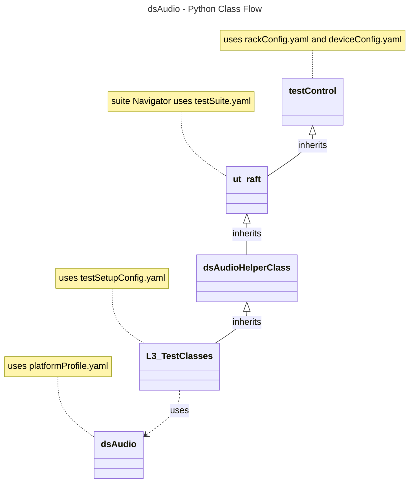

# Audio Settings L3 Low Level Test Specification and Procedure Documentation

## Table of Contents

- [Acronyms, Terms and Abbreviations](#acronyms-terms-and-abbreviations)
- [Overview](#overview)
- [References](#references)
- [Audio Streams Requirement](#audio-streams-requirement)
- [Level 3 Test Procedure](#level-3-test-cases-high-level-overview)
- [Level 3 Python Test](#level-3-python-test-cases-high-level-overview)

### Acronyms, Terms and Abbreviations

- `HAL`    - Hardware Abstraction Layer
- `API`    - Application Programming Interface
- `L2`     - Level 2 Testing
- `L3`     - Level 3 Testing
- `DS`     - Device Settings
- `ARC`    - Audio Return Channel
- `HDMI`   - High-Definition Multimedia Interface
- `LE`     - Loudness Equivalence
- `DRC`    - Dynamic Range Control
- `MI`     - Media Intelligent
- `MS12`   - MultiStream 12
- `MS11`   - MultiStream 11
- `DAP`    - Digital Audio Processing
- `PCM`    - Pulse Code Modulation
- `WAV`    - Waveform
- `DUT`    - Device Under Test
- `NA`     - Not Applicable
- `RAFT`   - Rapid Automation Framework for Testing

## Overview

This document describes the L3 Test Procedure for the Device Settings Audio module.

## References

- dsAudio HAL Interface - [dsAudio.h](https://github.com/rdkcentral/rdk-halif-device_settings/blob/4.0.0/include/dsAudio.h)
- High Level Test Specification - [ds-audio_High-Level_TestSpecification.md](./ds-audio_High-Level_TestSpecification.md)

## Audio Streams Requirement

|#|Stream Name|Description |
|-|-----------|------------|
|01|tones_string_48k_stereo.ac3|`AC3` format audio with tones (single notes) across various frequencies|
|02|Dolby_stream_supports_Dialogue_Enhancer|`AC4` format audio with speech frequencies, designed to test the dialogue enhancer feature|
|03|music_8k_stereo.ac3|`AC3` format audio with music, used to test features like the equalizer|
|04|tone_500Hz_compress_48k_stereo.ac3|`AC3` format with a 500Hz tone, which alternates between two volume levels (-25dB and -5dB), useful for compression and dynamic range testing|
|05|tone_bassrange_150Hz_48k_stereo.ac3|`AC3` format with a 150Hz tone at -10dB|
|06|Dolby_atmos_stream_supports_surround_mode|Dolby `AC4`, `EAC3_ATMOS`, and `AC4_ATMOS` formats to test surround sound mode|
|07|tones_string_48k_stereo.wav|`WAV` (`PCM`) format with tones across various frequencies|
|08|tones_string_48k_stereo.eac3|`EAC3` format with tones across various frequencies|
|09|tones_string_48k_stereo.aac|`AAC` format with tones across various frequencies|
|10|tones_string_48k_stereo.ogg|`VORBIS` format with tones across various frequencies|
|11|tones_string_48k_stereo.wma|`WMA` format with tones across various frequencies|
|12|Audio_supports_MAT_format|Dolby `MAT` format|
|13|Dolby_audio_supports_TRUEHD_format|Dolby `TRUEHD` format|
|14|DolbyDigitalPlus_atmos_audio|Dolby `EAC3_ATMOS` format|
|15|TRUEHD_atmos_audio|Dolby `TRUEHD_ATMOS` format|
|16|MAT_atmos_audio|Dolby `MAT_ATMOS` format|
|17|Dolby_atmos_audio|Dolby `AC4_ATMOS` format|
|18|Dolby_stream_supports_AVsync|Dolby stream specifically designed to test `AV` synchronization|
|19|Dolby_stream_supports_Multi-Language|`AC4` format with three language tracks (Chinese, English, and Spanish) and additional audio options, used to test multi-language audio capabilities|
|20|primary_audio_48k_2ch.ac3|`AC3` format with two-channel audio (stereo) containing dialogue|
|21|system_audio_48k_2ch.wav|`WAV` (`PCM`) format with two-channel audio containing dialogue|

## Level 3 Test Cases High Level Overview

Below are top test use-case for the audio port.

|#|Test-case|Description|HAL APIs|Source|Sink|Streams Number|
|-|---------|-----------|--------|------|----|--------------|
|1|Enable/disable audio ports|Play the predefined audio streams. Iterate through the supported audio ports, enabling or disabling them, and check if the stream is being played through each port| `dsEnableAudioPort()`|`Y`|`Y`|01|
|2|Verify the Headphone connection status|Enable the headphone port and verify the connection status by disconnecting and reconnecting the port. Additionally, confirm if the callback is triggered| `dsAudioOutIsConnected()`|`N`|`Y`|`NA`|
|3|Verify MS12 Audio Compression|Loop through the ports which supports Audio Compression and verify|`dsSetAudioCompression()`|`Y`|`Y`|01|
|4|Verify MS12 `DAP` Dialog enhancement|Loop through the ports which supports `MS12` `DAP` Capabilities and verify Dialog enhancement|`dsSetDialogEnhancement()`|`Y`|`Y`|02|
|5|Verify MS12 `DAP` Dolby Volume mode|Loop through the ports which supports `MS12` `DAP` Capabilities and verify Dolby Volume mode|`dsSetDolbyVolumeMode()`|`Y`|`Y`|01|
|6|Verify MS12 `DAP` Intelligent Equalizer|Loop through the ports which supports `MS12` `DAP` Capabilities and verify the Intelligent Equalizer|`dsSetIntelligentEqualizerMode()`|`Y`|`Y`|03|
|7|Verify MS12 `DAP` Volume leveller|Loop through the ports which supports `MS12` `DAP` Capabilities and verify Volume leveller|`dsSetVolumeLeveller()`|`Y`|`Y`|04|
|8|Verify MS12 `DAP` Bass enhancer|Loop through the ports which supports `MS12` `DAP` Capabilities and verify Bass enhancer|`dsSetBassEnhancer()`|`Y`|`Y`|05|
|9|Verify MS12 `DAP` Surround Decoder|Loop through the ports which supports `MS12` `DAP` Capabilities and verify Surround Decoder|`dsEnableSurroundDecoder()`|`Y`|`Y`|06|
|10|Verify MS12 `DAP` `DRC` Mode|Loop through the ports which supports `MS12` `DAP` Capabilities and verify `DRC` Mode|`dsSetDRCMode()`|`Y`|`Y`|04|
|11|Verify MS12 `DAP` Surround Virtualizer|Loop through the ports which supports `MS12` `DAP` Capabilities and verify Surround Virtualizer|`dsSetSurroundVirtualizer()`|`Y`|`Y`|06|
|12|Verify MS12 `DAP` `MI` Steering|Loop through the ports which supports `MS12` `DAP` Capabilities and verify `MI` Steering|`dsSetMISteering()`|`Y`|`Y`|01|
|13|Verify MS12 `DAP` Graphics Equalizer|Loop through the ports which supports `MS12` `DAP` Capabilities and verify Graphics Equalizer|`dsSetGraphicEqualizerMode()`|`Y`|`Y`|01|
|14|Verify MS12 `DAP` `LE` Config|Loop through the ports which supports `MS12` `DAP` Capabilities and verify `LE` Config|`dsEnableLEConfig()`|`Y`|`Y`|04|
|15|Test `ARC` Port|Enable the `ARC` port, retrieve the connected device's capabilities, and verify them| `dsGetSupportedARCTypes()`|`N`|`Y`|`NA`|
|16|Test `ARC` Port `SAD`|Enable the `ARC` port, set the set the `SAD` and verify| `dsAudioSetSAD()`|`N`|`Y`|`NA`|
|17|Test output mode|Play the predefined audio streams. Iterate through the audio ports which supports stereo modes, set various stereo modes and verify| `dsSetStereoMode()`|`Y`|`Y`|01, 07, 08|
|18|Test Audio Level|Play the predefined audio streams. Iterate through the audio ports, set the gain and verify| `dsSetAudioLevel()`|`N`|`Y`|01|
|19|Test Audio Gain|Play the predefined audio streams. set the gain for Speaker port and verify| `dsSetAudioGain()`|`N`|`Y`|01|
|20|Test Audio Mute|Play the predefined audio streams. Iterate through the audio ports, set the Mute, Un-mute and verify| `dsSetAudioMute()`|`Y`|`Y`|01|
|21|Test Audio Delay|Play the predefined audio streams. Iterate through the audio ports, set the delay and verify| `dsSetAudioDelay()`|`Y`|`Y`|18|
|22|Test Audio Format|Play the predefined audio streams. verify the audio format using `API`. Additionally, confirm if the callback is triggered| `dsGetAudioFormat()`|`Y`|`Y`|01, 07, 08, 09, 10, 11, 12, 13, 14, 15, 16, 17|
|23|Test Associated Audio Mixing|Play the predefined audio streams. Set the mixer levels and verify| `dsSetAssociatedAudioMixing()`, `dsSetFaderControl()`|`Y`|`Y`|19|
|24|Test Primary/Secondary Language|Play the predefined audio streams. Set the primary and secondary languages and verify| `dsSetPrimaryLanguage()`, `dsSetSecondaryLanguage()`|`Y`|`Y`|19|
|25|Test Audio Mixer Levels|Play the predefined audio streams. Set the mixer levels for primary and system audio and verify| `dsSetAudioMixerLevels()`|`N`|`Y`|20, 21|
|26|Test MS12 Audio Profiles|Play the predefined audio streams. Set the MS12 profiles and verify| `dsSetMS12AudioProfile()`|`N`|`Y`|03|

## Level 3 Python Test Cases High Level Overview

The class diagram below illustrates the flow of dsAudio L3 Python test cases:

- **testControl**
  - Test Control Module for running rack Testing. This module configures the `DUT` based on the rack configuration file provided to the test.
  - This class is defined in `RAFT` framework. For more details refer [RAFT](https://github.com/rdkcentral/python_raft/blob/1.0.0/README.md)
- **ut_raft**
  - Python based testing framework for writing engineering tests.
  - It provides common functionalities like menu navigation, configuration reader, reading user response etc.
  - For more details [ut-raft](https://github.com/rdkcentral/ut-raft).
- **dsAudio**
  - This is test helper class which communicates with the `L3` C/C++ test running on the `DUT` through menu
- **L3_TestClasses**
  - These are the L3 test case classes
  - Each class covers the each test use-case defined in [L3 Test use-cases](#level-3-test-cases-high-level-overview) table

### YAML File Inputs

- **rackConfig.yaml**
  - Identifies the rack configuration and platform used
  - References platform-specific config from `deviceConfig.yaml`
  - For more details refer [RAFT](https://github.com/rdkcentral/python_raft/blob/1.0.0/README.md) and [example_rack_config.yml](https://github.com/rdkcentral/python_raft/blob/1.0.0/examples/configs/example_rack_config.yml)

- **deviceConfig.yaml**
  - Specifies overall configuration for the platform
  - Can be overridden by:
    - Changing locally .yaml file directory
    - Using --deviceConfig command line switch
  - For more details refer [RAFT](https://github.com/rdkcentral/python_raft/blob/1.0.0/README.md) and [example_device_config.yml](https://github.com/rdkcentral/python_raft/blob/1.0.0/examples/configs/example_device_config.yml)

- **componentProfile.yaml/platformProfile.yaml**
  - Contains component-specific configurations
  - Contains platform wide configuration broken down into separate components
  - Example configuration file [dsAudio_Settings](https://github.com/rdkcentral/rdk-halif-test-device_settings/blob/3.0.0/profiles/sink/Sink_AudioSettings.yaml)

- **testSetupConfig.yaml**
  - This configuration file contains the list of requirements for tests to execute. Eg: Copying the streams, setting environment variables etc.
  - Example configuration file [dsAudio_L3_testSetup.yml](../../../host/tests/L3_TestCases/dsAudio/dsAudio_L3_testSetup.yml)

- **testSuite.yaml**
  - This configuration file contains the list of menu items for C/C++ L3 test running on `DUT`
  - Example configuration file [dsAudio_test_suite.yml](../../../host/tests/dsClasses/dsAudio_test_suite.yml)
