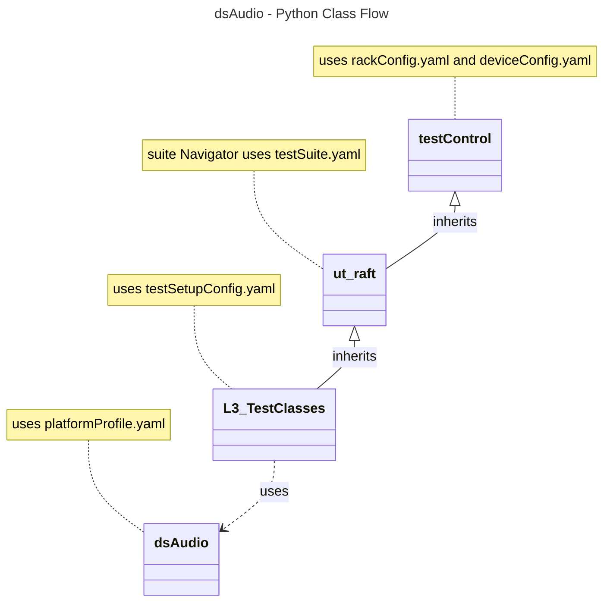

# Audio Settings L3 Low Level Test Specification and Procedure Documentation

## Table of Contents

- [Acronyms, Terms and Abbreviations](#acronyms-terms-and-abbreviations)
- [Overview](#overview)
- [References](#references)
- [Audio Streams Requirement](#audio-streams-requirement)
- [Level 3 Test Procedure](#level-3-test-cases-high-level-overview)
- [Level 3 Python Test](#level-3-python-test-cases-high-level-overview)

### Acronyms, Terms and Abbreviations

- `HAL`    - Hardware Abstraction Layer
- `API`    - Application Programming Interface
- `L2`     - Level 2 Testing
- `L3`     - Level 3 Testing
- `DS`     - Device Settings
- `ARC`    - Audio Return Channel
- `HDMI`   - High-Definition Multimedia Interface
- `LE`     - Loudness Equivalence
- `DRC`    - Dynamic Range Control
- `MI`     - Media Intelligent
- `MS12`   - MultiStream 12
- `MS11`   - MultiStream 11
- `DAP`    - Digital Audio Processing
- `PCM`    - Pulse Code Modulation
- `WAV`    - Waveform
- `DUT`    - Device Under Test
- `NA`     - Not Applicable
- `RAFT`   - Rapid Automation Framework for Testing

## Overview

This document describes the L3 Test Procedure for the Device Settings Audio module.

## References

- dsAudio HAL Interface - [dsAudio.h](https://github.com/rdkcentral/rdk-halif-device_settings/blob/4.0.0/include/dsAudio.h)
- High Level Test Specification - [ds-audio_High-Level_TestSpecification.md](./ds-audio_High-Level_TestSpecification.md)

## Audio Streams Requirement

|#|Stream|Description|
|-|------|-----------|
|001|400Hz_sine_tone|File: `WAV`, Format: `PCM`, SampleRate: 48000, Channels: 2|
|002|AAC_stream|File: `mp4`, Format: `AAC`, SampleRate: 48000, Channels: 2|
|003|Vorbis_stream|File: `ogg`, Format: `vorbis`, SampleRate: 48000, Channels: 2|
|004|wma_stream|File: `wma`, Format: `wma`, SampleRate: 48000, Channels: 2|
|005|Dolby_Streams|`TBD`|
|006|Dolby_MS12_Streams|`TBD`|

## Level 3 Test Cases High Level Overview

Below are top test use-case for the audio port.

|#|Test-case|Description|HAL APIs|Source|Sink|Streams Number|
|-|---------|-----------|--------|------|----|--------------|
|1|Enable/disable audio ports|Play the predefined audio streams. Iterate through the supported audio ports, enabling or disabling them, and check if the stream is being played through each port| `dsEnableAudioPort()`|`Y`|`Y`|001|
|2|Verify the Headphone connection status|Enable the headphone port and verify the connection status by disconnecting and reconnecting the port. Additionally, confirm if the callback is triggered| `dsAudioOutIsConnected()`|`N`|`Y`|`NA`|
|3|Verify MS12 `DAP` Capabilities|Loop through the ports which supports `MS12` `DAP` Capabilities and verify the `DAP` features: Audio compression, Dialog enhancement, Dolby Volume mode, Intelligent Equalizer, Volume leveller, Bass enhancer, Surround Decoder, `DRC` Mode, Surround Virtualizer, `MI` Steering, Graphics Equalizer, `LE` Config| `dsSetAudioCompression()`, `dsSetDialogEnhancement()`, `dsSetDolbyVolumeMode()`, `dsSetIntelligentEqualizerMode()`, `dsSetVolumeLeveller()`, `dsSetBassEnhancer()`, `dsEnableSurroundDecoder()`, `dsSetDRCMode()`, `dsSetSurroundVirtualizer()`, `dsSetMISteering()`, `dsSetGraphicEqualizerMode()`, `dsEnableLEConfig()`|`Y`|`Y`|006|
|4|Test `ARC` Port|Enable the `ARC` port, retrieve the connected device's capabilities, and verify them| `dsGetSupportedARCTypes()`|`N`|`Y`|`NA`|
|5|Test `ARC` Port `SAD`|Enable the `ARC` port, set the set the `SAD` and verify| `dsAudioSetSAD()`|`N`|`Y`|`NA`|
|6|Test output mode|Play the predefined audio streams. Iterate through the audio ports which supports stereo modes, set various stereo modes and verify| `dsSetStereoMode()`|`Y`|`Y`|001, 002, 005|
|7|Test Audio Gain|Play the predefined audio streams. Iterate through the audio ports, set the gain and verify| `dsSetAudioGain()`, `dsSetAudioLevel()`|`N`|`Y`|001, 005|
|8|Test Audio Mute|Play the predefined audio streams. Iterate through the audio ports, set the Mute, Un-mute and verify| `dsSetAudioMute()`|`Y`|`Y`|001, 005|
|9|Test Audio Delay|Play the predefined audio streams. Iterate through the audio ports, set the delay and verify| `dsSetAudioDelay()`|`Y`|`Y`|001, 005|
|10|Test Audio Format|Play the predefined audio streams. verify the audio format using `API`. Additionally, confirm if the callback is triggered| `dsGetAudioFormat()`|`Y`|`Y`|001, 002, 003, 004, 005|
|11|Test Associated Audio Mixing|Play the predefined audio streams. Set the mixer levels and verify| `dsSetAssociatedAudioMixing()`, `dsSetFaderControl()`|`Y`|`Y`|005|
|12|Test Primary/Secondary Language|Play the predefined audio streams. Set the primary and secondary languages and verify| `dsSetPrimaryLanguage()`, `dsSetSecondaryLanguage()`|`Y`|`Y`|005|
|13|Test Audio Mixer Levels|Play the predefined audio streams. Set the mixer levels for primary and system audio and verify| `dsSetAudioMixerLevels()`|`N`|`Y`|005|

## Level 3 Python Test Cases High Level Overview

The class diagram below illustrates the flow of dsAudio L3 Python test cases:

- **testControl**
  - Test Control Module for running rack Testing. This module configures the `DUT` based on the rack configuration file provided to the test.
  - This class is defined in `RAFT` framework. For more details refer [RAFT](https://github.com/rdkcentral/python_raft/blob/1.0.0/README.md)
- **ut_raft**
  - Python based testing framework for writing engineering tests.
  - It provides common functionalities like menu navigation, configuration reader, reading user response etc.
  - For more details [ut-raft](https://github.com/rdkcentral/ut-raft).
- **dsAudio**
  - This is test helper class which communicates with the `L3` C/C++ test running on the `DUT` through menu
- **L3_TestClasses**
  - These are the L3 test case classes
  - Each class covers the each test use-case defined in [L3 Test use-cases](#level-3-test-cases-high-level-overview) table

### YAML File Inputs

- **rackConfig.yaml**
  - Identifies the rack configuration and platform used
  - References platform-specific config from `deviceConfig.yaml`
  - For more details refer [RAFT](https://github.com/rdkcentral/python_raft/blob/1.0.0/README.md) and [example_rack_config.yml](https://github.com/rdkcentral/python_raft/blob/1.0.0/examples/configs/example_rack_config.yml)

- **deviceConfig.yaml**
  - Specifies overall configuration for the platform
  - Can be overridden by:
    - Changing locally .yaml file directory
    - Using --deviceConfig command line switch
  - For more details refer [RAFT](https://github.com/rdkcentral/python_raft/blob/1.0.0/README.md) and [example_device_config.yml](https://github.com/rdkcentral/python_raft/blob/1.0.0/examples/configs/example_device_config.yml)

- **componentProfile.yaml/platformProfile.yaml**
  - Contains component-specific configurations
  - Contains platform wide configuration broken down into separate components
  - Example configuration file [dsAudio_Settings](https://github.com/rdkcentral/rdk-halif-test-device_settings/blob/3.0.0/profiles/sink/Sink_AudioSettings.yaml)

- **testSetupConfig.yaml**
  - This configuration file contains the list of requirements for tests to execute. Eg: Copying the streams, setting environment variables etc.
  - Example configuration file [dsAudio_L3_testSetup.yml](../../../host/tests/dsAudio_L3_Tests/dsAudio_L3_testSetup.yml)

- **testSuite.yaml**
  - This configuration file contains the list of menu items for C/C++ L3 test running on `DUT`
  - Example configuration file [dsAudio_test_suite.yml](../../../host/tests/dsClasses/dsAudio_test_suite.yml)
