# DSAUDIO L2 Low Level Test Specification and Procedure Documentation

## Table of Contents

- [DSAUDIO L2 Low Level Test Specification and Procedure Documentation](#dsaudio-l2-low-level-test-specification-and-procedure-documentation)

  - [Table of Contents](#table-of-contents)
  - [Overview](#overview)
    - [Acronyms, Terms and Abbreviations](#acronyms-terms-and-abbreviations)
    - [Definitions](#definitions)
    - [References](#references)
  - [Level 2 Test Procedure](#level-2-test-procedure)

## Overview

This document describes the level 2 testing suite for the DSAUDIO module.

### Acronyms, Terms and Abbreviations

- `HAL` \- Hardware Abstraction Layer, may include some common components
- `UT`  \- Unit Test(s)
- `OEM`  \- Original Equipment Manufacture
- `SoC`  \- System on a Chip

### Definitions

  - `ut-core` \- Common Testing Framework <https://github.com/rdkcentral/ut-core>, which wraps a open-source framework that can be expanded to the requirements for future framework.

### References
- `High Level Test Specification` - [audiosettings_tests.md](audiosettings_tests.md)

## Level 2 Test Procedure

The following functions are expecting to test the module operates correctly.

### Test 1

|Title|Details|
|--|--|
|Function Name|`test_l2_dsAudio_EnableDisableAndVerifyAudioPortStatus_sink`|
|Description|Loop through supported audio ports, enable/disable audio ports and retrieve status for verification|
|Test Group|Module : 02|
|Test Case ID|001|
|Priority|High|

**Pre-Conditions :**
None

**Dependencies :**
None

**User Interaction :**
If user chose to run the test in interactive mode, then the test case has to be selected via console.

#### Test Procedure :

| Variation / Steps | Description | Test Data | Expected Result | Notes|
| -- | --------- | ---------- | -------------- | ----- |
| 01 | Initialize audio port using dsAudioPortInit | None | dsERR_NONE | Should be successful |
| 02 | Loop through supported audio ports and get audio port using dsGetAudioPort | type = dsAUDIOPORT_TYPE_ID_LR to dsAUDIOPORT_TYPE_MAX | dsERR_NONE | Should be successful |
| 03 | Enable audio port using dsEnableAudioPort | handle = obtained from dsGetAudioPort, enabled = true | dsERR_NONE | Should be successful |
| 04 | Check if audio port is enabled using dsIsAudioPortEnabled | handle = obtained from dsGetAudioPort | dsERR_NONE, enabled = true | Should be successful |
| 05 | Disable audio port using dsEnableAudioPort | handle = obtained from dsGetAudioPort, enabled = false | dsERR_NONE | Should be successful |
| 06 | Check if audio port is disabled using dsIsAudioPortEnabled | handle = obtained from dsGetAudioPort | dsERR_NONE, enabled = false | Should be successful |
| 07 | Terminate audio port using dsAudioPortTerm | None | dsERR_NONE | Should be successful |


### Test 2

|Title|Details|
|--|--|
|Function Name|`test_l2_dsAudio_EnableDisableAndVerifyAudioPortStatus_source`|
|Description|Loop through supported audio ports, enable/disable audio ports and retrieve status for verification|
|Test Group|Module : 02|
|Test Case ID|002|
|Priority|High|

**Pre-Conditions :**
None

**Dependencies :**
None

**User Interaction :**
If user chose to run the test in interactive mode, then the test case has to be selected via console.

#### Test Procedure :

| Variation / Steps | Description | Test Data | Expected Result | Notes|
| -- | --------- | ---------- | -------------- | ----- |
| 01 | Initialize audio port using dsAudioPortInit | None | dsERR_NONE | Should be successful |
| 02 | Loop through all audio port types and get audio port using dsGetAudioPort | type = 0 to dsAUDIOPORT_TYPE_MAX, index = 0, handle = valid pointer | dsERR_NONE | Should be successful |
| 03 | Enable the retrieved audio port using dsEnableAudioPort | handle = retrieved handle, enabled = true | dsERR_NONE | Should be successful |
| 04 | Check if the audio port is enabled using dsIsAudioPortEnabled | handle = retrieved handle, enabled = valid pointer | dsERR_NONE, enabled = true | Should be successful |
| 05 | Disable the retrieved audio port using dsEnableAudioPort | handle = retrieved handle, enabled = false | dsERR_NONE | Should be successful |
| 06 | Check if the audio port is disabled using dsIsAudioPortEnabled | handle = retrieved handle, enabled = valid pointer | dsERR_NONE, enabled = false | Should be successful |
| 07 | Terminate audio port using dsAudioPortTerm | None | dsERR_NONE | Should be successful |


### Test 3

|Title|Details|
|--|--|
|Function Name|`test_l2_dsAudio_CheckHeadphoneConnectionStatus_sink`|
|Description|Loop through supported audio ports, get the handle for dsAUDIOPORT_TYPE_HEADPHONE port, check the connection status. Connection status should be false|
|Test Group|Module : 02|
|Test Case ID|003|
|Priority|High|

**Pre-Conditions :**
None

**Dependencies :**
None

**User Interaction :**
If user chose to run the test in interactive mode, then the test case has to be selected via console.

#### Test Procedure :

| Variation / Steps | Description | Test Data | Expected Result | Notes|
| -- | --------- | ---------- | -------------- | ----- |
| 01 | Initialize the audio port using dsAudioPortInit | None | dsERR_NONE | Should be successful |
| 02 | Loop through supported audio ports and get the handle for each port using dsGetAudioPort | type = dsAUDIOPORT_TYPE_ID_LR to dsAUDIOPORT_TYPE_MAX, index = 0 | dsERR_NONE | Should be successful |
| 03 | If the port type is dsAUDIOPORT_TYPE_HEADPHONE, check the connection status using dsAudioOutIsConnected | handle = obtained from dsGetAudioPort | dsERR_NONE | Should be successful |
| 04 | Assert that the connection status is false | isConnected = false | false | Should be successful |
| 05 | Terminate the audio port using dsAudioPortTerm | None | dsERR_NONE | Should be successful |


### Test 4

|Title|Details|
|--|--|
|Function Name|`test_l2_dsAudio_RetrieveAndVerifyMS12Capabilities_sink`|
|Description|Retrieve the supported MS12 DAP capabilities of the device and verify them with the configuration YAML file. If it is a sink device, retrieve the value from the 'Sink_AudioSettings.yaml' file using the path 'Ports/1/MS12_Capabilities' supported by the SPEAKER port. If it is a source device, retrieve the value from the 'Source_AudioSettings.yaml' file using the path 'Ports/2/MS12_Capabilities' supported by the HDMI port.|
|Test Group|Module : 02|
|Test Case ID|004|
|Priority|High|

**Pre-Conditions :**
None

**Dependencies :**
None

**User Interaction :**
If user chose to run the test in interactive mode, then the test case has to be selected via console.

#### Test Procedure :

| Variation / Steps | Description | Test Data | Expected Result | Notes|
| -- | --------- | ---------- | -------------- | ----- |
| 01 | Initialize the audio port using dsAudioPortInit | None | dsERR_NONE | Should be successful |
| 02 | Get the audio port using dsGetAudioPort | type = dsAUDIOPORT_TYPE_SPEAKER, index = 1 | dsERR_NONE | Should be successful |
| 03 | Get the MS12 capabilities using dsGetMS12Capabilities | handle = obtained from dsGetAudioPort | dsERR_NONE | Should be successful |
| 04 | Compare MS12 capabilities from API and Sink_AudioSettings.yaml file | | Match | Should be successful |
| 05 | Terminate the audio port using dsAudioPortTerm | None | dsERR_NONE | Should be successful |


### Test 5

|Title|Details|
|--|--|
|Function Name|`test_l2_dsAudio_RetrieveAndVerifyMS12Capabilities_source`|
|Description|Retrieve the supported MS12 DAP capabilities of the device and verify them with the configuration YAML file. If it is a sink device, retrieve the value from the 'Sink_AudioSettings.yaml' file using the path 'Ports/1/MS12_Capabilities' supported by the SPEAKER port. If it is a source device, retrieve the value from the 'Source_AudioSettings.yaml' file using the path 'Ports/2/MS12_Capabilities' supported by the HDMI port.|
|Test Group|Module : 02|
|Test Case ID|005|
|Priority|High|

**Pre-Conditions :**
None

**Dependencies :**
None

**User Interaction :**
If user chose to run the test in interactive mode, then the test case has to be selected via console.

#### Test Procedure :

| Variation / Steps | Description | Test Data | Expected Result | Notes|
| -- | --------- | ---------- | -------------- | ----- |
| 01 | Initialize the audio port using dsAudioPortInit | None | dsERR_NONE | Should be successful |
| 02 | Get the audio port handle using dsGetAudioPort | type = dsAUDIOPORT_TYPE_HDMI, index = 0 | dsERR_NONE | Should be successful |
| 03 | Retrieve the MS12 capabilities of the device using dsGetMS12Capabilities | handle = obtained from dsGetAudioPort | dsERR_NONE | Should be successful |
| 04 | Verify the retrieved capabilities with the configuration file | capabilities = obtained from dsGetMS12Capabilities | dsERR_NONE | Should be successful |
| 05 | Terminate the audio port using dsAudioPortTerm | None | dsERR_NONE | Should be successful |


### Test 6

|Title|Details|
|--|--|
|Function Name|`test_l2_dsAudio_SetAndGetAudioCompression_sink`|
|Description|Loop through supported audio ports, set various compression levels for supported ports and retrieve compression levels for verification|
|Test Group|Module : 02|
|Test Case ID|006|
|Priority|High|

**Pre-Conditions :**
None

**Dependencies :**
None

**User Interaction :**
If user chose to run the test in interactive mode, then the test case has to be selected via console.

#### Test Procedure :

| Variation / Steps | Description | Test Data | Expected Result | Notes|
| -- | --------- | ---------- | -------------- | ----- |
| 01 | Initialize the audio port using dsAudioPortInit | None | dsERR_NONE | Should be successful |
| 02 | Loop through supported audio ports using dsGetAudioPort | type = dsAUDIOPORT_TYPE_ID_LR to dsAUDIOPORT_TYPE_MAX, index = 0 | dsERR_NONE | Should be successful |
| 03 | For each port, set various compression levels using dsSetAudioCompression | handle = obtained from dsGetAudioPort, compression = 0 to 10 | dsERR_NONE | Should be successful |
| 04 | Retrieve the set compression level using dsGetAudioCompression | handle = obtained from dsGetAudioPort | dsERR_NONE | Should be successful |
| 05 | Verify the set and retrieved compression levels are same | compression = set value, getCompression = retrieved value | compression should be equal to getCompression | Should be successful |
| 06 | Terminate the audio port using dsAudioPortTerm | None | dsERR_NONE | Should be successful |


### Test 7

|Title|Details|
|--|--|
|Function Name|`test_l2_dsAudio_SetAndGetAudioCompression_source`|
|Description|Loop through supported audio ports, set various compression levels for supported ports and retrieve compression levels for verification|
|Test Group|Module : 02|
|Test Case ID|007|
|Priority|High|

**Pre-Conditions :**
None

**Dependencies :**
None

**User Interaction :**
If user chose to run the test in interactive mode, then the test case has to be selected via console.

#### Test Procedure :

| Variation / Steps | Description | Test Data | Expected Result | Notes|
| -- | --------- | ---------- | -------------- | ----- |
| 01 | Initialize the audio port using dsAudioPortInit | None | dsERR_NONE | Should be successful |
| 02 | Loop through supported audio ports using dsGetAudioPort | portType = dsAUDIOPORT_TYPE_ID_LR to dsAUDIOPORT_TYPE_MAX, index = 0 | dsERR_NONE | Should be successful |
| 03 | Set various compression levels for supported ports using dsSetAudioCompression | handle = valid handle, compression = 0 to 10 | dsERR_NONE | Should be successful |
| 04 | Retrieve compression levels for verification using dsGetAudioCompression | handle = valid handle | dsERR_NONE | Should be successful |
| 05 | Assert that the set and retrieved compression levels are equal | compression = set compression, getCompression = retrieved compression | compression should be equal to getCompression | Should be successful |
| 06 | Terminate the audio port using dsAudioPortTerm | None | dsERR_NONE | Should be successful |


### Test 8

|Title|Details|
|--|--|
|Function Name|`test_l2_dsAudio_SetAndGetDialogEnhancement_sink`|
|Description|Loop through supported audio ports, Set Dialog Enhancement for supported ports and retrieve Dialog Enhancement for verification|
|Test Group|Module : 02|
|Test Case ID|008|
|Priority|High|

**Pre-Conditions :**
None

**Dependencies :**
None

**User Interaction :**
If user chose to run the test in interactive mode, then the test case has to be selected via console.

#### Test Procedure :

| Variation / Steps | Description | Test Data | Expected Result | Notes|
| -- | --------- | ---------- | -------------- | ----- |
| 01 | Initialize the audio port using dsAudioPortInit() | None | dsERR_NONE | Should be successful |
| 02 | Loop through supported audio ports and get the audio port using dsGetAudioPort() | type = dsAUDIOPORT_TYPE_ID_LR to dsAUDIOPORT_TYPE_MAX | dsERR_NONE | Should be successful |
| 03 | For each audio port, set the Dialog Enhancement level using dsSetDialogEnhancement() | handle = obtained from dsGetAudioPort(), level = 0 to 16 | dsERR_NONE | Should be successful |
| 04 | For each audio port, get the Dialog Enhancement level using dsGetDialogEnhancement() | handle = obtained from dsGetAudioPort() | dsERR_NONE | Should be successful |
| 05 | Verify the set and get Dialog Enhancement levels are same | getLevel = obtained from dsGetDialogEnhancement(), level = set in dsSetDialogEnhancement() | getLevel should be equal to level | Should be successful |
| 06 | Terminate the audio port using dsAudioPortTerm() | None | dsERR_NONE | Should be successful |


### Test 9

|Title|Details|
|--|--|
|Function Name|`test_l2_dsAudio_SetAndGetDialogEnhancement_source`|
|Description|Loop through supported audio ports, Set Dialog Enhancement for supported ports and retrieve Dialog Enhancement for verification|
|Test Group|Module : 02|
|Test Case ID|009|
|Priority|High|

**Pre-Conditions :**
None

**Dependencies :**
None

**User Interaction :**
If user chose to run the test in interactive mode, then the test case has to be selected via console.

#### Test Procedure :

| Variation / Steps | Description | Test Data | Expected Result | Notes|
| -- | --------- | ---------- | -------------- | ----- |
| 01 | Initialize the audio port using dsAudioPortInit | None | dsERR_NONE | Should be successful |
| 02 | Loop through supported audio ports and get the audio port using dsGetAudioPort | type = dsAUDIOPORT_TYPE_ID_LR to dsAUDIOPORT_TYPE_MAX, index = 0 to 1 | dsERR_NONE | Should be successful |
| 03 | For each audio port, set the Dialog Enhancement level using dsSetDialogEnhancement | handle = valid handle, level = 0 to 16 | dsERR_NONE | Should be successful |
| 04 | For each audio port, get the Dialog Enhancement level using dsGetDialogEnhancement | handle = valid handle | dsERR_NONE | Should be successful |
| 05 | Verify the set and get Dialog Enhancement levels are same | level = getLevel | level | Should be successful |
| 06 | Terminate the audio port using dsAudioPortTerm | None | dsERR_NONE | Should be successful |


### Test 10

|Title|Details|
|--|--|
|Function Name|`test_l2_dsAudio_SetAndGetDolbyVolumeMode_sink`|
|Description|Loop through supported audio ports, Set DOLBY Volume Mode for supported ports and retrieve DOLBY Volume Mode for verification|
|Test Group|Module : 02|
|Test Case ID|10|
|Priority|High|

**Pre-Conditions :**
None

**Dependencies :**
None

**User Interaction :**
If user chose to run the test in interactive mode, then the test case has to be selected via console.

#### Test Procedure :

| Variation / Steps | Description | Test Data | Expected Result | Notes|
| -- | --------- | ---------- | -------------- | ----- |
| 01 | Initialize the audio port using dsAudioPortInit | None | dsERR_NONE | Should be successful |
| 02 | Loop through supported audio ports and get the audio port using dsGetAudioPort | portType = dsAUDIOPORT_TYPE_ID_LR to dsAUDIOPORT_TYPE_MAX, index = 0 | dsERR_NONE | Should be successful |
| 03 | Set DOLBY Volume Mode for the retrieved audio port using dsSetDolbyVolumeMode | handle = retrieved handle, mode = true | dsERR_NONE | Should be successful |
| 04 | Retrieve DOLBY Volume Mode for the set audio port using dsGetDolbyVolumeMode | handle = retrieved handle | dsERR_NONE and mode = true | Should be successful |
| 05 | Set DOLBY Volume Mode for the retrieved audio port using dsSetDolbyVolumeMode | handle = retrieved handle, mode = false | dsERR_NONE | Should be successful |
| 06 | Retrieve DOLBY Volume Mode for the set audio port using dsGetDolbyVolumeMode | handle = retrieved handle | dsERR_NONE and mode = false | Should be successful |
| 07 | Terminate the audio port using dsAudioPortTerm | None | dsERR_NONE | Should be successful |


### Test 11

|Title|Details|
|--|--|
|Function Name|`test_l2_dsAudio_SetAndGetDolbyVolumeMode_source`|
|Description|Loop through supported audio ports, Set DOLBY Volume Mode for supported ports and retrieve DOLBY Volume Mode for verification|
|Test Group|Module : 02|
|Test Case ID|011|
|Priority|High|

**Pre-Conditions :**
None

**Dependencies :**
None

**User Interaction :**
If user chose to run the test in interactive mode, then the test case has to be selected via console.

#### Test Procedure :

| Variation / Steps | Description | Test Data | Expected Result | Notes|
| -- | --------- | ---------- | -------------- | ----- |
| 01 | Initialize the audio port using dsAudioPortInit | None | dsERR_NONE | Should be successful |
| 02 | Loop through all audio port types , get the audio port using dsGetAudioPort | type = dsAUDIOPORT_TYPE_ID_LR to dsAUDIOPORT_TYPE_MAX | dsERR_NONE | Should be successful |
| 03 | Set the Dolby Volume Mode to true using dsSetDolbyVolumeMode | handle = obtained handle, mode = true | dsERR_NONE | Should be successful |
| 04 | Get the Dolby Volume Mode using dsGetDolbyVolumeMode | handle = obtained handle | dsERR_NONE, mode = true | Should be successful |
| 05 | Set the Dolby Volume Mode to false using dsSetDolbyVolumeMode | handle = obtained handle, mode = false | dsERR_NONE | Should be successful |
| 06 | Get the Dolby Volume Mode using dsGetDolbyVolumeMode | handle = obtained handle | dsERR_NONE, mode = false | Should be successful |
| 07 | Terminate the audio port using dsAudioPortTerm | None | dsERR_NONE | Should be successful |


### Test 12

|Title|Details|
|--|--|
|Function Name|`test_l2_dsAudio_SetAndGetIntelligentEqualizerMode_sink`|
|Description|Loop through supported audio ports, Set Intelligent Equalizer Mode for supported ports and retrieve Intelligent Equalizer Mode for verification|
|Test Group|Module : 02|
|Test Case ID|12|
|Priority|High|

**Pre-Conditions :**
None

**Dependencies :**
None

**User Interaction :**
If user chose to run the test in interactive mode, then the test case has to be selected via console.

#### Test Procedure :

| Variation / Steps | Description | Test Data | Expected Result | Notes|
| -- | --------- | ---------- | -------------- | ----- |
| 01 | Initialize the audio port using dsAudioPortInit | None | dsERR_NONE | Should be successful |
| 02 | Loop through supported audio ports using dsGetAudioPort | type = dsAUDIOPORT_TYPE_ID_LR to dsAUDIOPORT_TYPE_MAX, index = 0 | dsERR_NONE | Should be successful |
| 03 | Set Intelligent Equalizer Mode for each supported port using dsSetIntelligentEqualizerMode | handle = obtained from dsGetAudioPort, mode = 0 to 6 | dsERR_NONE | Should be successful |
| 04 | Retrieve Intelligent Equalizer Mode for each supported port using dsGetIntelligentEqualizerMode | handle = obtained from dsGetAudioPort | dsERR_NONE | Should be successful |
| 05 | Verify the set and retrieved Intelligent Equalizer Mode are same | mode = set mode, getMode = retrieved mode | mode should be equal to getMode | Should be successful |
| 06 | Terminate the audio port using dsAudioPortTerm | None | dsERR_NONE | Should be successful |


### Test 13

|Title|Details|
|--|--|
|Function Name|`test_l2_dsAudio_SetAndGetIntelligentEqualizerMode_source`|
|Description|Loop through supported audio ports, Set Intelligent Equalizer Mode for supported ports and retrieve Intelligent Equalizer Mode for verification|
|Test Group|Module : 02|
|Test Case ID|013|
|Priority|High|

**Pre-Conditions :**
None

**Dependencies :**
None

**User Interaction :**
If user chose to run the test in interactive mode, then the test case has to be selected via console.

#### Test Procedure :

| Variation / Steps | Description | Test Data | Expected Result | Notes|
| -- | --------- | ---------- | -------------- | ----- |
| 01 | Initialize the audio port using dsAudioPortInit | None | dsERR_NONE | Should be successful |
| 02 | Loop through supported audio ports using dsGetAudioPort | type = dsAUDIOPORT_TYPE_ID_LR to dsAUDIOPORT_TYPE_MAX, index = 0 | dsERR_NONE | Should be successful |
| 03 | Set Intelligent Equalizer Mode for supported ports using dsSetIntelligentEqualizerMode | handle = obtained from dsGetAudioPort, mode = 0 to 6 | dsERR_NONE | Should be successful |
| 04 | Retrieve Intelligent Equalizer Mode for verification using dsGetIntelligentEqualizerMode | handle = obtained from dsGetAudioPort | dsERR_NONE | Should be successful |
| 05 | Assert that the set mode and retrieved mode are equal | mode = set mode, getMode = retrieved mode | mode should be equal to getMode | Should be successful |
| 06 | Terminate the audio port using dsAudioPortTerm | None | dsERR_NONE | Should be successful |


### Test 14

|Title|Details|
|--|--|
|Function Name|`test_l2_dsAudio_SetAndGetVolumeLeveller_sink`|
|Description|Loop through supported audio ports, set Volume leveller for supported ports and retrieve Volume leveller for verification|
|Test Group|Module : 02|
|Test Case ID|14|
|Priority|High|

**Pre-Conditions :**
None

**Dependencies :**
None

**User Interaction :**
If user chose to run the test in interactive mode, then the test case has to be selected via console.

#### Test Procedure :

| Variation / Steps | Description | Test Data | Expected Result | Notes|
| -- | --------- | ---------- | -------------- | ----- |
| 01 | Initialize the audio port using dsAudioPortInit | None | dsERR_NONE | Should be successful |
| 02 | Loop through supported audio ports and get the audio port using dsGetAudioPort | portType = dsAUDIOPORT_TYPE_ID_LR to dsAUDIOPORT_TYPE_MAX, index = 0 | dsERR_NONE | Should be successful |
| 03 | Set the volume leveller for the retrieved audio port using dsSetVolumeLeveller | handle = retrieved handle, volLeveller = {mode: 1, level: 5} | dsERR_NONE | Should be successful |
| 04 | Retrieve the volume leveller for the same audio port using dsGetVolumeLeveller | handle = retrieved handle | dsERR_NONE | Should be successful |
| 05 | Verify the set and retrieved volume leveller are same | volLevellerSet.mode = volLevellerGet.mode, volLevellerSet.level = volLevellerGet.level | volLevellerSet.mode, volLevellerSet.level | Should be successful |
| 06 | Terminate the audio port using dsAudioPortTerm | None | dsERR_NONE | Should be successful |





```mermaid
graph TB
    A[dsAudioPortInit] -->|dsERR_NONE| B{Loop through audio ports <br> call dsGetAudioPort}
    A -->|Failure| A1[Test case fail]
    B -->|dsERR_NONE and valid handle| C[dsSetVolumeLeveller]
    C -->|dsERR_NONE| D[dsGetVolumeLeveller]
    D -->|dsERR_NONE and same structure| B
    B -->|End of loop| E[dsAudioPortTerm]
    E -->|dsERR_NONE| F[Test case success]
    E -->|Failure| E1[Test case fail]
```

### Test 15

|Title|Details|
|--|--|
|Function Name|`test_l2_dsAudio_SetAndGetVolumeLeveller_source`|
|Description|Loop through supported audio ports, Set Volume leveller for supported ports and retrieve Volume leveller for verification|
|Test Group|Module : 02|
|Test Case ID|015|
|Priority|High|

**Pre-Conditions :**
None

**Dependencies :**
None

**User Interaction :**
If user chose to run the test in interactive mode, then the test case has to be selected via console.

#### Test Procedure :

| Variation / Steps | Description | Test Data | Expected Result | Notes|
| -- | --------- | ---------- | -------------- | ----- |
| 01 | Initialize the audio port using dsAudioPortInit | None | dsERR_NONE | Should be successful |
| 02 | Loop through supported audio ports and get the audio port using dsGetAudioPort | type = dsAUDIOPORT_TYPE_ID_LR to dsAUDIOPORT_TYPE_MAX | dsERR_NONE | Should be successful |
| 03 | Set Volume leveller for the retrieved audio port using dsSetVolumeLeveller | handle = retrieved handle, volLevellerSet.mode = 1, volLevellerSet.level = 5| dsERR_NONE | Should be successful |
| 04 | Retrieve Volume leveller for the same audio port using dsGetVolumeLeveller | handle = retrieved handle | dsERR_NONE | Should be successful |
| 05 | Verify the set and retrieved Volume leveller are same | volLevellerGet.mode = volLevellerSet.mode, volLevellerGet.level = volLevellerSet.level | volLevellerSet.mode, volLevellerSet.level | Should be successful |
| 06 | Terminate the audio port using dsAudioPortTerm | None | dsERR_NONE | Should be successful |


### Test 16

|Title|Details|
|--|--|
|Function Name|`test_l2_dsAudio_SetAndGetBassEnhancer_sink`|
|Description|Loop through supported audio ports, Set Bass Enhancer for supported ports and retrieve Bass Enhancer for verification|
|Test Group|Module : 02|
|Test Case ID|16|
|Priority|High|

**Pre-Conditions :**
None

**Dependencies :**
None

**User Interaction :**
If user chose to run the test in interactive mode, then the test case has to be selected via console.

#### Test Procedure :

| Variation / Steps | Description | Test Data | Expected Result | Notes|
| -- | --------- | ---------- | -------------- | ----- |
| 01 | Initialize the audio port using dsAudioPortInit() | None | dsERR_NONE | Should be successful |
| 02 | Loop through all supported audio ports and get the audio port using dsGetAudioPort() | type = 0 to dsAUDIOPORT_TYPE_MAX, index = 0 | dsERR_NONE | Should be successful |
| 03 | Set Bass Enhancer for the retrieved audio port using dsSetBassEnhancer() | handle = retrieved handle, boost = 0 to 100 | dsERR_NONE | Should be successful |
| 04 | Retrieve Bass Enhancer for the same audio port using dsGetBassEnhancer() | handle = retrieved handle | dsERR_NONE | Should be successful |
| 05 | Verify the set and retrieved Bass Enhancer values are same | setBoost = retrieved boost | setBoost | Should be successful |
| 06 | Terminate the audio port using dsAudioPortTerm() | None | dsERR_NONE | Should be successful |


### Test 17

|Title|Details|
|--|--|
|Function Name|`test_l2_dsAudio_SetAndGetBassEnhancer_source`|
|Description|Loop through supported audio ports, Set Bass Enhancer for supported ports and retrieve Bass Enhancer for verification|
|Test Group|Module : 02|
|Test Case ID|17|
|Priority|High|

**Pre-Conditions :**
None

**Dependencies :**
None

**User Interaction :**
If user chose to run the test in interactive mode, then the test case has to be selected via console.

#### Test Procedure :

| Variation / Steps | Description | Test Data | Expected Result | Notes|
| -- | --------- | ---------- | -------------- | ----- |
| 01 | Initialize the audio port using dsAudioPortInit | None | dsERR_NONE | Should be successful |
| 02 | Loop through supported audio ports and get the audio port using dsGetAudioPort | type = dsAUDIOPORT_TYPE_ID_LR to dsAUDIOPORT_TYPE_MAX, index = 0 to MAX_PORTS | dsERR_NONE | Should be successful |
| 03 | Set Bass Enhancer for the retrieved audio port using dsSetBassEnhancer | handle = retrieved handle, boost = 0 to 100 | dsERR_NONE | Should be successful |
| 04 | Retrieve Bass Enhancer for the set audio port using dsGetBassEnhancer | handle = retrieved handle | dsERR_NONE | Should be successful |
| 05 | Verify the set and retrieved Bass Enhancer values are equal | setBoost = retrieved boost | setBoost | Should be successful |
| 06 | Terminate the audio port using dsAudioPortTerm | None | dsERR_NONE | Should be successful |


### Test 18

|Title|Details|
|--|--|
|Function Name|`test_l2_dsAudio_EnableAndVerifySurroundDecoder_sink`|
|Description|Loop through supported audio ports, Enable Surround Decoder for supported ports and retrieve Surround Decoder status for verification|
|Test Group|Module : 02|
|Test Case ID|018|
|Priority|High|

**Pre-Conditions :**
None

**Dependencies :**
None

**User Interaction :**
If user chose to run the test in interactive mode, then the test case has to be selected via console.

#### Test Procedure :

| Variation / Steps | Description | Test Data | Expected Result | Notes|
| -- | --------- | ---------- | -------------- | ----- |
| 01 | Initialize the audio port using dsAudioPortInit | None | dsERR_NONE | Should be successful |
| 02 | Loop through supported audio ports using dsGetAudioPort | type = dsAUDIOPORT_TYPE_ID_LR to dsAUDIOPORT_TYPE_MAX, index = 0, handle = valid buffer | dsERR_NONE | Should be successful |
| 03 | Enable Surround Decoder for each supported port using dsEnableSurroundDecoder | handle = obtained handle, enabled = true | dsERR_NONE | Should be successful |
| 04 | Retrieve Surround Decoder status for each port using dsIsSurroundDecoderEnabled | handle = obtained handle, enabled = valid buffer | dsERR_NONE and enabled = true | Should be successful |
| 05 | Terminate the audio port using dsAudioPortTerm | None | dsERR_NONE | Should be successful |


### Test 19

|Title|Details|
|--|--|
|Function Name|`test_l2_dsAudio_EnableAndVerifySurroundDecoder_source`|
|Description|Loop through supported audio ports, Enable Surround Decoder for supported ports and retrieve Surround Decoder status for verification|
|Test Group|Module : 02|
|Test Case ID|019|
|Priority|High|

**Pre-Conditions :**
None

**Dependencies :**
None

**User Interaction :**
If user chose to run the test in interactive mode, then the test case has to be selected via console.

#### Test Procedure :

| Variation / Steps | Description | Test Data | Expected Result | Notes|
| -- | --------- | ---------- | -------------- | ----- |
| 01 | Initialize audio port using dsAudioPortInit() | None | dsERR_NONE | Should be successful |
| 02 | Loop through supported audio ports and get audio port using dsGetAudioPort() | type = dsAUDIOPORT_TYPE_ID_LR to dsAUDIOPORT_TYPE_MAX, index = 0| dsERR_NONE | Should be successful |
| 03 | Enable Surround Decoder for the retrieved audio port using dsEnableSurroundDecoder() | handle = retrieved handle, enabled = true | dsERR_NONE | Should be successful |
| 04 | Retrieve Surround Decoder status for verification using dsIsSurroundDecoderEnabled() | handle = retrieved handle | dsERR_NONE | Should be successful |
| 05 | Assert that the Surround Decoder status is as expected | isEnabled = retrieved status, enabled = true | true | Should be successful |
| 06 | Terminate audio port using dsAudioPortTerm() | None | dsERR_NONE | Should be successful |


### Test 20

|Title|Details|
|--|--|
|Function Name|`test_l2_dsAudio_SetAndGetDRCMode_sink`|
|Description|Loop through supported audio ports, Set `DRC` Mode for supported ports and retrieve `DRC` Mode for verification|
|Test Group|Module : 02|
|Test Case ID|20|
|Priority|High|

**Pre-Conditions :**
None

**Dependencies :**
None

**User Interaction :**
If user chose to run the test in interactive mode, then the test case has to be selected via console.

#### Test Procedure :

| Variation / Steps | Description | Test Data | Expected Result | Notes|
| -- | --------- | ---------- | -------------- | ----- |
| 01 | Initialize the audio port using dsAudioPortInit() | None | dsERR_NONE | Should be successful |
| 02 | Loop through all audio port types, get the audio port handle using dsGetAudioPort() | type = 0 to dsAUDIOPORT_TYPE_MAX, index = 0 | dsERR_NONE | Should be successful |
| 03 | For each valid audio port handle, loop through all DRC modes (0 and 1), set the DRC mode using dsSetDRCMode() | handle = valid handle, mode = 0 or 1 | dsERR_NONE | Should be successful |
| 04 | For each set DRC mode, get the DRC mode using dsGetDRCMode() | handle = valid handle | dsERR_NONE | Should be successful |
| 05 | Verify the set and get DRC modes are equal | getMode = mode | mode | Should be successful |
| 06 | Terminate the audio port using dsAudioPortTerm() | None | dsERR_NONE | Should be successful |


### Test 21

|Title|Details|
|--|--|
|Function Name|`test_l2_dsAudio_SetAndGetDRCMode_source`|
|Description|Loop through supported audio ports, set `DRC` Mode for supported ports and retrieve `DRC` Mode for verification|
|Test Group|Module : 02|
|Test Case ID|21|
|Priority|High|

**Pre-Conditions :**
None

**Dependencies :**
None

**User Interaction :**
If user chose to run the test in interactive mode, then the test case has to be selected via console.

#### Test Procedure :

| Variation / Steps | Description | Test Data | Expected Result | Notes|
| -- | --------- | ---------- | -------------- | ----- |
| 01 | Initialize the audio port using dsAudioPortInit() | None | dsERR_NONE | Should be successful |
| 02 | Loop through supported audio ports and get the audio port using dsGetAudioPort() | type = dsAUDIOPORT_TYPE_ID_LR to dsAUDIOPORT_TYPE_MAX, index = 0| dsERR_NONE | Should be successful |
| 03 | Set DRC Mode for the retrieved audio port using dsSetDRCMode() | handle = retrieved handle, mode = 0 or 1 | dsERR_NONE | Should be successful |
| 04 | Retrieve DRC Mode for the same audio port using dsGetDRCMode() | handle = retrieved handle | dsERR_NONE | Should be successful |
| 05 | Verify the set and retrieved DRC Modes are same | getMode = retrieved mode, mode = set mode | getMode should be equal to mode | Should be successful |
| 06 | Terminate the audio port using dsAudioPortTerm() | None | dsERR_NONE | Should be successful |


```mermaid
graph TB
    A[dsAudioPortInit] -->|dsERR_NONE| B{Loop through audio ports <br> call dsGetAudioPort}
    A -->|!= dsERR_NONE| A1[Test case fail]
    B -->|dsERR_NONE| C[dsSetDRCMode mode 0 to 1]
    C -->|dsERR_NONE| D[dsGetDRCMode]
    D -->|dsERR_NONE| E[Compare get and set values]
    E -->|Match| B
    B -->|End of loop| F[dsAudioPortTerm]
    F -->|dsERR_NONE| G[Test case success]
    F -->|!= dsERR_NONE| F1[Test case fail]
```


### Test 22

|Title|Details|
|--|--|
|Function Name|`test_l2_dsAudio_SetAndGetSurroundVirtualizer_sink`|
|Description|Loop through supported audio ports, Set Surround Virtualizer for supported ports and retrieve Surround Virtualizer for verification|
|Test Group|Module : 02|
|Test Case ID|22|
|Priority|High|

**Pre-Conditions :**
None

**Dependencies :**
None

**User Interaction :**
If user chose to run the test in interactive mode, then the test case has to be selected via console.

#### Test Procedure :

| Variation / Steps | Description | Test Data | Expected Result | Notes|
| -- | --------- | ---------- | -------------- | ----- |
| 01 | Initialize the audio port using dsAudioPortInit | None | dsERR_NONE | Should be successful |
| 02 | Loop through supported audio ports and get the audio port using dsGetAudioPort | type = dsAUDIOPORT_TYPE_ID_LR to dsAUDIOPORT_TYPE_MAX, index = 0 | dsERR_NONE | Should be successful |
| 03 | Set Surround Virtualizer for the retrieved audio port using dsSetSurroundVirtualizer | handle = retrieved handle, virtualizer = {mode: 1, boost: 50} | dsERR_NONE | Should be successful |
| 04 | Retrieve Surround Virtualizer for the same audio port using dsGetSurroundVirtualizer | handle = retrieved handle | dsERR_NONE | Should be successful |
| 05 | Verify the set and retrieved Surround Virtualizer are same | mode = 1, boost = 50 | dsERR_NONE | Should be successful |
| 06 | Terminate the audio port using dsAudioPortTerm | None | dsERR_NONE | Should be successful |


```mermaid
graph TB
    A[call dsAudioPortInit] -->|dsERR_NONE| B{Loop through the <br> supported audio ports <br> call dsGetAudioPort }
    A -->|Failure| A1[Test case fail]
    B -->|dsERR_NONE and a valid handle| C[dsSetSurroundVirtualizer API]
    C -->|dsERR_NONE| D[dsGetSurroundVirtualizer API]
    D -->|dsERR_NONE and values match| B
    B -->|End of loop| E[dsAudioPortTerm API]
    E -->|dsERR_NONE| F[Test case success]
    E -->|Failure| E1[Test case fail]
```


### Test 23

|Title|Details|
|--|--|
|Function Name|`test_l2_dsAudio_SetAndGetSurroundVirtualizer_source`|
|Description|Loop through supported audio ports, set Surround Virtualizer for supported ports and retrieve Surround Virtualizer for verification|
|Test Group|Module : 02|
|Test Case ID|23|
|Priority|High|

**Pre-Conditions :**
None

**Dependencies :**
None

**User Interaction :**
If user chose to run the test in interactive mode, then the test case has to be selected via console.

#### Test Procedure :

| Variation / Steps | Description | Test Data | Expected Result | Notes|
| -- | --------- | ---------- | -------------- | ----- |
| 01 | Initialize audio port using dsAudioPortInit | None | dsERR_NONE | Should be successful |
| 02 | Loop through all audio port types , get audio port using dsGetAudioPort | type = 0 to dsAUDIOPORT_TYPE_MAX, index = 0 | dsERR_NONE | Should be successful |
| 03 | Set Surround Virtualizer for the audio port using dsSetSurroundVirtualizer | handle = handle from dsGetAudioPort, virtualizer.mode = 1, virtualizer.boost = random number between 0 and 96 | dsERR_NONE  | Should be successful |
| 04 | Get Surround Virtualizer for the audio port using dsGetSurroundVirtualizer | handle = handle from dsGetAudioPort | dsERR_NONE | Should be successful |
| 05 | Verify the set and get Surround Virtualizer are same | getVirtualizer.mode = virtualizer.mode, getVirtualizer.boost = virtualizer.boost | True | Should be successful |
| 06 | Terminate audio port using dsAudioPortTerm | None | dsERR_NONE | Should be successful |


```mermaid
graph TB
A[Call dsAudioPortInit] -->|dsERR_NONE| B{Loop through <br> supported audio ports <br> call dsGetAudioPort}
B --> D[Call dsSetSurroundVirtualizer]
D --> |dsERR_NONE| E[Call dsGetSurroundVirtualizer]
E -- dsERR_NONE & same dsSurroundVirtualizer_t structure --> B
B -- End of loop --> F[Call dsAudioPortTerm]
F -- dsERR_NONE --> G[Test case pass]
A -- dsERR_NONE != return --> H[Test case fail]
F -- dsERR_NONE != return --> K[Test case fail]
```


### Test 24

|Title|Details|
|--|--|
|Function Name|`test_l2_dsAudio_SetAndGetMISteering_sink`|
|Description|Loop through supported audio ports, set `MI` Steering for supported ports and retrieve `MI` Steering for verification|
|Test Group|Module : 02|
|Test Case ID|24|
|Priority|High|

**Pre-Conditions :**
None

**Dependencies :**
None

**User Interaction :**
If user chose to run the test in interactive mode, then the test case has to be selected via console.

#### Test Procedure :

| Variation / Steps | Description | Test Data | Expected Result | Notes|
| -- | --------- | ---------- | -------------- | ----- |
| 01 | Initialize the audio port using dsAudioPortInit() | None | dsERR_NONE | Should be successful |
| 02 | Loop through supported audio ports and get the audio port using dsGetAudioPort() | type = dsAUDIOPORT_TYPE_ID_LR to dsAUDIOPORT_TYPE_MAX, index = 0 | dsERR_NONE | Should be successful |
| 03 | Set `MI` Steering for the retrieved audio port using dsSetMISteering() | handle = retrieved handle, enabled = true | dsERR_NONE | Should be successful |
| 04 | Retrieve `MI` Steering for the audio port using dsGetMISteering() | handle = retrieved handle | dsERR_NONE | Should be successful |
| 05 | Verify the `MI` Steering status | enabled = retrieved status | true | Should be successful |
| 06 | Terminate the audio port using dsAudioPortTerm() | None | dsERR_NONE | Should be successful |


```mermaid
graph TB
    A[dsAudioPortInit] -->|dsERR_NONE| B{Loop through audio ports <br> call dsGetAudioPort}
    A -->|!= dsERR_NONE| AF[Test case fail]
    B -->|dsERR_NONE and valid handle| C[dsSetMISteering]
    C -->|dsERR_NONE| D[dsGetMISteering]
    D -->|dsERR_NONE and enabled = true| B
    B -->|End of loop| E[dsAudioPortTerm]
    E -->|dsERR_NONE| F[Test case pass]
    E -->|!= dsERR_NONE| EF[Test case fail]
```


### Test 25

|Title|Details|
|--|--|
|Function Name|`test_l2_dsAudio_SetAndGetMISteering_source`|
|Description|Loop through supported audio ports, set `MI` Steering for supported ports and retrieve `MI` Steering for verification|
|Test Group|Module : 02|
|Test Case ID|25|
|Priority|High|

**Pre-Conditions :**
None

**Dependencies :**
None

**User Interaction :**
If user chose to run the test in interactive mode, then the test case has to be selected via console.

#### Test Procedure :

| Variation / Steps | Description | Test Data | Expected Result | Notes|
| -- | --------- | ---------- | -------------- | ----- |
| 01 | Initialize the audio port using dsAudioPortInit | None | dsERR_NONE | Should be successful |
| 02 | Loop through all audio port types , get the audio port handle using dsGetAudioPort | type = 0 to dsAUDIOPORT_TYPE_MAX, index = 0| dsERR_NONE | Should be successful|
| 03 | Set MI Steering for the obtained audio port handle using dsSetMISteering | handle = obtained handle, enabled = true | dsERR_NONE| Should be successful|
| 04 | Get MI Steering for the obtained audio port handle using dsGetMISteering | handle = obtained handle | dsERR_NONE, getEnabled = true | Should be successful |
| 05 | Terminate the audio port using dsAudioPortTerm | None | dsERR_NONE | Should be successful |


```mermaid
graph TB
A[Call dsAudioPortInit] -->|dsERR_NONE| B{Loop through <br> supported audio ports <br> call dsGetAudioPort}
B -->|dsERR_NONE| C[Call dsSetMISteering enabled set to true]
A -->|Not dsERR_NONE| A_F[Test case fail]
C -->|dsERR_NONE| D[Call dsGetMISteering with handle]
D -->|dsERR_NONE, enabled = true| B
B -->|End of loop| E[Call dsAudioPortTerm]
E -->|dsERR_NONE| F[Test case pass]
E -->|Not dsERR_NONE| E_F[Test case fail]
```


### Test 26

|Title|Details|
|--|--|
|Function Name|`test_l2_dsAudio_SetAndGetGraphicEqualizerMode_sink`|
|Description|Loop through supported audio ports, Set Graphic Equalizer for supported ports and retrieve Graphic Equalizer for verification|
|Test Group|Module : 02|
|Test Case ID|26|
|Priority|High|

**Pre-Conditions :**
None

**Dependencies :**
None

**User Interaction :**
If user chose to run the test in interactive mode, then the test case has to be selected via console.

#### Test Procedure :

| Variation / Steps | Description | Test Data | Expected Result | Notes|
| -- | --------- | ---------- | -------------- | ----- |
| 01 | Initialize the audio port using dsAudioPortInit() | None | dsERR_NONE | Should be successful |
| 02 | Loop through supported audio ports and get the audio port using dsGetAudioPort() | type = dsAUDIOPORT_TYPE_ID_LR to dsAUDIOPORT_TYPE_MAX| dsERR_NONE | Should be successful |
| 03 | For each audio port, set the Graphic Equalizer mode using dsSetGraphicEqualizerMode() | handle = obtained from dsGetAudioPort(), mode = 0 to 3 | dsERR_NONE | Should be successful |
| 04 | For each audio port, get the Graphic Equalizer mode using dsGetGraphicEqualizerMode() | handle = obtained from dsGetAudioPort() | dsERR_NONE | Should be successful |
| 05 | Verify the set and get Graphic Equalizer mode are same | mode = set mode, getMode = obtained from dsGetGraphicEqualizerMode() | mode should be equal to getMode | Should be successful |
| 06 | Terminate the audio port using dsAudioPortTerm() | None | dsERR_NONE | Should be successful |


```mermaid
graph TB
    A[dsAudioPortInit] -->|dsERR_NONE| B{Loop through audio ports <br> call dsGetAudioPort}
    A -->|Failure| A1[Test case fail]
    B -->|dsERR_NONE| C[dsSetGraphicEqualizerMode mode 0 to 3]
    C -->|dsERR_NONE| D[dsGetGraphicEqualizerMode]
    D -->|dsERR_NONE, set and get match| B
    B -->|End of loop| E[dsAudioPortTerm]
    E -->|dsERR_NONE| F[Test case success]
    E -->|Failure| E1[Test case fail]
```


### Test 27

|Title|Details|
|--|--|
|Function Name|`test_l2_dsAudio_SetAndGetGraphicEqualizerMode_source`|
|Description|Loop through supported audio ports, set Graphic Equalizer for supported ports and retrieve Graphic Equalizer for verification|
|Test Group|Module : 02|
|Test Case ID|27|
|Priority|High|

**Pre-Conditions :**
None

**Dependencies :**
None

**User Interaction :**
If user chose to run the test in interactive mode, then the test case has to be selected via console.

#### Test Procedure :

| Variation / Steps | Description | Test Data | Expected Result | Notes|
| -- | --------- | ---------- | -------------- | ----- |
| 01 | Initialize the audio port using dsAudioPortInit | None | dsERR_NONE | Should be successful |
| 02 | Loop through supported audio ports and get the audio port using dsGetAudioPort | type = dsAUDIOPORT_TYPE_ID_LR to dsAUDIOPORT_TYPE_MAX, index = 0, handle = valid pointer | dsERR_NONE | Should be successful |
| 03 | Set Graphic Equalizer for the retrieved audio port using dsSetGraphicEqualizerMode | handle = retrieved handle, mode = 0 to 3 | dsERR_NONE | Should be successful |
| 04 | Retrieve Graphic Equalizer for the same audio port using dsGetGraphicEqualizerMode | handle = retrieved handle, mode = valid pointer | dsERR_NONE | Should be successful |
| 05 | Assert that the set and retrieved Graphic Equalizer modes are equal | mode, mode set | mode = mode set | Should be successful |
| 06 | Terminate the audio port using dsAudioPortTerm | None | dsERR_NONE | Should be successful |


```mermaid
graph TB
A[Call dsAudioPortInit] -->|dsERR_NONE| B{Loop through <br> supported audio ports <br> call dsGetAudioPort}
A -- Not dsERR_NONE --> AF[Test case fail]
B -- dsERR_NONE & valid handle --> C[Call dsSetGraphicEqualizerMode <br> with mode 0 to 3]
C -- dsERR_NONE --> D[Call dsGetGraphicEqualizerMode]
D -- dsERR_NONE <br> get and set mode match --> B
B --End of loop --> E[Call dsAudioPortTerm]
E -- dsERR_NONE --> F[Test case success]
E -- dsERR_NOT_NONE --> FF[Test case fail]
```


### Test 28

|Title|Details|
|--|--|
|Function Name|`test_l2_dsAudio_EnableDisableAndRetrieveLEConfig_sink`|
|Description|Loop through supported audio ports, enable/disable audio loudness equivalence and retrieve audio loudness equivalence status for verification|
|Test Group|Module : 02|
|Test Case ID|28|
|Priority|High|

**Pre-Conditions :**
None

**Dependencies :**
None

**User Interaction :**
If user chose to run the test in interactive mode, then the test case has to be selected via console.

#### Test Procedure :

| Variation / Steps | Description | Test Data | Expected Result | Notes|
| -- | --------- | ---------- | -------------- | ----- |
| 01 | Initialize audio port using dsAudioPortInit() | None | dsERR_NONE | Should be successful |
| 02 | Loop through each audio port type, get audio port using dsGetAudioPort() | type = 0 to dsAUDIOPORT_TYPE_MAX, index = 0 | dsERR_NONE | Should be successful |
| 03 | Enable loudness equivalence configuration using dsEnableLEConfig() | handle = obtained handle, enable = true | dsERR_NONE | Should be successful |
| 04 | Retrieve loudness equivalence configuration using dsGetLEConfig() | handle = obtained handle | dsERR_NONE and enable = true | Should be successful |
| 05 | Disable loudness equivalence configuration using dsEnableLEConfig() | handle = obtained handle, enable = false | dsERR_NONE | Should be successful |
| 06 | Retrieve loudness equivalence configuration using dsGetLEConfig() | handle = obtained handle | dsERR_NONE and enable = false | Should be successful |
| 07 | Terminate audio port using dsAudioPortTerm() | None | dsERR_NONE | Should be successful |


```mermaid
graph TB
    A[Call dsAudioPortInit] -->|dsERR_NONE| B{Loop through <br> supported audio ports <br> Call dsGetAudioPort}
    A -->|Failure| A1[Test case fail]
    B -->|dsERR_NONE and valid handle| C[Call dsEnableLEConfig <br> with enable as true]
    C -->|dsERR_NONE| D[Call dsGetLEConfig]
    D -->|dsERR_NONE and enable as true| E[Call dsEnableLEConfig  <br> with enable as false]
    E -->|dsERR_NONE| F[Call dsGetLEConfig]
    F -->|dsERR_NONE and <br> enable as false| B
    B -->|End of loop|G[Call dsAudioPortTerm]
    G -->|dsERR_NONE| H[Test case success]
    G -->|Failure| G1[Test case fail]
```


### Test 29

|Title|Details|
|--|--|
|Function Name|`test_l2_dsAudio_EnableDisableAndRetrieveLEConfig_source`|
|Description|Loop through supported audio ports, enable/disable audio loudness equivalence and retrieve audio loudness equivalence status for verification|
|Test Group|Module : 02|
|Test Case ID|29|
|Priority|High|

**Pre-Conditions :**
None

**Dependencies :**
None

**User Interaction :**
If user chose to run the test in interactive mode, then the test case has to be selected via console.

#### Test Procedure :

| Variation / Steps | Description | Test Data | Expected Result | Notes|
| -- | --------- | ---------- | -------------- | ----- |
| 01 | Initialize audio port using dsAudioPortInit | None | dsERR_NONE | Should be successful |
| 02 | Loop through supported audio ports and get audio port using dsGetAudioPort | portType = dsAUDIOPORT_TYPE_ID_LR to dsAUDIOPORT_TYPE_MAX, index = 0 | dsERR_NONE | Should be successful |
| 03 | Enable audio loudness equivalence using dsEnableLEConfig | handle = obtained from dsGetAudioPort, enable = true | dsERR_NONE | Should be successful |
| 04 | Retrieve audio loudness equivalence status using dsGetLEConfig | handle = obtained from dsGetAudioPort | dsERR_NONE, enable = true | Should be successful |
| 05 | Disable audio loudness equivalence using dsEnableLEConfig | handle = obtained from dsGetAudioPort, enable = false | dsERR_NONE | Should be successful |
| 06 | Retrieve audio loudness equivalence status using dsGetLEConfig | handle = obtained from dsGetAudioPort | dsERR_NONE, enable = false | Should be successful |
| 07 | Terminate audio port using dsAudioPortTerm | None | dsERR_NONE | Should be successful |


```mermaid
graph TB
    A[dsAudioPortInit] -->|dsERR_NONE| B{Loop through audio ports <br> Call dsGetAudioPort}
    A -->|!= dsERR_NONE| A1[Test case fail]
    B -->|dsERR_NONE| C[dsEnableLEConfig]
    C -->|dsERR_NONE| D[dsGetLEConfig]
    D -->|dsERR_NONE and enable = true| E[dsEnableLEConfig with <br> enable = false]
    E -->|dsERR_NONE| F[dsGetLEConfig]
    F -->|dsERR_NONE and <br>enable = false| B
    B -->|End of loop|G[dsAudioPortTerm]
    G -->|dsERR_NONE| H[Test case success]
    G -->|!= dsERR_NONE| G1[Test case fail]
```


### Test 30

|Title|Details|
|--|--|
|Function Name|`test_l2_dsAudio_CheckMS12DecodeSupport_sink`|
|Description|Loop through the supported audio ports and check whether the port supports MS12 decode using the configuration YAML file. For a sink device, retrieve the value from the 'Sink_AudioSettings.yaml' file using the path 'Ports/1/IsMS12Decode' supported by the SPEAKER port. For a source device, retrieve the value from the 'Source_AudioSettings.yaml' file using the path 'Ports/2/IsMS12Decode' supported by the HDMI port.|
|Test Group|Module : 02|
|Test Case ID|30|
|Priority|High|

**Pre-Conditions :**
None

**Dependencies :**
None

**User Interaction :**
If user chose to run the test in interactive mode, then the test case has to be selected via console.

#### Test Procedure :

| Variation / Steps | Description | Test Data | Expected Result | Notes|
| -- | --------- | ---------- | -------------- | ----- |
| 01 | Initialize the audio port using dsAudioPortInit | None | dsERR_NONE | Should be successful |
| 02 | Loop through the supported audio ports | type = dsAUDIOPORT_TYPE_ID_LR to dsAUDIOPORT_TYPE_MAX, index = 0 | dsERR_NONE | Should be successful |
| 03 | Get the audio port using dsGetAudioPort for SPEAKER port| type, index | dsERR_NONE | Should be successful |
| 04 | Check if the port supports MS12 decode using dsIsAudioMS12Decode | handle | dsERR_NONE | Should be successful |
| 05 | Compare YAML value with dsIsAudioMS12Decode value from API | | Matches | Should be successful |
| 06 | Terminate the audio port using dsAudioPortTerm | None | dsERR_NONE | Should be successful |


```mermaid
graph TB
    A[Call dsAudioPortInit] -->|dsERR_NONE| B{Loop through <br> supported audio ports}
    B --> C[Call dsGetAudioPort <br> for SPEAKER port ]
    C -->|dsERR_NONE and valid handle| D[Call dsIsAudioMS12Decode]
    D -->|dsERR_NONE and boolean value| E[Retrieve value from Sink_AudioSettings.yaml]
    E --> F[Compare YAML value with dsIsAudioMS12Decode value]
    F -->|Match| B
    B --> |End of loop|I[Call dsAudioPortTerm]
    I -->|dsERR_NONE| J[Test case success]
    A -->|Not dsERR_NONE| K[Test case fail]
    I -->|Not dsERR_NONE| N[Test case fail]
```


### Test 31

|Title|Details|
|--|--|
|Function Name|`test_l2_dsAudio_CheckMS12DecodeSupport_source`|
|Description|Loop through the supported audio ports and check whether the port supports MS12 decode using the configuration YAML file. For a sink device, retrieve the value from the 'Sink_AudioSettings.yaml' file using the path 'Ports/1/IsMS12Decode' supported by the SPEAKER port. For a source device, retrieve the value from the 'Source_AudioSettings.yaml' file using the path 'Ports/2/IsMS12Decode' supported by the HDMI port.|
|Test Group|Module : 02|
|Test Case ID|031|
|Priority|High|

**Pre-Conditions :**
None

**Dependencies :**
None

**User Interaction :**
If user chose to run the test in interactive mode, then the test case has to be selected via console.

#### Test Procedure :

| Variation / Steps | Description | Test Data | Expected Result | Notes|
| -- | --------- | ---------- | -------------- | ----- |
| 01 | Initialize the audio port using dsAudioPortInit | None | dsERR_NONE | Should be successful |
| 02 | Loop through the supported audio ports and get the audio port using dsGetAudioPort for HDMI port | type = dsAUDIOPORT_TYPE_ID_LR to dsAUDIOPORT_TYPE_MAX, index = 0  | dsERR_NONE | Should be successful |
| 03 | Check whether the port supports MS12 decode using dsIsAudioMS12Decode | handle = obtained from dsGetAudioPort | dsERR_NONE | Should be successful |
| 04 | Compare YAML value with dsIsAudioMS12Decode value from API | | Matches | Should be successful |
| 05 | Terminate the audio port using dsAudioPortTerm | None | dsERR_NONE | Should be successful |


```mermaid
graph TB
    A[Call dsAudioPortInit] -->|dsERR_NONE| B{Loop through <br> supported audio ports}
    B -->|dsERR_NONE and valid handle| C[Call dsGetAudioPort <br> for HDMI port]
    C -->|Source device and type is HDMI| E[Retrieve value from Source_AudioSettings.yaml]
    E --> F[Call dsIsAudioMS12Decode]
    F -->|dsERR_NONE and MS12 decode <br> support status matches| B
    B -->|All ports checked| G[Call dsAudioPortTerm]
    G -->|dsERR_NONE| H[Test case pass]
    A -->|Not dsERR_NONE| I[Test case fail]
    G -->|Not dsERR_NONE| L[Test case fail]
```


### Test 32

|Title|Details|
|--|--|
|Function Name|`test_l2_dsAudio_CheckMS11DecodeSupport_sink`|
|Description|Loop through the supported audio ports and check whether the port supports MS11 decode using the configuration YAML file. For a sink device, retrieve the value from the 'Sink_AudioSettings.yaml' file using the path 'Ports/1/IsMS11Decode' supported by the SPEAKER port. For a source device, retrieve the value from the 'Source_AudioSettings.yaml' file using the path 'Ports/2/IsMS11Decode' supported by the HDMI port.|
|Test Group|Module : 02|
|Test Case ID|032|
|Priority|High|

**Pre-Conditions :**
None

**Dependencies :**
None

**User Interaction :**
If user chose to run the test in interactive mode, then the test case has to be selected via console.

#### Test Procedure :

| Variation / Steps | Description | Test Data | Expected Result | Notes|
| -- | --------- | ---------- | -------------- | ----- |
| 01 | Initialize the audio port using dsAudioPortInit | None | dsERR_NONE | Should be successful |
| 02 | Loop through the supported audio ports and get the audio port using dsGetAudioPort | type = dsAUDIOPORT_TYPE_SPEAKER, index = 0 | dsERR_NONE | Should be successful |
| 03 | Check whether the port supports MS11 decode using dsIsAudioMSDecode | handle = obtained from dsGetAudioPort | dsERR_NONE | Should be successful |
| 04 | Compare YAML value with dsIsAudioMSDecode value from API | | Matches | Should be successful |
| 05 | Terminate the audio port using dsAudioPortTerm | None | dsERR_NONE | Should be successful |


```mermaid
graph TB
A[dsAudioPortInit] --> B{For Each Audio Port}
B --> C[dsGetAudioPort for SPEAKER port]
C -->| dsERR_NONE| D[dsIsAudioMSDecode]
D -->| dsERR_NONE| E[Compare value from yaml file]
E --> |Match| B
B--> |End of loop| F[dsAudioPortTerm]
F -->|dsERR_NONE| H[Test case pass]
F -->|Not dsERR_NONE| F1[Test case fail]
A -->|Not dsERR_NONE| A1[Test case fail]
```


### Test 33

|Title|Details|
|--|--|
|Function Name|`test_l2_dsAudio_CheckMS11DecodeSupport_source`|
|Description|Loop through the supported audio ports and check whether the port supports MS11 decode using the configuration YAML file. For a sink device, retrieve the value from the 'Sink_AudioSettings.yaml' file using the path 'Ports/1/IsMS11Decode' supported by the SPEAKER port. For a source device, retrieve the value from the 'Source_AudioSettings.yaml' file using the path 'Ports/2/IsMS11Decode' supported by the HDMI port.|
|Test Group|Module : 02|
|Test Case ID|033|
|Priority|High|

**Pre-Conditions :**
None

**Dependencies :**
None

**User Interaction :**
If user chose to run the test in interactive mode, then the test case has to be selected via console.

#### Test Procedure :

| Variation / Steps | Description | Test Data | Expected Result | Notes|
| -- | --------- | ---------- | -------------- | ----- |
| 01 | Initialize the audio port using dsAudioPortInit | None | dsERR_NONE | Should be successful |
| 02 | Loop through the supported audio ports and get the audio port using dsGetAudioPort for HDMI port | type = dsAUDIOPORT_TYPE_HDMI, index = 0 | dsERR_NONE | Should be successful |
| 03 | Check whether the port supports MS11 decode using dsIsAudioMSDecode | handle = obtained from dsGetAudioPort | dsERR_NONE | Should be successful |
| 04 | Compare YAML value with dsIsAudioMSDecode value from API | | Matches | Should be successful |
| 05 | Terminate the audio port using dsAudioPortTerm | None | dsERR_NONE | Should be successful |


```mermaid
graph TB
A[dsAudioPortInit] --> B{For Each Audio Port}
A -->|Not dsERR_NONE| A1[Test case fail]
B --> C[dsGetAudioPort for HDMI port]
C -->| dsERR_NONE| D[dsIsAudioMSDecode]
D -->| dsERR_NONE| E[Compare value from API with yaml file]
E --> |Match| B
B--> |End of loop| F[dsAudioPortTerm]
F -->|dsERR_NONE| H[Test case pass]
F -->|Not dsERR_NONE| F1[Test case fail]
```


### Test 34

|Title|Details|
|--|--|
|Function Name|`test_l2_dsAudio_VerifyMS12AudioProfiles_sink`|
|Description|Get the supported MS12 audio profiles and verify them with the configuration YAML file. For a sink device, retrieve the value from the 'Sink_AudioSettings.yaml' file using the path 'Ports/1/MS12_AudioProfiles' supported by the SPEAKER port. For source devices, it is not supported.|
|Test Group|Module : 02|
|Test Case ID|34|
|Priority|High|

**Pre-Conditions :**
None

**Dependencies :**
None

**User Interaction :**
If user chose to run the test in interactive mode, then the test case has to be selected via console.

#### Test Procedure :

| Variation / Steps | Description | Test Data | Expected Result | Notes|
| -- | --------- | ---------- | -------------- | ----- |
| 01 | Initialize the audio port using dsAudioPortInit | None | dsERR_NONE | Should be successful |
| 02 | Get the audio port handle for SPEAKER port at index 1 using dsGetAudioPort | type = dsAUDIOPORT_TYPE_SPEAKER, index = 1, handle = valid pointer | dsERR_NONE | Should be successful |
| 03 | Get the MS12 audio profile list using dsGetMS12AudioProfileList | handle = valid handle, profiles = valid pointer | dsERR_NONE | Should be successful |
| 04 | Verify the retrieved audio profile list with the expected profile string | profiles.audioProfileList = valid profile list | "Ports/1/MS12_AudioProfiles" | Should be successful |
| 05 | Terminate the audio port using dsAudioPortTerm | None | dsERR_NONE | Should be successful |


```mermaid
graph TB
    Step1[Call dsAudioPortInit API] -- dsERR_NONE --> Step2[Call dsGetAudioPort API with <br> dsAUDIOPORT_TYPE_SPEAKER and 1]
    Step1 -- Not dsERR_NONE --> Fail1[Test Case Failed]
    Step2 -- dsERR_NONE and valid handle --> Step3[Call dsGetMS12AudioProfileList API with handle]
    Step2 -- Not dsERR_NONE or invalid handle --> Fail2[Test Case Failed]
    Step3 -- dsERR_NONE and valid list --> Step4[Retrieve list of MS12 audio <br> profiles from Sink_AudioSettings.yaml]
    Step3 -- Not dsERR_NONE or invalid list --> Fail3[Test Case Failed]
    Step4 -- Success --> Step5[Compare list of audio profiles <br> from API and file]
    Step4 -- Failure --> Fail4[Test Case Failed]
    Step5 -- Lists match --> Step6[Call dsAudioPortTerm API]
    Step5 -- Lists do not match --> Fail5[Test Case Failed]
    Step6 -- dsERR_NONE --> End[Test Case Passed]
    Step6 -- Not dsERR_NONE --> Fail6[Test Case Failed]
```


### Test 35

|Title|Details|
|--|--|
|Function Name|`test_l2_dsAudio_SetAndGetMS12AudioProfile_sink`|
|Description|Get Supported `MS12` Audio profiles, loop through supported audio ports, set various audio profiles for supported ports and retrieve audio profile for verification.|
|Test Group|Module : 02|
|Test Case ID|35|
|Priority|High|

**Pre-Conditions :**
None

**Dependencies :**
None

**User Interaction :**
If user chose to run the test in interactive mode, then the test case has to be selected via console.

#### Test Procedure :

| Variation / Steps | Description | Test Data | Expected Result | Notes|
| -- | --------- | ---------- | -------------- | ----- |
| 01 | Initialize audio port using dsAudioPortInit() | None | dsERR_NONE | Should be successful |
| 02 | Loop through all audio port types and get audio port using dsGetAudioPort() | type = 0 to dsAUDIOPORT_TYPE_MAX, index = 0 | dsERR_NONE | Should be successful |
| 03 | Get MS12 audio profile list using dsGetMS12AudioProfileList() | handle = obtained from dsGetAudioPort() | dsERR_NONE | Should be successful |
| 04 | Loop through all profiles and set MS12 audio profile using dsSetMS12AudioProfile() | handle = obtained from dsGetAudioPort(), profile = profileName | dsERR_NONE | Should be successful |
| 05 | Get MS12 audio profile using dsGetMS12AudioProfile() | handle = obtained from dsGetAudioPort() | dsERR_NONE | Should be successful |
| 06 | Assert that the set and get profiles are equal | profile = obtained from dsGetMS12AudioProfile(), profileName = set in dsSetMS12AudioProfile() | True | Should be successful |
| 07 | Terminate audio port using dsAudioPortTerm() | None | dsERR_NONE | Should be successful |


```mermaid
graph TB
A[Call dsAudioPortInit] -->|dsERR_NONE| B{Loop through supported audio ports}
A -->|Failure| A1[Test case fail]
B -->|dsERR_NONE| C[Call dsGetMS12AudioProfileList for each port]
C -->|dsERR_NONE| D[Loop through supported audio profiles]
D -->|dsERR_NONE| E[Call dsSetMS12AudioProfile for each profile]
E -->|dsERR_NONE| F[Call dsGetMS12AudioProfile for each profile]
F -->|dsERR_NONE| B
B -->|End of loop| G[Call dsAudioPortTerm]
G -->|dsERR_NONE| H[Test case success]
G -->|Failure| G1[Test case fail]
```


### Test 36

|Title|Details|
|--|--|
|Function Name|`test_l2_dsAudio_GetHDMIARCPortId_sink`|
|Description|Get the ARC port ID and verify it with the configuration YAML file. For a sink device, retrieve the value from the 'Sink_AudioSettings.yaml' file using the path 'Ports/2/Arc_Port' as the sink device supports Arc_Port only on the HDMI_ARC port. It is not supported on source devices.|
|Test Group|Module : 02|
|Test Case ID|036|
|Priority|High|

**Pre-Conditions :**
None

**Dependencies :**
None

**User Interaction :**
If user chose to run the test in interactive mode, then the test case has to be selected via console.

#### Test Procedure :

| Variation / Steps | Description | Test Data | Expected Result | Notes|
| -- | --------- | ---------- | -------------- | ----- |
| 01 | Initialize the audio port using dsAudioPortInit | None | dsERR_NONE | Should be successful |
| 02 | Get the HDMI ARC port ID using dsGetHDMIARCPortId | portId = valid integer pointer | dsERR_NONE | Should be successful |
| 03 | Check the port ID with the value from the YAML file | portId, "Ports/2/Arc_Port" | portId should match with the value from YAML file | Should be successful |
| 04 | Terminate the audio port using dsAudioPortTerm | None | dsERR_NONE | Should be successful |


```mermaid
graph TB
    A[Call dsAudioPortInit API] -->|Return dsERR_NONE| B[Call dsGetHDMIARCPortId API]
    A -->|Return not dsERR_NONE| A1[Test case fail]
    B -->|Return dsERR_NONE| C[Retrieve ARC port ID from YAML file]
    B -->|Return not dsERR_NONE| B1[Test case fail]
    C --> D[Compare API port ID with YAML port ID]
    D -->|Port IDs match| E[Call dsAudioPortTerm API]
    D -->|Port IDs do not match| D1[Test case fail]
    E -->|Return dsERR_NONE| F[Test case success]
    E -->|Return not dsERR_NONE| E1[Test case fail]
```


### Test 37

|Title|Details|
|--|--|
|Function Name|`test_l2_dsAudio_SetAndGetStereoMode_sink`|
|Description|Loop through supported audio ports, set Stereo mode for supported ports and retrieve Stereo mode for verification|
|Test Group|Module : 02|
|Test Case ID|37|
|Priority|High|

**Pre-Conditions :**
None

**Dependencies :**
None

**User Interaction :**
If user chose to run the test in interactive mode, then the test case has to be selected via console.

#### Test Procedure :

| Variation / Steps | Description | Test Data | Expected Result | Notes|
| -- | --------- | ---------- | -------------- | ----- |
| 01 | Initialize the audio port using dsAudioPortInit() | None | dsERR_NONE | Should be successful |
| 02 | Loop through all audio port types and indices, get the audio port handle using dsGetAudioPort() | type = 0 to dsAUDIOPORT_TYPE_MAX, index = 0 | dsERR_NONE | Should be successful |
| 03 | Set the stereo mode for the retrieved audio port handle using dsSetStereoMode() | handle = retrieved handle, mode = dsAUDIO_STEREO_MONO to dsAUDIO_STEREO_MAX | dsERR_NONE | Should be successful |
| 04 | Get the stereo mode for the same audio port handle using dsGetStereoMode() | handle = retrieved handle | dsERR_NONE | Should be successful |
| 05 | Assert that the retrieved stereo mode is the same as the set stereo mode | mode = retrieved mode | mode = getmode| Should be successful |
| 06 | Terminate the audio port using dsAudioPortTerm() | None | dsERR_NONE | Should be successful |


```mermaid
graph TB
    A[Call dsAudioPortInit] -->|dsERR_NONE| B{Loop through <br> supported audio ports}
    A -->|!= dsERR_NONE| A1[Test case fail]
    B -->|dsERR_NONE and valid handle| C[Call dsSetStereoMode <br> with various stereo modes]
    C -->|dsERR_NONE| D[Call dsGetStereoMode with handle]
    D -->|dsERR_NONE, set and get matches| B
    B -->|End of loop|E[Call dsAudioPortTerm]
    E -->|dsERR_NONE| F[Test case success]
    E -->|!= dsERR_NONE| E1[Test case fail]
```


### Test 38

|Title|Details|
|--|--|
|Function Name|`test_l2_dsAudio_SetAndGetStereoMode_source`|
|Description|Loop through supported audio ports, set Stereo mode for supported ports and retrieve Stereo mode for verification|
|Test Group|Module : 02|
|Test Case ID|38|
|Priority|High|

**Pre-Conditions :**
None

**Dependencies :**
None

**User Interaction :**
If user chose to run the test in interactive mode, then the test case has to be selected via console.

#### Test Procedure :

| Variation / Steps | Description | Test Data | Expected Result | Notes|
| -- | --------- | ---------- | -------------- | ----- |
| 01 | Initialize the audio port using dsAudioPortInit() | None | dsERR_NONE | Should be successful |
| 02 | Loop through all audio port types and get the audio port handle using dsGetAudioPort() | type = 0 to dsAUDIOPORT_TYPE_MAX, index = 0, handle = valid pointer | dsERR_NONE | Should be successful |
| 03 | Loop through all stereo modes and set the stereo mode using dsSetStereoMode() | handle = obtained handle, mode = dsAUDIO_STEREO_MONO to dsAUDIO_STEREO_MAX | dsERR_NONE | Should be successful |
| 04 | Get the stereo mode using dsGetStereoMode() | handle = obtained handle, mode = valid pointer | dsERR_NONE | Should be successful |
| 05 | Verify the set and get stereo modes are same | mode = set mode, getMode = obtained mode | set mode and get mode should be same | Should be successful |
| 06 | Terminate the audio port using dsAudioPortTerm() | None | dsERR_NONE | Should be successful |


```mermaid
graph TB
    A[Call dsAudioPortInit] -->|dsERR_NONE| B{Loop through dsAudioPortType_t}
    A -->|!=dsERR_NONE| A1[Test case fail]
    B -->|dsERR_NONE and valid handle| C[Call dsSetStereoMode with <br> various stereo modes]
    C -->|dsERR_NONE| D[Call dsGetStereoMode]
    D -->|dsERR_NONE <br> same dsAudioStereoMode_t| B
    B --> E[Call dsAudioPortTerm]
    E -->|dsERR_NONE| F[Test case success]
    E -->|!=dsERR_NONE| E1[Test case fail]
```


### Test 39

|Title|Details|
|--|--|
|Function Name|`test_l2_dsAudio_SetAndGetStereoAuto_sink`|
|Description|Loop through supported audio ports, set Stereo Auto mode for supported ports and retrieve it for verification|
|Test Group|Module : 02|
|Test Case ID|39|
|Priority|High|

**Pre-Conditions :**
None

**Dependencies :**
None

**User Interaction :**
If user chose to run the test in interactive mode, then the test case has to be selected via console.

#### Test Procedure :

| Variation / Steps | Description | Test Data | Expected Result | Notes|
| -- | --------- | ---------- | -------------- | ----- |
| 01 | Initialize the audio port using dsAudioPortInit | None | dsERR_NONE | Should be successful |
| 02 | Loop through supported audio ports and get the audio port using dsGetAudioPort | portType = dsAUDIOPORT_TYPE_ID_LR to dsAUDIOPORT_TYPE_MAX, index = 0 | dsERR_NONE | Should be successful |
| 03 | Set Stereo Auto mode for the retrieved audio port using dsSetStereoAuto | handle = retrieved handle, autoMode = 1 | dsERR_NONE | Should be successful |
| 04 | Retrieve the Stereo Auto mode for the same audio port using dsGetStereoAuto | handle = retrieved handle | dsERR_NONE | Should be successful |
| 05 | Verify the set and retrieved Stereo Auto mode are same | getAutoMode = retrieved auto mode, autoMode = 1 | getAutoMode should be equal to autoMode | Should be successful |
| 06 | Terminate the audio port using dsAudioPortTerm | None | dsERR_NONE | Should be successful |


```mermaid
graph TB
A[Call dsAudioPortInit] -->|dsERR_NONE| B{Loop through supported <br> audio ports}
B -->|dsERR_NONE| C[Call dsSetStereoAuto <br> with autoMode=true]
C -->|dsERR_NONE| D[Call dsGetStereoAuto with handle]
D -->|dsERR_NONE & get and set matches| B
B -->|End of loop|E[Call dsAudioPortTerm]
E -->|dsERR_NONE| F[Test case pass]
E -->|Failure| E1[Test case fail]
```


### Test 40

|Title|Details|
|--|--|
|Function Name|`test_l2_dsAudio_SetAndGetAudioGain_sink`|
|Description|Loop through supported audio ports, set various Linear Audio Gain Values for supported ports and retrieve Audio Gain for verification|
|Test Group|Module : 02|
|Test Case ID|40|
|Priority|High|

**Pre-Conditions :**
None

**Dependencies :**
None

**User Interaction :**
If user chose to run the test in interactive mode, then the test case has to be selected via console.

#### Test Procedure :

| Variation / Steps | Description | Test Data | Expected Result | Notes|
| -- | --------- | ---------- | -------------- | ----- |
| 01 | Initialize the audio port using dsAudioPortInit | None | dsERR_NONE | Should be successful |
| 02 | Loop through supported audio ports using dsGetAudioPort | portType = dsAUDIOPORT_TYPE_ID_LR to dsAUDIOPORT_TYPE_MAX, index = 0 | dsERR_NONE | Should be successful |
| 03 | Set various Linear Audio Gain Values for supported ports using dsSetAudioGain | handle = valid handle, gain = -2080 to 480 in steps of 10 | dsERR_NONE | Should be successful |
| 04 | Retrieve Audio Gain for verification using dsGetAudioGain | handle = valid handle | dsERR_NONE, gain = set gain value | Should be successful |
| 05 | Terminate the audio port using dsAudioPortTerm | None | dsERR_NONE | Should be successful |


```mermaid
graph TB
    A[dsAudioPortInit] -->|dsERR_NONE| B{Loop through <br> supported audio ports}
    A -->|Failure| A1[Test case fail]
    B -->|dsERR_NONE| C[dsSetAudioGain with <br>various gain values]
    C -->|dsERR_NONE| D[dsGetAudioGain to <br> retrieve the audio gain value]
    D -->|dsERR_NONE and <br> gain value matches| B
    B -->|End of loop|E[dsAudioPortTerm]
    E -->|dsERR_NONE| F[Test case success]
    E -->|Failure| E1[Test case fail]
```


### Test 41

|Title|Details|
|--|--|
|Function Name|`test_l2_dsAudio_SetAndGetAudioLevel_sink`|
|Description|Loop through supported audio ports, set various Audio Levels for supported ports and retrieve Audio Level for verification|
|Test Group|Module : 02|
|Test Case ID|041|
|Priority|High|

**Pre-Conditions :**
None

**Dependencies :**
None

**User Interaction :**
If user chose to run the test in interactive mode, then the test case has to be selected via console.

#### Test Procedure :

| Variation / Steps | Description | Test Data | Expected Result | Notes|
| -- | --------- | ---------- | -------------- | ----- |
| 01 | Initialize the audio port using dsAudioPortInit | None | dsERR_NONE | Should be successful |
| 02 | Loop through supported audio ports and get the audio port handle using dsGetAudioPort | portType = dsAUDIOPORT_TYPE_ID_LR to dsAUDIOPORT_TYPE_MAX, index = 0 | dsERR_NONE | Should be successful |
| 03 | Set various Audio Levels for the obtained audio port handle using dsSetAudioLevel | handle = obtained handle, level = 0 to 100 | dsERR_NONE | Should be successful |
| 04 | Retrieve the Audio Level for the set level using dsGetAudioLevel | handle = obtained handle | dsERR_NONE, level = set level | Should be successful |
| 05 | Terminate the audio port using dsAudioPortTerm | None | dsERR_NONE | Should be successful |


```mermaid
graph TB
    A[dsAudioPortInit] -->|dsERR_NONE| B{Loop through the <br> supported audio ports}
    A -->|Failure| A1[Test case fail]
    B -->|dsERR_NONE and valid handle| C[Set various audio levels <br> dsSetAudioLevel]
    C -->|dsERR_NONE| D[Retrieve the audio level <br> dsGetAudioLevel]
    D -->|dsERR_NONE and same audio level| B
    B -->|End of loop|E[dsAudioPortTerm]
    E -->|dsERR_NONE| F[Test case pass]
    E -->|Failure| E1[Test case fail]
```


### Test 42

|Title|Details|
|--|--|
|Function Name|`test_l2_dsAudio_AudioMuteVerification_sink`|
|Description|Loop through supported audio ports, enable/disable audio mute for supported ports and retrieve Mute status for verification|
|Test Group|Module : 02|
|Test Case ID|042|
|Priority|High|

**Pre-Conditions :**
None

**Dependencies :**
None

**User Interaction :**
If user chose to run the test in interactive mode, then the test case has to be selected via console.

#### Test Procedure :

| Variation / Steps | Description | Test Data | Expected Result | Notes|
| -- | --------- | ---------- | -------------- | ----- |
| 01 | Initialize audio port using dsAudioPortInit | None | dsERR_NONE | Should be successful |
| 02 | Loop through all audio port types , get audio port using dsGetAudioPort | type = 0 to dsAUDIOPORT_TYPE_MAX | dsERR_NONE or error code | Should be successful if audio port is available |
| 03 | Set audio mute to true using dsSetAudioMute | handle = obtained handle, mute = true | dsERR_NONE | Should be successful |
| 04 | Verify audio mute status using dsIsAudioMute | handle = obtained handle, mute = pointer to mute status | dsERR_NONE, mute = true | Should be successful |
| 05 | Set audio mute to false using dsSetAudioMute | handle = obtained handle, mute = false | dsERR_NONE | Should be successful |
| 06 | Verify audio mute status using dsIsAudioMute | handle = obtained handle, mute = pointer to mute status | dsERR_NONE, mute = false | Should be successful |
| 07 | Terminate audio port using dsAudioPortTerm | None | dsERR_NONE | Should be successful |


```mermaid
graph TB
A[Call dsAudioPortInit] -->|dsERR_NONE| B{Loop through <br> supported audio ports}
B -- dsERR_NONE & valid handle --> C[Call dsSetAudioMute with mute=true]
C -- dsERR_NONE --> D[Call dsIsAudioMute]
D -- dsERR_NONE & muted=true --> E[Call dsSetAudioMute with mute=false]
E -- dsERR_NONE --> F[Call dsIsAudioMute]
F -- dsERR_NONE & muted=false --> B
B -- End of loop --> G[Call dsAudioPortTerm]
G -- dsERR_NONE --> H[Test case success]
G -- Not dsERR_NONE --> G1[Test case fail]
```


### Test 43

|Title|Details|
|--|--|
|Function Name|`test_l2_dsAudio_AudioMuteVerification_source`|
|Description|Loop through supported audio ports, enable/disable audio mute for supported ports and retrieve Mute status for verification|
|Test Group|Module : 02|
|Test Case ID|043|
|Priority|High|

**Pre-Conditions :**
None

**Dependencies :**
None

**User Interaction :**
If user chose to run the test in interactive mode, then the test case has to be selected via console.

#### Test Procedure :

| Variation / Steps | Description | Test Data | Expected Result | Notes|
| -- | --------- | ---------- | -------------- | ----- |
| 01 | Initialize audio port using dsAudioPortInit | None | dsERR_NONE | Should be successful |
| 02 | Loop through supported audio ports using dsGetAudioPort | type = dsAUDIOPORT_TYPE_ID_LR to dsAUDIOPORT_TYPE_MAX, index = 0 | dsERR_NONE | Should be successful |
| 03 | Enable audio mute for each supported port using dsSetAudioMute | handle = obtained from dsGetAudioPort, mute = true | dsERR_NONE | Should be successful |
| 04 | Retrieve Mute status for each port using dsIsAudioMute | handle = obtained from dsGetAudioPort | dsERR_NONE, muted = true | Should be successful |
| 05 | Disable audio mute for each supported port using dsSetAudioMute | handle = obtained from dsGetAudioPort, mute = false | dsERR_NONE | Should be successful |
| 06 | Retrieve Mute status for each port using dsIsAudioMute | handle = obtained from dsGetAudioPort | dsERR_NONE, muted = false | Should be successful |
| 07 | Terminate audio port using dsAudioPortTerm | None | dsERR_NONE | Should be successful |


```mermaid
graph TB
    A[Call dsAudioPortInit] -->|dsERR_NONE| B{Loop through <br> dsAUDIOPORT_TYPE_ID_LR to<br> dsAUDIOPORT_TYPE_MAX-1}
    A -->|!=dsERR_NONE| A1[Test case fail]
    B -->|dsERR_NONE and valid handle| D[Call dsSetAudioMute with <br> mute as true]
    D -->|dsERR_NONE| E[Call dsIsAudioMute with handle]
    E -->|dsERR_NONE and muted as true| F[Call dsSetAudioMute with <br> mute as false]
    F -->|dsERR_NONE| G[Call dsIsAudioMute with handle]
    G -->|dsERR_NONE and <br>muted as false| B
    B --> H[Call dsAudioPortTerm]
    H -->|dsERR_NONE| I[Test case pass]
    H -->|!=dsERR_NONE| H1[Test case fail]
```


### Test 44

|Title|Details|
|--|--|
|Function Name|`test_l2_dsAudio_SetAndGetAudioDelay_sink`|
|Description|Loop through supported audio ports, set Audio delay for supported ports and retrieve delay for verification|
|Test Group|Module : 02|
|Test Case ID|44|
|Priority|High|

**Pre-Conditions :**
None

**Dependencies :**
None

**User Interaction :**
If user chose to run the test in interactive mode, then the test case has to be selected via console.

#### Test Procedure :

| Variation / Steps | Description | Test Data | Expected Result | Notes|
| -- | --------- | ---------- | -------------- | ----- |
| 01 | Initialize the audio port using dsAudioPortInit | None | dsERR_NONE | Should be successful |
| 02 | Loop through supported audio ports and get the audio port using dsGetAudioPort | port = dsAUDIOPORT_TYPE_ID_LR to dsAUDIOPORT_TYPE_MAX, index = 0 | dsERR_NONE | Should be successful |
| 03 | Set the audio delay for the retrieved audio port using dsSetAudioDelay | handle = retrieved handle, delay = 100ms | dsERR_NONE | Should be successful |
| 04 | Retrieve the audio delay for the same audio port using dsGetAudioDelay | handle = retrieved handle | dsERR_NONE | Should be successful |
| 05 | Verify the set and retrieved audio delay are same | setDelay = 100ms, getDelay = retrieved delay | getDelay should be equal to setDelay | Should be successful |
| 06 | Terminate the audio port using dsAudioPortTerm | None | dsERR_NONE | Should be successful |


```mermaid
graph TB
    A[ dsAudioPortInit] -->|dsERR_NONE| B{Loop through the <br> supported audio ports}
    B -->|dsERR_NONE| D[ call dsSetAudioDelay <br>with delay value]
    D -->|dsERR_NONE| E[call dsGetAudioDelay ]
    E -->|dsERR_NONE| F[Verify audio delay matches <br> the set audio delay]
    F --> B
    B -->|End of Loop| G[ call dsAudioPortTerm]
    G -->|dsERR_NONE| H[Test case success]
    A -->|Failure| I[Test case fail]
    G -->|Failure| M[Test case fail]
```


### Test 45

|Title|Details|
|--|--|
|Function Name|`test_l2_dsAudio_SetAndGetAudioDelay_source`|
|Description|Loop through supported audio ports, set Audio delay for supported ports and retrieve delay for verification|
|Test Group|Module : 02|
|Test Case ID|045|
|Priority|High|

**Pre-Conditions :**
None

**Dependencies :**
None

**User Interaction :**
If user chose to run the test in interactive mode, then the test case has to be selected via console.

#### Test Procedure :

| Variation / Steps | Description | Test Data | Expected Result | Notes|
| -- | --------- | ---------- | -------------- | ----- |
| 01 | Initialize the audio port using dsAudioPortInit | None | dsERR_NONE | Should be successful |
| 02 | Loop through supported audio ports using dsGetAudioPort | type = dsAUDIOPORT_TYPE_ID_LR to dsAUDIOPORT_TYPE_MAX, index = 0 | dsERR_NONE | Should be successful |
| 03 | Set Audio delay for each supported port using dsSetAudioDelay | handle = obtained from dsGetAudioPort, delaySet = 100 | dsERR_NONE | Should be successful |
| 04 | Retrieve delay for each supported port using dsGetAudioDelay | handle = obtained from dsGetAudioPort | dsERR_NONE | Should be successful |
| 05 | Verify the set and retrieved delay are equal | delayGet = obtained from dsGetAudioDelay, delaySet = 100 | delayGet should be equal to delaySet | Should be successful |
| 06 | Terminate the audio port using dsAudioPortTerm | None | dsERR_NONE | Should be successful |


```mermaid
graph TB
    A[dsAudioPortInit] -->|dsERR_NONE| B{for dsAUDIOPORT_TYPE_ID_LR to <br>dsAUDIOPORT_TYPE_HEADPHONE}
    B -->|dsERR_NONE and valid handle| D[dsSetAudioDelay]
    D -->|dsERR_NONE| E[dsGetAudioDelay]
    E -->|dsERR_NONE and <br> same delay value| B
    B -->|Loop End| F[dsAudioPortTerm]
    F -->|dsERR_NONE| G[Test case pass]
    A -->|!=dsERR_NONE| H[Test case fail]
    F -->|!=dsERR_NONE| L[Test case fail]
```


### Test 46

|Title|Details|
|--|--|
|Function Name|`test_l2_dsAudio_VerifyAtmosCapabilities_sink`|
|Description|For sink devices, get the ATMOS capabilities of dsAUDIOPORT_TYPE_SPEAKER (internal speaker) and verify them with the configuration YAML file. Retrieve the value from the 'Sink_AudioSettings.yaml' file using the path 'Ports/1/ATMOS_Capabilities' as the SPEAKER port number is 1. It is not supported for source device.|
|Test Group|Module : 02|
|Test Case ID|46|
|Priority|High|

**Pre-Conditions :**
None

**Dependencies :**
None

**User Interaction :**
If user chose to run the test in interactive mode, then the test case has to be selected via console.

#### Test Procedure :

| Variation / Steps | Description | Test Data | Expected Result | Notes|
| -- | --------- | ---------- | -------------- | ----- |
| 01 | Initialize the audio port using dsAudioPortInit | None | dsERR_NONE | Should be successful |
| 02 | Get the audio port of type dsAUDIOPORT_TYPE_SPEAKER and index 1 using dsGetAudioPort | type=dsAUDIOPORT_TYPE_SPEAKER, index=1 | dsERR_NONE | Should be successful |
| 03 | Verify the type and index of the audio port | type=dsAUDIOPORT_TYPE_SPEAKER, index=1 | None | Should be successful |
| 04 | Get the ATMOS capability of the sink device using dsGetSinkDeviceAtmosCapability | handle=valid handle | dsERR_NONE | Should be successful |
| 05 | Verify the ATMOS capability of the sink device | capability=valid capability | None | Should be successful |
| 06 | Terminate the audio port using dsAudioPortTerm | None | dsERR_NONE | Should be successful |


```mermaid
graph TB
    Step1[Call dsAudioPortInit] -->|dsERR_NONE| Step2
    Step1 -->|Failure| Fail1[Test case failed]
    Step2[Call dsGetAudioPort with <br> dsAUDIOPORT_TYPE_SPEAKER and 1] -->|dsERR_NONE and valid handle| Step3
    Step2 -->|Failure| Fail2[Test case failed]
    Step3[Call dsGetSinkDeviceAtmosCapability] -->|dsERR_NONE and <br> valid dsATMOSCapability_t| Step4
    Step3 -->|Failure| Fail3[Test case failed]
    Step4[Compare ATMOS capability with <br>  Sink_AudioSettings.yaml] -->|Match| Step5
    Step4 -->|Failure| Fail4[Test case failed]
    Step5[Call dsAudioPortTerm] -->|dsERR_NONE| Step6[Test case success]
    Step5 -->|Failure| Fail5[Test case failed]
```


### Test 47

|Title|Details|
|--|--|
|Function Name|`test_l2_dsAudio_GetAudioCapabilities_sink`|
|Description|Get the audio capabilities of the device and verify with configuration YAML file. If it is a sink device, the value to be retrieved from the 'Sink_AudioSettings.yaml' file with the path of 'Audio_Capabilities'. For the source devices, the value to be retrieved from the 'Source_AudioSettings.yaml' file with the path of 'Audio_Capabilities'.|
|Test Group|Module : 02|
|Test Case ID|047|
|Priority|High|

**Pre-Conditions :**
None

**Dependencies :**
None

**User Interaction :**
If user chose to run the test in interactive mode, then the test case has to be selected via console.

#### Test Procedure :

| Variation / Steps | Description | Test Data | Expected Result | Notes|
| -- | --------- | ---------- | -------------- | ----- |
| 01 | Initialize the audio port using dsAudioPortInit | None | dsERR_NONE | Should be successful |
| 02 | Get the audio port with type as sink and index as 0 using dsGetAudioPort | type = dsAUDIOPORT_TYPE_SPEAKER, index = 0 | dsERR_NONE | Should be successful |
| 03 | Get the audio capabilities using dsGetAudioCapabilities with the handle obtained from previous step | handle = obtained from step 02 | dsERR_NONE | Should be successful |
| 04 | Verify the obtained capabilities with the expected value from the configuration file | capabilities = obtained from step 03 | Value from 'Audio_Capabilities' in 'Sink_AudioSettings.yaml' | Should be successful |
| 05 | Terminate the audio port using dsAudioPortTerm | None | dsERR_NONE | Should be successful |


```mermaid
graph TB
    A[Call dsAudioPortInit] -->|return dsERR_NONE| B[Call dsGetAudioPort with <br> dsAUDIOPORT_TYPE_SPEAKER and index 0]
    A -->|return not dsERR_NONE| A1[Test case fail]
    B -->|return dsERR_NONE| C[Call dsGetAudioCapabilities]
    B -->|return not dsERR_NONE| B1[Test case fail]
    C -->|return dsERR_NONE| D[Compare obtained audio capabilities with yaml file]
    C -->|return not dsERR_NONE| C1[Test case fail]
    D -->|Values match| E[Call dsAudioPortTerm]
    D -->|Values do not match| D1[Test case fail]
    E -->|return dsERR_NONE| F[Test case success]
    E -->|return not dsERR_NONE| E1[Test case fail]
```


### Test 48

|Title|Details|
|--|--|
|Function Name|`test_l2_dsAudio_GetAudioCapabilities_source`|
|Description|Get the audio capabilities of the device and verify with configuration YAML file. If it is a sink device, the value to be retrieved from the 'Sink_AudioSettings.yaml' file with the path of 'Audio_Capabilities'. For the source devices, the value to be retrieved from the 'Source_AudioSettings.yaml' file with the path of 'Audio_Capabilities'.|
|Test Group|Module : 02|
|Test Case ID|48|
|Priority|High|

**Pre-Conditions :**
None

**Dependencies :**
None

**User Interaction :**
If user chose to run the test in interactive mode, then the test case has to be selected via console.

#### Test Procedure :

| Variation / Steps | Description | Test Data | Expected Result | Notes|
| -- | --------- | ---------- | -------------- | ----- |
| 01 | Initialize the audio port using dsAudioPortInit | None | dsERR_NONE | Should be successful |
| 02 | Get the audio port for each index using dsGetAudioPort | index = 0 to dsAUDIOPORT_TYPE_MAX, handle = 0 | dsERR_NONE | Should be successful |
| 03 | Get the audio capabilities using dsGetAudioCapabilities with the handle obtained from previous step | handle = obtained from previous step, capabilities = 0 | dsERR_NONE | Should be successful |
| 04 | Verify the obtained capabilities with the configuration YAML file | capabilities = obtained from previous step | Equal to the value in the YAML file | Should be successful |
| 05 | Terminate the audio port using dsAudioPortTerm | None | dsERR_NONE | Should be successful |


```mermaid
graph TB
A[Call dsAudioPortInit] -->|return dsERR_NONE| B[Call dsGetAudioPort]
A -->|return not dsERR_NONE| A1[Test case fail]
B -->|return dsERR_NONE| C[Call dsGetAudioCapabilities]
B -->|return not dsERR_NONE| B1[Test case fail]
C -->|return dsERR_NONE| E[Compare API and YAML capabilities]
C -->|return not dsERR_NONE| C1[Test case fail]
E -->|Match| F[Call dsAudioPortTerm]
E -->|Not Match| E1[Test case fail]
F -->|return dsERR_NONE| G[Test case success]
F -->|return not dsERR_NONE| F1[Test case fail]
```


### Test 49

|Title|Details|
|--|--|
|Function Name|`test_l2_dsAudio_EnableDisableRetrieveAudioMixing_sink`|
|Description|Loop through supported audio ports, Enable/disable Associated Audio Mixing for supported ports and retrieve it for verification|
|Test Group|Module : 02|
|Test Case ID|49|
|Priority|High|

**Pre-Conditions :**
None

**Dependencies :**
None

**User Interaction :**
If user chose to run the test in interactive mode, then the test case has to be selected via console.

#### Test Procedure :

| Variation / Steps | Description | Test Data | Expected Result | Notes|
| -- | --------- | ---------- | -------------- | ----- |
| 01 | Initialize the audio port using dsAudioPortInit | None | dsERR_NONE | Should be successful |
| 02 | Loop through supported audio ports and get the audio port using dsGetAudioPort | type = dsAUDIOPORT_TYPE_ID_LR to dsAUDIOPORT_TYPE_MAX, index = 0 to MAX_PORTS | dsERR_NONE | Should be successful |
| 03 | Enable Associated Audio Mixing for the retrieved port using dsSetAssociatedAudioMixing | handle = retrieved handle, mixing = true | dsERR_NONE | Should be successful |
| 04 | Retrieve the Associated Audio Mixing status using dsGetAssociatedAudioMixing | handle = retrieved handle, mixing = pointer to bool | dsERR_NONE and mixing = true | Should be successful |
| 05 | Disable Associated Audio Mixing for the retrieved port using dsSetAssociatedAudioMixing | handle = retrieved handle, mixing = false | dsERR_NONE | Should be successful |
| 06 | Retrieve the Associated Audio Mixing status using dsGetAssociatedAudioMixing | handle = retrieved handle, mixing = pointer to bool | dsERR_NONE and mixing = false | Should be successful |
| 07 | Terminate the audio port using dsAudioPortTerm | None | dsERR_NONE | Should be successful |


```mermaid
graph TB
    A[Call dsAudioPortInit] -->|dsERR_NONE| B{Loop through <br> supported audio ports}
    A -->|Failure| AF[Test case fail]
    B -->|dsERR_NONE| C[Call dsSetAssociatedAudioMixing to <br> enable and disable audio mixing]
    C -->|dsERR_NONE| D[Call dsGetAssociatedAudioMixing to <br> retrieve audio mixing status]
    D -->|dsERR_NONE & get and set matches| B
    B --> |End of loop| E[Call dsAudioPortTerm]
    E -->|dsERR_NONE| F[Test case success]
    E -->|Failure| EF[Test case fail]
```


### Test 50

|Title|Details|
|--|--|
|Function Name|`test_l2_dsAudio_EnableDisableRetrieveAudioMixing_source`|
|Description|Loop through supported audio ports, enable/disable Associated Audio Mixing for supported ports and retrieve it for verification|
|Test Group|Module : 02|
|Test Case ID|50|
|Priority|High|

**Pre-Conditions :**
None

**Dependencies :**
None

**User Interaction :**
If user chose to run the test in interactive mode, then the test case has to be selected via console.

#### Test Procedure :

| Variation / Steps | Description | Test Data | Expected Result | Notes|
| -- | --------- | ---------- | -------------- | ----- |
| 01 | Initialize the audio port using dsAudioPortInit | None | dsERR_NONE | Should be successful |
| 02 | Loop through supported audio ports and get the audio port using dsGetAudioPort | type = dsAUDIOPORT_TYPE_ID_LR to dsAUDIOPORT_TYPE_MAX, index = 0, handle = valid pointer | dsERR_NONE | Should be successful |
| 03 | Enable Associated Audio Mixing for the retrieved port using dsSetAssociatedAudioMixing | handle = retrieved handle, mixing = true | dsERR_NONE | Should be successful |
| 04 | Retrieve the Associated Audio Mixing status using dsGetAssociatedAudioMixing | handle = retrieved handle, mixing = valid pointer | dsERR_NONE and mixing = true | Should be successful |
| 05 | Disable Associated Audio Mixing for the retrieved port using dsSetAssociatedAudioMixing | handle = retrieved handle, mixing = false | dsERR_NONE | Should be successful |
| 06 | Retrieve the Associated Audio Mixing status using dsGetAssociatedAudioMixing | handle = retrieved handle, mixing = valid pointer | dsERR_NONE and mixing = false | Should be successful |
| 07 | Terminate the audio port using dsAudioPortTerm | None | dsERR_NONE | Should be successful |


```mermaid
graph TB
    A[dsAudioPortInit] -->|dsERR_NONE| B{Loop through <br> audio ports}
    A -->|Failure| A1[Test case fail]
    B -->|dsERR_NONE| C[dsSetAssociatedAudioMixing true]
    C -->|dsERR_NONE| D[dsGetAssociatedAudioMixing]
    D -->|dsERR_NONE & true| E[dsSetAssociatedAudioMixing false]
    E -->|dsERR_NONE| F[dsGetAssociatedAudioMixing]
    F -->|dsERR_NONE & false| B
    B -->|End of loop| G[dsAudioPortTerm]
    G -->|dsERR_NONE| H[Test case pass]
    G -->|Failure| G1[Test case fail]
```


### Test 51

|Title|Details|
|--|--|
|Function Name|`test_l2_dsAudio_AudioPortControl_sink`|
|Description|Loop through supported audio ports, Enable Associated Audio Mixing for supported ports, Set various Fader Control values for supported ports and retrieve it for verification|
|Test Group|Module : 02|
|Test Case ID|51|
|Priority|High|

**Pre-Conditions :**
None

**Dependencies :**
None

**User Interaction :**
If user chose to run the test in interactive mode, then the test case has to be selected via console.

#### Test Procedure :

| Variation / Steps | Description | Test Data | Expected Result | Notes|
| -- | --------- | ---------- | -------------- | ----- |
| 01 | Initialize the audio port using dsAudioPortInit() | None | dsERR_NONE | Should be successful |
| 02 | Loop through supported audio ports and get the audio port using dsGetAudioPort() | type = dsAUDIOPORT_TYPE_ID_LR to dsAUDIOPORT_TYPE_MAX, index = 0| dsERR_NONE | Should be successful |
| 03 | Enable Associated Audio Mixing for the retrieved port using dsSetAssociatedAudioMixing() | handle = retrieved handle, mixing = true | dsERR_NONE | Should be successful |
| 04 | Set various Fader Control values for the retrieved port using dsSetFaderControl() | handle = retrieved handle, mixerbalance = -32 to 32 | dsERR_NONE | Should be successful |
| 05 | Retrieve the Fader Control value for verification using dsGetFaderControl() | handle = retrieved handle, getMixerbalance = buffer to store the retrieved value | dsERR_NONE, getMixerbalance = mixerbalance | Should be successful |
| 06 | Terminate the audio port using dsAudioPortTerm() | None | dsERR_NONE | Should be successful |


```mermaid
graph TB
A[dsAudioPortInit] -->|dsERR_NONE| B{Loop through <br>audio ports}
B -->|dsERR_NONE| C[dsSetAssociatedAudioMixing]
C -->|dsERR_NONE| D[dsSetFaderControl]
D -->|dsERR_NONE| E[dsGetFaderControl]
E -->|dsERR_NONE & <br>get and set matches| B
B -->|dsERR_NONE| I[dsAudioPortTerm]
I -->|dsERR_NONE| J[Test case success]
I -->|!= dsERR_NONE| K[Test case fail]
A -->|!= dsERR_NONE| L[Test case fail]
```


### Test 52

|Title|Details|
|--|--|
|Function Name|`test_l2_dsAudio_AudioPortControl_source`|
|Description|Loop through supported audio ports, enable Associated Audio Mixing for supported ports, set various Fader Control values for supported ports and retrieve it for verification|
|Test Group|Module : 02|
|Test Case ID|52|
|Priority|High|

**Pre-Conditions :**
None

**Dependencies :**
None

**User Interaction :**
If user chose to run the test in interactive mode, then the test case has to be selected via console.

#### Test Procedure :

| Variation / Steps | Description | Test Data | Expected Result | Notes|
| -- | --------- | ---------- | -------------- | ----- |
| 01 | Initialize the audio port using dsAudioPortInit | None | dsERR_NONE | Should be successful |
| 02 | Loop through supported audio ports using dsGetAudioPort | type = dsAUDIOPORT_TYPE_ID_LR to dsAUDIOPORT_TYPE_MAX, index = 0 | dsERR_NONE | Should be successful |
| 03 | Enable Associated Audio Mixing for supported ports using dsSetAssociatedAudioMixing | handle = obtained from dsGetAudioPort, mixing = true | dsERR_NONE | Should be successful |
| 04 | Set various Fader Control values for supported ports using dsSetFaderControl | handle = obtained from dsGetAudioPort, mixerbalance = -32 to 32 | dsERR_NONE | Should be successful |
| 05 | Retrieve the set Fader Control values for verification using dsGetFaderControl | handle = obtained from dsGetAudioPort | dsERR_NONE, retrievedMixerbalance = mixerbalance | Should be successful |
| 06 | Terminate the audio port using dsAudioPortTerm | None | dsERR_NONE | Should be successful |


```mermaid
graph TB
    A[dsAudioPortInit] -->|dsERR_NONE| B[Loop: dsGetAudioPort]
    B -->|dsERR_NONE| C[dsSetAssociatedAudioMixing]
    C -->|dsERR_NONE| D[dsSetFaderControl]
    D -->|dsERR_NONE| E[dsGetFaderControl]
    E -->|dsERR_NONE & <br> get and set matches| B
    B -->|End of loop|F[dsAudioPortTerm]
    F -->|dsERR_NONE| H[Test case success]
    A -->|Failure| G[Test case fail]
    F -->|Failure| K[Test case fail]
```


### Test 53

|Title|Details|
|--|--|
|Function Name|`test_l2_dsAudio_SetAndGetPrimaryLanguage_sink`|
|Description|Set Primary Language and retrieve the same for verification|
|Test Group|Module : 02|
|Test Case ID|53|
|Priority|High|

**Pre-Conditions :**
None

**Dependencies :**
None

**User Interaction :**
If user chose to run the test in interactive mode, then the test case has to be selected via console.

#### Test Procedure :

| Variation / Steps | Description | Test Data | Expected Result | Notes|
| -- | --------- | ---------- | -------------- | ----- |
| 01 | Initialize the audio port using dsAudioPortInit() | None | dsERR_NONE | Should be successful |
| 02 | Get the audio port handle using dsGetAudioPort() with valid parameters | dsAUDIOPORT_TYPE_HDMI ,0, handle = valid pointer | dsERR_NONE | Should be successful |
| 03 | Set the primary language using dsSetPrimaryLanguage() with handle and valid language code | handle = obtained handle, setLang = "eng" | dsERR_NONE | Should be successful |
| 04 | Get the primary language using dsGetPrimaryLanguage() with handle | handle = obtained handle, getLang = valid buffer | dsERR_NONE | Should be successful |
| 05 | Verify the set and get languages are same | setLang = "eng", getLang = obtained language | setLang should be equal to getLang | Should be successful |
| 06 | Terminate the audio port using dsAudioPortTerm() | None | dsERR_NONE | Should be successful |


```mermaid
graph TB
A[Call dsAudioPortInit] -->|dsERR_NONE| B[Call dsGetAudioPort]
A -->|!=dsERR_NONE| A1[Test case fail]
B -->|dsERR_NONE and valid handle| C[Call dsSetPrimaryLanguage]
B -->|!=dsERR_NONE or invalid handle| B1[Test case fail]
C -->|dsERR_NONE| D[Call dsGetPrimaryLanguage]
C -->|!=dsERR_NONE| C1[Test case fail]
D -->|dsERR_NONE and same language code| E[Call dsAudioPortTerm]
D -->|!=dsERR_NONE or different language code| D1[Test case fail]
E -->|dsERR_NONE| F[Test case success]
E -->|!=dsERR_NONE| E1[Test case fail]
```


### Test 54

|Title|Details|
|--|--|
|Function Name|`test_l2_dsAudio_SetAndGetPrimaryLanguage_source`|
|Description|Set Primary Language and retrieve the same for verification|
|Test Group|Module : 02|
|Test Case ID|54|
|Priority|High|

**Pre-Conditions :**
None

**Dependencies :**
None

**User Interaction :**
If user chose to run the test in interactive mode, then the test case has to be selected via console.

#### Test Procedure :

| Variation / Steps | Description | Test Data | Expected Result | Notes|
| -- | --------- | ---------- | -------------- | ----- |
| 01 | Initialize the audio port using dsAudioPortInit | None | dsERR_NONE | Should be successful |
| 02 | Get the audio port handle using dsGetAudioPort | dsAUDIOPORT_TYPE_HDMI, 0, &handle | dsERR_NONE | Should be successful |
| 03 | Set the primary language using dsSetPrimaryLanguage | handle, setLang = "eng" | dsERR_NONE | Should be successful |
| 04 | Get the primary language using dsGetPrimaryLanguage | handle, getLang | dsERR_NONE, getLang = "eng" | Should be successful |
| 05 | Terminate the audio port using dsAudioPortTerm | None | dsERR_NONE | Should be successful |


```mermaid
graph TB
A[Call dsAudioPortInit] -->|dsERR_NONE| B[Call dsGetAudioPort]
A -->|!=dsERR_NONE| A1[Test case fail]
B -->|dsERR_NONE and valid handle| C[Call dsSetPrimaryLanguage]
B -->|!=dsERR_NONE or invalid handle| B1[Test case fail]
C -->|dsERR_NONE| D[Call dsGetPrimaryLanguage]
C -->|!=dsERR_NONE| C1[Test case fail]
D -->|dsERR_NONE & get and get matches| E[Call dsAudioPortTerm]
D -->|!=dsERR_NONE or get and get mismatches| D1[Test case fail]
E -->|dsERR_NONE| F[Test case success]
E -->|!=dsERR_NONE| E1[Test case fail]
```


### Test 55

|Title|Details|
|--|--|
|Function Name|`test_l2_dsAudio_SetAndGetSecondaryLanguage_sink`|
|Description|Set Secondary Language and retrieve the same for verification|
|Test Group|Module : 02|
|Test Case ID|55|
|Priority|High|

**Pre-Conditions :**
None

**Dependencies :**
None

**User Interaction :**
If user chose to run the test in interactive mode, then the test case has to be selected via console.

#### Test Procedure :

| Variation / Steps | Description | Test Data | Expected Result | Notes|
| -- | --------- | ---------- | -------------- | ----- |
| 01 | Initialize the audio port using dsAudioPortInit | None | dsERR_NONE | Should be successful |
| 02 | Get the audio port handle using dsGetAudioPort | type = dsAUDIOPORT_TYPE_HDMI, index = 0, handle = valid pointer | dsERR_NONE | Should be successful |
| 03 | Set the secondary language using dsSetSecondaryLanguage | handle = obtained handle, language = "eng" | dsERR_NONE | Should be successful |
| 04 | If setting secondary language fails, terminate the audio port using dsAudioPortTerm and return | None | dsERR_NONE | Should be successful |
| 05 | Get the secondary language using dsGetSecondaryLanguage | handle = obtained handle, language = valid buffer | dsERR_NONE | Should be successful |
| 06 | Verify the set and get languages are same | setLang = "eng", getLang = obtained language | setLang should be equal to getLang | Should be successful |
| 07 | Terminate the audio port using dsAudioPortTerm | None | dsERR_NONE | Should be successful |


```mermaid
graph TB
A[Call dsAudioPortInit] -->|dsERR_NONE| B[Call dsGetAudioPort]
A -->|!=dsERR_NONE| A1[Test case fail]
B -->|dsERR_NONE| C[Call dsSetSecondaryLanguage]
B -->|!=dsERR_NONE| B1[Test case fail]
C -->|dsERR_NONE| D[Call dsGetSecondaryLanguage]
C -->|!=dsERR_NONE| C1[Test case fail]
D -->|dsERR_NONE & get and set same| E[Call dsAudioPortTerm]
D -->|!=dsERR_NONE| D1[Test case fail]
E -->|dsERR_NONE| F[Test case pass]
E -->|!=dsERR_NONE| E1[Test case fail]
```


### Test 56

|Title|Details|
|--|--|
|Function Name|`test_l2_dsAudio_SetAndGetSecondaryLanguage_source`|
|Description|Set Secondary Language and retrieve the same for verification|
|Test Group|Module : 02|
|Test Case ID|56|
|Priority|High|

**Pre-Conditions :**
None

**Dependencies :**
None

**User Interaction :**
If user chose to run the test in interactive mode, then the test case has to be selected via console.

#### Test Procedure :

| Variation / Steps | Description | Test Data | Expected Result | Notes|
| -- | --------- | ---------- | -------------- | ----- |
| 01 | Initialize the audio port using dsAudioPortInit() | None | dsERR_NONE | Should be successful |
| 02 | Get the audio port using dsGetAudioPort() with valid parameters | dsAUDIOPORT_TYPE_HDMI, 0, &handle | dsERR_NONE | Should be successful |
| 03 | Set the secondary language using dsSetSecondaryLanguage() with valid parameters | handle, setLang = "eng" | dsERR_NONE | Should be successful |
| 04 | If dsSetSecondaryLanguage() fails, terminate the audio port using dsAudioPortTerm() and return | None | dsERR_NONE | Should be successful |
| 05 | Get the secondary language using dsGetSecondaryLanguage() with valid parameters | handle, getLang | dsERR_NONE, setLang = getLang | Should be successful |
| 06 | If dsGetSecondaryLanguage() fails or the set and get languages do not match, log an error | None | dsERR_NONE, setLang = getLang | Should be successful |
| 07 | Terminate the audio port using dsAudioPortTerm() | None | dsERR_NONE | Should be successful |


```mermaid
graph TB
A[Call dsAudioPortInit] -->|dsERR_NONE| B[Call dsGetAudioPort]
A -->|!=dsERR_NONE| A1[Test case fail]
B -->|dsERR_NONE and valid handle| C[Call dsSetSecondaryLanguage]
B -->|!=dsERR_NONE or invalid handle| B1[Test case fail]
C -->|dsERR_NONE| D[Call dsGetSecondaryLanguage]
C -->|!=dsERR_NONE| C1[Test case fail]
D -->|dsERR_NONE and same language code| E[Call dsAudioPortTerm]
D -->|!=dsERR_NONE or different language code| D1[Test case fail]
E -->|dsERR_NONE| F[Test case success]
E -->|!=dsERR_NONE| E1[Test case fail]
```
