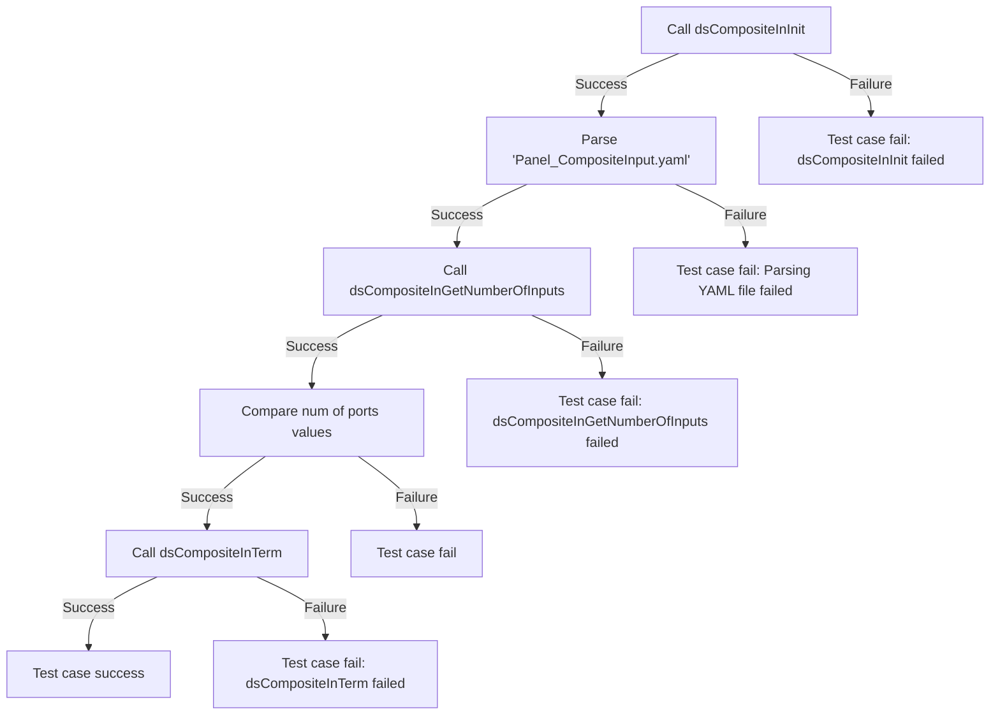
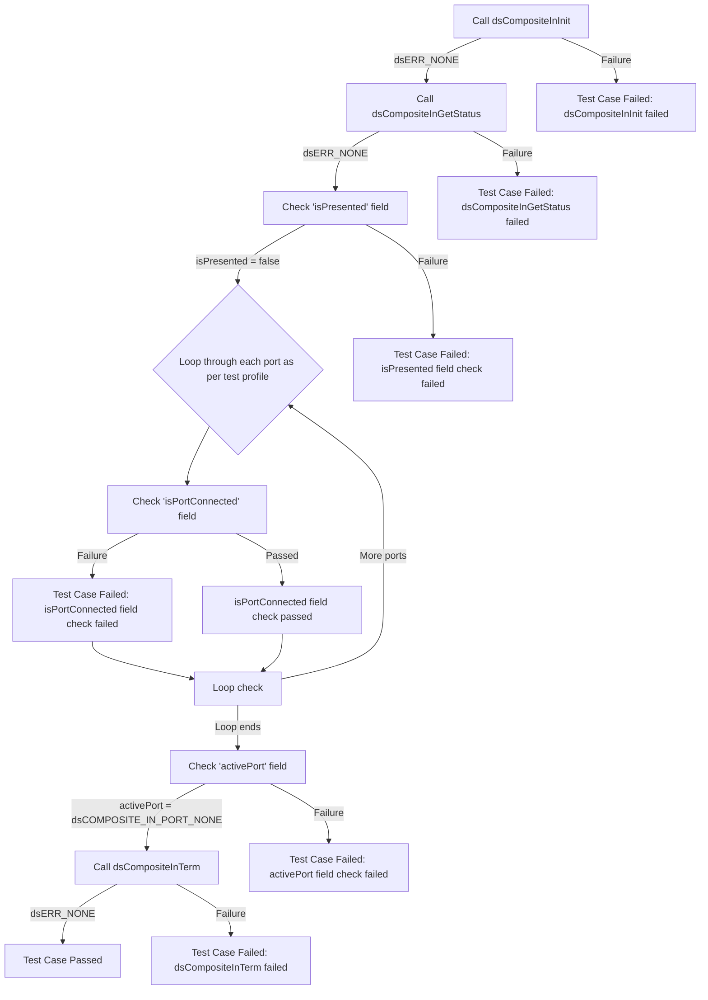
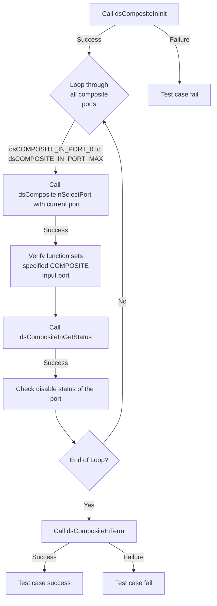

# Device Settings Composite Input L2 Low Level Test Specification and Procedure Documentation

## Overview

This document describes the Low Level L2 Test Specification and Procedure for the Device Settings Composite Input module.

### Acronyms, Terms and Abbreviations

- `HAL` \- Hardware Abstraction Layer, may include some common components
- `UT`  \- Unit Test(s)
- `OEM`  \- Original Equipment Manufacture
- `SoC`  \- System on a Chip

### Definitions

- `ut-core` \- Common Testing Framework <https://github.com/rdkcentral/ut-core>, which wraps a open-source framework that can be expanded to the requirements for future framework.

### References

- `High Level Test Specification` - [ds-compositeIn-High-Level_TestSpec.md](https://github.com/rdkcentral/rdk-halif-test-device_settings/blob/main/docs/pages/ds-compositeIn-High-Level_TestSpec.md)
- `HAL Interface file` - [dsCompositeIn Header](https://github.com/rdkcentral/rdk-halif-device_settings/blob/main/include/dsCompositeIn.h)

## Level 2 Test Procedure

The following functions are expecting to test the module operates correctly.

### Test 1

|Title|Details|
|--|--|
|Function Name|`test_l2_dsCompositeIn_GetNumberOfInputs`|
|Description|Ensure that the function returns the expected number of COMPOSITE input ports by comparing the input port values parsed from the configuration YAML file for the platform under test. The value to be retrieved from the YAML is `dsCompositeIn/composite_input_configurations/number_of_ports`.|
|Test Group|02|
|Test Case ID|001|
|Priority|High|

**Pre-Conditions**
None

**Dependencies**
None

**User Interaction**
If user chose to run the test in interactive mode, then the test case has to be selected via console.

#### Test Procedure - Test 1

| Variation / Steps | Description | Test Data | Expected Result | Notes|
| -- | --------- | ---------- | -------------- | ----- |
| 01 | Initialize the COMPOSITE Input module using `dsCompositeInInit` | None | `dsERR_NONE` | Should be successful |
| 02 | Get the number of COMPOSITE Input ports using `dsCompositeInGetNumberOfInputs` | numInputs = valid buffer | `dsERR_NONE` | Should be successful |
| 03 | Compare the value returned by `dsCompositeInGetNumberOfInputs` with the value retrieved from the YAML file | numInputs, `dsCompositeIn/composite_input_configurations/number_of_ports` from configuration file | They should match | Should be successful |
| 04 | Terminate the COMPOSITE Input module using `dsCompositeInTerm` | None | `dsERR_NONE` | Should be successful |

### Test 2

|Title|Details|
|--|--|
|Function Name|`test_l2_dsCompositeIn_VerifyCompositeInputStatus`|
|Description|Verify the status of the Composite Inputs by ensuring it is in disable status.|
|Test Group|02|
|Test Case ID|002|
|Priority|High|

**Pre-Conditions**
None

**Dependencies**
None

**User Interaction**
If user chose to run the test in interactive mode, then the test case has to be selected via console.

#### Test Procedure - Test 2

| Variation / Steps | Description | Test Data | Expected Result | Notes|
| -- | --------- | ---------- | -------------- | ----- |
| 01 | Initialize the Composite Input using `dsCompositeInInit` | None | `dsERR_NONE` | Should be successful |
| 02 | Get the status of the Composite Input using `dsCompositeInGetStatus` | status = valid buffer | `dsERR_NONE` | Should be successful |
| 03 | Check if the Composite Input is presented or not | isPresented = false | false | Should be successful |
| 04 | Loop through and check if each of the Composite Input Port existing on the platform is connected or not| status.isPortConnected[Port No] = false | false | Should be successful |
| 05 | Check the active port of the Composite Input | status.activePort = `dsCOMPOSITE_IN_PORT_NONE` | `dsCOMPOSITE_IN_PORT_NONE` | Should be successful |
| 06 | Terminate the Composite Input using `dsCompositeInTerm` | None | `dsERR_NONE` | Should be successful |

### Test 3

|Title|Details|
|--|--|
|Function Name|`test_l2_dsCompositeIn_VerifyCompositeInPortSelectionAndStatus`|
|Description|Loop through all the existing composite ports on the platform, verify that the function successfully sets the specified COMPOSITE Input port when there is no connection of source device, and check the disable status of the port information using Get status.|
|Test Group|02|
|Test Case ID|003|
|Priority|High|

**Pre-Conditions**
None

**Dependencies**
None

**User Interaction**
If user chose to run the test in interactive mode, then the test case has to be selected via console.

#### Test Procedure - Test 3

| Variation / Steps | Description | Test Data | Expected Result | Notes|
| -- | --------- | ---------- | -------------- | ----- |
| 01 | Initialize the COMPOSITE Input module using `dsCompositeInInit` | None | `dsERR_NONE` | Should be successful |
| 02 | Loop through the supported COMPOSITE Input ports on the platform based on the get number of Inputs and select each port using `dsCompositeInSelectPort` | port = `dsCompositeInGetNumberOfInputs` | `dsERR_NONE` | Should be successful |
| 03 | Get the status of the selected COMPOSITE Input port using `dsCompositeInGetStatus` | status = valid buffer | `dsERR_NONE` | Should be successful |
| 04 | Check if the active port is the selected port ,if the port is not presented and if the port is not connected | activePort = port, isPresented = false, isPortConnected = false | activePort = port, isPresented = false, isPortConnected = false | Should be successful |
| 05 | Terminate the COMPOSITE Input module using `dsCompositeInTerm` | None | `dsERR_NONE` | Should be successful |

