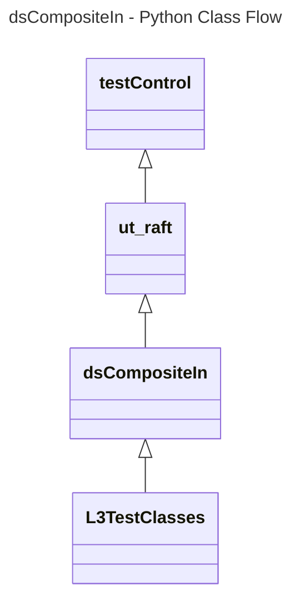
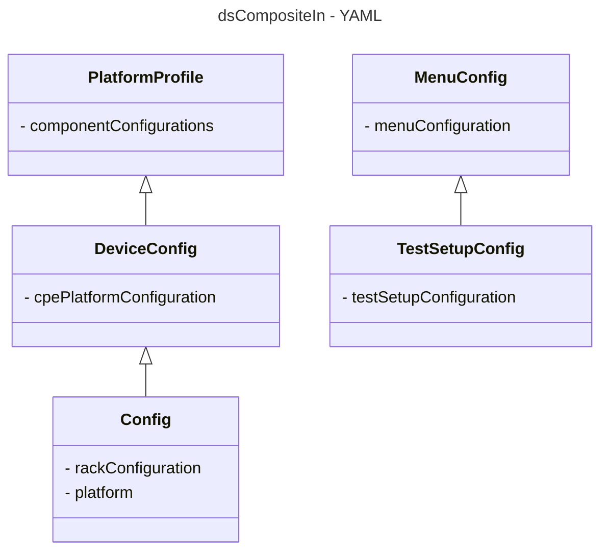

# Device Settings Composite Input L3 Low Level Test Specification and Procedure Documentation

## Table of Contents

- [Overview](#overview)
- [Acronyms, Terms and Abbreviations](#acronyms-terms-and-abbreviations)
- [References](#references)
- [Level 3 Test cases High Level Overview](#level-3-test-cases-high-level-overview)
- [Level 3 Python Test](#level-3-python-test-cases-high-level-overview)

## Overview

This document describes the L3 Low Level Test Specification and Procedure Documentation for the Device Settings Composite Input module.

### Acronyms, Terms and Abbreviations

- `HAL`    - Hardware Abstraction Layer
- `API`    - Application Programming Interface
- `L2`     - Level 2 Testing
- `L3`     - Level 3 Testing
- `DS`     - Device Settings
- `DUT`    - Device Under Test
- `NA`     - Not Applicable
- `RAFT`   - Rapid Automation Framework for Testing

### References

- `High Level Test Specification` - [ds-compositeIn-High-Level_TestSpec.md](https://github.com/rdkcentral/rdk-halif-test-device_settings/blob/main/docs/pages/ds-compositeIn-High-Level_TestSpec.md)

- `HAL Interface file` - [dsCompositeIn Header 4.0.0](https://github.com/rdkcentral/rdk-halif-device_settings/blob/4.0.0/include/dsCompositeIn.h)


## Level 3 Test Cases High Level Overview

Below are top test use-case for the Composite Input.

|#|Test-case|Description|Focus APIs|
|-|---------|-----------|--------|
|1|Verify the CompositeIn port connection with callbacks|Connect/disconnect the CompositeIn source device on each of compositeIn port and check the callbacks is triggered when the connection status changes|`dsCompositeInRegisterConnectCB()`|
|2|Select the CompositeIn port |Select the composite input port and verify the status|`dsCompositeInSelectPort()`|
|3|Verify the CompositeIn active port status with callbacks|Select the CompositeIn port and check the callbacks is triggered when the active status changes|`dsCompositeInRegisterStatusChangeCB()`|
|4|Scale the video and verify |Play a video in CompositeIn source device and scale the video resolution|`dsCompositeInScaleVideo()`|
|5|Verify the status information of CompositeIn port |Play a video in CompositeIn source device connected to the active CompositeIn port and verify the status| `dsCompositeInGetStatus()`|
|6|Verify the CompositeIn Signal change with callback|Select the CompositeIn port and check the callback is triggered when the change in signal status occurs|`dsCompositeInRegisterSignalChangeCB()`|

## Level 3 Python Test Cases High Level Overview

The class diagram below illustrates the flow of dsCompositeIn L3 Python test cases:



- **testControl**
  - Test Control Module for running rack Testing. This module configures the `DUT` based on the rack configuration file provided to the test.
  - This class is defined in `RAFT` framework. For more details refer [RAFT](https://github.com/rdkcentral/python_raft/blob/1.0.0/README.md)
- **ut_raft**
  - Python based testing framework for writing engineering tests.
  - It provides common functionalities like menu navigation, configuration reader, reading user response etc.
  - For more details [ut-raft](https://github.com/rdkcentral/ut-raft).
- **dsCompositeIn**
  - This is test helper class which communicates with the `L3` C/C++ test running on the `DUT` through menu
- **L3TestClasses**
  - These are the L3 test case classes
  - Each class covers the each test use-case defined in [L3 Test use-cases](#level-3-test-cases-high-level-overview) table

## YAML File Inputs



- **config.yaml**
  - Identifies the rack configuration and platform used
  - References platform-specific config from `deviceConfig.yaml`
  - For more details refer [RAFT](https://github.com/rdkcentral/python_raft/blob/1.0.0/README.md) and [example_rack_config.yml](https://github.com/rdkcentral/python_raft/blob/1.0.0/examples/configs/example_rack_config.yml)

- **deviceConfig.yaml**
  - Specifies overall configuration for the platform
  - Can be overridden by:
    - Changing locally .yaml file directory
    - Using --deviceConfig command line switch
  - For more details refer [RAFT](https://github.com/rdkcentral/python_raft/blob/1.0.0/README.md) and [example_device_config.yml](https://github.com/rdkcentral/python_raft/blob/1.0.0/examples/configs/example_device_config.yml)

- **componentProfile.yaml/platformProfile.yaml**
  - Contains component-specific configurations
  - Contains platform wide configuration broken down into separate components
  - Example configuration file [dsCompositeIn_Settings](https://github.com/rdkcentral/rdk-halif-test-device_settings/blob/3.0.0/profiles/sink/Sink_CompositeInput.yaml)

- **testSetupConfig.yaml**
  - This configuration file contains the list of requirements for tests to execute. Eg: Copying the streams, setting environment variables etc.
  - Example configuration file listed below:

```yaml
dsCompositeIn:
  description: "dsCompositeIn Device Settings test setup"
  assets:
    device:
      Common: #List of common requirements for all the tests
        artifacts:
          -  "<URL>/hal_test" #URL Path to the bin files to copy
          -  "<URL>/ut_contol.so" #URL Path to the .so files if any to copy
          -  "<URL>/run.sh"
        execute:
          - ""  #prerequisites commands if required
        streams:
          - "" #URL path to the test streams
      test1_VerifyCompositeInPortConnectionAndStatus: #Requirements for specific test
        artifacts:
        execute:
        streams:
      test2_ScaleCompositeInVideoAndVerifyStatus:
        artifacts:
        execute:
        streams:
    host:
      menu_config: "../../assets/dsCompositeIn_L3_menu.yml" #Menu configuration file
```
- **menuConfig**
  - This configuration file contains the list of menu items for C/C++ L3 test running on `DUT`
  - Example configuration file listed below:

```yaml
dsCompositeIn:
  description: "dsCompositeIn Device Settings testing profile / menu system for UT"
  test:
  control:
    menu:
      type: UT-C # C (UT-C Cunit) / C++ (UT-G (g++ ut-core gtest backend))
      groups:
          name: "L3 dsCompositeIn - Sink"
          menu_initialize:
            name: "Initialize dsCompositeIn"
          menu_enable:
            name: "Select Port"
            input:
                - "Select CompositeIn Port"
          menu_scaleVideo:
            name: "Scale Video"
            input:
                - "Select x coordinate"
                - "Select y coordinate"
                - "Select width"
                - "Select height"
```

## Test Execution

- Folder Structure
  - assets
    - testSetupConfig.yaml
    - menuConfig.yaml
  - host
    - tests
      - helpers
        - dsCompositeInTestHelper.py
      - dsCompositeIn_test1_XYZ.py
      - dsCompositeIn_test2_XYZ.py

- User runs test (eg: test1_XYZ.py)
  - Chooses platform via --config config.yaml and config file
  - --slot 1 is default (optional)
  - Test reads the testSetupConfig.yaml from the assets folder
- Test extracts
  - Specific component configuration
  - validationProfile for the platform
  - Specific test setup requirements
  - Specific test menu configurations
