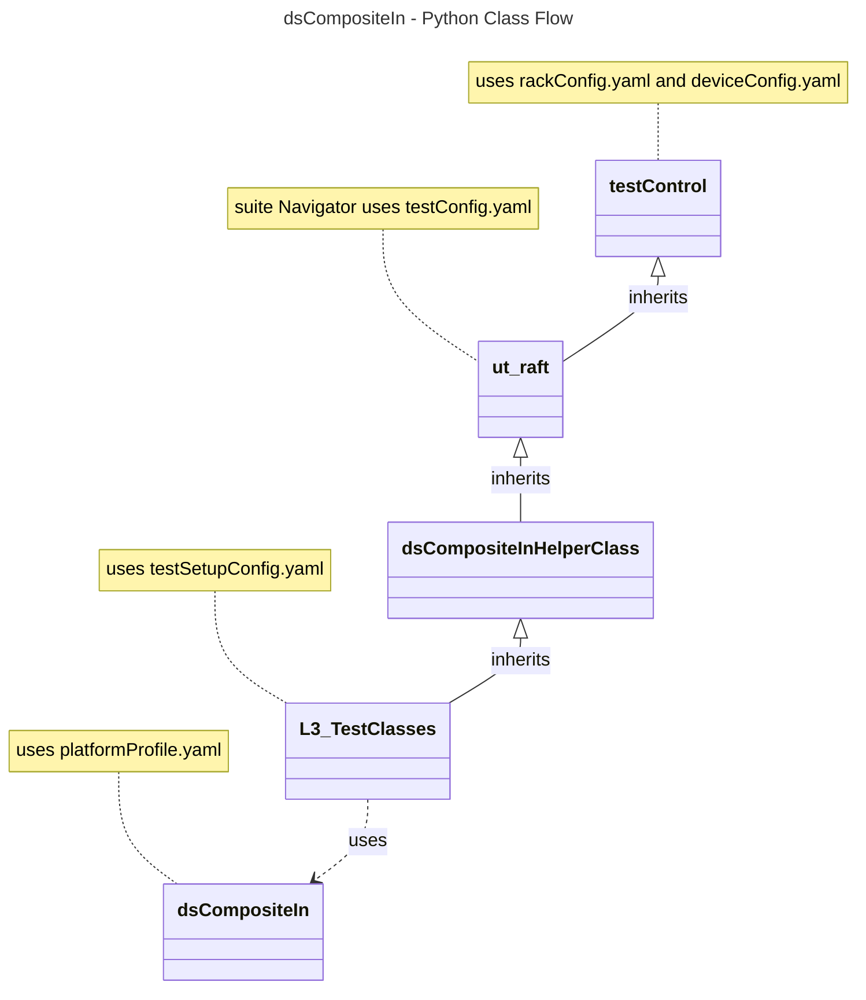

# Device Settings Composite Input L3 Low Level Test Specification and Procedure Documentation

## Table of Contents

- [Overview](#overview)
- [Acronyms, Terms and Abbreviations](#acronyms-terms-and-abbreviations)
- [References](#references)
- [Level 3 Test cases High Level Overview](#level-3-test-cases-high-level-overview)
- [Level 3 Python Test](#level-3-python-test-cases-high-level-overview)
- [YAML File Inputs](#yaml-file-inputs)

## Overview

This document describes the L3 Low Level Test Specification and Procedure Documentation for the Device Settings Composite Input module.

### Acronyms, Terms and Abbreviations

- `HAL`    - Hardware Abstraction Layer
- `API`    - Application Programming Interface
- `L3`     - Level 3 Testing
- `DS`     - Device Settings
- `DUT`    - Device Under Test
- `NA`     - Not Applicable
- `RAFT`   - Rapid Automation Framework for Testing

### References

- `High Level Test Specification` - [ds-compositeIn-High-Level_TestSpec.md](ds-compositeIn-High-Level_TestSpec.md)

- `HAL Interface file` - [dsCompositeIn Header 4.0.0](https://github.com/rdkcentral/rdk-halif-device_settings/blob/4.0.0/include/dsCompositeIn.h)

## Level 3 Test Cases High Level Overview

|#|Streams Name|Streams description|
|-|------------|-------------------|
|1|vts_SDR_stream|Format: SDR,Resolution: 1920 x 1080|

Below are top test use-case for the Composite Input.

|#|Test-case|Description|Focus APIs|
|-|---------|-----------|--------|
|1|Verify the CompositeIn port connection with callbacks|Connect/disconnect the CompositeIn source device on each of compositeIn port and check the callbacks is triggered when the connection status changes|`dsCompositeInRegisterConnectCB()`|
|2|Verify the CompositeIn active port status with callbacks|Connect a CompositeIn source device, select the CompositeIn port and check the callbacks is triggered when the active status changes(i.e like isPresented, activeport)|`dsCompositeInRegisterStatusChangeCB()`|
|3|Scale the video and verify |Play the video stream(`vts_SDR_stream`) in CompositeIn source device connected to the active CompositeIn port and scale the video resolution|`dsCompositeInScaleVideo()`|
|4|Verify the CompositeIn Signal change with callback| Connect a CompositeIn source device, select the CompositeIn port and check the callback is triggered when the change in signal status occurs(i.e like no signal , unstable signal, stable signal)|`dsCompositeInRegisterSignalChangeCB()`|
|5|Verify the CompositeIn video mode change with callback| Connect a CompositeIn source device, select the CompositeIn port, and verify that the callback is triggered when there is a change in the video mode on the source device|`dsCompositeInRegisterVideoModeUpdateCB()`|

## Level 3 Python Test Cases High Level Overview

The class diagram below illustrates the flow of dsCompositeIn L3 Python test cases:

- **testControl**
  - Test Control Module for running rack Testing. This module configures the `DUT` based on the rack configuration file provided to the test.
  - This class is defined in `RAFT` framework. For more details refer [RAFT](https://github.com/rdkcentral/python_raft/blob/1.0.0/README.md)
- **ut_raft**
  - Python based testing framework for writing engineering tests.
  - It provides common functionalities like menu navigation, configuration reader, reading user response etc.
  - For more details [ut-raft](https://github.com/rdkcentral/ut-raft).
- **dsCompositeIn**
  - This is test helper class which communicates with the `L3` C/C++ test running on the `DUT` through menu
- **L3_TestClasses**
  - These are the L3 test case classes
  - Each class covers the each test use-case defined in [L3 Test use-cases](#level-3-test-cases-high-level-overview) table

## YAML File Inputs

- **rackConfig.yaml**
  - Identifies the rack configuration and platform used
  - References platform-specific config from `deviceConfig.yaml`
  - For more details refer [RAFT](https://github.com/rdkcentral/python_raft/blob/1.0.0/README.md) and [example_rack_config.yml](https://github.com/rdkcentral/python_raft/blob/1.0.0/examples/configs/example_rack_config.yml)

- **deviceConfig.yaml**
  - Specifies overall configuration for the platform
  - Can be overridden by:
    - Changing locally .yaml file directory
    - Using --deviceConfig command line switch
  - For more details refer [RAFT](https://github.com/rdkcentral/python_raft/blob/1.0.0/README.md) and [example_device_config.yml](https://github.com/rdkcentral/python_raft/blob/1.0.0/examples/configs/example_device_config.yml)

- **componentProfile.yaml/platformProfile.yaml**
  - Contains component-specific configurations
  - Contains platform wide configuration broken down into separate components
  - Example configuration file [dsCompositeIn_Settings](https://github.com/rdkcentral/rdk-halif-test-device_settings/blob/3.0.0/profiles/sink/Sink_CompositeInput.yaml)

- **testSetupConfig.yaml**
  - This configuration file contains the list of requirements for tests to execute. Eg: Copying the streams etc.
  - Example configuration file [dsCompositeIn_L3_testSetup.yml](../../../host/tests/L3_TestCases/dsCompositeIn/dsCompositeIn_L3_testSetup.yml)

- **testConfig.yaml**
  - This configuration file contains the list of menu items for C/C++ L3 test running on `DUT`
  - Example configuration file [dsCompositeIn_testConfig.yml](../../../host/tests/dsClasses/dsCompositeIn_testConfig.yml)
