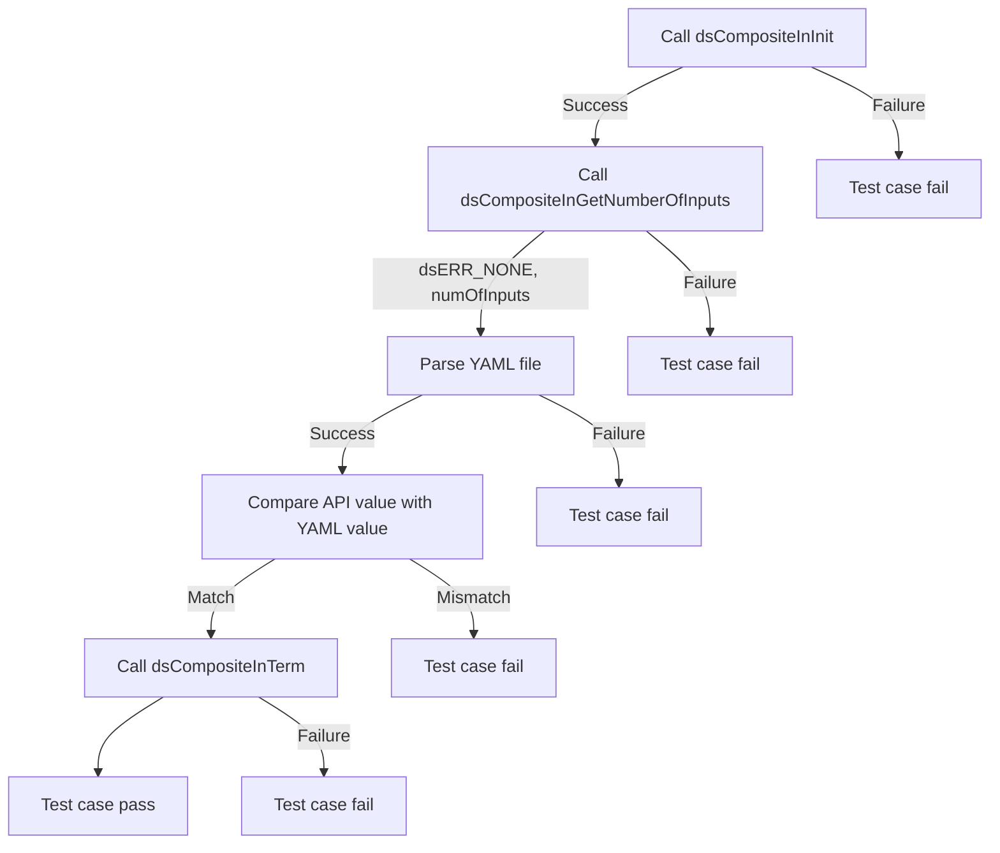
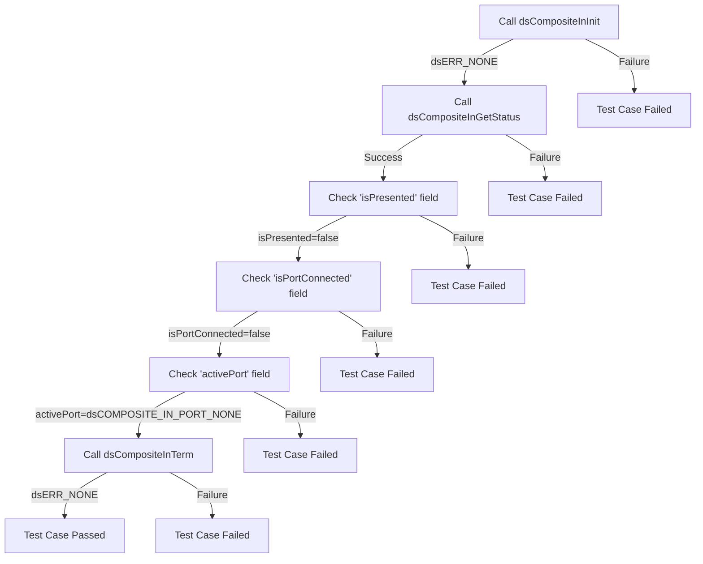
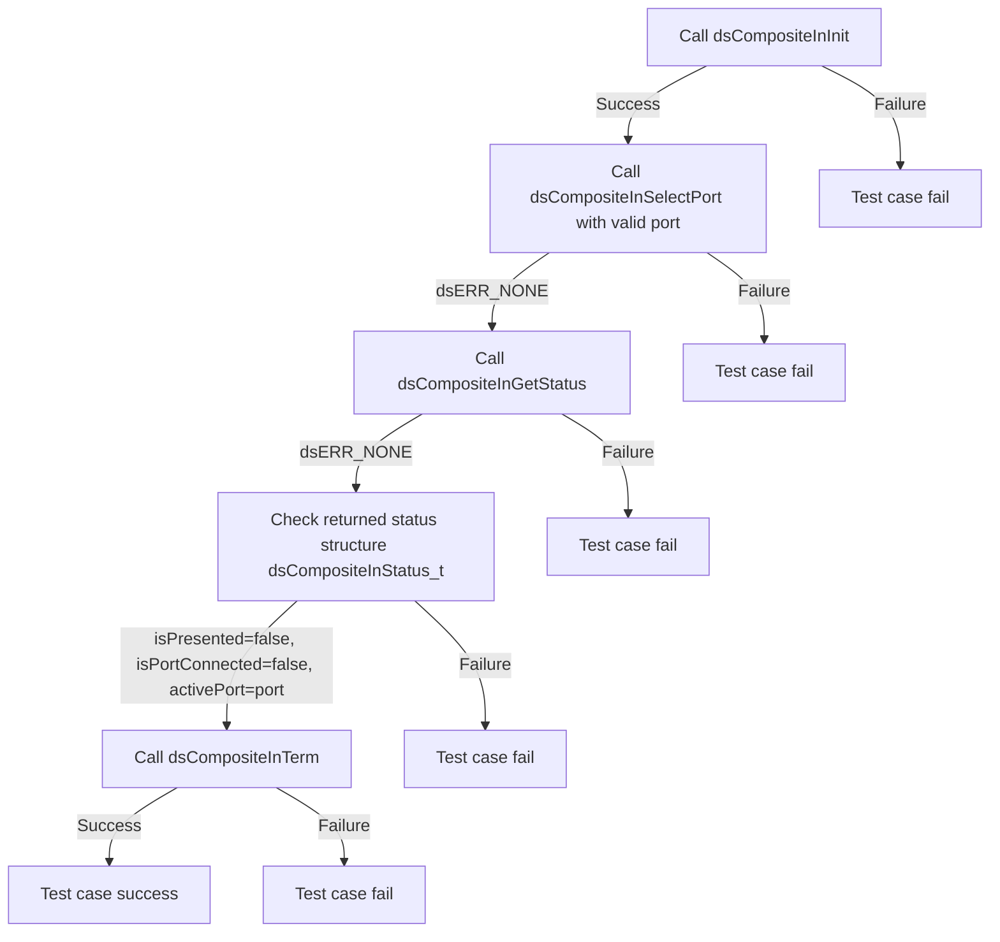
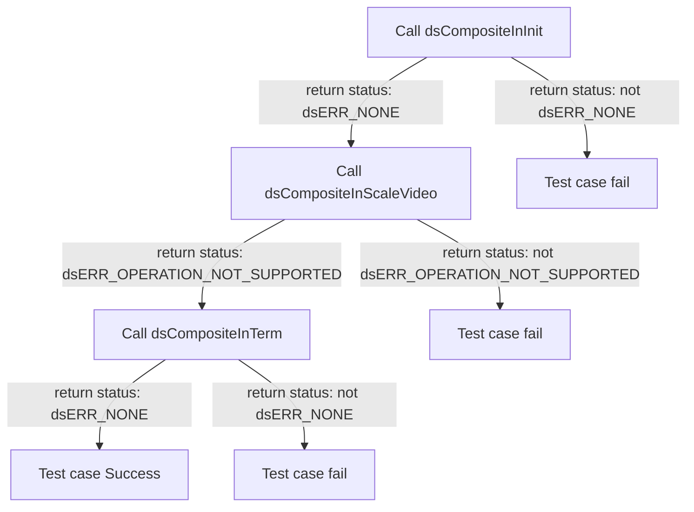

# DSCOMPOSITEIN L2 Low Level Test Specification and Procedure Documentation

## Table of Contents

- [DSCOMPOSITEIN L2 Low Level Test Specification and Procedure Documentation](#dscompositein-l2-low-level-test-specification-and-procedure-documentation)

  - [Table of Contents](#table-of-contents)
  - [Overview](#overview)
    - [Acronyms, Terms and Abbreviations](#acronyms-terms-and-abbreviations)
    - [Definitions](#definitions)
    - [References](#references)
  - [Level 2 Test Procedure](#level-2-test-procedure)

## Overview

This document describes the level 2 testing suite for the DSCOMPOSITEIN module.

### Acronyms, Terms and Abbreviations

- `HAL` \- Hardware Abstraction Layer, may include some common components
- `UT`  \- Unit Test(s)
- `OEM`  \- Original Equipment Manufacture
- `SoC`  \- System on a Chips

### Definitions

- `ut-core` \- Common Testing Framework <https://github.com/rdkcentral/ut-core>, which wraps a open-source framework that can be expanded to the requirements for future framework.

### References
- `High Level Test Specification` - [dsComposite_test_spec.md](dsComposite_test_spec.md)

## Level 2 Test Procedure

The following functions are expecting to test the module operates correctly.

### Test 1

|Title|Details|
|--|--|
|Function Name|`test_l2_dsCompositeIn_GetNumberOfInputs`|
|Description|Ensure that the function returns the expected number of COMPOSITE input ports. Compare the input port values by parsing the configuration YAML file 'ReferencePanel_AVInput_Info.yaml'.|
|Test Group|Module : 02|
|Test Case ID|001|
|Priority|High|

**Pre-Conditions :**
None

**Dependencies :**
None

**User Interaction :**
If user chose to run the test in interactive mode, then the test case has to be selected via console.

#### Test Procedure :

| Variation / Steps | Description | Test Data | Expected Result | Notes|
| -- | --------- | ---------- | -------------- | ----- |
| 01 | Initialize the COMPOSITE Input module using dsCompositeInInit | None | dsERR_NONE | Should be successful |
| 02 | Call the API dsCompositeInGetNumberOfInputs |  | dsERR_NONE, numInputs | Should be successful |
| 03 | Parse the configuration YAML file 'ReferencePanel_AVInput_Info.yaml' and get the expected number of COMPOSITE input ports | YAML file: 'ReferencePanel_AVInput_Info.yaml' | Expected number of COMPOSITE input ports | Should be successful |
| 04 | Compare the value obtained from the API with the expected value from the YAML file | numInputs, expectedNumInputs | numInputs should be equal to expectedNumInputs | Should be successful |
| 05 | Terminate the COMPOSITE Input module using dsCompositeInTerm | None | dsERR_NONE | Should be successful |

### Test 2

|Title|Details|
|--|--|
|Function Name|`test_l2_dsCompositeIn_VerifyCompositeInputStatus`|
|Description|Verify the status of the Composite Input by ensuring it is in disable status.|
|Test Group|Module : 02|
|Test Case ID|002|
|Priority|High|

**Pre-Conditions :**
None

**Dependencies :**
None

**User Interaction :**
If user chose to run the test in interactive mode, then the test case has to be selected via console.

#### Test Procedure :

| Variation / Steps | Description | Test Data | Expected Result | Notes|
| -- | --------- | ---------- | -------------- | ----- |
| 01 | Initialize the Composite Input using dsCompositeInInit | None | dsERR_NONE | Should be successful |
| 02 | Get the status of the Composite Input using dsCompositeInGetStatus | status = valid buffer | dsERR_NONE | Should be successful |
| 03 | Check if the Composite Input is presented | status.isPresented = false | false | Should be successful |
| 04 | Check if the Composite Input Port 0 is connected | status.isPortConnected[dsCOMPOSITE_IN_PORT_0] = false | false | Should be successful |
| 05 | Check if the Composite Input Port 1 is connected | status.isPortConnected[dsCOMPOSITE_IN_PORT_1] = false | false | Should be successful |
| 06 | Check the active port of the Composite Input | status.activePort = dsCOMPOSITE_IN_PORT_NONE | dsCOMPOSITE_IN_PORT_NONE | Should be successful |
| 07 | Terminate the Composite Input using dsCompositeInTerm | None | dsERR_NONE | Should be successful |

### Test 3

|Title|Details|
|--|--|
|Function Name|`test_l2_dsCompositeIn_SetAndCheckCompositeInputPort`|
|Description|Verify that the function successfully sets the specified COMPOSITE Input port when there is no connection of source device and check the disable status of the port information using Get status.|
|Test Group|Module : 02|
|Test Case ID|003|
|Priority|High|

**Pre-Conditions :**
None

**Dependencies :**
None

**User Interaction :**
If user chose to run the test in interactive mode, then the test case has to be selected via console.

#### Test Procedure :

| Variation / Steps | Description | Test Data | Expected Result | Notes|
| -- | --------- | ---------- | -------------- | ----- |
| 01 | Initialize the COMPOSITE Input sub-system using dsCompositeInInit | None | dsERR_NONE | Should be successful |
| 02 | Set the COMPOSITE Input port for presentation using dsCompositeInSelectPort | Port = dsCOMPOSITE_IN_PORT_0 | dsERR_NONE | Should be successful |
| 03 | Get the status of all COMPOSITE Input Status using dsCompositeInGetStatus | status = valid buffer | dsERR_NONE | Should be successful |
| 04 | Check if the status isPresented is false | status.isPresented = false | false | Should be successful |
| 05 | Check if the status isPortConnected[Port] is false | status.isPortConnected[Port] = false | false | Should be successful |
| 06 | Check if the activePort is equal to the selected Port | status.activePort = Port | Port | Should be successful |
| 07 | Terminate the COMPOSITE Input sub-system using dsCompositeInTerm | None | dsERR_NONE | Should be successful |

### Test 4

|Title|Details|
|--|--|
|Function Name|`test_l2_dsCompositeIn_ScaleVideoWithoutSelectingPort`|
|Description|Scaling the COMPOSITE input video without selecting the composite Input port. It should result as 'NOT SUPPORTED'.|
|Test Group|Module : 02|
|Test Case ID|004|
|Priority|High|

**Pre-Conditions :**
None

**Dependencies :**
None

**User Interaction :**
If user chose to run the test in interactive mode, then the test case has to be selected via console.

#### Test Procedure :

| Variation / Steps | Description | Test Data | Expected Result | Notes|
| -- | --------- | ---------- | -------------- | ----- |
| 01 | Initialize the composite input using dsCompositeInInit() | None | dsERR_NONE | Should be successful |
| 02 | Scale the composite input video without selecting the port using dsCompositeInScaleVideo() | x=10, y=10, width=100, height=100 | dsERR_OPERATION_NOT_SUPPORTED | Should fail |
| 03 | Terminate the composite input using dsCompositeInTerm() | None | dsERR_NONE | Should be successful |

