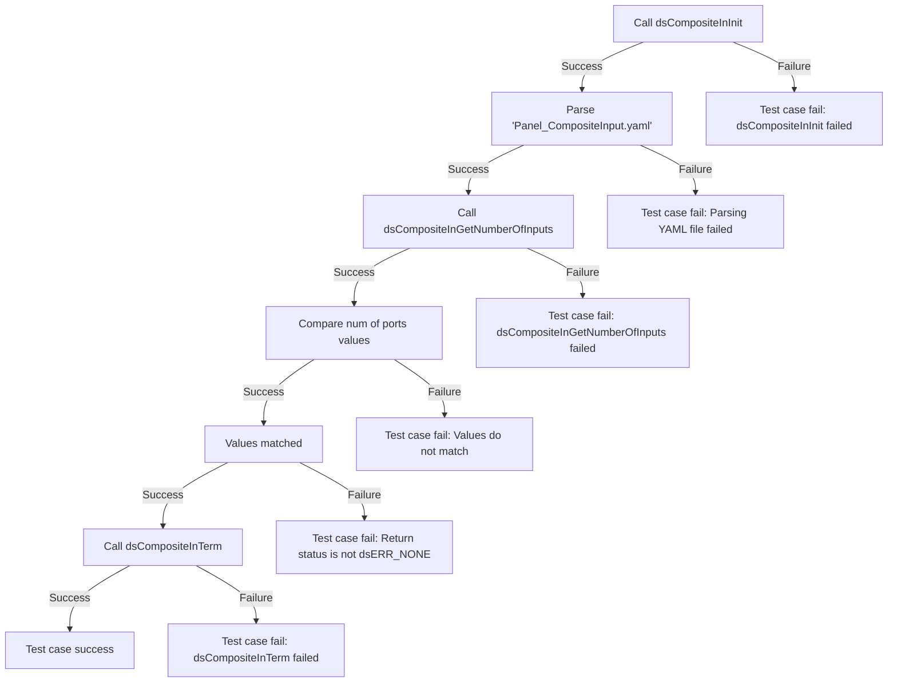
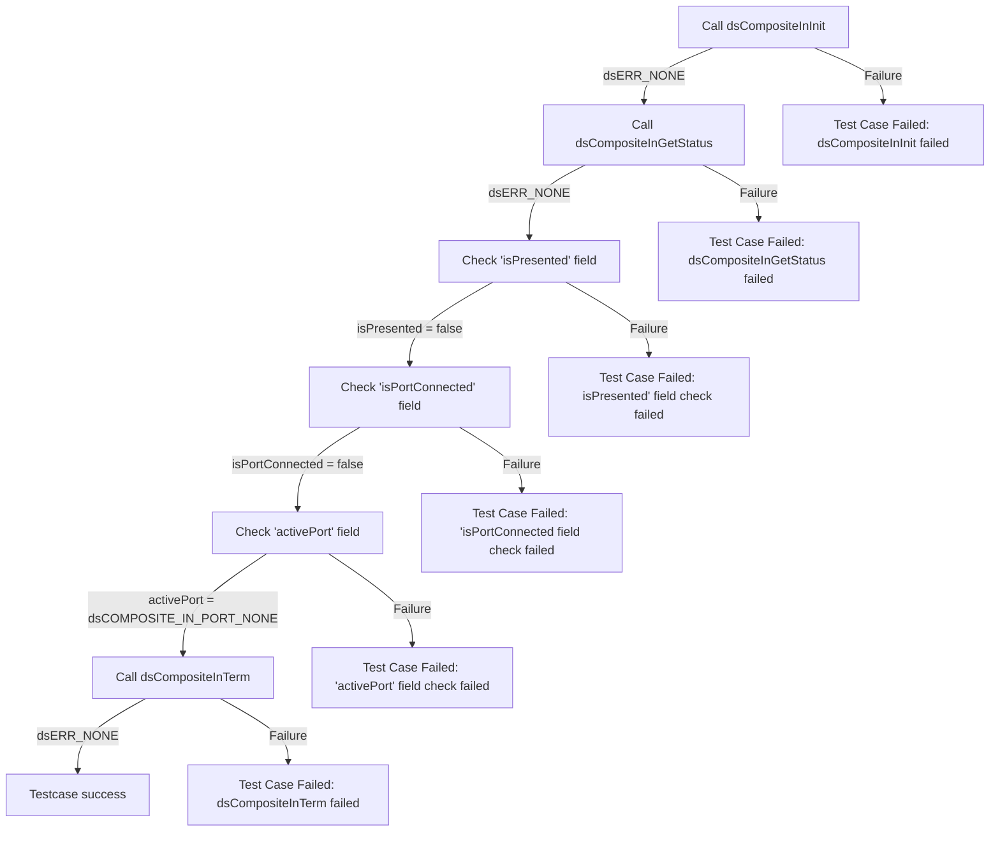
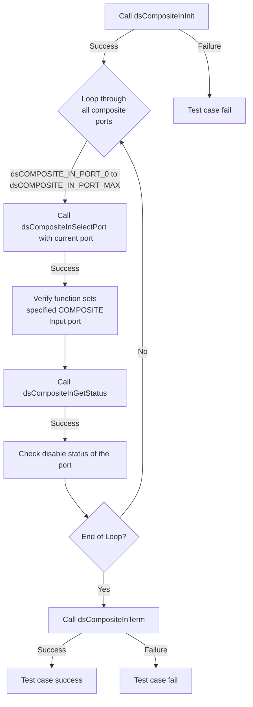

# DSCOMPOSITEIN L2 Low Level Test Specification and Procedure Documentation

## Table of Contents

- [DSCOMPOSITEIN L2 Low Level Test Specification and Procedure Documentation](#dscompositein-l2-low-level-test-specification-and-procedure-documentation)

  - [Table of Contents](#table-of-contents)
  - [Overview](#overview)
    - [Acronyms, Terms and Abbreviations](#acronyms-terms-and-abbreviations)
    - [Definitions](#definitions)
    - [References](#references)
  - [Level 2 Test Procedure](#level-2-test-procedure)

## Overview

This document describes the level 2 testing suite for the DSCOMPOSITEIN module.

### Acronyms, Terms and Abbreviations

- `HAL` \- Hardware Abstraction Layer, may include some common components
- `UT`  \- Unit Test(s)
- `OEM`  \- Original Equipment Manufacture
- `SoC`  \- System on a Chip

### Definitions

  - `ut-core` \- Common Testing Framework <https://github.com/rdkcentral/ut-core>, which wraps a open-source framework that can be expanded to the requirements for future framework.

### References
- `High Level Test Specification` - [dsComposite_test_spec.md](dsComposite_test_spec.md)

## Level 2 Test Procedure

The following functions are expecting to test the module operates correctly.

### Test 1

|Title|Details|
|--|--|
|Function Name|`test_l2_dsCompositeIn_GetNumberOfInputs`|
|Description|Ensure that the function returns the expected number of COMPOSITE input ports by comparing the input port values parsed from the configuration YAML file 'Panel_CompositeInput.yaml'. The value to be retrieved from the YAML is 'composite_input_configurations/number_of_ports'.|
|Test Group|Module : 02|
|Test Case ID|001|
|Priority|High|

**Pre-Conditions :**
None

**Dependencies :**
None

**User Interaction :**
If user chose to run the test in interactive mode, then the test case has to be selected via console.

#### Test Procedure :

| Variation / Steps | Description | Test Data | Expected Result | Notes|
| -- | --------- | ---------- | -------------- | ----- |
| 01 | Initialize the COMPOSITE Input module using dsCompositeInInit | None | dsERR_NONE | Should be successful |
| 02 | Get the number of COMPOSITE Input ports using dsCompositeInGetNumberOfInputs | numInputs = valid buffer | dsERR_NONE | Should be successful |
| 03 | Compare the value returned by dsCompositeInGetNumberOfInputs with the value retrieved from the YAML file | numInputs, "composite_input_configurations/number_of_ports" | They should match | Should be successful |
| 04 | Terminate the COMPOSITE Input module using dsCompositeInTerm | None | dsERR_NONE | Should be successful |

### Test 2

|Title|Details|
|--|--|
|Function Name|`test_l2_dsCompositeIn_VerifyCompositeInputStatus`|
|Description|Verify the status of the Composite Input by ensuring it is in disable status.|
|Test Group|Module : 02|
|Test Case ID|002|
|Priority|High|

**Pre-Conditions :**
None

**Dependencies :**
None

**User Interaction :**
If user chose to run the test in interactive mode, then the test case has to be selected via console.

#### Test Procedure :

| Variation / Steps | Description | Test Data | Expected Result | Notes|
| -- | --------- | ---------- | -------------- | ----- |
| 01 | Initialize the Composite Input using dsCompositeInInit() | None | dsERR_NONE | Should be successful |
| 02 | Get the status of the Composite Input using dsCompositeInGetStatus() | status = valid buffer | dsERR_NONE | Should be successful |
| 03 | Check if the Composite Input is presented | isPresented = false | false | Should be successful |
| 04 | Check if the Composite Input Port 0 is connected | status.isPortConnected[dsCOMPOSITE_IN_PORT_0] = false | false | Should be successful |
| 05 | Check if the Composite Input Port 1 is connected | status.isPortConnected[dsCOMPOSITE_IN_PORT_1] = false | false | Should be successful |
| 06 | Check the active port of the Composite Input | status.activePort = dsCOMPOSITE_IN_PORT_NONE | dsCOMPOSITE_IN_PORT_NONE | Should be successful |
| 07 | Terminate the Composite Input using dsCompositeInTerm() | None | dsERR_NONE | Should be successful |

### Test 3

|Title|Details|
|--|--|
|Function Name|`test_l2_dsCompositeIn_VerifyCompositeInPortSelectionAndStatus`|
|Description|Loop through all the composite ports, verify that the function successfully sets the specified COMPOSITE Input port when there is no connection of source device, and check the disable status of the port information using Get status.|
|Test Group|Module : 02|
|Test Case ID|003|
|Priority|High|

**Pre-Conditions :**
None

**Dependencies :**
None

**User Interaction :**
If user chose to run the test in interactive mode, then the test case has to be selected via console.

#### Test Procedure :

| Variation / Steps | Description | Test Data | Expected Result | Notes|
| -- | --------- | ---------- | -------------- | ----- |
| 01 | Initialize the COMPOSITE Input module using dsCompositeInInit() | None | dsERR_NONE | Should be successful |
| 02 | Loop through all the COMPOSITE Input ports and select each port using dsCompositeInSelectPort(port) | port = dsCOMPOSITE_IN_PORT_0 to dsCOMPOSITE_IN_PORT_MAX | dsERR_NONE | Should be successful |
| 03 | Get the status of the selected COMPOSITE Input port using dsCompositeInGetStatus(&status) | status = valid buffer | dsERR_NONE | Should be successful |
| 04 | Check if the active port is the selected port ,if the port is not presented and if the port is not connected | activePort = port, isPresented = false, isPortConnected = false | activePort = port, isPresented = false, isPortConnected = false | Should be successful |
| 05 | Terminate the COMPOSITE Input module using dsCompositeInTerm() | None | dsERR_NONE | Should be successful |

