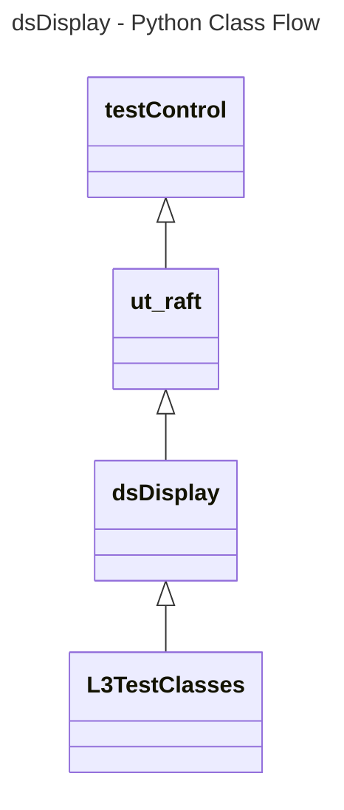

# Device Settings Display L3 Low Level Test Specification and Procedure Documentation

## Table of Contents

- [Overview](#overview)
- [Acronyms, Terms and Abbreviations](#acronyms-terms-and-abbreviations)
- [References](#references)
- [Level 3 Test cases High Level Overview](#level-3-test-cases-high-level-overview)
- [Level 3 Python Test Cases High Level Overview](#level-3-python-test-cases-high-level-overview)

## Overview

This document describes the L3 Low Level Test Specification and Procedure Documentation for the Device Settings Display module.

### Acronyms, Terms and Abbreviations

- `HAL`  \- Hardware Abstraction Layer, may include some common components
- `UT`   \- Unit Test(s)
- `OEM`  \- Original Equipment Manufacture
- `L3`   \- Level 3 Testing
- `DS`   \- Device Settings
- `EDID` \- Extended Display Identification Data
- `DUT`  \- Device Under Test
- `RAFT` \- Rapid Automation Framework for Testing
- `Y`    \- yes supported
- `NA`   \- Not Supported

### References

- `High Level Test Specification` - [dsDisplay High Level TestSpec](https://github.com/rdkcentral/rdk-halif-test-device_settings/blob/3.1.4/docs/pages/ds-display-high-Level_TestSpec.md)

- `HAL Interface file` - [dsDisplay Header 4.0.0](https://github.com/rdkcentral/rdk-halif-device_settings/blob/4.0.0/include/dsDisplay.h)

## Level 3 Test Cases High Level Overview

Below are the top test use cases for the display.

|#|Test-case|Description|Focus APIs|Source|Sink|
|-|---------|-----------|----------|------|----|
|1|Verify Display Events with callbacks|Monitor and verify that the callbacks are triggered correctly for each display event |`dsRegisterDisplayEventCallback()`|`Y`|`Y`|
|2|Retrieves and interprets EDID information|Verify the functionality of retrieving and accurately interpreting the EDID information, providing essential data about the display's capabilities and characteristics |`dsGetEDID()`|`Y`|`Y`|
|3|Gets the EDID buffer and EDID length|Verify that the edid buffer contains the expected EDID data, and the length is accurate |`dsGetEDIDBytes()`|`Y`|`Y`|
|4|Gets Aspect Ratio |Verify that the aspect ratio of the display is correctly retrieved and matches the expected value for a given configuration |`dsGetDisplayAspectRatio()`|`Y`|`NA`|

## Level 3 Python Test Cases High Level Overview

The class diagram below illustrates the flow of dsDisplay L3 Python test cases:

- **testControl**
  - Test Control Module for running rack Testing. This module configures the `DUT` based on the rack configuration file provided to the test.
  - This class is defined in `RAFT` framework. For more details refer [RAFT](https://github.com/rdkcentral/python_raft/blob/1.0.0/README.md)
- **ut_raft**
  - Python based testing framework for writing engineering tests.
  - It provides common functionalities like menu navigation, configuration reader, reading user response etc.
  - For more details [ut-raft](https://github.com/rdkcentral/ut-raft).
- **dsDisplay**
  - This is test helper class which communicates with the `L3` C/C++ test running on the `DUT` through menu
- **L3TestClasses**
  - These are the L3 test case classes
  - Each class covers the each test use-case defined in [L3 Test use-cases](#level-3-test-cases-high-level-overview) table

## YAML File Inputs
**TODO: Configuration examples with class diagrams will be added at a later stage.**