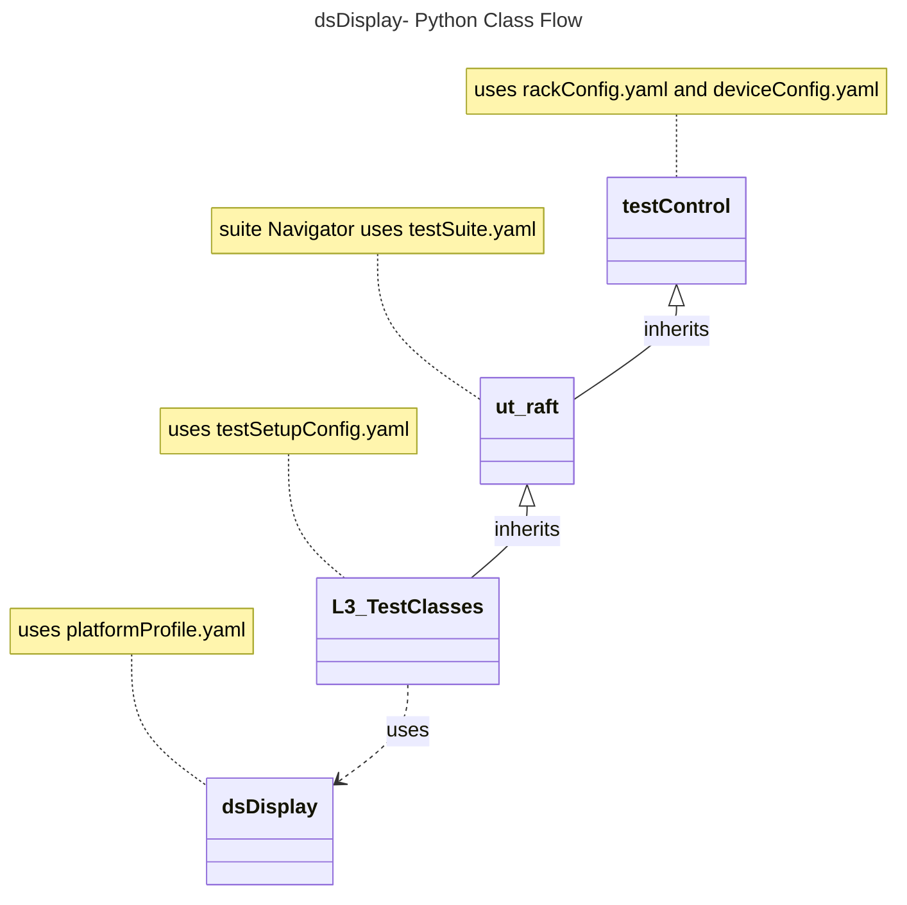

# Display Settings L3 Low Level Test Specification and Procedure Documentation

## Table of Contents

- [Acronyms, Terms and Abbreviations](#acronyms-terms-and-abbreviations)
- [Overview](#overview)
- [References](#references)
- [Level 3 Test Procedure](#level-3-test-cases-high-level-overview)
- [Level 3 Python Test](#level-3-python-test-cases-high-level-overview)

### Acronyms, Terms and Abbreviations

- `HAL`  \- Hardware Abstraction Layer, may include some common components
- `UT`   \- Unit Test(s)
- `OEM`  \- Original Equipment Manufacture
- `L3`   \- Level 3 Testing
- `DS`   \- Device Settings
- `EDID` \- Extended Display Identification Data
- `DUT`  \- Device Under Test
- `RAFT` \- Rapid Automation Framework for Testing
- `Y`    \- yes supported
- `NA`   \- Not Supported

## Overview

This document describes the L3 Test Procedure for the Device Settings Display module.

### References

- `Display Interface file` - [dsDisplay.h](https://github.com/rdkcentral/rdk-halif-device_settings/blob/4.0.0/include/dsDisplay.h)
- `High Level Test Specification` - [ds-display_High-Level_TestSpecification.md](https://github.com/rdkcentral/rdk-halif-test-device_settings/blob/3.1.4/docs/pages/ds-display-high-Level_TestSpec.md)

## Level 3 Test Cases High Level Overview

Below are the top test use cases for the display.

|#|Test-case|Description|HAL APIs|Source|Sink|
|-|---------|-----------|--------|------|----|
|1|Verify Display Events with callbacks|Connect/disconnect the display device on each port and verify that the callbacks are triggered for connection status changes and other display events (e.g., Rx Sense ON/OFF, HDCP protocol version change) |`dsRegisterDisplayEventCallback()`|`Y`|`Y`|
|2|Retrieves and interprets EDID information|Connect various pre-defined displays to the device, retrieve their EDID information, and compare it against the expected EDID data |`dsGetEDID()`|`Y`|`Y`|
|3|Gets the EDID buffer and EDID length|Verify that the edid buffer contains the expected EDID data, and the length is accurate |`dsGetEDIDBytes()`|`Y`|`Y`|
|4|Gets Aspect Ratio |Verify that the aspect ratio of the display is correctly retrieved and matches the expected value for a given configuration |`dsGetDisplayAspectRatio()`|`Y`|`NA`|

## Level 3 Python Test Cases High Level Overview

The class diagram below illustrates the flow of dsDisplay L3 Python test cases:

- **testControl**
  - Test Control Module for running rack Testing. This module configures the `DUT` based on the rack configuration file provided to the test.
  - This class is defined in `RAFT` framework. For more details refer [RAFT](https://github.com/rdkcentral/python_raft/blob/1.0.0/README.md)
- **ut_raft**
  - Python based testing framework for writing engineering tests.
  - It provides common functionalities like menu navigation, configuration reader, reading user response etc.
  - For more details [ut-raft](https://github.com/rdkcentral/ut-raft).
- **dsDisplay**
  - This is test helper class which communicates with the `L3` C/C++ test running on the `DUT` through menu
- **L3TestClasses**
  - These are the L3 test case classes
  - Each class covers the each test use-case defined in [L3 Test use-cases](#level-3-test-cases-high-level-overview) table

## YAML File Inputs

- **rackConfig.yaml**
  - Identifies the rack configuration and platform used
  - References platform-specific config from `deviceConfig.yaml`
  - For more details refer [RAFT](https://github.com/rdkcentral/python_raft/blob/1.0.0/README.md) and [example_rack_config.yml](https://github.com/rdkcentral/python_raft/blob/1.0.0/examples/configs/example_rack_config.yml)

- **deviceConfig.yaml**
  - Specifies overall configuration for the platform
  - Can be overridden by:
    - Changing locally .yaml file directory
    - Using --deviceConfig command line switch
  - For more details refer [RAFT](https://github.com/rdkcentral/python_raft/blob/1.0.0/README.md) and [example_device_config.yml](https://github.com/rdkcentral/python_raft/blob/1.0.0/examples/configs/example_device_config.yml)

- **componentProfile.yaml/platformProfile.yaml**
  - Contains component-specific configurations
  - Contains platform wide configuration broken down into separate components
  - Example configuration file [dsDisplay_Settings](https://github.com/rdkcentral/rdk-halif-test-device_settings/blob/3.0.0/profiles/sink/Sink_4K_Display.yaml)

- **testSetupConfig.yaml**
  - This configuration file contains the list of requirements for tests to execute. Eg: Copying the streams, setting environment variables etc.
  - Example configuration file [dsDisplay_L3_testSetup.yml](../../../host/tests/dsDisplay_L3_Tests/dsDisplay_L3_testSetup.yml)

- **testSuite.yaml**
  - This configuration file contains the list of menu items for C/C++ L3 test running on `DUT`
  - Example configuration file [dsDisplay_test_suite.yml](../../../host/tests/dsClasses/dsDisplay_test_suite.yml)
