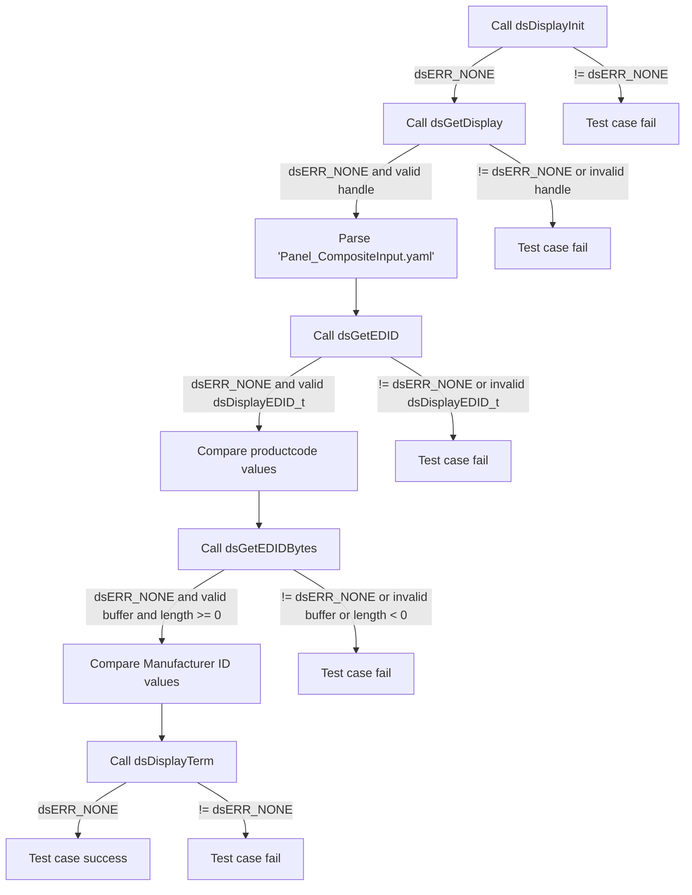
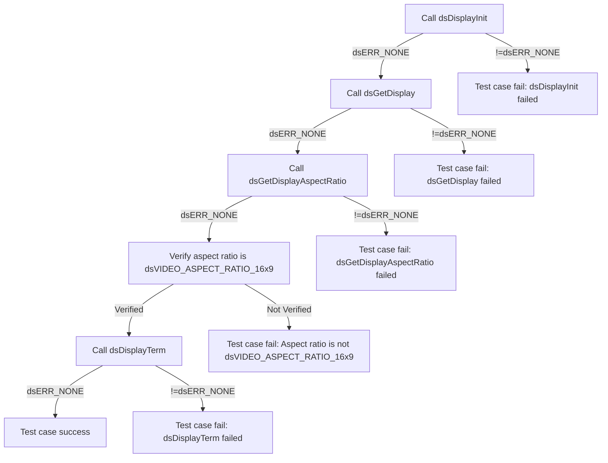

# DSDISPLAY L2 Low Level Test Specification and Procedure Documentation

## Table of Contents

- [DSDISPLAY L2 Low Level Test Specification and Procedure Documentation](#dsdisplay-l2-low-level-test-specification-and-procedure-documentation)

  - [Table of Contents](#table-of-contents)
  - [Overview](#overview)
    - [Acronyms, Terms and Abbreviations](#acronyms-terms-and-abbreviations)
    - [Definitions](#definitions)
    - [References](#references)
  - [Level 2 Test Procedure](#level-2-test-procedure)

## Overview

This document describes the level 2 testing suite for the DSDISPLAY module.

### Acronyms, Terms and Abbreviations

- `HAL` \- Hardware Abstraction Layer, may include some common components
- `UT`  \- Unit Test(s)
- `OEM`  \- Original Equipment Manufacture
- `SoC`  \- System on a Chip

### Definitions

  - `ut-core` \- Common Testing Framework <https://github.com/rdkcentral/ut-core>, which wraps a open-source framework that can be expanded to the requirements for future framework.

### References
- `High Level Test Specification` - [dsDisplay_TestSpecificaion.md](dsDisplay_TestSpecificaion.md)

## Level 2 Test Procedure

The following functions are expecting to test the module operates correctly.

### Test 1

|Title|Details|
|--|--|
|Function Name|`test_l2_dsDisplay_RetrieveAndValidateEDID_sink`|
|Description|For the sink device, retrieve EDID information for the 'dsVIDEOPORT_TYPE_INTERNAL' type using GetEDID and GetEDIDBytes, then validate the values against the data available in the profile file. The values to be validated are the 'EDID_Data/productCode' for GetEDID and the 'EDID_Data/edidBytes'(which stands for Manufacturer ID) at bytes 8 and 9 against the values available in the profile file "Panel_4K_Display.yaml" for GetEDIDBytes.|
|Test Group|Module : 02|
|Test Case ID|001|
|Priority|High|

**Pre-Conditions :**
None

**Dependencies :**
None

**User Interaction :**
If user chose to run the test in interactive mode, then the test case has to be selected via console.

#### Test Procedure :

| Variation / Steps | Description | Test Data | Expected Result | Notes|
| -- | --------- | ---------- | -------------- | ----- |
| 01 | Initialize the display using dsDisplayInit | None | dsERR_NONE | Should be successful |
| 02 | Get the display handle using dsGetDisplay for the 'dsVIDEOPORT_TYPE_INTERNAL' type  | type = dsVIDEOPORT_TYPE_INTERNAL, index = 0 | dsERR_NONE | Should be successful |
| 03 | Retrieve EDID information using dsGetEDID | handle = obtained from step 02 | dsERR_NONE | Should be successful |
| 04 | Validate with the product code data available in the profile file 'Panel_4K_Display.yaml.yml' | product code, EDID_Data/productCode | Value matches | Should be successful |
| 05 | Retrieve EDID bytes using dsGetEDIDBytes | handle = obtained from step 02, edidBytes = valid buffer, length = valid buffer | dsERR_NONE | Should be successful |
| 06 | Validate with the Manufacturer ID at bytes 8 and 9 against the values available in the profile
 file "Panel_4K_Display.yaml" | Manufacturer ID , EDID_Data/edidBytes | Value matches | Should be successful |
| 07 | Terminate the display using dsDisplayTerm | None | dsERR_NONE | Should be successful |

### Test 2

|Title|Details|
|--|--|
|Function Name|`test_l2_dsDisplay_TestDefaultAspectRatio_source`|
|Description|Test the default aspect ratio (16:9) without any TV connected.|
|Test Group|Module : 02|
|Test Case ID|002|
|Priority|High|

**Pre-Conditions :**
None

**Dependencies :**
None

**User Interaction :**
If user chose to run the test in interactive mode, then the test case has to be selected via console.

#### Test Procedure :

| Variation / Steps | Description | Test Data | Expected Result | Notes|
| -- | --------- | ---------- | -------------- | ----- |
| 01 | Initialize the display using dsDisplayInit() | None | dsERR_NONE | Should be successful |
| 02 | Get the display handle using dsGetDisplay() with dsVIDEOPORT_TYPE_HDMI and index 0 | dsVIDEOPORT_TYPE_HDMI, 0 | dsERR_NONE | Should be successful |
| 03 | Get the display aspect ratio using dsGetDisplayAspectRatio() with the handle obtained from dsGetDisplay() | handle obtained from dsGetDisplay() | dsERR_NONE, dsVIDEO_ASPECT_RATIO_16x9 | Should be successful |
| 04 | Verify that the aspect ratio is dsVIDEO_ASPECT_RATIO_16x9 | None | dsVIDEO_ASPECT_RATIO_16x9 | Should be successful |
| 05 | Terminate the display using dsDisplayTerm() | None | dsERR_NONE | Should be successful |

