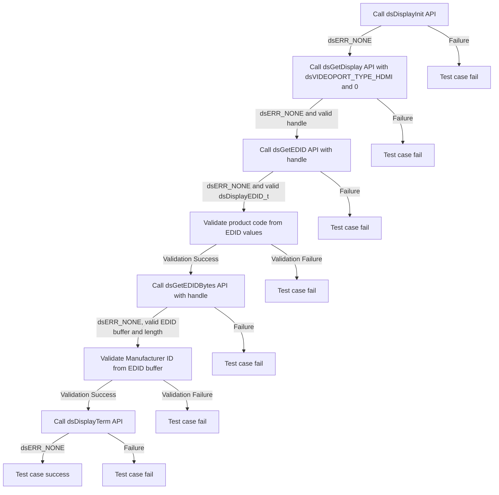
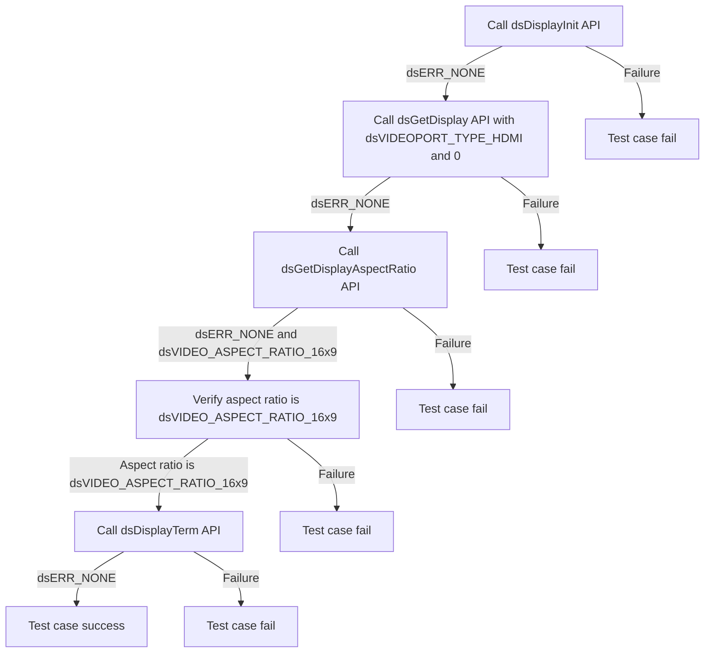

# DSDISPLAY L2 Low Level Test Specification and Procedure Documentation

## Table of Contents

- [DSDISPLAY L2 Low Level Test Specification and Procedure Documentation](#dsdisplay-l2-low-level-test-specification-and-procedure-documentation)

  - [Table of Contents](#table-of-contents)
  - [Overview](#overview)
    - [Acronyms, Terms and Abbreviations](#acronyms-terms-and-abbreviations)
    - [Definitions](#definitions)
    - [References](#references)
  - [Level 2 Test Procedure](#level-2-test-procedure)

## Overview

This document describes the level 2 testing suite for the DSDISPLAY module.

### Acronyms, Terms and Abbreviations

- `HAL` \- Hardware Abstraction Layer, may include some common components
- `UT`  \- Unit Test(s)
- `OEM`  \- Original Equipment Manufacture
- `SoC`  \- System on a Chip

### Definitions

- `ut-core` \- Common Testing Framework <https://github.com/rdkcentral/ut-core>, which wraps a open-source framework that can be expanded to the requirements for future framework.

### References
- `High Level Test Specification` - [dsDisplay_TestSpecificaion.md](dsDisplay_TestSpecificaion.md)

## Level 2 Test Procedure

The following functions are expecting to test the module operates correctly.

### Test 1

|Title|Details|
|--|--|
|Function Name|`test_l2_dsDisplay_ValidateEDIDInfo`|
|Description|For Sink device, EDID info should be retrieved using GetEDID and GetEDIDBytes and validate the values against the data available in Profile file 'ReferencePanel_EDID_Info.yml'. The values that shall be validated are product code" for GetEDID and validating "Manufacturer ID" at byte 8th and 9th against the values available in the profile file for GetEDIDBytes.|
|Test Group|Module : 02|
|Test Case ID|001|
|Priority|High|

**Pre-Conditions :**
None

**Dependencies :**
None

**User Interaction :**
If user chose to run the test in interactive mode, then the test case has to be selected via console.

#### Test Procedure :

| Variation / Steps | Description | Test Data | Expected Result | Notes|
| -- | --------- | ---------- | -------------- | ----- |
| 01 | Initialize the display using dsDisplayInit() | None | dsERR_NONE | Should be successful |
| 02 | Get the display handle using dsGetDisplay() with dsVIDEOPORT_TYPE_HDMI and index 0 | dsVIDEOPORT_TYPE_HDMI, 0 | dsERR_NONE | Should be successful |
| 03 | Get the EDID info using dsGetEDID() with the obtained handle | handle | dsERR_NONE | Should be successful |
| 04 | Validate the product code from the output structure against the data available in Profile file 'ReferencePanel_EDID_Info.yml' | | Value matches | Should be successful |
| 05 | Get the EDID bytes using dsGetEDIDBytes() with the obtained handle | handle, edidBytes, &length | dsERR_NONE | Should be successful |
| 05 | Validate the "Manufacturer ID" at byte 8th and 9th from the EDID buffer against the values available in the profile file 'ReferencePanel_EDID_Info.yml'| | Value matches | Should be successful |
| 06 | Terminate the display using dsDisplayTerm() | None | dsERR_NONE | Should be successful |

### Test 2

|Title|Details|
|--|--|
|Function Name|`test_l2_dsDisplay_TestDefaultAspectRatio`|
|Description|Test the default aspect ratio (16:9) without any TV connected.|
|Test Group|Module : 02|
|Test Case ID|002|
|Priority|High|

**Pre-Conditions :**
None

**Dependencies :**
None

**User Interaction :**
If user chose to run the test in interactive mode, then the test case has to be selected via console.

#### Test Procedure :

| Variation / Steps | Description | Test Data | Expected Result | Notes|
| -- | --------- | ---------- | -------------- | ----- |
| 01 | Initialize the display using dsDisplayInit | None | dsERR_NONE | Should be successful |
| 02 | Get the display handle for HDMI port at index 0 using dsGetDisplay | type = dsVIDEOPORT_TYPE_HDMI, index = 0 | dsERR_NONE | Should be successful |
| 03 | Get the aspect ratio of the display using dsGetDisplayAspectRatio | handle = obtained from dsGetDisplay | dsERR_NONE | Should be successful |
| 04 | Check if the aspect ratio is 16:9 | aspectRatio = dsVIDEO_ASPECT_RATIO_16x9 | dsERR_NONE | Should be successful |
| 05 | Terminate the display using dsDisplayTerm | None | dsERR_NONE | Should be successful |

