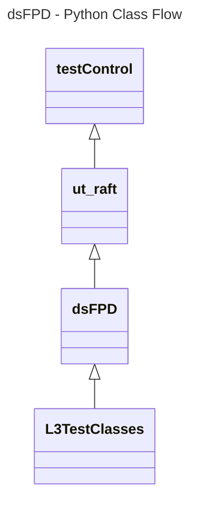

# Device Settings Front Panel Display L3 Low Level Test Specification and Procedure Documentation

## Table of Contents

- [Overview](#overview)
- [Acronyms, Terms and Abbreviations](#acronyms-terms-and-abbreviations)
- [References](#references)
- [Level 3 Test cases High Level Overview](#level-3-test-cases-high-level-overview)
- [Level 3 Python Test Cases High Level Overview](#level-3-python-test-casesc-high-level-overview)

## Overview

This document describes the L3 Low Level Test Specification and Procedure Documentation for the Device Settings Front Panel Display module.

### Acronyms, Terms and Abbreviations

- `HAL` \- Hardware Abstraction Layer, may include some common components
- `UT`  \- Unit Test(s)
- `OEM` \- Original Equipment Manufacture
- `SoC` \- System on a Chip
- `LED` \- Light Emitting Diode
- `FPD` \- Front Panel Display
- `Y`   \- yes supported
- `NA`  \- Not Supported

### References

- `High Level Test Specification` - [dsFrontPanelDevice High Level TestSpec](ds-front-panel-display_High-Level_TestSpec.md)
- `Interface header [4.0.0]` - [dsFPD HAL header](https://github.com/rdkcentral/rdk-halif-device_settings/blob/4.0.0/include/dsFPD.h)

## Level 3 Test Cases High Level Overview

|#|Test-case|Description|HAL APIs|Source|Sink|
|-|---------|-----------|--------|------|----|
|1|Verify LED can be set On and OFF|Verify all the supported LED on the DUT can be powered on or off. The User to vaidate the same reflected in DUT. |`dsSetFPState()`|`Y`|`Y`|
|2|Check Brightness Control|Verify the brightness control for all the supported LED on the DUT by changing the brightness Settings. The User to vaidate the same reflected in DUT. |`dsSetFPBrightness()`|`Y`|`Y`|
|3|Check LED Blink funciton|Verify all the supported LED on the DUT can be set with supported Blink rates. The User to vaidate the same reflected in DUT. |`dsSetFPBlink()`|`Y`|`Y`|
|4|Verify LED Color support  | Verify all the supported LED on the DUT can be set to supported colors. The User to vaidate the same reflected in DUT. | `dsSetFPColor()` | `Y` | `Y`|
|5|Verify All the Supported State pattern of LED | Verify the Front Panel LED can all the supported states on the DUT. The User to vaidate the same reflected in DUT. | `dsFPSetLEDState()`|`Y`|`Y`|

## Level 3 Python Test Cases High Level Overview

The class diagram below illustrates the flow of dsFPD L3 Python test cases:

- **testControl**
  - Test Control Module for running rack Testing. This module configures the `DUT` based on the rack configuration file provided to the test.
  - This class is defined in `RAFT` framework. For more details refer [RAFT](https://github.com/rdkcentral/python_raft/blob/1.0.0/README.md)
- **ut_raft**
  - Python based testing framework for writing engineering tests.
  - It provides common functionalities like menu navigation, configuration reader, reading user response etc.
  - For more details [ut-raft](https://github.com/rdkcentral/ut-raft).
- **dsFPD**
  - This is test helper class which communicates with the `L3` C/C++ test running on the `DUT` through menu
- **L3TestClasses**
  - These are the L3 test case classes
  - Each class covers the each test use-case defined in [L3 Test use-cases](#level-3-test-cases-high-level-overview) table

## YAML File Inputs
**TODO: Configuration examples with class diagrams will be added at a later stage.**