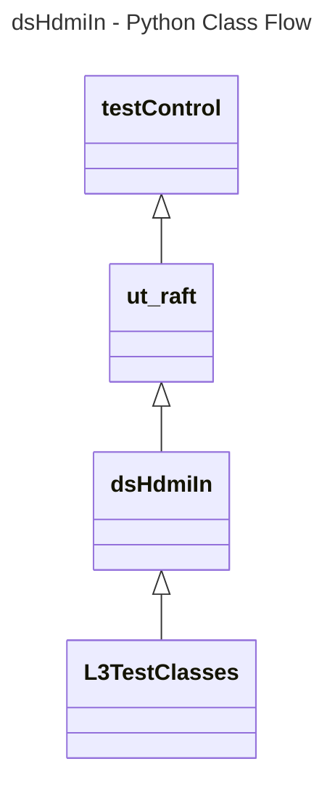
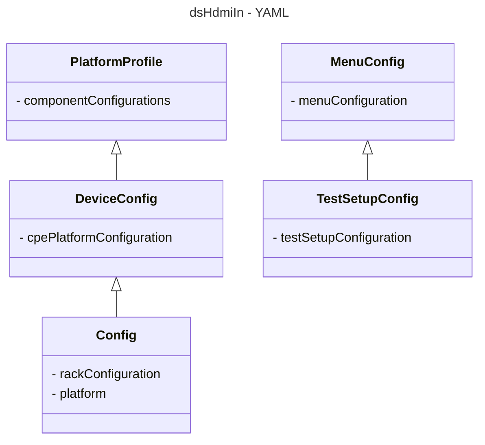

# Device Settings HdmiIn L3 Low Level Test Specification and Procedure Documentation

## Table of Contents

- [Overview](#overview)
- [Acronyms, Terms and Abbreviations](#acronyms-terms-and-abbreviations)
- [References](#references)
- [Level 3 Test cases High Level Overview](#level-3-test-cases-high-level-overview)

## Overview

This document describes the L3 Low Level Test Specification and Procedure Documentation for the Device Settings HdmiIn module.

### Acronyms, Terms and Abbreviations

- `HAL` \- Hardware Abstraction Layer, may include some common components
- `UT`  \- Unit Test(s)
- `OEM` \- Original Equipment Manufacture
- `SoC` \- System on a Chip
- `HDMI`\- High-Definition Multimedia Interface
- `HDR` \- High Dynamic Range
- `HLG` \- Hybrid Log-Gamma
- `SDR` \- Standard Dynamic Range
- `EDID`\- Extended Display Identification Data
- `ALLM`\- Auto Low Latency Mode
- `AVI` \- Audio Video Interleave
- `SPD` \- Source Product Descriptor

### References

- `High Level Test Specification` - [dsHdmiIn High Level TestSpec](https://github.com/rdkcentral/rdk-halif-test-device_settings/blob/3.1.4/docs/pages/ds-hdmi-in-High-Level_TestSpec.md)
- `Interface header` - [dsHdmiIn HAL header 4.0.0](https://github.com/rdkcentral/rdk-halif-device_settings/blob/4.0.0/include/dsHdmiIn.h)

## Level 3 Test Cases High Level Overview

|#|Streams Name|Streams description|
|-|------------|-------------------|
|1|vts_HDR10_stream|Format: HDR10,Resolution: 3840 x 2160 (4K UHD),Color Depth: 10-bit,Color Space: Rec. 2020|
|2|vts_SDR_stream|Format: SDR,Resolution: 1920 x 1080|
|3|vts_HLG_stream|Format: HLG,Resolution: 3840 x 2160 or It can also be used with 1080p and 720p resolutions.|
|4|vts_DolbyVision_stream|Format: Dolby Vision,Resolution: 3840 x 2160 (4K UHD),Color Depth: 10/12-bit,Color Space: Rec. 2020format and dynamic metadata.|
|5|vts_HDR10plus_stream|Format: HDR10,Resolution: 3840 x 2160 (4K UHD),Color Depth: 10-bit,Color Space: Rec. 2020 and dynamic metadata capabilities.|

Each test case need to verify with the each HdmiIn port.
Below are top test use-case for the HdmiIn port.

|#|Test-case|Description|Focus APIs|Source|Sink|
|-|---------|-----------|----------|------|----|
|1|Verify the HdmiIn Connect status with callback|Connect or Disconnect HdmiInput device on each of the HdmiInput ports and check the hdmiInConnectCB callback is triggered|`dsHdmiInRegisterConnectCB()`|`Y`|`Y`|
|2|Verify the HdmiIn Signal change with callback|Select the HdmiInput port and check the callback is triggered when the change in signal status occurs|`dsHdmiInRegisterSignalChangeCB()`|`NA`|`Y`|
|3|Verify the HdmiIn Status change with callback|Select the HdmiInput port and check the callback is triggered when the status change occurs(i.e like isPresented, activeport) and  check the callbacks is triggered|`dsHdmiInRegisterStatusChangeCB()`|`NA`|`Y`|
|4|Verify the HdmiIn Video Mode update  with callback|Play the streams from Hdminput device video content with any format(like `HDR`,`HLG`,`DolbyVision`,`SDR`,...) and check the callbacks is triggered when we change the resolution|`dsHdmiInRegisterVideoModeUpdateCB()`|`NA`|`Y`|
|5|Verify the HdmiIn `ALLM` change  with callback|Change the `ALLM` option to TRUE/FALSE after connecting game controller on 4k supported panel and check the callbacks is triggered when the `ALLM` status change occurs|`dsHdmiInRegisterAllmChangeCB()`|`NA`|`Y`|
|6|Verify the  HdmiIn Audio Video lateny with callback|Play the streams from Hdminput device video content with any format(like `HDR`,`HLG`,`DolbyVision`,`SDR`,...) and check the callbacks is triggered when there is latency change|`dsHdmiInRegisterAVLatencyChangeCB()`|`NA`|`Y`|
|7|Verify the HdmiIn `AVI` content change with callbacks|Play the streams from Hdminput device video content with any format(like `HDR`,`HLG`,`DolbyVision`,`SDR`,...) and check the callbacks is triggered there is `AVI` content change|`dsHdmiInRegisterAviContentTypeChangeCB()`|`NA`|`Y`|
|8|Get HdmiIn status of the selected port|Select the HdmiInput and verify the status whether selected port active or not|`dsHdmiInSelectPort()`,`dsHdmiInGetStatus()`|`Y`|`Y`|
|9|Scale HdmiIn video of the selected port|Select the HdmiInput and scale the video on the selcted port verify video scaled or not|`dsHdmiInScaleVideo()`|`Y`|`Y`|
|10|Check and verify Zoom mode selected|Select the Zoom mode from the available inputs and verify its set or not|`dsHdmiInSelectZoomMode()`|`Y`|`NA`|
|11|Get Current video mode of slected input port|Play the video with any format(like `HDR`,`HLG`,`DolbyVision`,`SDR`,...) from the selected HdmiInput port and get the current video mode|`dsHdmiInGetCurrentVideoMode()`|`Y`|`Y`|
|12|Get and verify the `EDID` of selected port|Select the HdmiInput and get the `EDID` for that particular Input port|`dsGetEDIDBytesInfo()`|`NA`|`Y`|
|13|Get and verify the `SPD` info of selected port|Select the HdmiInput and get the `SPD` info for that particular Input port|`dsGetHDMISPDInfo()`|`NA`|`Y`|
|14|Set and verify the `EDID` version on selected port|Set the `EDID` version and verify by retrieving the `EDID` version|`dsSetEdidVersion()`,`dsGetEdidVersion()`|`NA`|`Y`|
|15|Get the `ALLM`status of selected port|Select the HdmiInput and get the `ALLM` status for that particular Input port|`dsGetAllmStatus()`|`NA`|`Y`|
|16|Get audio video latency of current video|Play the video on selected HdmiInput port and get the audio video latency of current content|`dsGetAVLatency()`|`NA`|`Y`|
|17|Set and verify `EDID` to `ALLM` support on selected port|Set and retrieve `ALLM` on selected port connected with game controller on 4k supported panel|`dsSetEdid2AllmSupport()`,`dsGetEdid2AllmSupport()`|`NA`|`Y`|

## Level 3 Python Test Cases High Level Overview

The class diagram below illustrates the flow of dsHdmiIn L3 Python test cases:



- **testControl**
  - Test Control Module for running rack Testing. This module configures the `DUT` based on the rack configuration file provided to the test.
  - This class is defined in `RAFT` framework. For more details refer [RAFT](https://github.com/rdkcentral/python_raft/blob/1.0.0/README.md)
- **ut_raft**
  - Python based testing framework for writing engineering tests.
  - It provides common functionalities like menu navigation, configuration reader, reading user response etc.
  - For more details [ut-raft](https://github.com/rdkcentral/ut-raft).
- **dsHdmiIn**
  - This is test helper class which communicates with the `L3` C/C++ test running on the `DUT` through menu
- **L3TestClasses**
  - These are the L3 test case classes
  - Each class covers the each test use-case defined in [L3 Test use-cases](#level-3-test-cases-high-level-overview) table

## YAML File Inputs



- **config.yaml**
  - Identifies the rack configuration and platform used
  - References platform-specific config from `deviceConfig.yaml`
  - For more details refer [RAFT](https://github.com/rdkcentral/python_raft/blob/1.0.0/README.md) and [example_rack_config.yml](https://github.com/rdkcentral/python_raft/blob/1.0.0/examples/configs/example_rack_config.yml)

- **deviceConfig.yaml**
  - Specifies overall configuration for the platform
  - Can be overridden by:
    - Changing locally .yaml file directory
    - Using --deviceConfig command line switch
  - For more details refer [RAFT](https://github.com/rdkcentral/python_raft/blob/1.0.0/README.md) and [example_device_config.yml](https://github.com/rdkcentral/python_raft/blob/1.0.0/examples/configs/example_device_config.yml)

- **componentProfile.yaml/platformProfile.yaml**
  - Contains component-specific configurations
  - Contains platform wide configuration broken down into separate components
  - Example configuration file [dsHdmiIn_Settings](https://github.com/rdkcentral/rdk-halif-test-device_settings/blob/3.0.0/profiles/sink/Sink_HDMIIN.yaml)

- **testSetupConfig.yaml**
  - This configuration file contains the list of requirements for tests to execute. Eg: Copying the streams, setting environment variables etc.
  - Example configuration file listed below:

```yaml
dsHdmiIn:
  description: "dsHdmiIn Device Settings test setup"
  assets:
    device:
      Common: #List of common requirements for all the tests
        artifacts:
          -  "<URL>/hal_test" #URL Path to the bin files to copy
          -  "<URL>/ut_control.so" #URL Path to the .so files if any to copy
          -  "<URL>/run.sh"
        execute:
          - ""  #prerequisites commands if required
        streams:
      test1_SelectPortAndVerifyPortStatus: #Requirements for specific test
        artifacts:
        execute:
        streams:
          - "" #URL path to the test streams
          - "" #URL path to the test streams
      test2_PortActiveAndPresentedStatus:
        artifacts:
        execute:
        streams:
          - "" #URL path to the test streams
          - "" #URL path to the test streams
    host:
      menu_config: "../../assets/dsHdmiIn_L3_menu.yml" #Menu configuration file
```
- **menuConfig**
  - This configuration file contains the list of menu items for C/C++ L3 test running on `DUT`
  - Example configuration file listed below:

```yaml
dsHdmiIn:
  description: "dsHdmiIn Device Settings testing profile / menu system for UT"
  test:
  control:
    menu:
      type: UT-C # C (UT-C Cunit) / C++ (UT-G (g++ ut-core gtest backend))
      groups:
          name: "L3 dsHdmiIn - Sink"
          menu_initialize:
            name: "Initialize dsHdmiIn"
          menu_select:
            name: "dsHdmiIn Select Port"
            input:
                - "Select dsHdmiIn Port"
                - "Select audiomix"
                - "Select Videoplane"
                - "Select topmost"
```

## Test Execution

- Folder Structure
  - assets
    - testSetupConfig.yaml
    - menuConfig.yaml
  - host
    - tests
      - helpers
        - dsHdmiInTestHelper.py
      - dsHdmiIn_test1_XYZ.py
      - dsHdmiIn_test2_XYZ.py

- User runs test (eg: test1_XYZ.py)
  - Chooses platform via --config config.yaml and config file
  - --slot 1 is default (optional)
  - Test reads the testSetupConfig.yaml from the assets folder
- Test extracts
  - Specific component configuration
  - validationProfile for the platform
  - Specific test setup requirements
  - Specific test menu configurations
