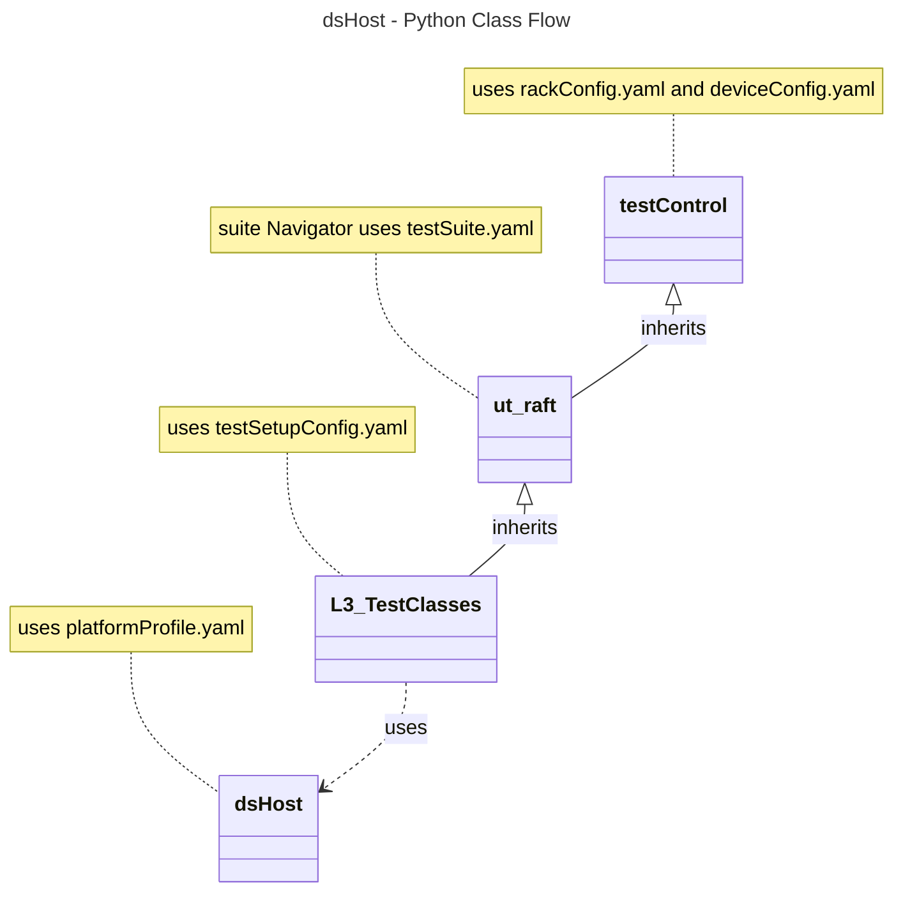

# Device Settings Host L3 Low Level Test Specification and Procedure Documentation

## Table of Contents

- [Overview](#overview)
- [Acronyms, Terms and Abbreviations](#acronyms-terms-and-abbreviations)
- [References](#references)
- [Level 3 Test cases High Level Overview](#level-3-test-cases-high-level-overview)
- [Level 3 Python Test](#level-3-python-test-cases-high-level-overview)

## Overview

This document describes the L3 Low Level Test Specification and Procedure Documentation for the Device Settings Host module.

### Acronyms, Terms and Abbreviations

- `HAL` \- Hardware Abstraction Layer, may include some common components
- `UT`  \- Unit Test(s)
- `OEM` \- Original Equipment Manufacture
- `SoC` \- System on a Chip
- `Y`   \- yes supported
- `NA`  \- Not Supported

### References

- `High Level Test Specification` - [dsHost_TestSpecification.md](https://github.com/rdkcentral/rdk-halif-test-device_settings/blob/main/docs/pages/dsHost_TestSpecification.md)
- `HAL Interface Header File` - [dsHost.h](https://github.com/rdkcentral/rdk-halif-device_settings/blob/main/include/dsHost.h)

## Level 3 Test Cases High Level Overview

Each test case need to verify with the each supported video port.
Below are top test use-case for the video port.

|#|Test-case|Description|HAL APIs|Source|Sink|
|-|---------|-----------|--------|------|----|
|1|Verify that the get temperature function |After the device is running for sometime, call getTemperature, and call it after a five minute wait. The two temperatures should not see any noticable changes in temperature |`dsGetCPUTemperature()`|`Y`|`Y`|

## Level 3 Python Test Cases High Level Overview

The class diagram below illustrates the flow of dsHost L3 Python test cases:

- **testControl**
  - Test Control Module for running rack Testing. This module configures the `DUT` based on the rack configuration file provided to the test.
  - This class is defined in `RAFT` framework. For more details refer [RAFT](https://github.com/rdkcentral/python_raft/blob/1.0.0/README.md)
- **ut_raft**
  - Python based testing framework for writing engineering tests.
  - It provides common functionalities like menu navigation, configuration reader, reading user response etc.
  - For more details [ut-raft](https://github.com/rdkcentral/ut-raft).
- **dsHost**
  - This is test helper class which communicates with the `L3` C/C++ test running on the `DUT` through menu
- **L3_TestClasses**
  - These are the L3 test case classes
  - Each class covers the each test use-case defined in [L3 Test use-cases](#level-3-test-cases-high-level-overview) table

### YAML File Inputs

- **rackConfig.yaml**
  - Identifies the rack configuration and platform used
  - References platform-specific config from `deviceConfig.yaml`
  - For more details refer [RAFT](https://github.com/rdkcentral/python_raft/blob/1.0.0/README.md) and [example_rack_config.yml](https://github.com/rdkcentral/python_raft/blob/1.0.0/examples/configs/example_rack_config.yml)

- **deviceConfig.yaml**
  - Specifies overall configuration for the platform
  - Can be overridden by:
    - Changing locally .yaml file directory
    - Using --deviceConfig command line switch
  - For more details refer [RAFT](https://github.com/rdkcentral/python_raft/blob/1.0.0/README.md) and [example_device_config.yml](https://github.com/rdkcentral/python_raft/blob/1.0.0/examples/configs/example_device_config.yml)

   **componentProfile.yaml/platformProfile.yaml**
  - Contains component-specific configurations
  - Contains platform wide configuration broken down into separate components
  - Example configuration file [dsHost_Settings](https://github.com/rdkcentral/rdk-halif-test-device_settings/blob/3.0.0/profiles/sink/Sink_HostSettings.yaml)

- **testSetupConfig.yaml**
  - This configuration file contains the list of requirements for tests to execute. Eg: Copying the streams, setting environment variables etc.
  - Example configuration file [dsHost_L3_testSetup.yml](../../../host/tests/L3_TestCases/dsHost/dsHost_L3_testSetup.yml)

- **testSuite.yaml**
  - This configuration file contains the list of menu items for C/C++ L3 test running on `DUT`
  - Example configuration file [dsHost_testConfig.yml](../../../host/tests/dsClasses/dsHost_testConfig.yml)