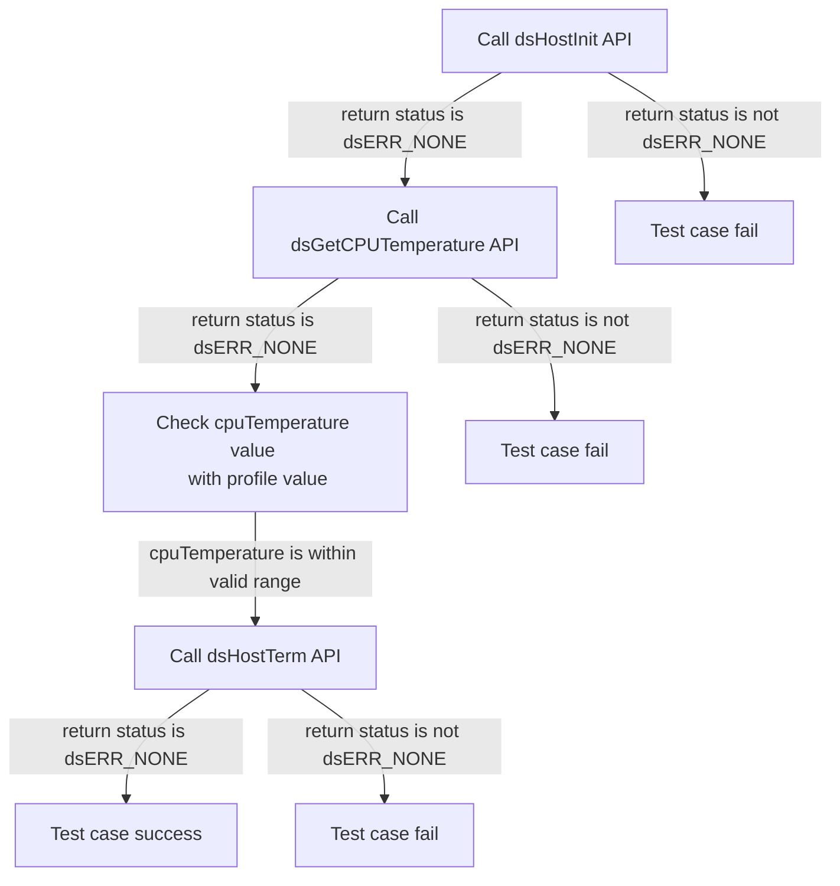
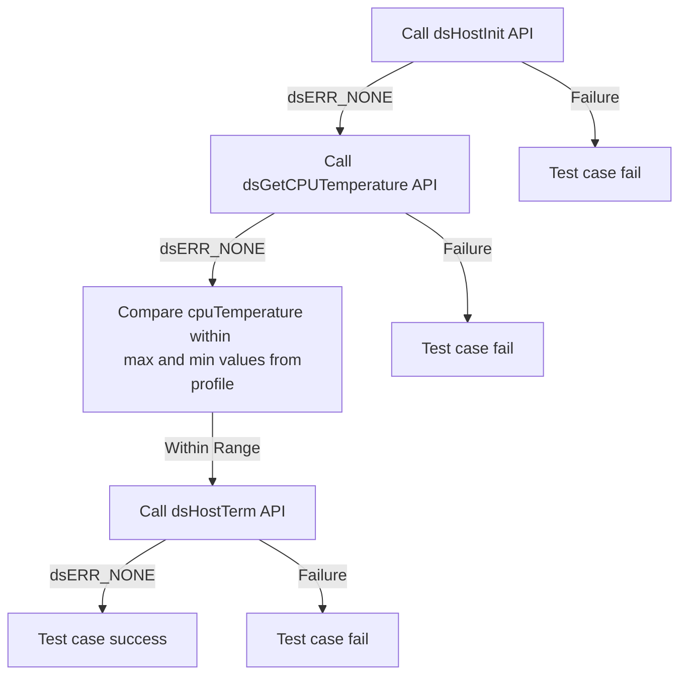
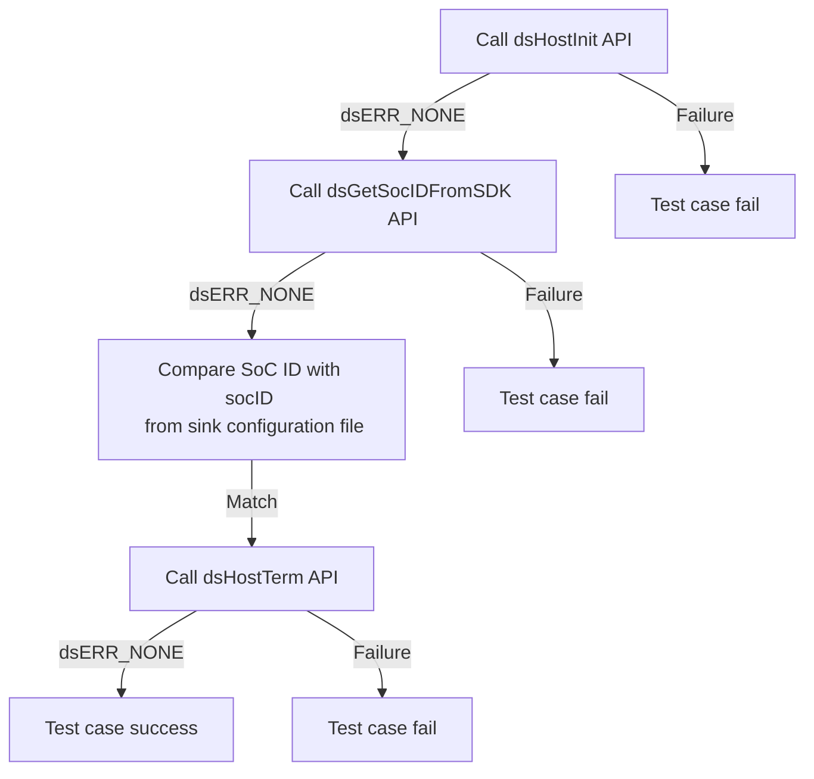
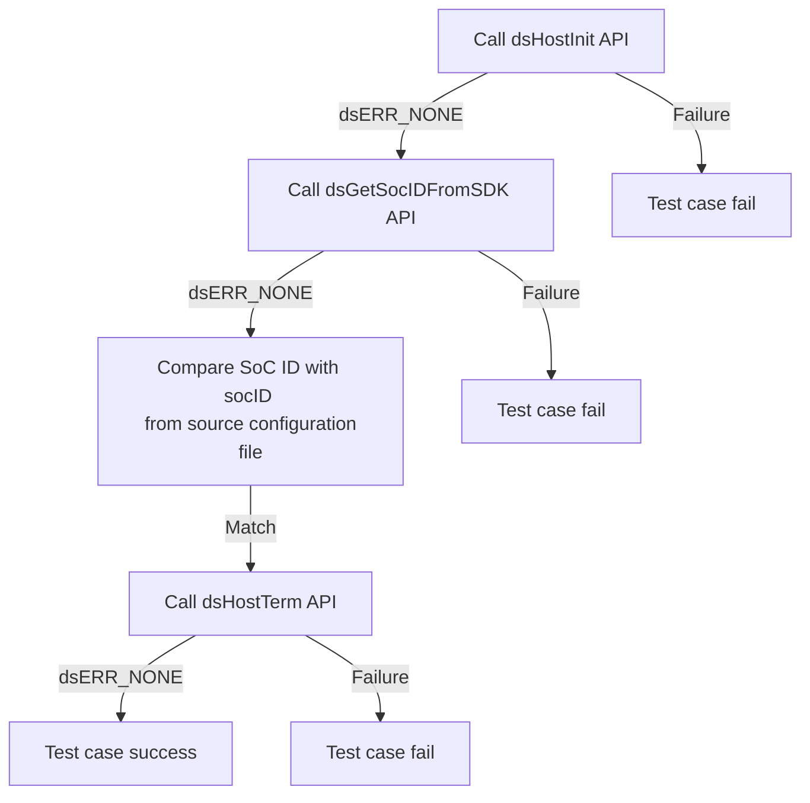
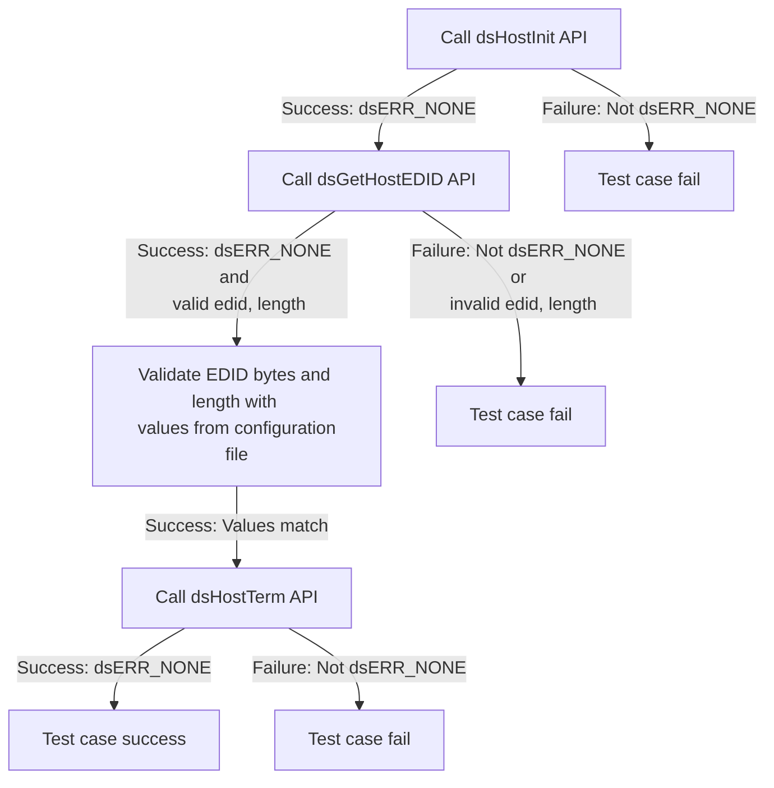

# DSHOST L2 Low Level Test Specification and Procedure Documentation

## Table of Contents

- [DSHOST L2 Low Level Test Specification and Procedure Documentation](#dshost-l2-low-level-test-specification-and-procedure-documentation)

  - [Table of Contents](#table-of-contents)
  - [Overview](#overview)
    - [Acronyms, Terms and Abbreviations](#acronyms-terms-and-abbreviations)
    - [Definitions](#definitions)
    - [References](#references)
  - [Level 2 Test Procedure](#level-2-test-procedure)

## Overview

This document describes the level 2 testing suite for the DSHOST module.

### Acronyms, Terms and Abbreviations

- `HAL` \- Hardware Abstraction Layer, may include some common components
- `UT`  \- Unit Test(s)
- `OEM`  \- Original Equipment Manufacture
- `SoC`  \- System on a Chip

### Definitions

  - `ut-core` \- Common Testing Framework <https://github.com/rdkcentral/ut-core>, which wraps a open-source framework that can be expanded to the requirements for future framework.

### References
- `High Level Test Specification` - [dsHost_TestSpecification.md](dsHost_TestSpecification.md)

## Level 2 Test Procedure

The following functions are expecting to test the module operates correctly.

### Test 1

|Title|Details|
|--|--|
|Function Name|`test_l2_dsHost_GetCPUTemperature_sink`|
|Description|Get the CPU temperature and check whether the temperature falls within valid operating range and ensure the CPU is in a normal operating state based on maximum and minimum values of 'cpuTemperature' in the configuration yaml for sink is `Sink_HostSettings.yaml` and source is `Source_HostSettings.yaml`|
|Test Group|Module : 02|
|Test Case ID|001|
|Priority|High|

**Pre-Conditions :**
None

**Dependencies :**
None

**User Interaction :**
If user chose to run the test in interactive mode, then the test case has to be selected via console.

#### Test Procedure :

| Variation / Steps | Description | Test Data | Expected Result | Notes|
| -- | --------- | ---------- | -------------- | ----- |
| 01 | Initialize the host using dsHostInit | No input parameters | dsERR_NONE | Should be successful |
| 02 | Get the CPU temperature using dsGetCPUTemperature | cpuTemperature = valid buffer | dsERR_NONE | Should be successful |
| 03 | Check the CPU temperature against the profile | cpuTemperature = obtained value | "cpuTemperature" | Should be successful |
| 04 | Terminate the host using dsHostTerm | No input parameters | dsERR_NONE | Should be successful |

### Test 2

|Title|Details|
|--|--|
|Function Name|`test_l2_dsHost_GetCPUTemperature_source`|
|Description|Get the CPU temperature and check whether the temperature falls within valid operating range and ensure the `CPU` is in a normal operating state based on maximum and minimum values of 'cpuTemperature' in the configuration yaml for sink is `Sink_HostSettings.yaml` and source is `Source_HostSettings.yaml`|
|Test Group|Module : 02|
|Test Case ID|002|
|Priority|High|

**Pre-Conditions :**
None

**Dependencies :**
None

**User Interaction :**
If user chose to run the test in interactive mode, then the test case has to be selected via console.

#### Test Procedure :

| Variation / Steps | Description | Test Data | Expected Result | Notes|
| -- | --------- | ---------- | -------------- | ----- |
| 01 | Initialize the host using dsHostInit | None | dsERR_NONE | Should be successful |
| 02 | Get the CPU temperature using dsGetCPUTemperature | cpuTemperature = valid float pointer | dsERR_NONE | Should be successful |
| 03 | Check if the CPU temperature is within the valid operating range from profile | cpuTemperature = obtained value | cpuTemperature value within the valid range | Should be successful |
| 04 | Terminate the host using dsHostTerm | None | dsERR_NONE | Should be successful |

### Test 3

|Title|Details|
|--|--|
|Function Name|`test_l2_dsHost_GetAndVerifySocID_sink`|
|Description|Get the `SoC` ID and verify with socID" value in configuration yaml file for sink is `Sink_HostSettings.yaml` and source is `Source_HostSettings.yaml`.|
|Test Group|Module : 02|
|Test Case ID|003|
|Priority|High|

**Pre-Conditions :**
None

**Dependencies :**
None

**User Interaction :**
If user chose to run the test in interactive mode, then the test case has to be selected via console.

#### Test Procedure :

| Variation / Steps | Description | Test Data | Expected Result | Notes|
| -- | --------- | ---------- | -------------- | ----- |
| 01 | Initialize the host using dsHostInit API | No input parameters | dsERR_NONE | Should be successful |
| 02 | Get the SoC ID using dsGetSocIDFromSDK API | socID = valid buffer | dsERR_NONE | Should be successful |
| 03 | Verify the SoC ID with the value in the configuration yaml file | socID = value from configuration yaml file | dsERR_NONE | Should be successful |
| 04 | Terminate the host using dsHostTerm API | No input parameters | dsERR_NONE | Should be successful |

### Test 4

|Title|Details|
|--|--|
|Function Name|`test_l2_dsHost_GetAndVerifySocID_source`|
|Description|Get the `SoC` ID and verify with socID" value in configuration yaml file for sink is `Sink_HostSettings.yaml` and source is `Source_HostSettings.yaml`.|
|Test Group|Module : 02|
|Test Case ID|004|
|Priority|High|

**Pre-Conditions :**
None

**Dependencies :**
None

**User Interaction :**
If user chose to run the test in interactive mode, then the test case has to be selected via console.

#### Test Procedure :

| Variation / Steps | Description | Test Data | Expected Result | Notes|
| -- | --------- | ---------- | -------------- | ----- |
| 01 | Initialize the host using dsHostInit | None | dsERR_NONE | Should be successful |
| 02 | Get the SoC ID from SDK using dsGetSocIDFromSDK| socID = valid buffer | dsERR_NONE | Should be successful |
| 03 | Verify the SoC ID with the value in the configuration file | socID  | socID = value from configuration yaml file | Should be successful |
| 04 | Terminate the host using dsHostTerm | None | dsERR_NONE | Should be successful |

### Test 5

|Title|Details|
|--|--|
|Function Name|`test_l2_dsHost_ValidateHostEDID_sink`|
|Description|Get the host EDID bytes and validate the EDID bytes and length with the "edidBytes" and "edidbytesLength" values from the configuration yaml file `Sink_HostSettings.yaml`|
|Test Group|Module : 02|
|Test Case ID|005|
|Priority|High|

**Pre-Conditions :**
None

**Dependencies :**
None

**User Interaction :**
If user chose to run the test in interactive mode, then the test case has to be selected via console.

#### Test Procedure :

| Variation / Steps | Description | Test Data | Expected Result | Notes|
| -- | --------- | ---------- | -------------- | ----- |
| 01 | Initialize the host using dsHostInit | No input parameters | dsERR_NONE | Should be successful |
| 02 | Get the host EDID using dsGetHostEDID | edid = valid buffer, length = valid pointer | dsERR_NONE | Should be successful |
| 03 | Validate the EDID bytes and length with the "edidBytes" and "edidbytesLength" values from the configuration yaml file `Sink_HostSettings.yaml` | edid = retrieved EDID, length = retrieved length | edidBytes and edidbytesLength from `Sink_HostSettings.yaml` matches | Should be successful |
| 04 | Terminate the host using dsHostTerm | No input parameters | dsERR_NONE | Should be successful |

