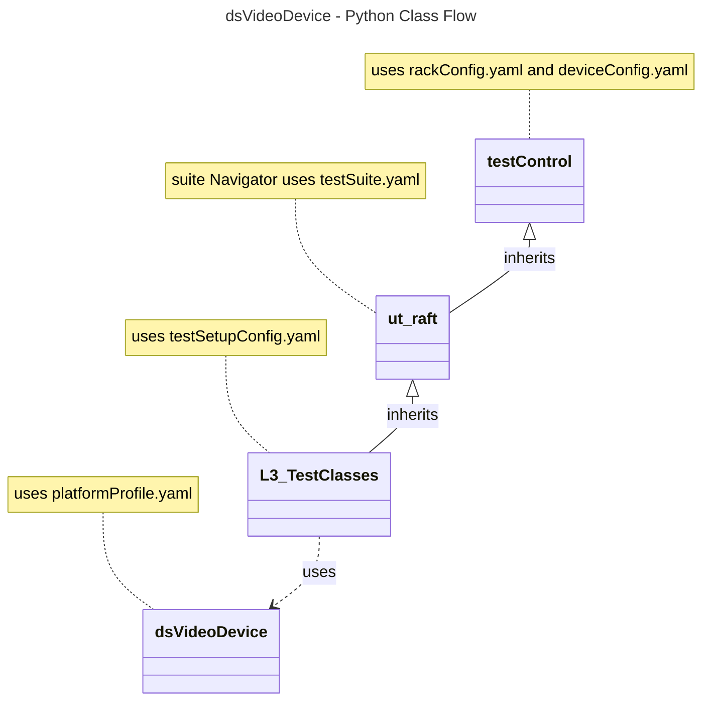

# Device Settings Video Device L3 Low Level Test Specification and Procedure Documentation

## Table of Contents

- [Overview](#overview)
- [Acronyms, Terms and Abbreviations](#acronyms-terms-and-abbreviations)
- [References](#references)
- [Level 3 Test cases High Level Overview](#level-3-test-cases-high-level-overview)
- [Level 3 Python Test](#level-3-python-test-cases-high-level-overview)

## Overview

This document describes the L3 Low Level Test Specification and Procedure Documentation for the Device Settings Video Device module.

### Acronyms, Terms and Abbreviations

- `HAL` \- Hardware Abstraction Layer, may include some common components
- `DFC`  \- Decoder Format Conversion
- `OEM` \- Original Equipment Manufacture
- `SoC` \- System on a Chip
- `L3`   \- Level 3 Testing
- `DS`   \- Device Settings
- `HDR`  \- High Dynamic Range
- `FPS`  \- Frames Per Second.
- `FRF`  \- Frame Rate Frequency
- `HEVC` \- High Efficiency Video Coding
- `RAFT`  \- Rapid Automation Framework for Testing
- `DUT`   \- Device Under Test
- `NA`   \- Not Applicable
- `Y`    \- Yes

### References

- `High Level Test Specification` - [dsVideoDevice High Level TestSpec](ds-video-device_High-Level_TestSpec.md)
- `Interface header` - [dsVideoDevice HAL header](https://github.com/rdkcentral/rdk-halif-device_settings/blob/main/include/dsVideoDevice.h)

## Video Streams Requirement
|#|Streams Name|Streams description|
|-|------------|-------------------|
|1|BounceBall_3840x2160_23.98fps|Framerate Per Second: 23.98fps|
|2|BounceBall_3840x2160_24fps|Framerate Per Second: 24fps|
|3|BounceBall_3840x2160_25fps|Framerate Per Second: 25fps|
|4|BounceBall_3840x2160_29.97fps|Framerate Per Second: 29.97fps|
|5|BounceBall_3840x2160_30fps|Framerate Per Second: 30fps|
|6|BounceBall_3840x2160_50fps|Framerate Per Second: 50fps|
|7|BounceBall_3840x2160_59.94fps|Framerate Per Second: 59.94fps|
|8|BounceBall_3840x2160_60fps|Framerate Per Second: 60fps|

## Level 3 Test Cases High Level Overview
Below are top test use-case for the Video Display.

|#|Test-case|Description|HAL APIs|Source|Sink|Streams Number|
|-|---------|-----------|--------|------|----|--------------|
|1|Verify the Video Display framerate change with pre and post change callback.|Set the supported diplay framrates using `dsSetDisplayframerate()` and check the callback is triggered before and after when the framerate of a display changes|`dsRegisterFrameratePreChangeCB()`, `dsRegisterFrameratePostChangeCB()`|`NA`|`Y`|`NA`|
|2|Set and verify the Zoom mode of the source device|Play any video content and Set the supported Zoom mode and verify the selected Zoom mode|`dsSetDFC()`, `dsGetDFC()`|`Y`|`NA`|1,2|
|3|Select the Device Frame Rate of Sink device|Select the Device Frame Rate of Sink device and on playing video playback verify `dsSetDisplayframerate()`|`dsSetDisplayframerate()`|`NA`|`Y`|1,2,3,4,5,6,7,8|
|4|Set and verify the `FRF` mode|Select the`FRF`mode and verify the selected `FRF` mode with video playback|`dsSetFRFMode()`|`NA`|`Y`|1,2,3,4,5,6,7,8|

## Level 3 Python Test Cases High Level Overview

The class diagram below illustrates the flow of dsVideoDevice L3 Python test cases:

- **testControl**
  - Test Control Module for running rack Testing. This module configures the `DUT` based on the rack configuration file provided to the test.
  - This class is defined in `RAFT` framework. For more details refer [RAFT](https://github.com/rdkcentral/python_raft/blob/1.0.0/README.md)
- **ut_raft**
  - Python based testing framework for writing engineering tests.
  - It provides common functionalities like menu navigation, configuration reader, reading user response etc.
  - For more details [ut-raft](https://github.com/rdkcentral/ut-raft).
- **dsVideoDevice**
  - This is test helper class which communicates with the `L3` C/C++ test running on the `DUT` through menu
- **L3_TestClasses**
  - These are the L3 test case classes
  - Each class covers the each test use-case defined in [L3 Test use-cases](#level-3-test-cases-high-level-overview) table

### YAML File Inputs

- **rackConfig.yaml**
  - Identifies the rack configuration and platform used
  - References platform-specific config from `deviceConfig.yaml`
  - For more details refer [RAFT](https://github.com/rdkcentral/python_raft/blob/1.0.0/README.md) and [example_rack_config.yml](https://github.com/rdkcentral/python_raft/blob/1.0.0/examples/configs/example_rack_config.yml)

- **deviceConfig.yaml**
  - Specifies overall configuration for the platform
  - Can be overridden by:
    - Changing locally .yaml file directory
    - Using --deviceConfig command line switch
  - For more details refer [RAFT](https://github.com/rdkcentral/python_raft/blob/1.0.0/README.md) and [example_device_config.yml](https://github.com/rdkcentral/python_raft/blob/1.0.0/examples/configs/example_device_config.yml)

- **componentProfile.yaml/platformProfile.yaml**
  - Contains component-specific configurations
  - Contains platform wide configuration broken down into separate components
  - Example configuration file [dsVideoDevice_Settings](https://github.com/rdkcentral/rdk-halif-test-device_settings/blob/3.0.0/profiles/sink/Sink_VideoDevice.yaml)

- **testSetupConfig.yaml**
  - This configuration file contains the list of requirements for tests to execute. Eg: Copying the streams, setting environment variables etc.
  - Example configuration file [dsVideoDevice_L3_testSetup.yml](../../../host/tests/dsVideoDevice_L3_Tests/dsVideoDevice_L3_testSetup.yml)

- **testSuite.yaml**
  - This configuration file contains the list of menu items for C/C++ L3 test running on `DUT`
  - Example configuration file [dsVideoDevice_test_suite.yml](../../../host/tests/dsClasses/dsVideoDevice_test_suite.yml)
