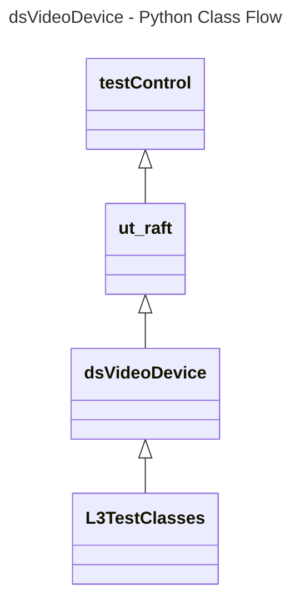

# Device Settings Video Device L3 Low Level Test Specification and Procedure Documentation

## Table of Contents

- [Overview](#overview)
- [Acronyms, Terms and Abbreviations](#acronyms-terms-and-abbreviations)
- [References](#references)
- [Level 3 Test cases High Level Overview](#level-3-test-cases-high-level-overview)
- [Level 3 Python Test](#level-3-python-test-cases-high-level-overview)

## Overview

This document describes the L3 Low Level Test Specification and Procedure Documentation for the Device Settings Video Device module.

### Acronyms, Terms and Abbreviations

- `HAL` \- Hardware Abstraction Layer, may include some common components
- `DFC`  \- Decoder Format Conversion
- `OEM` \- Original Equipment Manufacture
- `SoC` \- System on a Chip
- `L3`   \- Level 3 Testing
- `DS`   \- Device Settings
- `HDR`  \- High Dynamic Range
- `FPS`  \- Frames Per Second.
- `FRF`  \- Frame Rate Frequency
- `HEVC` \- High Efficiency Video Coding
- `RAFT`  \- Rapid Automation Framework for Testing
- `DUT`   \- Device Under Test
- `NA`   \- Not Applicable
- `Y`    \- Yes

### References

- `High Level Test Specification` - [dsVideoDevice High Level TestSpec](ds-video-device_High-Level_TestSpec.md)
- `Interface header` - [dsVideoDevice HAL header](https://github.com/rdkcentral/rdk-halif-device_settings/blob/main/include/dsVideoDevice.h)

## Level 3 Test Cases High Level Overview
Below are top test use-case for the Video Display.

|#|Test-case|Description|HAL APIs|Source|Sink|
|-|---------|-----------|--------|------|----|
|1|Verify the Video Display framerate change with pre-change callback.|Play any video content and check the callback is triggered before when the framerate of a display changes|`dsRegisterFrameratePreChangeCB()`|`NA`|`Y`|
|2|Verify the Video Display framerate change with post-change callback|Play any video content and check the callback is triggered after when the framerate of a display changes|`dsRegisterFrameratePostChangeCB()`|`NA`|`Y`|
|3|Set and verify the Zoom mode of the source device|Set the Zoom mode and verify the selected Zoom mode|`dsSetDFC()`, `dsGetDFC()`|`Y`|`NA`|
|4|Select the Device Frame Rate of Sink device|Select the Device Frame Rate of Sink device and verify|`dsSetDisplayframerate()`|`NA`|`Y`|
|5|Set and verify the `FRF` mode|Select the`FRF`mode and verify the selected `FRF` mode|`dsSetFRFMode()`,`dsGetFRFMode()`|`NA`|`Y`|
|6|Check Video coding Formats and information|Select the supported video device and the get Video coding format using `dsGetSupportedVideoCodingFormats()` and get Video codec information for video device using `dsGetVideoCodecInfo()`|`dsGetSupportedVideoCodingFormats()`,`dsGetVideoCodecInfo()`|`Y`|`NA`|

## Level 3 Python Test Cases High Level Overview

The class diagram below illustrates the flow of dsVideoDevice L3 Python test cases:

- **testControl**
  - Test Control Module for running rack Testing. This module configures the `DUT` based on the rack configuration file provided to the test.
  - This class is defined in `RAFT` framework. For more details refer [RAFT](https://github.com/rdkcentral/python_raft/blob/1.0.0/README.md)
- **ut_raft**
  - Python based testing framework for writing engineering tests.
  - It provides common functionalities like menu navigation, configuration reader, reading user response etc.
  - For more details [ut-raft](https://github.com/rdkcentral/ut-raft).
- **dsVideoDevice**
  - This is test helper class which communicates with the `L3` C/C++ test running on the `DUT` through menu
- **L3TestClasses**
  - These are the L3 test case classes
  - Each class covers the each test use-case defined in [L3 Test use-cases](#level-3-test-cases-high-level-overview) table

# TODO: Configuration examples with class diagrams will be added at a later stage.
