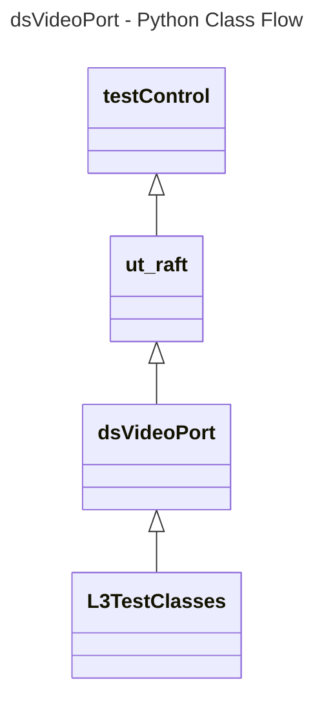
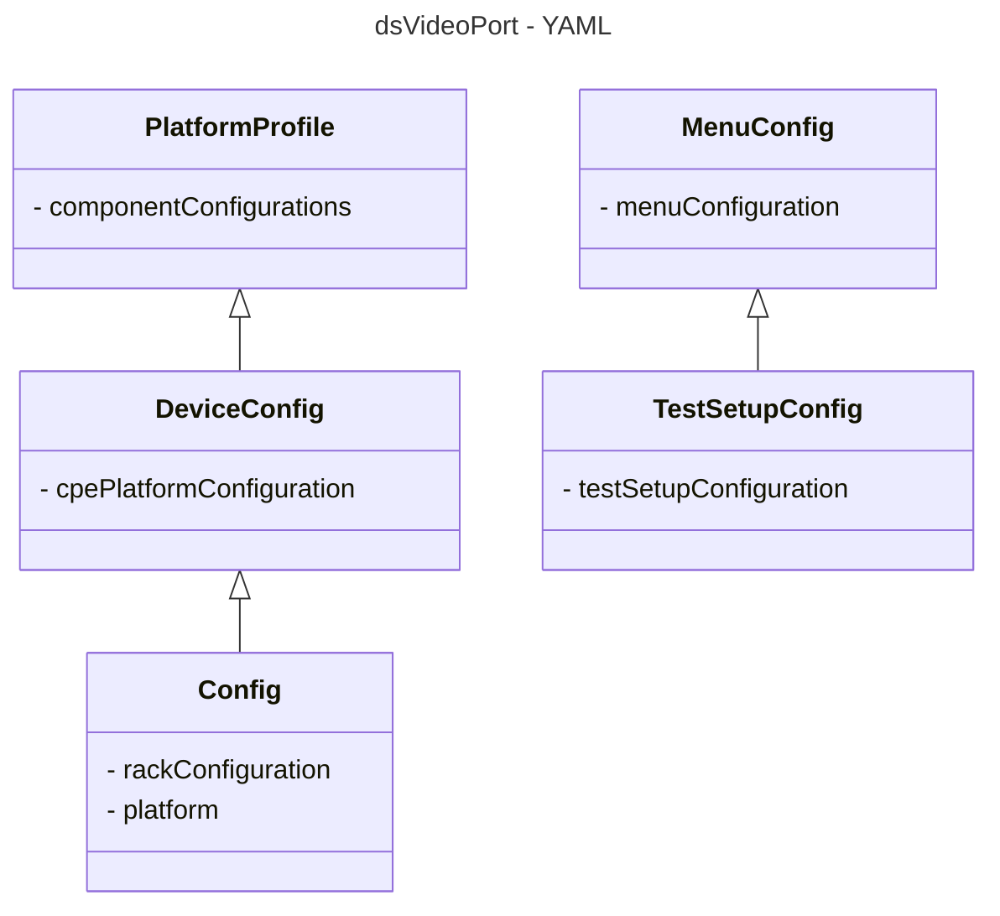

# Device Settings Video Port L3 Low Level Test Specification and Procedure Documentation

## Table of Contents

- [Overview](#overview)
- [Acronyms, Terms and Abbreviations](#acronyms-terms-and-abbreviations)
- [References](#references)
- [Level 3 Test cases High Level Overview](#level-3-test-cases-high-level-overview)
- [Level 3 Python Test Cases High Level Overview](#level-3-python-test-cases-high-level-overview)

## Overview

This document describes the L3 Low Level Test Specification and Procedure Documentation for the Device Settings Video Port module.

### Acronyms, Terms and Abbreviations

- `HAL` \- Hardware Abstraction Layer, may include some common components
- `UT`  \- Unit Test(s)
- `OEM` \- Original Equipment Manufacture
- `SoC` \- System on a Chip
- `HDMI`\- High-Definition Multimedia Interface
- `HDCP`\- High-bandwidth Digital Content Protection
- `HDR` \- High Dynamic Range
- `HLG` \- Hybrid Log-Gamma
- `SDR` \- Standard Dynamic Range
- `Y`   \- yes supported
- `NA`  \- Not Supported

### References

- `High Level Test Specification` - [dsVideoPort High Level TestSpec](ds-video-port_High-Level_TestSpec.md)
- `Interface header` - [dsVideoPort HAL header](https://github.com/rdkcentral/rdk-halif-device_settings/blob/main/include/dsVideoPort.h)

## Level 3 Test Cases High Level Overview

|#|Streams Name|Streams description|
|-|------------|-------------------|
|1|vts_HDR10_stream|Format: HDR10,Resolution: 3840 x 2160 (4K UHD),Color Depth: 10-bit,Color Space: Rec. 2020|
|2|vts_SDR_stream|Format: SDR,Resolution: 1920 x 1080|
|3|vts_HLG_stream|Format: HLG,Resolution: 3840 x 2160 or It can also be used with 1080p and 720p resolutions.|
|4|vts_DolbyVision_stream|Format: Dolby Vision,Resolution: 3840 x 2160 (4K UHD),Color Depth: 10/12-bit,Color Space: Rec. 2020format and dynamic metadata.|
|5|vts_HDR10plus_stream|Format: HDR10,Resolution: 3840 x 2160 (4K UHD),Color Depth: 10-bit,Color Space: Rec. 2020 and dynamic metadata capabilities.|

Each test case need to verify with the each supported video port.
Below are top test use-case for the video port.

|#|Test-case|Description|HAL APIs|Source|Sink|Streams Number|
|-|---------|-----------|--------|------|----|--------------|
|1|Verify the Video content Formats with callbacks|Play the pre-defined streams with different video content format(`HDR`,`HLG`,DolbyVision,..) and check the callbacks is triggered when the video content format changes|`dsVideoFormatUpdateRegisterCB()`|`Y`|`Y`|1,2,3,4,5|
|2|Check DisplayConnected|Verify the Display by enabling and disable each supported video port|`dsEnableVideoPort()`|`Y`|`Y`|1|
|3|Select the `HDCP` Version |Select the Supported `HDCP` version and verify|`dsSetHdmiPreference()`|`Y`|`Y`|`NA`|
|4|Verify the Resolution for source|Play the pre-defined stream and set supported resolution and verify the resolution of the TV|`dsSetResolution()`|`Y`|`NA`|1|
|5|Verify the `HDCP` status using callbacks for Source|Power off and power on TV or pug/unplug `HDMI` and Check the `HDCP` status using callbacks(i.e.UNPOWERED,AUTHENTICATED,..)|`dsEnableHDCP()`|`Y`|`NA`|`NA`|
|6|Select video content formats for Source |Select the Supported `HDR` modes & Verify the video content formats|`dsSetForceHDRMode()`|`Y`|`NA`|1,2,3,4,5|
|7|Resets the video output to `SDR` for Source |Play the `HDR` stream and verify the video content formats|`dsResetOutputToSDR()`|`Y`|`NA`|2|
|8|Select preferred color depth for Source|Select the Color depth from Supported list & verify|`dsSetPreferredColorDepth()`|`Y`|`NA`|`NA`|
|9|sets the background color for Source |Select the background color form supported list & verify|`dsSetBackgroundColor()`|`Y`|`NA`|`NA`|

## Level 3 Python Test Cases High Level Overview

The class diagram below illustrates the flow of dsVideoPort L3 Python test cases:



- **testControl**
  - Test Control Module for running rack Testing. This module configures the `DUT` based on the rack configuration file provided to the test.
  - This class is defined in `RAFT` framework. For more details refer [RAFT](https://github.com/rdkcentral/python_raft/blob/1.0.0/README.md)
- **ut_raft**
  - Python based testing framework for writing engineering tests.
  - It provides common functionalities like menu navigation, configuration reader, reading user response etc.
  - For more details [ut-raft](https://github.com/rdkcentral/ut-raft).
- **dsVideoPort**
  - This is test helper class which communicates with the `L3` C/C++ test running on the `DUT` through menu
- **L3TestClasses**
  - These are the L3 test case classes
  - Each class covers the each test use-case defined in [L3 Test use-cases](#level-3-test-cases-high-level-overview) table

## YAML File Inputs



- **config.yaml**
  - Identifies the rack configuration and platform used
  - References platform-specific config from `deviceConfig.yaml`
  - For more details refer [RAFT](https://github.com/rdkcentral/python_raft/blob/1.0.0/README.md) and [example_rack_config.yml](https://github.com/rdkcentral/python_raft/blob/1.0.0/examples/configs/example_rack_config.yml)

- **deviceConfig.yaml**
  - Specifies overall configuration for the platform
  - Can be overridden by:
    - Changing locally .yaml file directory
    - Using --deviceConfig command line switch
  - For more details refer [RAFT](https://github.com/rdkcentral/python_raft/blob/1.0.0/README.md) and [example_device_config.yml](https://github.com/rdkcentral/python_raft/blob/1.0.0/examples/configs/example_device_config.yml)

- **componentProfile.yaml/platformProfile.yaml**
  - Contains component-specific configurations
  - Contains platform wide configuration broken down into separate components
  - Example configuration file [dsVideoPort_Settings](https://github.com/rdkcentral/rdk-halif-test-device_settings/blob/main/profiles/sink/Sink_4K_VideoPort.yaml)

- **testSetupConfig.yaml**
  - This configuration file contains the list of requirements for tests to execute. Eg: Copying the streams, setting environment variables etc.
  - Example configuration file listed below:

```yaml
dsVideoPort:
  description: "dsVideoPort Device Settings test setup"
  assets:
    device:
      Common: #List of common requirements for all the tests
        artifacts:
          -  "<URL>/hal_test" #URL Path to the bin files to copy
          -  "<URL>/libut_control.so" #URL Path to the .so files if any to copy
          -  "<URL>/run.sh"
        execute:
          - ""  #prerequisites commands if required
        streams:
      test1_Verify_Video_Content_Formats_with_callbacks: #Requirements for specific test
        artifacts:
        execute:
        streams:
          - "<URL>/vts_HDR10_stream" #URL path to the test streams
          - "<URL>/vts_SDR_stream" #URL path to the test streams
      test2_PortConnectionStatus:
        artifacts:
        execute:
        streams:
          - "<URL>/vts_DolbyVision_stream" #URL path to the test streams
          - "<URL>/vts_HDR10plus_stream" #URL path to the test streams
    host:
      menu_config: "../../assets/dsVideoPort_L3_menu.yml" #Menu configuration file
```

- **menuConfig**
  - This configuration file contains the list of menu items for C/C++ L3 test running on `DUT`
  - Example configuration file listed below:

```yaml
dsVideoPort:
  description: "dsVideoPort Device Settings testing profile / menu system for UT"
  test:
  control:
    menu:
      type: UT-C # C (UT-C Cunit) / C++ (UT-G (g++ ut-core gtest backend))
      groups:
          name: "L3 dsVideoPort "
          menu_initialize:
            name: "Initialize dsVideoPort"
          menu_enable:
            name: "Enable Video Port"
            input:
                - "Select dsVideoPort Port"
                - "Select INTERNAL Type"
          menu_disable:
            name: "Disable Video Port"
            input:
                - "Select dsVideoPort Port"
```

## Test Execution

- Folder Structure
  - assets
    - testSetupConfig.yaml
    - menuConfig.yaml
  - host
    - tests
      - helpers
        - dsVideoPortTestHelper.py
      - dsVideoPort_test1_XYZ.py
      - dsVideoPort_test2_XYZ.py

- User runs test (eg: test1_XYZ.py)
  - Chooses platform via --config config.yaml and config file
  - --slot 1 is default (optional)
  - Test reads the testSetupConfig.yaml from the assets folder
- Test extracts
  - Specific component configuration
  - validationProfile for the platform
  - Specific test setup requirements
  - Specific test menu configurations
