# DSVIDEOPORT L2 Low Level Test Specification and Procedure Documentation

## Table of Contents

- [DSVIDEOPORT L2 Low Level Test Specification and Procedure Documentation](#dsvideoport-l2-low-level-test-specification-and-procedure-documentation)

  - [Table of Contents](#table-of-contents)
  - [Overview](#overview)
    - [Acronyms, Terms and Abbreviations](#acronyms-terms-and-abbreviations)
    - [Definitions](#definitions)
    - [References](#references)
  - [Level 2 Test Procedure](#level-2-test-procedure)

## Overview

This document describes the level 2 testing suite for the DSVIDEOPORT module.

### Acronyms, Terms and Abbreviations

- `HAL` \- Hardware Abstraction Layer, may include some common components
- `UT`  \- Unit Test(s)
- `OEM`  \- Original Equipment Manufacture
- `SoC`  \- System on a Chip

### Definitions

  - `ut-core` \- Common Testing Framework <https://github.com/rdkcentral/ut-core>, which wraps a open-source framework that can be expanded to the requirements for future framework.

### References
- `High Level Test Specification` - [ds-video-port_High-Level_TestSpec..md](ds-video-port_High-Level_TestSpec.md)

## Level 2 Test Procedure

The following functions are expecting to test the module operates correctly.

### Test 1

|Title|Details|
|--|--|
|Function Name|`test_l2_dsVideoPort_EnableDisableVideoPort`|
|Description|Get each video port handle, check each Video Port enable/disable status. If port is disabled, enable it and check the each port status.|
|Test Group|Module : 02|
|Test Case ID|001|
|Priority|High|

**Pre-Conditions :**
None

**Dependencies :**
None

**User Interaction :**
If user chose to run the test in interactive mode, then the test case has to be selected via console.

#### Test Procedure :

| Variation / Steps | Description | Test Data | Expected Result | Notes|
| -- | --------- | ---------- | -------------- | ----- |
| 01 | Initialize the Video Port sub-system using dsVideoPortInit() | None | dsERR_NONE | Should be successful |
| 02 | Loop through each type of video port and get the handle for the video port using dsGetVideoPort() | type = dsVIDEOPORT_TYPE_RF to dsVIDEOPORT_TYPE_MAX, index = 0 | dsERR_NONE | Should be successful |
| 03 | Check if the video port is enabled using dsIsVideoPortEnabled() | handle = obtained from dsGetVideoPort() | dsERR_NONE | Should be successful |
| 04 | If the video port is disabled, enable it using dsEnableVideoPort() | handle = obtained from dsGetVideoPort(), enabled = true | dsERR_NONE | Should be successful |
| 05 | Check if the video port is now enabled using dsIsVideoPortEnabled() | handle = obtained from dsGetVideoPort() | dsERR_NONE, enabled = true | Should be successful |
| 06 | Terminate the Video Port sub-system using dsVideoPortTerm() | None | dsERR_NONE | Should be successful |

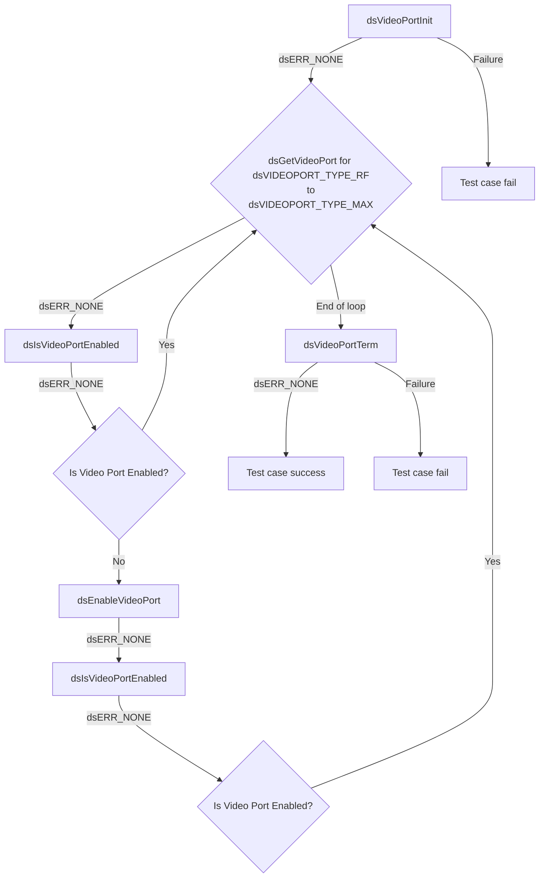
```mermaid
graph TB
    A[dsVideoPortInit] -->|dsERR_NONE| B{dsGetVideoPort for <br> dsVIDEOPORT_TYPE_RF <br> to dsVIDEOPORT_TYPE_MAX}
    A -->|Failure| A1[Test case fail]
    B -->|dsERR_NONE| C[dsIsVideoPortEnabled]
    C -->|dsERR_NONE| D{Is Video Port Enabled?}
    D -->|No| E[dsEnableVideoPort]
    D -->|Yes| B
    E -->|dsERR_NONE| G[dsIsVideoPortEnabled]
    G -->|dsERR_NONE| H{Is Video Port Enabled?}
    H -->|Yes| B
    B -->|End of loop| K
    K[dsVideoPortTerm] -->|dsERR_NONE| L[Test case success]
    K -->|Failure| K1[Test case fail]
```

### Test 2

|Title|Details|
|--|--|
|Function Name|`test_l2_dsVideoPort_VerifyDisplayConnectionStatus`|
|Description|Verify each port display connected/disconnected status without video port connected|
|Test Group|Module : 02|
|Test Case ID|002|
|Priority|High|

**Pre-Conditions :**
None

**Dependencies :**
None

**User Interaction :**
If user chose to run the test in interactive mode, then the test case has to be selected via console.

#### Test Procedure :

| Variation / Steps | Description | Test Data | Expected Result | Notes|
| -- | --------- | ---------- | -------------- | ----- |
| 01 | Initialize video port using dsVideoPortInit | None | dsERR_NONE | Should be successful |
| 02 | Loop through each type of video port and get the handle for the video port using dsGetVideoPort()| type = dsVIDEOPORT_TYPE_RF to dsVIDEOPORT_TYPE_MAX, index = 0 | dsERR_NONE | Should be successful |
| 03 | Check display connection status using dsIsDisplayConnected with handle obtained from dsGetVideoPort | handle=handle obtained from dsGetVideoPort | dsERR_NONE, connected=false | Should be successful |
| 04 | Check if video port is active using dsIsVideoPortActive with handle obtained from dsGetVideoPort | handle=handle obtained from dsGetVideoPort | dsERR_NONE, active=false | Should be successful |
| 05 | Terminate video port using dsVideoPortTerm | None | dsERR_NONE | Should be successful |

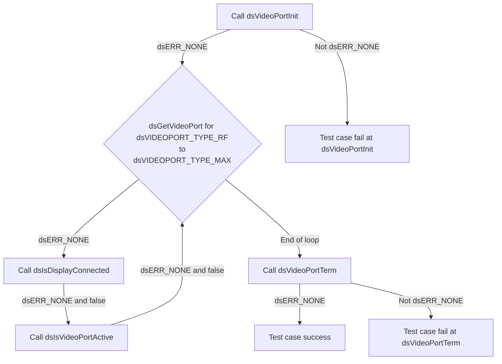
```mermaid
graph TB
A[Call dsVideoPortInit] -->|dsERR_NONE| B{dsGetVideoPort for <br> dsVIDEOPORT_TYPE_RF <br> to dsVIDEOPORT_TYPE_MAX}
B -->|dsERR_NONE| C[Call dsIsDisplayConnected]
C -->|dsERR_NONE and false| D[Call dsIsVideoPortActive]
B -->|End of loop |E[Call dsVideoPortTerm]
D -->|dsERR_NONE and false| B
E -->|dsERR_NONE| F[Test case success]
A -->|Not dsERR_NONE| G[Test case fail at dsVideoPortInit]
E -->|Not dsERR_NONE| K[Test case fail at dsVideoPortTerm]
```

### Test 3

|Title|Details|
|--|--|
|Function Name|`test_l2_dsVideoPort_VerifyDisplaySurround_sink`|
|Description|Get the surround mode capabilities of each port and verify with configuration YAML file 'Panel_4K_VideoPort.yaml'. If it is a sink device, the value to be retrieved from the YAML file is Ports/PortNo/Display_surrond" where PortNo is 1 as sink device has only INTERNAL port.|
|Test Group|Module : 02|
|Test Case ID|003|
|Priority|High|

**Pre-Conditions :**
None

**Dependencies :**
None

**User Interaction :**
If user chose to run the test in interactive mode, then the test case has to be selected via console.

#### Test Procedure :

| Variation / Steps | Description | Test Data | Expected Result | Notes|
| -- | --------- | ---------- | -------------- | ----- |
| 01 | Initialize the video port using dsVideoPortInit() | None | dsERR_NONE | Should be successful |
| 02 | Loop through each type of video port and get the handle for the video port using dsGetVideoPort()| type = dsVIDEOPORT_TYPE_RF to dsVIDEOPORT_TYPE_MAX, index = 0 | dsERR_NONE | Should be successful |
| 03 | Check if the display is in surround mode using dsIsDisplaySurround() | handle obtained from dsGetVideoPort() | dsERR_NONE | Should be successful |
| 04 | Retrieve the surround mode value from the YAML configuration file | Path = "Ports/1/Display_surrond" | Value from YAML file | Should be successful |
| 05 | Compare the value obtained from the API dsIsDisplaySurround() and the value retrieved from the YAML file | surround = value from dsIsDisplaySurround(), yamlSurround = value from YAML file | surround should be equal to yamlSurround | Should be successful |
| 06 | Terminate the video port using dsVideoPortTerm() | None | dsERR_NONE | Should be successful |

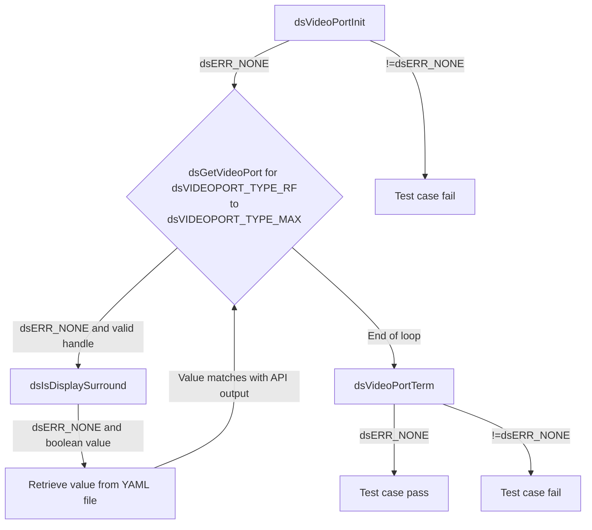
```mermaid
graph TB
A[dsVideoPortInit] -->|dsERR_NONE| B{dsGetVideoPort for <br> dsVIDEOPORT_TYPE_RF <br> to dsVIDEOPORT_TYPE_MAX}
B -->|dsERR_NONE and valid handle| C[dsIsDisplaySurround]
C -->|dsERR_NONE and boolean value| D[Retrieve value from YAML file]
D -->|Value matches with API output| B
B -->|End of loop| E[dsVideoPortTerm]
E -->|dsERR_NONE| F[Test case pass]
A -->|!=dsERR_NONE| G[Test case fail]
E -->|!=dsERR_NONE| K[Test case fail]
```

### Test 4

|Title|Details|
|--|--|
|Function Name|`test_l2_dsVideoPort_VerifySurroundModeCapabilities_source`|
|Description|Verify the each port surround mode capabilities of connected display and verify with configuration file|
|Test Group|Module : 02|
|Test Case ID|004|
|Priority|High|

**Pre-Conditions :**
None

**Dependencies :**
None

**User Interaction :**
If user chose to run the test in interactive mode, then the test case has to be selected via console.

#### Test Procedure :

| Variation / Steps | Description | Test Data | Expected Result | Notes|
| -- | --------- | ---------- | -------------- | ----- |
| 01 | Initialize the video port using dsVideoPortInit() | None | dsERR_NONE | Should be successful |
| 02 | Loop through each type of video port and get the handle for the video port using dsGetVideoPort()| type = dsVIDEOPORT_TYPE_RF to dsVIDEOPORT_TYPE_MAX, index = 0 | Should be successful |
| 03 | Check if the display supports surround mode using dsIsDisplaySurround() with the obtained handle | handle=obtained from step 02 | dsERR_NONE | Should be successful |
| 04 | If surround is supported, get the surround mode using dsGetSurroundMode() with the obtained handle | handle=obtained from step 02 | dsERR_NONE | Should be successful |
| 05 | Verify the obtained surround mode with the configuration file | surroundMode=obtained from step 04 | Not applicable | Not implemented in the given code |
| 06 | Terminate the video port using dsVideoPortTerm() | None | dsERR_NONE | Should be successful |

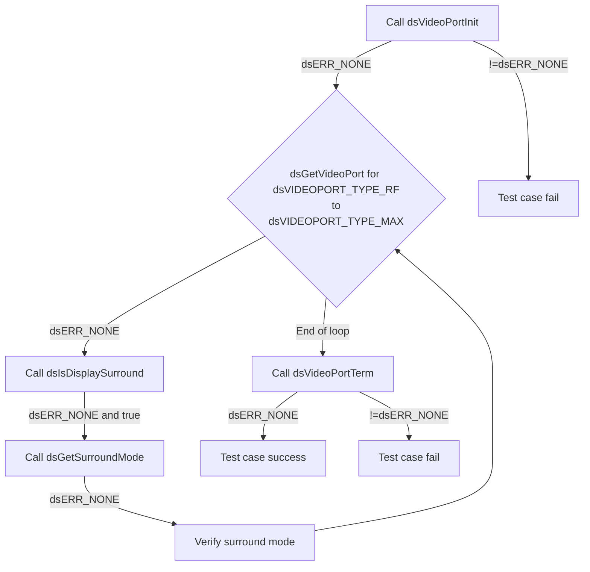
```mermaid
graph TB
A[Call dsVideoPortInit] -->|dsERR_NONE| B{dsGetVideoPort for <br> dsVIDEOPORT_TYPE_RF <br> to dsVIDEOPORT_TYPE_MAX}
A -->|!=dsERR_NONE| A1[Test case fail]
B -->|dsERR_NONE| C[Call dsIsDisplaySurround]
C -->|dsERR_NONE and true| D[Call dsGetSurroundMode]
D -->|dsERR_NONE| E[Verify surround mode]
E --> B
B -->|End of loop| F[Call dsVideoPortTerm]
F -->|dsERR_NONE| G[Test case success]
F -->|!=dsERR_NONE| F1[Test case fail]
```

### Test 5

|Title|Details|
|--|--|
|Function Name|`test_l2_dsVideoPort_SetAndGetVideoPortProperties`|
|Description|Set each Video port properties like pixel resolution, Aspect ratio, Stereo Scopic modes, frame rates & scan modes and looping through with supported values. Verify using get function.|
|Test Group|Module : 02|
|Test Case ID|005|
|Priority|High|

**Pre-Conditions :**
None

**Dependencies :**
None

**User Interaction :**
If user chose to run the test in interactive mode, then the test case has to be selected via console.

#### Test Procedure :

| Variation / Steps | Description | Test Data | Expected Result | Notes|
| -- | --------- | ---------- | -------------- | ----- |
| 01 | Initialize the video port using dsVideoPortInit() | None | dsERR_NONE | Should be successful |
| 02 | Loop through each type of video port and get the handle for the video port using dsGetVideoPort()| type = dsVIDEOPORT_TYPE_RF to dsVIDEOPORT_TYPE_MAX, index = 0 | dsERR_NONE | Should be successful |
| 03 | Loop through all possible pixel resolutions, aspect ratios, stereoscopic modes, frame rates and scan modes | pixelResolution = i, aspectRatio = j, stereoScopicMode = k, frameRate = l, interlaced = false | dsERR_NONE | Should be successful |
| 04 | Set the resolution using dsSetResolution() | handle, &setResolution | dsERR_NONE | Should be successful |
| 05 | Get the resolution using dsGetResolution() | handle, &getResolution | dsERR_NONE | Should be successful |
| 06 | Verify that the set and get resolutions are equal | setResolution, getResolution | setResolution == getResolution | Should be successful |
| 07 | Terminate the video port using dsVideoPortTerm() | None | dsERR_NONE | Should be successful |

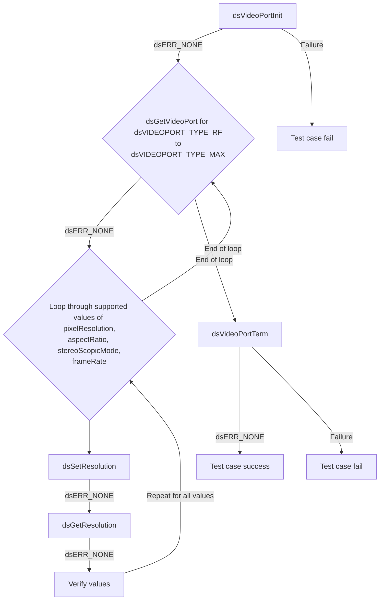
```mermaid
graph TB
A[dsVideoPortInit] -->|dsERR_NONE| B{dsGetVideoPort for <br> dsVIDEOPORT_TYPE_RF <br> to dsVIDEOPORT_TYPE_MAX}
A -->|Failure| A1[Test case fail]
B -->|dsERR_NONE| C{Loop through supported values of <br> pixelResolution, aspectRatio, <br> stereoScopicMode, frameRate }
C --> E[dsSetResolution]
C -->|End of loop| B
E -->|dsERR_NONE| F[dsGetResolution]
F -->|dsERR_NONE| G[Verify values]
G -->|Repeat for all values| C
B-->|End of loop| I[dsVideoPortTerm]
I -->|dsERR_NONE| J[Test case success]
I -->|Failure| I1[Test case fail]
```

### Test 6

|Title|Details|
|--|--|
|Function Name|`test_l2_dsVideoPort_VerifySupportedTvResolutions`|
|Description|Gets the each port supported resolutions of TV and verify with the configuration YAML file 'Panel_4K_VideoPort.yaml'. If it is a sink device, the value to be retrieved from the YAML file is Ports/PortNo/Supported_tv_resolutions_capabilities" where PortNo is 1 as sink device has only INTERNAL port.|
|Test Group|Module : 02|
|Test Case ID|006|
|Priority|High|

**Pre-Conditions :**
None

**Dependencies :**
None

**User Interaction :**
If user chose to run the test in interactive mode, then the test case has to be selected via console.

#### Test Procedure :

| Variation / Steps | Description | Test Data | Expected Result | Notes|
| -- | --------- | ---------- | -------------- | ----- |
| 01 | Initialize the video port using dsVideoPortInit | None | dsERR_NONE | Should be successful |
| 02 | Loop through each type of video port and get the handle for the video port using dsGetVideoPort()| type = dsVIDEOPORT_TYPE_RF to dsVIDEOPORT_TYPE_MAX, index = 0 | dsERR_NONE | Should be successful |
| 03 | Get the supported TV resolutions using dsSupportedTvResolutions with the handle obtained from dsGetVideoPort | handle, &resolutions | dsERR_NONE | Should be successful |
| 04 | Compare the value obtained from dsSupportedTvResolutions with the value retrieved from the YAML file | resolutions, "Ports/PortNo/Supported_tv_resolutions_capabilities" | Equal values | Should be successful |
| 05 | Terminate the video port using dsVideoPortTerm | None | dsERR_NONE | Should be successful |

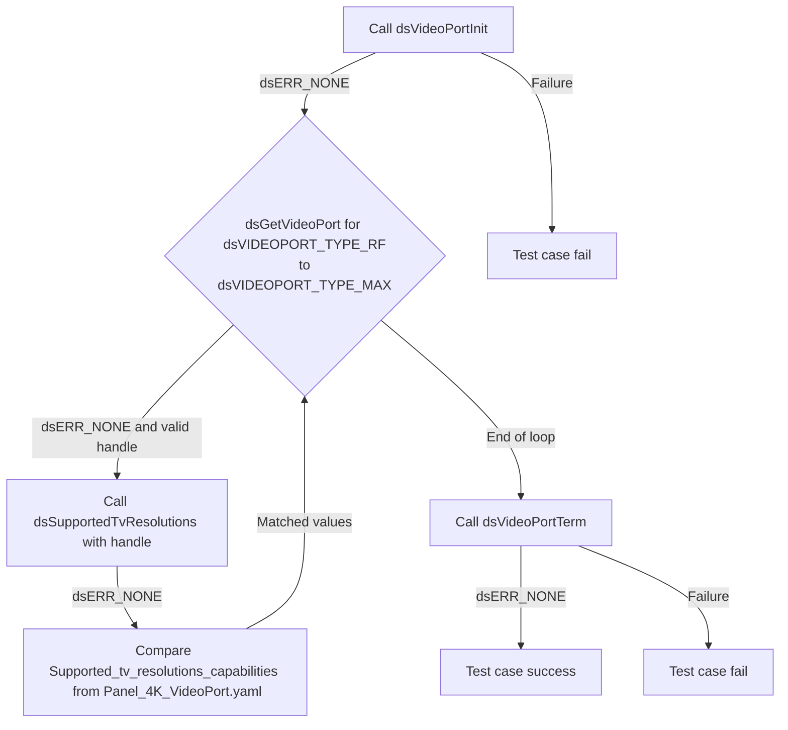
```mermaid
graph TB
    A[Call dsVideoPortInit] -->|dsERR_NONE| B{dsGetVideoPort for <br> dsVIDEOPORT_TYPE_RF <br> to dsVIDEOPORT_TYPE_MAX}
    B -->|dsERR_NONE and valid handle| C[Call dsSupportedTvResolutions with handle]
    C -->|dsERR_NONE| D[Compare Supported_tv_resolutions_capabilities <br> from Panel_4K_VideoPort.yaml]
    D -->|Matched values| B
    B --> |End of loop|E[Call dsVideoPortTerm]
    E -->|dsERR_NONE| F[Test case success]
    A -->|Failure| G[Test case fail]
    E -->|Failure| K[Test case fail]
```

### Test 7

|Title|Details|
|--|--|
|Function Name|`test_l2_dsVideoPort_GetAndVerifyHDRCapabilities`|
|Description|Get the each port HDR capabilities & verify with the configuration YAML file 'Panel_4K_VideoPort.yaml'. If it is a sink device, the value to be retrieved from the YAML file is Ports/PortNo/hdr_capabilities" where PortNo is 1 as sink device has only INTERNAL port.|
|Test Group|Module : 02|
|Test Case ID|007|
|Priority|High|

**Pre-Conditions :**
None

**Dependencies :**
None

**User Interaction :**
If user chose to run the test in interactive mode, then the test case has to be selected via console.

#### Test Procedure :

| Variation / Steps | Description | Test Data | Expected Result | Notes|
| -- | --------- | ---------- | -------------- | ----- |
| 01 | Initialize the video port using dsVideoPortInit() | None | dsERR_NONE | Should be successful |
| 02 | Loop through each type of video port and get the handle for the video port using dsGetVideoPort()| type = dsVIDEOPORT_TYPE_RF to dsVIDEOPORT_TYPE_MAX, index = 0 | dsERR_NONE | Should be successful |
| 03 | Get the HDR capabilities using dsGetTVHDRCapabilities() | handle = obtained from step 02 | dsERR_NONE | Should be successful |
| 04 | Retrieve the HDR capabilities from the YAML file | yaml_capabilities = "Ports/1/hdr_capabilities" | None | Should be successful |
| 05 | Compare the HDR capabilities obtained from the API and the YAML file | capabilities = obtained from step 03, yaml_capabilities = obtained from step 04 | capabilities should be equal to yaml_capabilities | Should be successful |
| 06 | Terminate the video port using dsVideoPortTerm() | None | dsERR_NONE | Should be successful |

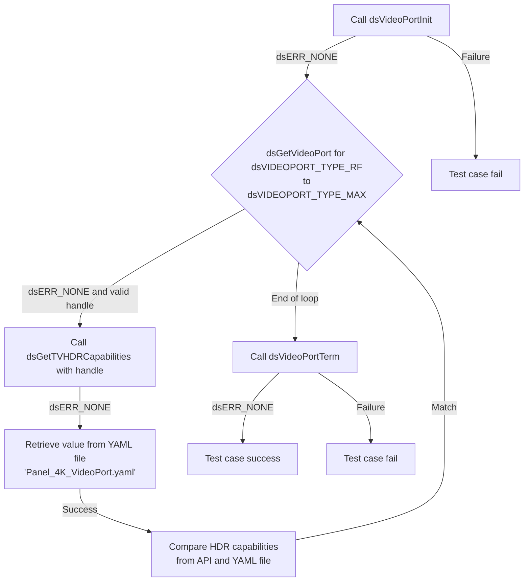
```mermaid
graph TB
A[Call dsVideoPortInit] -->|dsERR_NONE| B{dsGetVideoPort for <br> dsVIDEOPORT_TYPE_RF <br> to dsVIDEOPORT_TYPE_MAX}
A -->|Failure| A1[Test case fail]
B -->|dsERR_NONE and valid handle| C[Call dsGetTVHDRCapabilities with handle]
C -->|dsERR_NONE| D[Retrieve value from YAML <br> file 'Panel_4K_VideoPort.yaml']
D -->|Success| E[Compare HDR capabilities <br> from API and YAML file]
E -->|Match| B
B -->|End of loop| F[Call dsVideoPortTerm]
F -->|dsERR_NONE| G[Test case success]
F -->|Failure| F1[Test case fail]
```

### Test 8

|Title|Details|
|--|--|
|Function Name|`test_l2_dsVideoPort_SetAndGetForceDisable4KSupport`|
|Description|Set Force Disable 4KSupport for each port and verify with get function|
|Test Group|Module : 02|
|Test Case ID|008|
|Priority|High|

**Pre-Conditions :**
None

**Dependencies :**
None

**User Interaction :**
If user chose to run the test in interactive mode, then the test case has to be selected via console.

#### Test Procedure :

| Variation / Steps | Description | Test Data | Expected Result | Notes|
| -- | --------- | ---------- | -------------- | ----- |
| 01 | Initialize the video port subsystem using dsVideoPortInit() | None | dsERR_NONE | Should be successful |
| 02 | Loop through each type of video port and get the handle of the video port using dsGetVideoPort() | type = dsVIDEOPORT_TYPE_RF to dsVIDEOPORT_TYPE_MAX, index = 0 | dsERR_NONE | Should be successful |
| 03 | Forcefully disable 4K support for each video port using dsSetForceDisable4KSupport() | handle = obtained from dsGetVideoPort(), disable = true | dsERR_NONE | Should be successful |
| 04 | Verify if 4K support is forcefully disabled for each video port using dsGetForceDisable4KSupport() | handle = obtained from dsGetVideoPort() | dsERR_NONE, disable = true | Should be successful |
| 05 | Terminate the video port subsystem using dsVideoPortTerm() | None | dsERR_NONE | Should be successful |

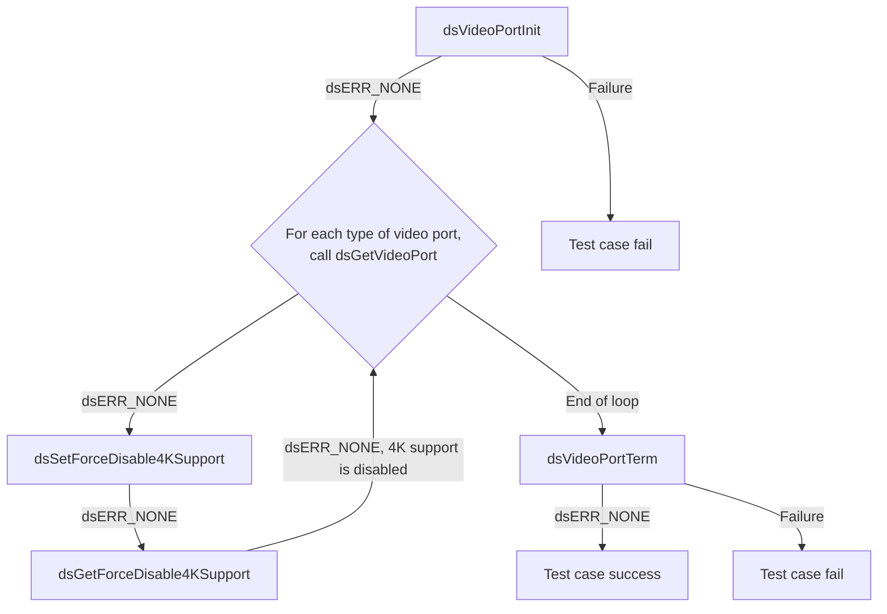
```mermaid
graph TB
    A[dsVideoPortInit] -->|dsERR_NONE| B{For each type of video port, <br> call dsGetVideoPort }
    B -->|dsERR_NONE| D[dsSetForceDisable4KSupport]
    D -->|dsERR_NONE| E[dsGetForceDisable4KSupport]
    E -->|dsERR_NONE, 4K support is disabled| B
    B -->|End of loop| I[dsVideoPortTerm]
    I -->|dsERR_NONE| J[Test case success]
    A -->|Failure| K[Test case fail]
    I -->|Failure| R[Test case fail]
```

### Test 9

|Title|Details|
|--|--|
|Function Name|`test_l2_dsVideoPort_CheckHDCPStatus`|
|Description|Check each port HDCP status and verify is dsHDCP_STATUS_AUTHENTICATED return for sink and dsHDCP_STATUS_UNPOWERED/dsHDCP_STATUS_PORTDISABLED for source|
|Test Group|Module : 02|
|Test Case ID|009|
|Priority|High|

**Pre-Conditions :**
None

**Dependencies :**
None

**User Interaction :**
If user chose to run the test in interactive mode, then the test case has to be selected via console.

#### Test Procedure :

| Variation / Steps | Description | Test Data | Expected Result | Notes|
| -- | --------- | ---------- | -------------- | ----- |
| 01 | Initialize the video port using dsVideoPortInit() | None | dsERR_NONE | Should be successful |
| 02 | Loop through each type of video port and get the handle of the video port using dsGetVideoPort() | type = dsVIDEOPORT_TYPE_RF to dsVIDEOPORT_TYPE_MAX, index = 0 | dsERR_NONE | Should be successful |
| 03 | Get the HDCP status using dsGetHDCPStatus() with the obtained handle | handle=obtained from previous step | dsERR_NONE | Should be successful |
| 04 | Verify the HDCP status. It should be either dsHDCP_STATUS_AUTHENTICATED, dsHDCP_STATUS_UNPOWERED or dsHDCP_STATUS_PORTDISABLED | status=obtained from previous step | dsHDCP_STATUS_AUTHENTICATED or dsHDCP_STATUS_UNPOWERED or dsHDCP_STATUS_PORTDISABLED | Should be successful |
| 05 | Terminate the video port using dsVideoPortTerm() | None | dsERR_NONE | Should be successful |

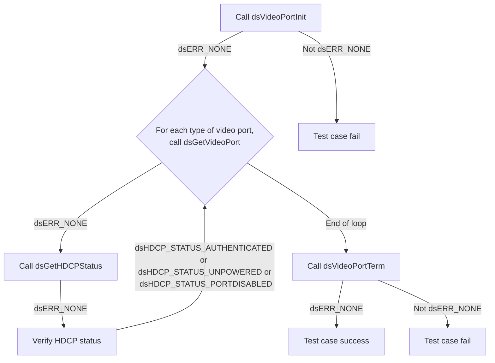
```mermaid
graph TB
A[Call dsVideoPortInit] -->|dsERR_NONE| B{For each type of video port, <br> call dsGetVideoPort }
A -->|Not dsERR_NONE| A1[Test case fail]
B -->|dsERR_NONE| C[Call dsGetHDCPStatus]
C -->|dsERR_NONE| D[Verify HDCP status]
D -->|dsHDCP_STATUS_AUTHENTICATED or <br> dsHDCP_STATUS_UNPOWERED or <br> dsHDCP_STATUS_PORTDISABLED| B
B -->|End of loop| E[Call dsVideoPortTerm]
E -->|dsERR_NONE| F[Test case success]
E -->|Not dsERR_NONE| E1[Test case fail]
```

### Test 10

|Title|Details|
|--|--|
|Function Name|`test_l2_dsVideoPort_VerifyHDCPProtocolStatus`|
|Description|Check each port HDCP protocol Status and verify with the configuration YAML file 'Panel_4K_VideoPort.yaml'. If it is a sink device, the value to be retrieved from the YAML file is Ports/PortNo/hdcp_protocol_version" where PortNo is 1 as sink device has only INTERNAL port.|
|Test Group|Module : 02|
|Test Case ID|10|
|Priority|High|

**Pre-Conditions :**
None

**Dependencies :**
None

**User Interaction :**
If user chose to run the test in interactive mode, then the test case has to be selected via console.

#### Test Procedure :

| Variation / Steps | Description | Test Data | Expected Result | Notes|
| -- | --------- | ---------- | -------------- | ----- |
| 01 | Initialize video port subsystem using dsVideoPortInit | None | dsERR_NONE | Should be successful |
| 02 | Loop through each type of video port and get the handle of the video port using dsGetVideoPort() | type = dsVIDEOPORT_TYPE_RF to dsVIDEOPORT_TYPE_MAX, index = 0 , handle = valid pointer | dsERR_NONE | Should be successful |
| 03 | Get HDCP protocol version using dsGetHDCPProtocol | handle = obtained handle, protocolVersion = valid pointer | dsERR_NONE | Should be successful |
| 04 | Compare the HDCP protocol version with the value from YAML file | protocolVersion = obtained protocol version, key = "Ports/1/hdcp_protocol_version" | True | Should be successful |
| 05 | Terminate video port subsystem using dsVideoPortTerm | None | dsERR_NONE | Should be successful |

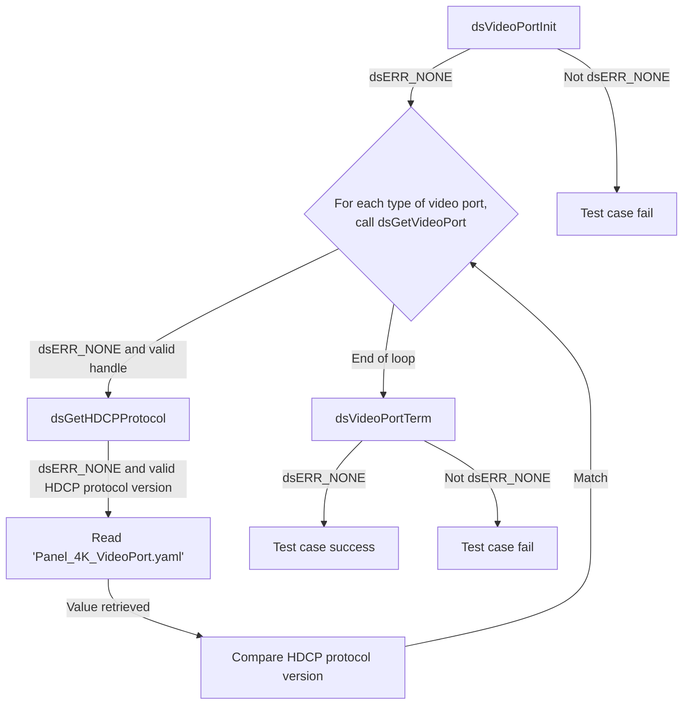
```mermaid
graph TB
A[dsVideoPortInit] -->|dsERR_NONE| B{For each type of video port, <br> call dsGetVideoPort }
B -->|dsERR_NONE and valid handle| C[dsGetHDCPProtocol]
A -->|Not dsERR_NONE| A1[Test case fail]
C -->|dsERR_NONE and valid HDCP protocol version| D[Read 'Panel_4K_VideoPort.yaml']
D -->|Value retrieved| E[Compare HDCP protocol version]
E -->|Match|B
B -->|End of loop| F[dsVideoPortTerm]
F -->|dsERR_NONE| G[Test case success]
F -->|Not dsERR_NONE| F1[Test case fail]
```

### Test 11

|Title|Details|
|--|--|
|Function Name|`test_l2_dsVideoPort_SetAndGetHdmiPreference`|
|Description|Set preferred HDCP Protocol version for each valid port and verify using get|
|Test Group|Module : 02|
|Test Case ID|11|
|Priority|High|

**Pre-Conditions :**
None

**Dependencies :**
None

**User Interaction :**
If user chose to run the test in interactive mode, then the test case has to be selected via console.

#### Test Procedure :

| Variation / Steps | Description | Test Data | Expected Result | Notes|
| -- | --------- | ---------- | -------------- | ----- |
| 01 | Initialize video port using dsVideoPortInit() | None | dsERR_NONE | Should be successful |
| 02 | Get video port handle for each port type using dsGetVideoPort() | portTypes[i] = dsVIDEOPORT_TYPE_RF, dsVIDEOPORT_TYPE_BB, dsVIDEOPORT_TYPE_SVIDEO, dsVIDEOPORT_TYPE_1394, dsVIDEOPORT_TYPE_DVI, dsVIDEOPORT_TYPE_COMPONENT, dsVIDEOPORT_TYPE_HDMI, dsVIDEOPORT_TYPE_HDMI_INPUT, dsVIDEOPORT_TYPE_INTERNAL | dsERR_NONE | Should be successful |
| 03 | Set HDMI preference for each HDCP protocol version using dsSetHdmiPreference() | handle = valid handle, hdcpCurrentProtocol = dsHDCP_VERSION_1X, dsHDCP_VERSION_2X | dsERR_NONE | Should be successful |
| 04 | Get HDMI preference using dsGetHdmiPreference() | handle = valid handle, hdcpCurrentProtocolGet = valid buffer | dsERR_NONE, hdcpCurrentProtocol = hdcpCurrentProtocolGet | Should be successful |
| 05 | Terminate video port using dsVideoPortTerm() | None | dsERR_NONE | Should be successful |

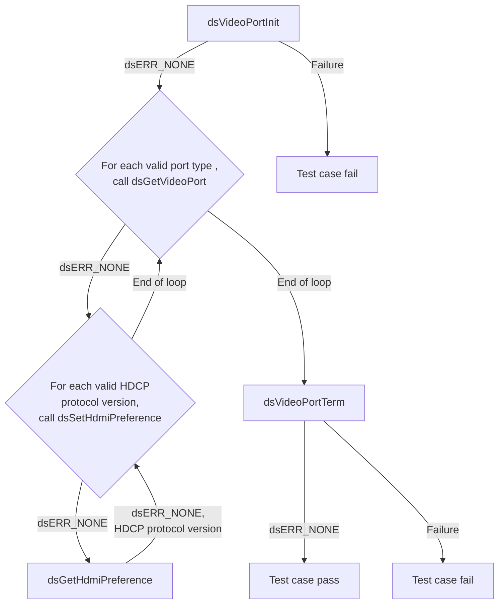
```mermaid
graph TB
A[dsVideoPortInit] -->|dsERR_NONE| B{For each valid port type , <br> call dsGetVideoPort}
B -->|dsERR_NONE| D{For each valid HDCP <br> protocol version, <br> call dsSetHdmiPreference}
D -->|dsERR_NONE| F[dsGetHdmiPreference]
F -->|dsERR_NONE,<br> HDCP protocol version| D
D -->|End of loop| B
B -->|End of loop|G[dsVideoPortTerm]
G -->|dsERR_NONE| H[Test case pass]
A -->|Failure| I[Test case fail]
G -->|Failure| M[Test case fail]
```

### Test 12

|Title|Details|
|--|--|
|Function Name|`test_l2_dsVideoPort_GetColorSpace`|
|Description|Get each port Color Space and compare with the configuration YAML file 'Panel_4K_VideoPort.yaml'. If it is a sink device, the value to be retrieved is Ports/PortNo/colorspaces" where PortNo is 1 as sink device has only INTERNAL port.|
|Test Group|Module : 02|
|Test Case ID|12|
|Priority|High|

**Pre-Conditions :**
None

**Dependencies :**
None

**User Interaction :**
If user chose to run the test in interactive mode, then the test case has to be selected via console.

#### Test Procedure :

| Variation / Steps | Description | Test Data | Expected Result | Notes|
| -- | --------- | ---------- | -------------- | ----- |
| 01 | Initialize video port subsystem using dsVideoPortInit | None | dsERR_NONE | Should be successful |
| 02 | Loop through each type of video port and get the handle of the video port using dsGetVideoPort() | type = dsVIDEOPORT_TYPE_RF to dsVIDEOPORT_TYPE_MAX, index = 0 | dsERR_NONE | Should be successful |
| 03 | Get color space using dsGetColorSpace | handle, &color_space | dsERR_NONE | Should be successful |
| 04 | Compare the color space value with the value in the configuration YAML file | color_space, "Ports/1/colorspaces" | None | Should be successful |
| 05 | Terminate video port subsystem using dsVideoPortTerm | None | dsERR_NONE | Should be successful |

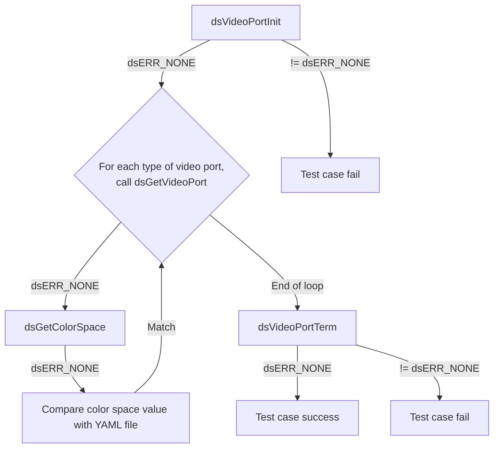
```mermaid
graph TB
    A[dsVideoPortInit] -->|dsERR_NONE| B{For each type of video port, <br> call dsGetVideoPort }
    B -->|dsERR_NONE| C[dsGetColorSpace]
    C -->|dsERR_NONE| D[Compare color space value with YAML file]
    D -->|Match| B
    B -->|End of loop| E[dsVideoPortTerm]
    E -->|dsERR_NONE| F[Test case success]
    A -->|!= dsERR_NONE| A1[Test case fail]
    E -->|!= dsERR_NONE| E1[Test case fail]
```

### Test 13

|Title|Details|
|--|--|
|Function Name|`test_l2_dsVideoPort_CheckColorDepthCapabilities_sink`|
|Description|Check each port Color Depth Capabilities and compare with the configuration YAML file 'Panel_4K_VideoPort.yaml'. If it is a sink device, the value to be retrieved is Ports/PortNo/Supported_color_depth_capabilities where PortNo is 1 as sink device has only INTERNAL port.|
|Test Group|Module : 02|
|Test Case ID|013|
|Priority|High|

**Pre-Conditions :**
None

**Dependencies :**
None

**User Interaction :**
If user chose to run the test in interactive mode, then the test case has to be selected via console.

#### Test Procedure :

| Variation / Steps | Description | Test Data | Expected Result | Notes|
| -- | --------- | ---------- | -------------- | ----- |
| 01 | Initialize Video Port sub-system using dsVideoPortInit | None | dsERR_NONE | Should be successful |
| 02 | Loop through each type of video port and get the handle of the video port using dsGetVideoPort() | type = dsVIDEOPORT_TYPE_RF to dsVIDEOPORT_TYPE_MAX, index = 0, &handle | dsERR_NONE | Should be successful |
| 03 | Get color depth capabilities using dsColorDepthCapabilities | handle, &colorDepthCapability | dsERR_NONE | Should be successful |
| 04 | Compare the obtained color depth capabilities with the values in the configuration YAML file | colorDepthCapability, "Ports/1/Supported_color_depth_capabilities" | None | Should be successful |
| 05 | Terminate Video Port sub-system using dsVideoPortTerm | None | dsERR_NONE | Should be successful |

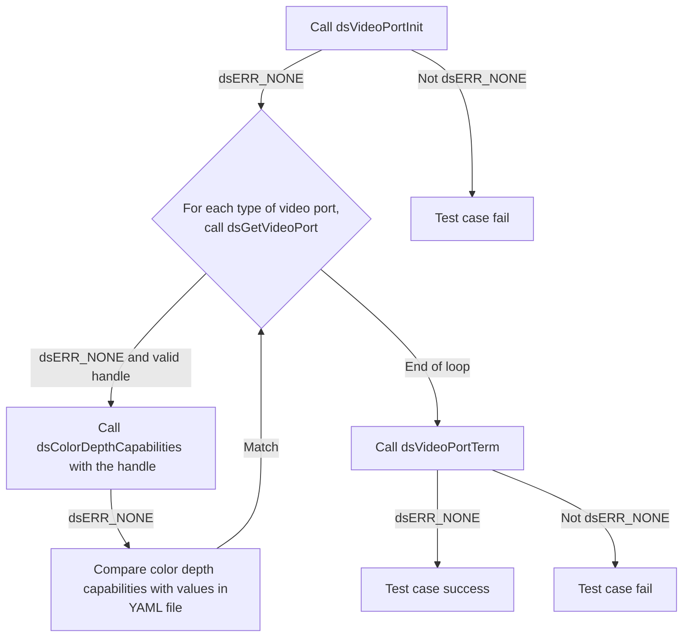
```mermaid
graph TB
A[Call dsVideoPortInit] -->|dsERR_NONE| B{For each type of video port, <br> call dsGetVideoPort }
A -->|Not dsERR_NONE| A1[Test case fail]
B -->|dsERR_NONE and valid handle| C[Call dsColorDepthCapabilities <br> with the handle]
C -->|dsERR_NONE| D[Compare color depth <br> capabilities with values in YAML file]
D -->|Match| B
B -->|End of loop|E[Call dsVideoPortTerm]
E -->|dsERR_NONE| F[Test case success]
E -->|Not dsERR_NONE| E1[Test case fail]
```

### Test 14

|Title|Details|
|--|--|
|Function Name|`test_l2_dsVideoPort_VerifyColorDepth`|
|Description|Get each port Color Depth and verify with the configuration YAML file 'Panel_4K_VideoPort.yaml'. If it is a sink device, the value to be retrieved is color_depth.|
|Test Group|Module : 02|
|Test Case ID|14|
|Priority|High|

**Pre-Conditions :**
None

**Dependencies :**
None

**User Interaction :**
If user chose to run the test in interactive mode, then the test case has to be selected via console.

#### Test Procedure :

| Variation / Steps | Description | Test Data | Expected Result | Notes|
| -- | --------- | ---------- | -------------- | ----- |
| 01 | Initialize video port subsystem using dsVideoPortInit | None | dsERR_NONE | Should be successful |
| 02 | Get video port handle for each type using dsGetVideoPort | type = dsVIDEOPORT_TYPE_RF to dsVIDEOPORT_TYPE_MAX, index = 0, handle = valid pointer | dsERR_NONE | Should be successful |
| 03 | Get color depth for each video port type using dsGetColorDepth | handle = obtained from previous step, color_depth = valid pointer | dsERR_NONE | Should be successful |
| 04 | Verify the obtained color depth with the expected value from the configuration file | color_depth = obtained from previous step | Expected value from configuration file | Should be successful |
| 05 | Terminate video port subsystem using dsVideoPortTerm | None | dsERR_NONE | Should be successful |

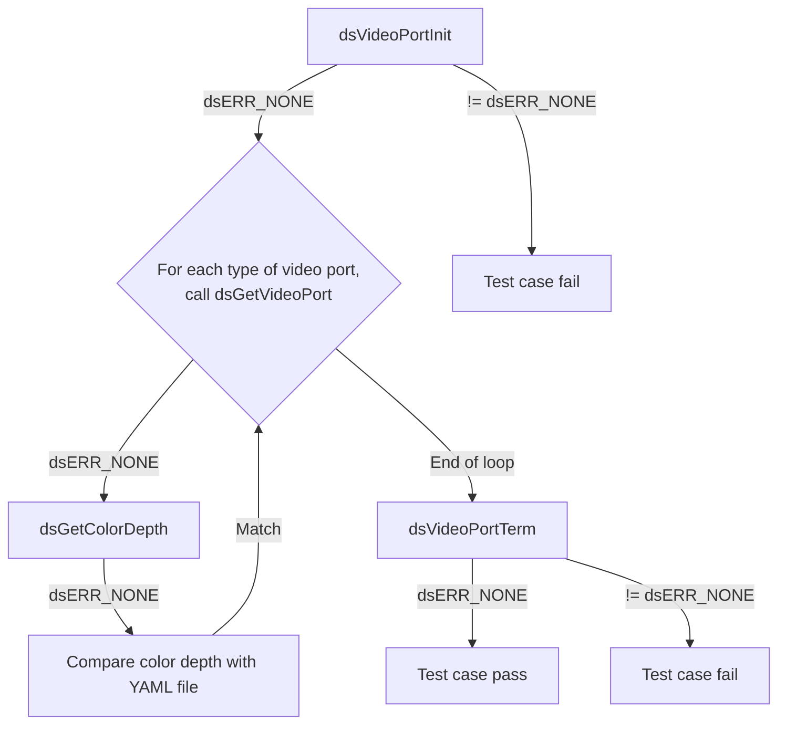
```mermaid
graph TB
    A[dsVideoPortInit] -->|dsERR_NONE| B{For each type of video port, <br> call dsGetVideoPort }
    B -->|dsERR_NONE| C[dsGetColorDepth]
    C -->|dsERR_NONE| D[Compare color depth with YAML file]
    D -->|Match| B
    B -->|End of loop| H[dsVideoPortTerm]
    H -->|dsERR_NONE| I[Test case pass]
    A -->|!= dsERR_NONE| J[Test case fail]
    H -->|!= dsERR_NONE| Q[Test case fail]
```

### Test 15

|Title|Details|
|--|--|
|Function Name|`test_l2_dsVideoPort_SetAndGetPreferredColorDepth_source`|
|Description|Set preferred color depth for each port and compare get function|
|Test Group|Module : 02|
|Test Case ID|015|
|Priority|High|

**Pre-Conditions :**
None

**Dependencies :**
None

**User Interaction :**
If user chose to run the test in interactive mode, then the test case has to be selected via console.

#### Test Procedure :

| Variation / Steps | Description | Test Data | Expected Result | Notes|
| -- | --------- | ---------- | -------------- | ----- |
| 01 | Initialize video port using dsVideoPortInit | None | dsERR_NONE | Should be successful |
| 02 | Loop through each type of video port and get the handle of the video port using dsGetVideoPort() | type = dsVIDEOPORT_TYPE_RF to dsVIDEOPORT_TYPE_MAX, index = 0 | dsERR_NONE | Should be successful |
| 03 | Set preferred color depth using dsSetPreferredColorDepth with handle obtained in step 2 and colorDepth=dsDISPLAY_COLORDEPTH_8BIT | handle=handle from step 2, colorDepth=dsDISPLAY_COLORDEPTH_8BIT | dsERR_NONE | Should be successful |
| 04 | Get preferred color depth using dsGetPreferredColorDepth with handle obtained in step 2 | handle=handle from step 2 | dsERR_NONE | Should be successful |
| 05 | Compare the color depth value set in step 3 with the value obtained in step 4 | colorDepth from step 3, getColorDepth from step 4 | colorDepth == getColorDepth | Should be successful |
| 06 | Terminate video port using dsVideoPortTerm | None | dsERR_NONE | Should be successful |

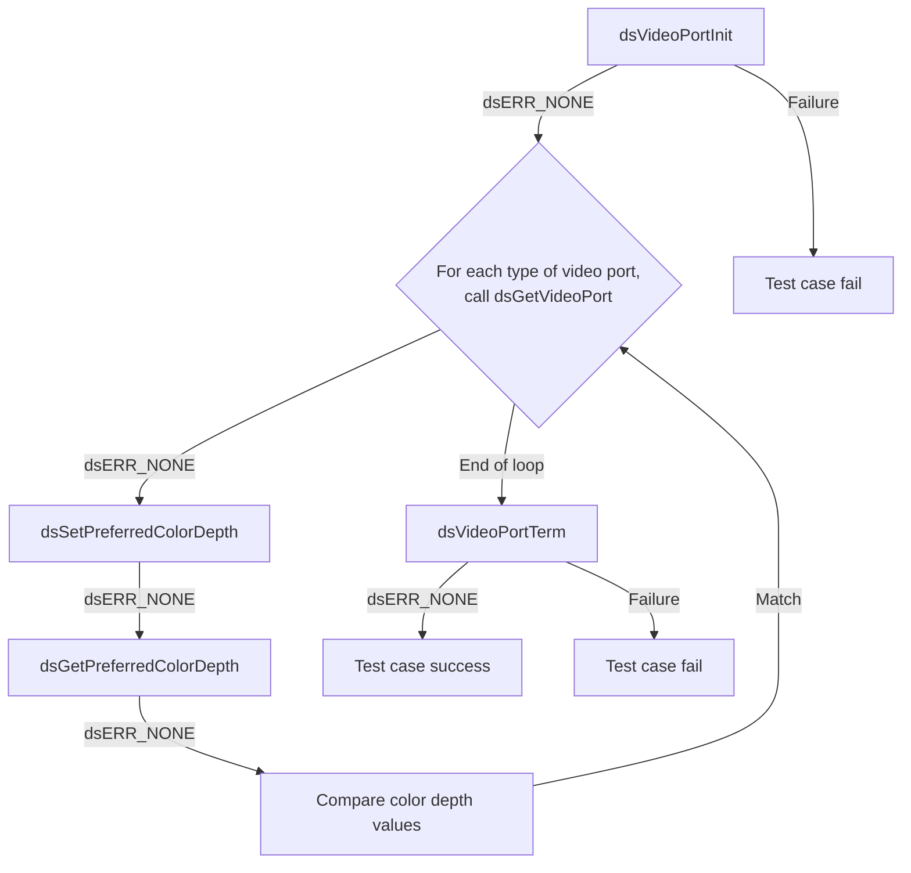
```mermaid
graph TB
A[dsVideoPortInit] -->|dsERR_NONE| B{For each type of video port, <br> call dsGetVideoPort }
A -->|Failure| A1[Test case fail]
B -->|dsERR_NONE| C[dsSetPreferredColorDepth]
C -->|dsERR_NONE| D[dsGetPreferredColorDepth]
D -->|dsERR_NONE| E[Compare color depth values]
E -->|Match| B
B -->|End of loop|F[dsVideoPortTerm]
F -->|dsERR_NONE| G[Test case success]
F -->|Failure| F1[Test case fail]
```

### Test 16

|Title|Details|
|--|--|
|Function Name|`test_l2_dsVideoPort_VerifyQuantizationRange_sink`|
|Description|Get each port QuantizationRange status and verify with the configuration YAML file 'Panel_4K_VideoPort.yaml'. If it is a sink device, the value to be retrieved is Ports/PortNo/quantization_ranges" where PortNo is 1 as sink device has only INTERNAL port.|
|Test Group|Module : 02|
|Test Case ID|16|
|Priority|High|

**Pre-Conditions :**
None

**Dependencies :**
None

**User Interaction :**
If user chose to run the test in interactive mode, then the test case has to be selected via console.

#### Test Procedure :

| Variation / Steps | Description | Test Data | Expected Result | Notes|
| -- | --------- | ---------- | -------------- | ----- |
| 01 | Initialize video port subsystem using dsVideoPortInit | None | dsERR_NONE | Should be successful |
| 02 | Loop through each type of video port and get the handle of the video port using dsGetVideoPort() | type = dsVIDEOPORT_TYPE_RF to dsVIDEOPORT_TYPE_MAX, index = 0, &handle | dsERR_NONE | Should be successful |
| 03 | Get quantization range using dsGetQuantizationRange | handle, &quantization_range | dsERR_NONE | Should be successful |
| 04 | Compare the quantization range with the value from YAML file | quantization_range, "Ports/1/quantization_ranges" | Equal values | Should be successful |
| 05 | Terminate video port subsystem using dsVideoPortTerm | None | dsERR_NONE | Should be successful |

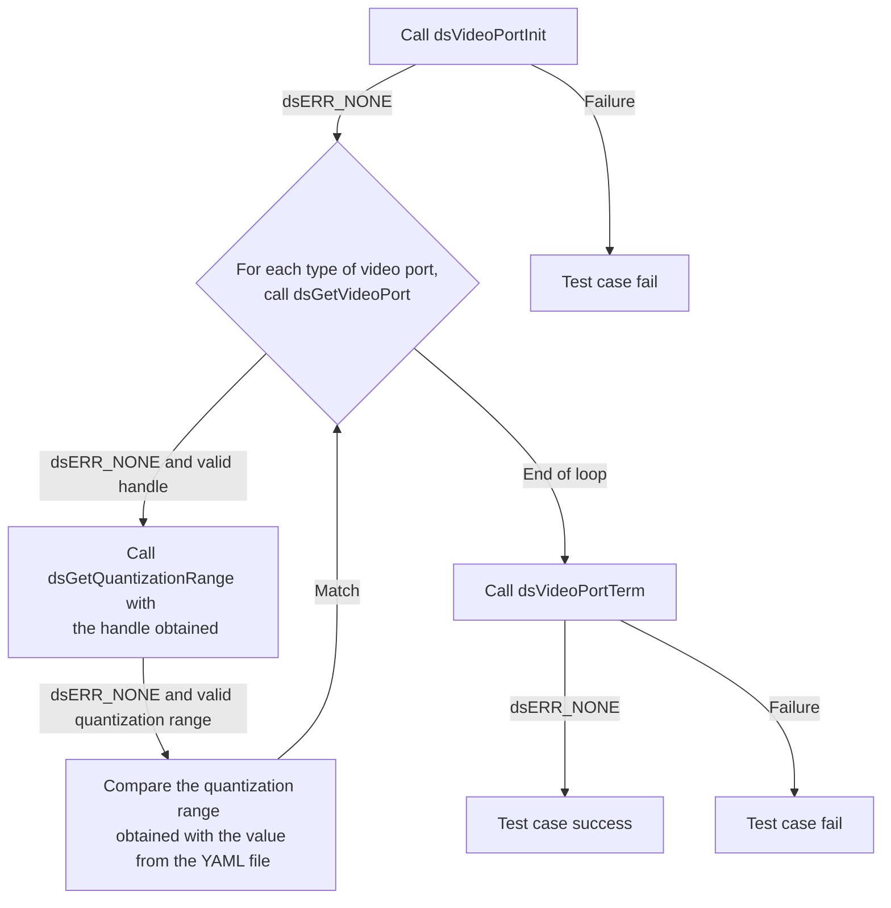
```mermaid
graph TB
A[Call dsVideoPortInit] -->|dsERR_NONE| B{For each type of video port, <br> call dsGetVideoPort }
A -->|Failure| A1[Test case fail]
B -->|dsERR_NONE and valid handle| C[Call dsGetQuantizationRange with <br> the handle obtained]
C -->|dsERR_NONE and valid quantization range| E[Compare the quantization range <br> obtained with the value <br> from the YAML file]
E -->|Match| B
B -->|End of loop|F[Call dsVideoPortTerm]
F -->|dsERR_NONE| G[Test case success]
F -->|Failure| F1[Test case fail]
```

### Test 17

|Title|Details|
|--|--|
|Function Name|`test_l2_dsVideoPort_GetMatrixCoefficients`|
|Description|Get each port MatrixCoefficients status and verify return dsDISPLAY_MATRIXCOEFFICIENT_UNKNOWN for source and with the configuration YAML file 'Panel_4K_VideoPort.yaml'. If it is a sink device, the value to be retrieved is Ports/PortNo/matrix_coefficients" where PortNo is 1 as sink device has only INTERNAL port.|
|Test Group|Module : 02|
|Test Case ID|017|
|Priority|High|

**Pre-Conditions :**
None

**Dependencies :**
None

**User Interaction :**
If user chose to run the test in interactive mode, then the test case has to be selected via console.

#### Test Procedure :

| Variation / Steps | Description | Test Data | Expected Result | Notes|
| -- | --------- | ---------- | -------------- | ----- |
| 01 | Initialize the video port using dsVideoPortInit | None | dsERR_NONE | Should be successful |
| 02 | Loop through each type of video port and get the handle of the video port using dsGetVideoPort() | type = dsVIDEOPORT_TYPE_RF to dsVIDEOPORT_TYPE_MAX, index = 0 | dsERR_NONE | Should be successful |
| 03 | Get the Matrix Coefficients using dsGetMatrixCoefficients with the handle obtained from previous step | handle = obtained from step 02 | dsERR_NONE | Should be successful |
| 04 | Verify the retrieved Matrix Coefficients | matrix_coefficients = obtained from step 03 | Ports/1/matrix_coefficients | Should be successful |
| 05 | Terminate the video port using dsVideoPortTerm | None | dsERR_NONE | Should be successful |

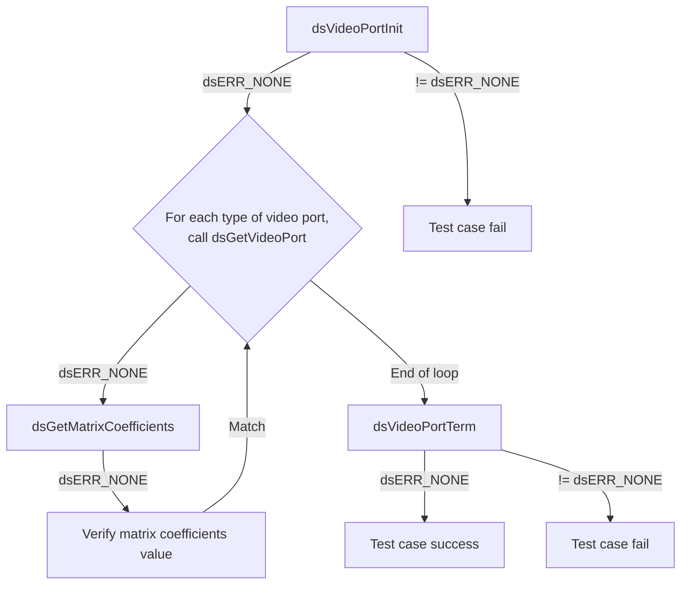
```mermaid
graph TB
    A[dsVideoPortInit] -->|dsERR_NONE| B{For each type of video port, <br> call dsGetVideoPort }
    B -->|dsERR_NONE| C[dsGetMatrixCoefficients]
    C -->|dsERR_NONE| D[Verify matrix coefficients value]
    D -->|Match| B
    B -->|End of loop|E[dsVideoPortTerm]
    E -->|dsERR_NONE| F[Test case success]
    A -->|!= dsERR_NONE| G[Test case fail]
    E -->|!= dsERR_NONE| K[Test case fail]
```
