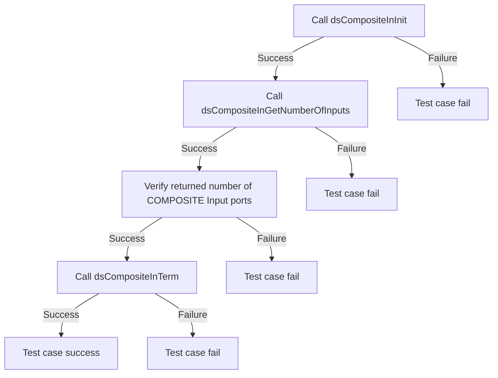
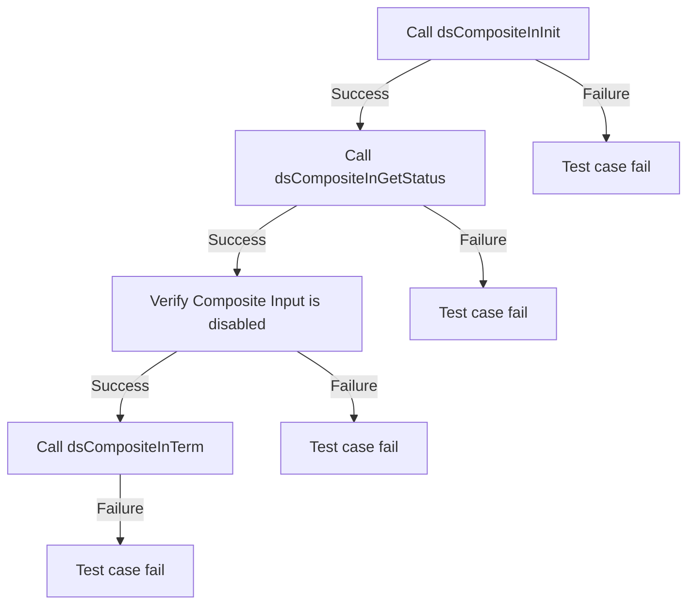
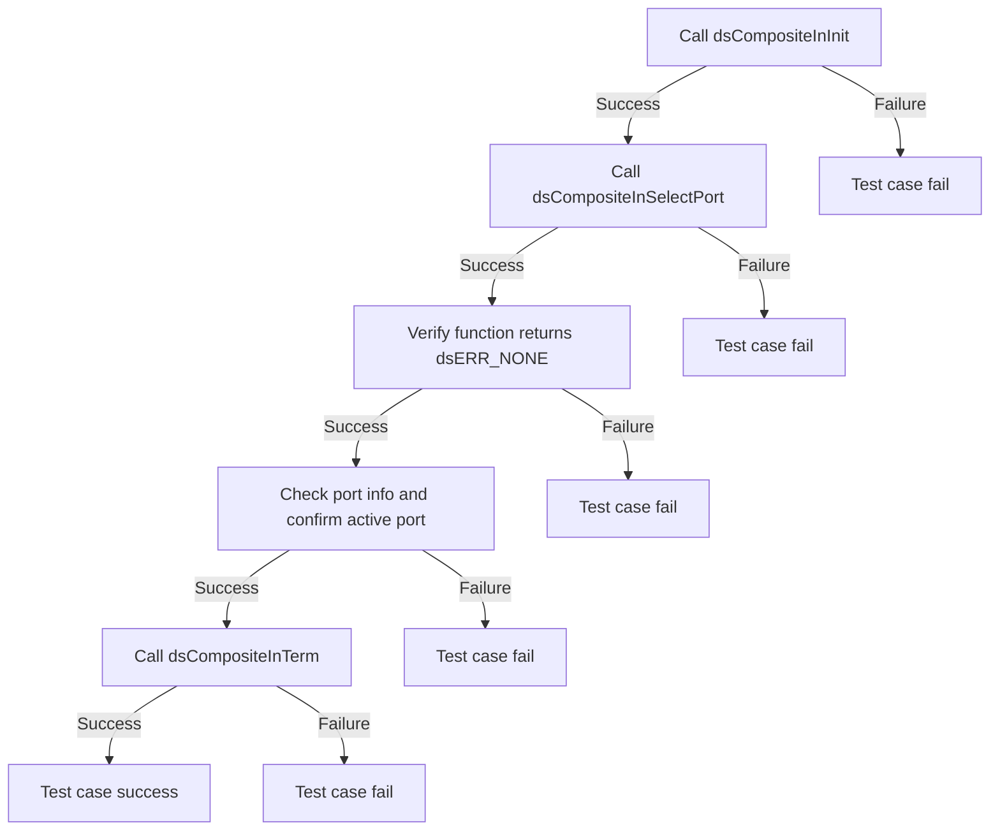

### Test 1

|Title|Details|
|--|--|
|Function Name|`test_l2_dsCompositeIn_GetNumberOfInputs`|
|Description|Verify that the function returns the expected COMPOSITE Input ports.|
|Test Group|Module : 02|
|Test Case ID|001|
|Priority|High|

**Pre-Conditions :**
None

**Dependencies :**
None

**User Interaction :**
If user chose to run the test in interactive mode, then the test case has to be selected via console.

#### Test Procedure :

| Variation / Steps | Description | Test Data | Expected Result | Notes|
| -- | --------- | ---------- | -------------- | ----- |
| 01 | Initialize the COMPOSITE Input ports using dsCompositeInInit | None | dsERR_NONE | Should be successful |
| 02 | Get the number of COMPOSITE Input ports using dsCompositeInGetNumberOfInputs | numInputs = valid buffer | dsERR_NONE | Should be successful |
| 03 | Verify the returned number of COMPOSITE Input ports | numInputs = valid buffer | numInputs >= 0 | Should be successful |
| 04 | Terminate the COMPOSITE Input ports using dsCompositeInTerm | None | dsERR_NONE | Should be successful |

### Test 2

|Title|Details|
|--|--|
|Function Name|`test_l2_dsCompositeIn_VerifyCompositeInputStatus`|
|Description|Verify the status of the Composite Input by ensuring it is in disable status.|
|Test Group|Module : 02|
|Test Case ID|002|
|Priority|High|

**Pre-Conditions :**
None

**Dependencies :**
None

**User Interaction :**
If user chose to run the test in interactive mode, then the test case has to be selected via console.

#### Test Procedure :

| Variation / Steps | Description | Test Data | Expected Result | Notes|
| -- | --------- | ---------- | -------------- | ----- |
| 01 | Initialize the Composite Input using dsCompositeInInit() | None | dsERR_NONE | Should be successful |
| 02 | Get the status of the Composite Input using dsCompositeInGetStatus() | status = valid buffer | dsERR_NONE | Should be successful |
| 03 | Verify if the Composite Input is disabled | status.isPresented = false | dsERR_NONE | Should be successful |
| 04 | Terminate the Composite Input using dsCompositeInTerm() | None | dsERR_NONE | Should be successful |

### Test 3

|Title|Details|
|--|--|
|Function Name|`test_l2_dsCompositeIn_SelectPort`|
|Description|Verify that the function successfully sets the specified COMPOSITE Input port as active for presentation and check the port information using "Get status".|
|Test Group|Module : 02|
|Test Case ID|003|
|Priority|High|

**Pre-Conditions :**
None

**Dependencies :**
None

**User Interaction :**
If user chose to run the test in interactive mode, then the test case has to be selected via console.

#### Test Procedure :

| Variation / Steps | Description | Test Data | Expected Result | Notes|
| -- | --------- | ---------- | -------------- | ----- |
| 01 | Initialize the Composite Input using dsCompositeInInit() | None | dsERR_NONE | Should be successful |
| 02 | Select the Composite Input port using dsCompositeInSelectPort() | port = dsCOMPOSITE_IN_PORT_0 | dsERR_NONE | Should be successful |
| 03 | Verify the selected port is active (implementation dependent) | activePort = port | activePort should be equal to port | Should be successful |
| 04 | Terminate the Composite Input using dsCompositeInTerm() | None | dsERR_NONE | Should be successful |

