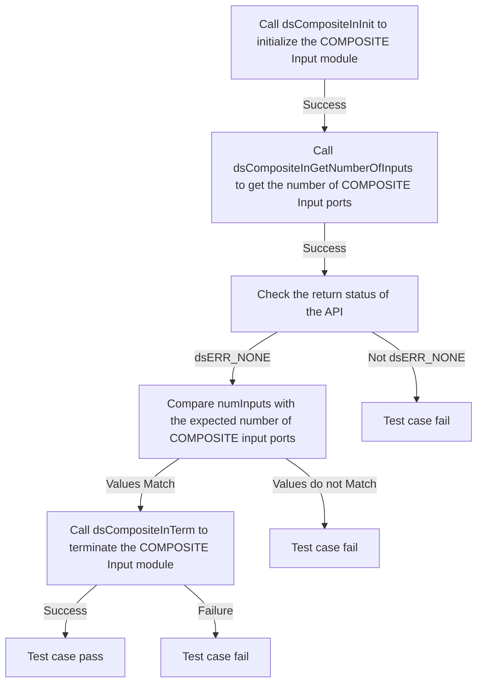
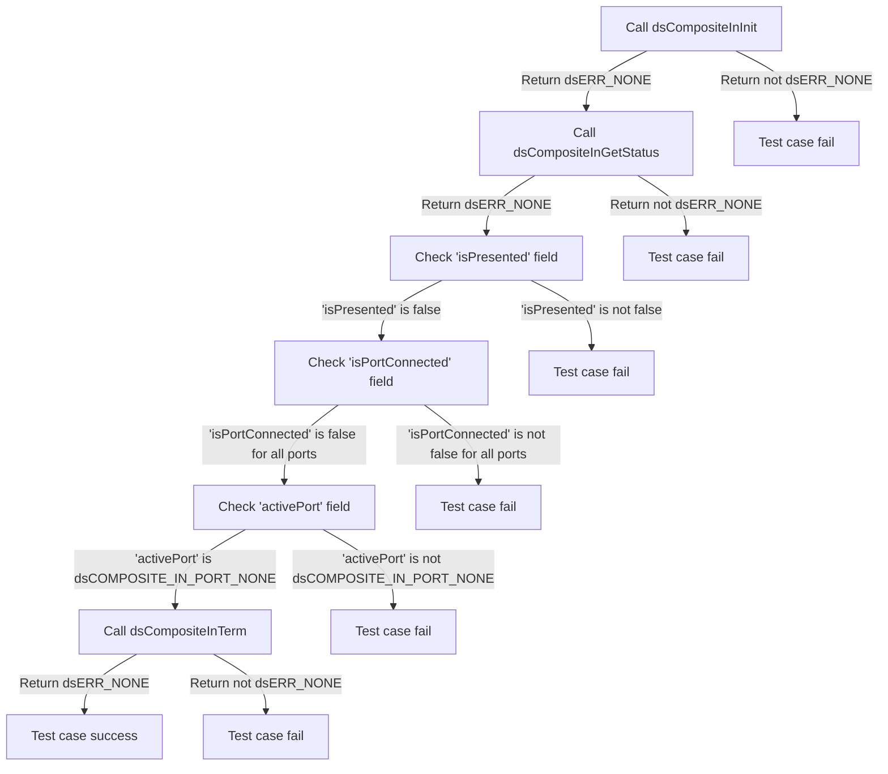
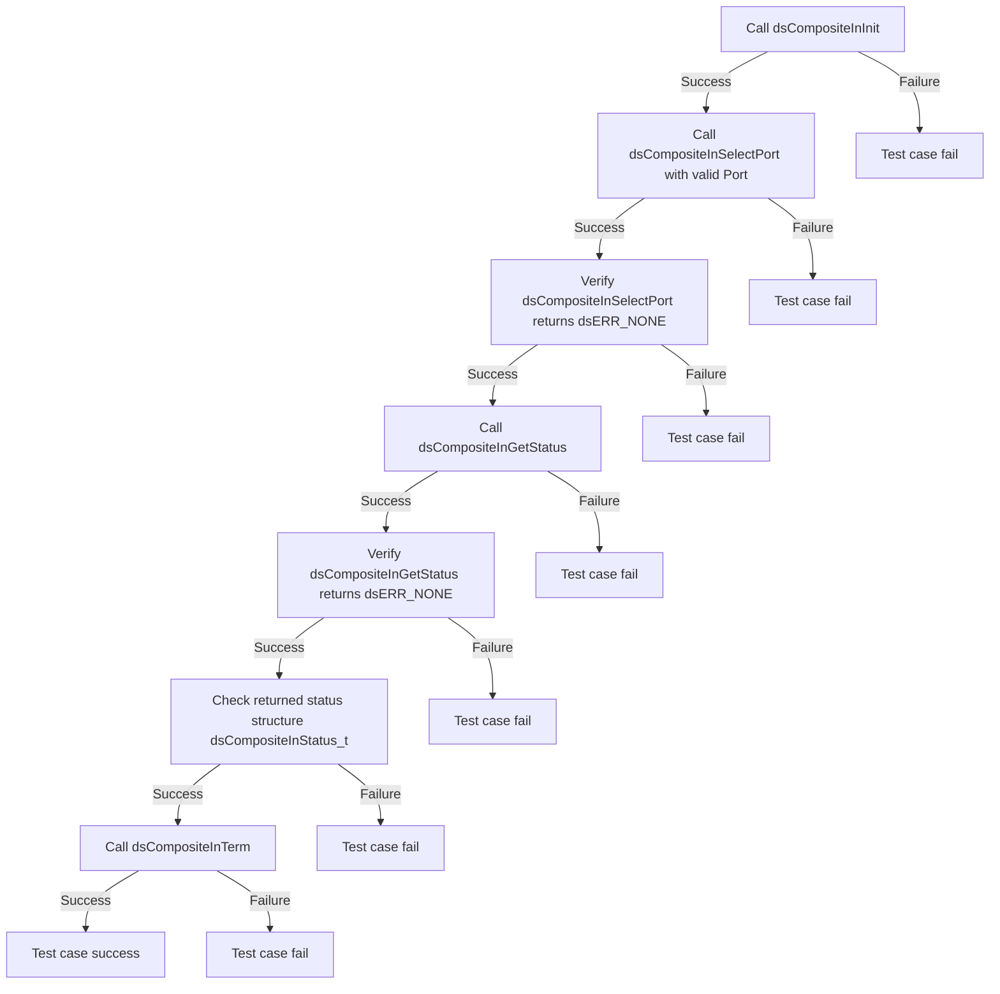
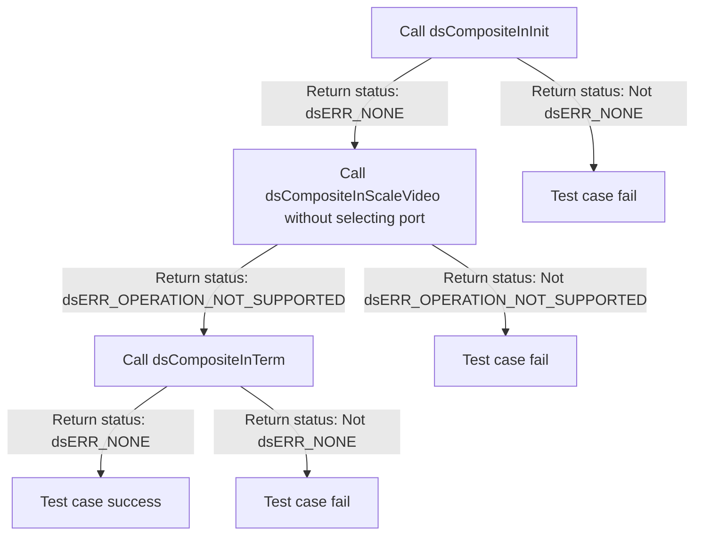

# DSCOMPOSITEIN Level 2 - Module Testing
 
| Version | Date(YY-MM-DD) | Comments |
| -------| ----- |  ----- |
| 1.0.0 | 20/05/24 | Inital Document |
 
## Table of Contents
            
- [DSCOMPOSITEIN Level 2 - Module Testing](#dscompositein-level-2---module-testing)
  - [History](#history)
  - [Table of Contents](#table-of-contents)
  - [Overview](#overview)
    - [Acronyms, Terms and Abbreviations](#acronyms-terms-and-abbreviations)
    - [Definitions](#definitions)
    - [References](#references)
  - [Level 2 Test Suite](#level-2-test-suite)
 
## Overview

This document describes the level 2 testing suite for the DSCOMPOSITEIN module.
 
### Acronyms, Terms and Abbreviations

- `HAL` \- Hardware Abstraction Layer, may include some common components
- `HAL.h`  \- Abstracted defined API to control the hardware
- `HAL.c`  \- Implementation wrapper layer created by the `OEM` or `SoC` Vendor.
- `RDK`  \- Reference Design Kit for All Devices
- `RDK-B`  \- Reference Design Kit for Broadband Devices
- `RDK-V`  \- Reference Design Kit for Video Devices
- `UT`  \- Unit Test(s)
- `OEM`  \- Original Equipment Manufacture
- `SoC`  \- System on a Chip
 
### Definitions

- `Soc Vendor` \- Definition to encompass multiple vendors
- `Unit Tests` \- C Function tests that run on the target hardware
- `Common Testing Framework` \- Off the shelf 3rd Party Testing Framework, or framework that does not require infrastructure to control it. That's not to say it cannot be controlled via infrastructure if required. Examples of which are.
  - `GTest` \- Google Test Suit <https://google.github.io/googletest>
  - `CUnit` \- C Testing Suit <http://cunit.sourceforge.net/>
  - `Unity` \- C Embedded Testing Suit <http://www.throwtheswitch.org/unity>
  - `ut-core` \- Common Testing Framework <https://github.com/rdkcentral/ut-core>, which wraps a open-source framework that can be expanded to the requirements for future framework.
 
### References

- `Feedback Loops` \- <https://www.softwaretestingnews.co.uk/4-methods-to-improve-your-feedback-loops-and-supercharge-your-testing-process/>
- `Doxygen` \- SourceCode documentation tool - <https://www.doxygen.nl/index.html>
- `Black Box Testing` \- <https://en.wikipedia.org/wiki/Black-box_testing>
 
## Level 2 Test Suite

The following functions are expecting to test the module operates correctly.
 
### Test 1

|Title|Details|
|--|--|
|Function Name|`test_l2_dsCompositeIn_VerifyCompositeInputPorts`|
|Description|Verify that the function returns the expected COMPOSITE input ports. Compare the input port values with the configuration file.|
|Test Group|Module : 02|
|Test Case ID|001|
|Priority|High|

**Pre-Conditions :**
None

**Dependencies :** 
None

**User Interaction :** 
If user chose to run the test in interactive mode, then the test case has to be selected via console.

#### Test Procedure :

| Variation / Steps | Description | Test Data | Expected Result | Notes|
| -- | --------- | ---------- | -------------- | ----- |
| 01 | Initialize the COMPOSITE Input module using dsCompositeInInit | None | dsERR_NONE | Should be successful |
| 02 | Get the number of COMPOSITE Input ports on the specific platform using dsCompositeInGetNumberOfInputs | numInputs = valid buffer | dsERR_NONE | Should be successful |
| 03 | Check the return status of the API | status = dsERR_NONE | dsERR_NONE | Should be successful |
| 04 | Compare the value of the numInputs with the expected number of COMPOSITE input ports from the configuration file | numInputs = numInputs from configuration file | dsERR_NONE | Should be successful |
| 05 | Terminate the COMPOSITE Input module using dsCompositeInTerm | None | dsERR_NONE | Should be successful |

### Test 2

|Title|Details|
|--|--|
|Function Name|`test_l2_dsCompositeIn_VerifyCompositeInputStatus`|
|Description|Verify the status of the Composite Input by ensuring it is in disable status.|
|Test Group|Module : 02|
|Test Case ID|002|
|Priority|High|

**Pre-Conditions :**
None

**Dependencies :** 
None

**User Interaction :** 
If user chose to run the test in interactive mode, then the test case has to be selected via console.

#### Test Procedure :

| Variation / Steps | Description | Test Data | Expected Result | Notes|
| -- | --------- | ---------- | -------------- | ----- |
| 01 | Initialize the Composite Input using dsCompositeInInit() | None | dsERR_NONE | Should be successful |
| 02 | Get the status of the Composite Input using dsCompositeInGetStatus() | status = valid buffer | dsERR_NONE | Should be successful |
| 03 | Check 'isPresented' field of the status | isPresented = false | false | Should be successful |
| 04 | Check 'isPortConnected' field of the status for all ports | isPortConnected[i] = false for all i | false | Should be successful |
| 05 | Check 'activePort' field of the status | activePort = dsCOMPOSITE_IN_PORT_NONE | dsCOMPOSITE_IN_PORT_NONE | Should be successful |
| 06 | Terminate the Composite Input using dsCompositeInTerm() | None | dsERR_NONE | Should be successful |

### Test 3

|Title|Details|
|--|--|
|Function Name|`test_l2_dsCompositeIn_SetAndCheckCompositeInputPort`|
|Description|Verify that the function successfully sets the specified COMPOSITE Input port when there is no connection of source device and check the disable status of the port information using Get status.|
|Test Group|Module : 02|
|Test Case ID|003|
|Priority|High|

**Pre-Conditions :**
None

**Dependencies :**
None

**User Interaction :**
If user chose to run the test in interactive mode, then the test case has to be selected via console.

#### Test Procedure :

| Variation / Steps | Description | Test Data | Expected Result | Notes|
| -- | --------- | ---------- | -------------- | ----- |
| 01 | Initialize the COMPOSITE Input sub-system using dsCompositeInInit | None | dsERR_NONE | Should be successful |
| 02 | Select a random port from the available ports | port = random value between 0 and dsCOMPOSITE_IN_PORT_MAX | dsERR_NONE | Should be successful |
| 03 | Set the COMPOSITE Input port for presentation using dsCompositeInSelectPort | port = selected random port | dsERR_NONE | Should be successful |
| 04 | Get the status of all COMPOSITE Input Status using dsCompositeInGetStatus | status = valid buffer | dsERR_NONE | Should be successful |
| 05 | Check the returned status | status.isPresented = false, status.isPortConnected[port] = false, status.activePort = selected random port | false, false, selected random port | Should be successful |
| 06 | Terminate the COMPOSITE Input sub-system using dsCompositeInTerm | None | dsERR_NONE | Should be successful |

### Test 4

|Title|Details|
|--|--|
|Function Name|`test_l2_dsCompositeIn_ScaleVideoWithoutSelectingPort`|
|Description|Scaling the COMPOSITE input video without selecting the composite Input port. It should result as 'NOT SUPPORTED'.|
|Test Group|Module : 02|
|Test Case ID|004|
|Priority|High|

**Pre-Conditions :**
None

**Dependencies :** 
None

**User Interaction :** 
If user chose to run the test in interactive mode, then the test case has to be selected via console.

#### Test Procedure :

| Variation / Steps | Description | Test Data | Expected Result | Notes|
| -- | --------- | ---------- | -------------- | ----- |
| 01 | Initialize the composite input using dsCompositeInInit | None | dsERR_NONE | Should be successful |
| 02 | Scale the video without selecting the composite input port using dsCompositeInScaleVideo | x = random value, y = random value, width = random value, height = random value | dsERR_OPERATION_NOT_SUPPORTED | Should fail |
| 03 | Terminate the composite input using dsCompositeInTerm | None | dsERR_NONE | Should be successful |

