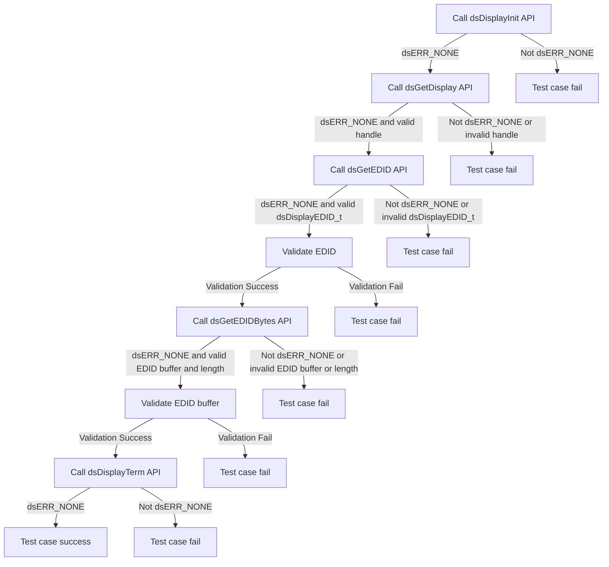
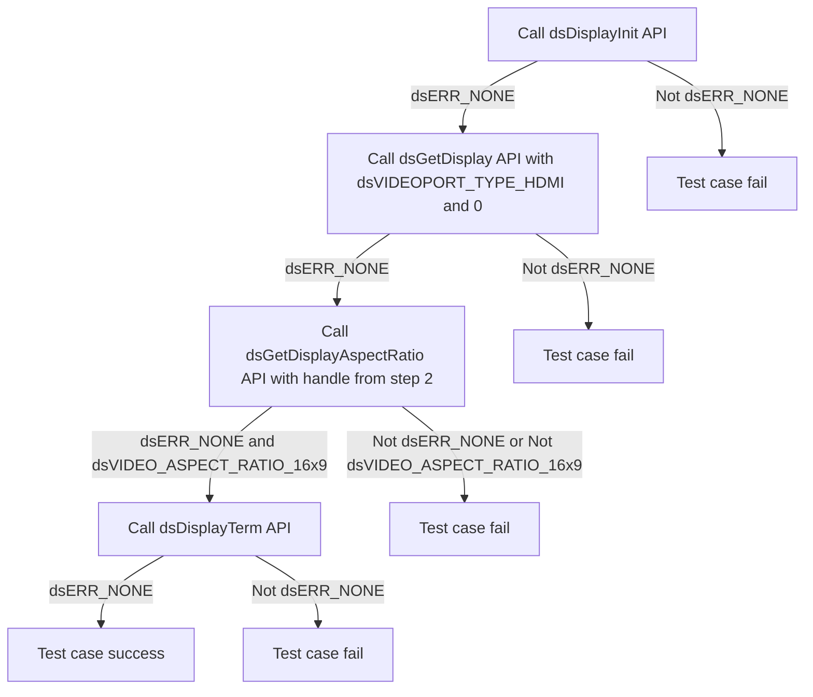

# DSDISPLAY Level 2 - Module Testing
 
| Version | Date(YY-MM-DD) | Comments |
| -------| ----- |  ----- |
| 1.0.0 | 20/05/24 | Inital Document |
 
## Table of Contents
            
- [DSDISPLAY Level 2 - Module Testing](#dsdisplay-level-2---module-testing)
  - [History](#history)
  - [Table of Contents](#table-of-contents)
  - [Overview](#overview)
    - [Acronyms, Terms and Abbreviations](#acronyms-terms-and-abbreviations)
    - [Definitions](#definitions)
    - [References](#references)
  - [Level 2 Test Suite](#level-2-test-suite)
 
## Overview

This document describes the level 2 testing suite for the DSDISPLAY module.
 
### Acronyms, Terms and Abbreviations

- `HAL` \- Hardware Abstraction Layer, may include some common components
- `HAL.h`  \- Abstracted defined API to control the hardware
- `HAL.c`  \- Implementation wrapper layer created by the `OEM` or `SoC` Vendor.
- `RDK`  \- Reference Design Kit for All Devices
- `RDK-B`  \- Reference Design Kit for Broadband Devices
- `RDK-V`  \- Reference Design Kit for Video Devices
- `UT`  \- Unit Test(s)
- `OEM`  \- Original Equipment Manufacture
- `SoC`  \- System on a Chip
 
### Definitions

- `Soc Vendor` \- Definition to encompass multiple vendors
- `Unit Tests` \- C Function tests that run on the target hardware
- `Common Testing Framework` \- Off the shelf 3rd Party Testing Framework, or framework that does not require infrastructure to control it. That's not to say it cannot be controlled via infrastructure if required. Examples of which are.
  - `GTest` \- Google Test Suit <https://google.github.io/googletest>
  - `CUnit` \- C Testing Suit <http://cunit.sourceforge.net/>
  - `Unity` \- C Embedded Testing Suit <http://www.throwtheswitch.org/unity>
  - `ut-core` \- Common Testing Framework <https://github.com/rdkcentral/ut-core>, which wraps a open-source framework that can be expanded to the requirements for future framework.
 
### References

- `Feedback Loops` \- <https://www.softwaretestingnews.co.uk/4-methods-to-improve-your-feedback-loops-and-supercharge-your-testing-process/>
- `Doxygen` \- SourceCode documentation tool - <https://www.doxygen.nl/index.html>
- `Black Box Testing` \- <https://en.wikipedia.org/wiki/Black-box_testing>
 
## Level 2 Test Suite

The following functions are expecting to test the module operates correctly.
 
### Test 1

|Title|Details|
|--|--|
|Function Name|`test_l2_dsDisplay_ValidateEDID`|
|Description|For sink devices, validate the predefined the EDID value coming from the TV HDMI port1 EDID|
|Test Group|Module : 02|
|Test Case ID|001|
|Priority|High|

**Pre-Conditions :**
None

**Dependencies :**
None

**User Interaction :**
If user chose to run the test in interactive mode, then the test case has to be selected via console.

#### Test Procedure :

| Variation / Steps | Description | Test Data | Expected Result | Notes|
| -- | --------- | ---------- | -------------- | ----- |
| 01 | Initialize the display using dsDisplayInit() | None | dsERR_NONE | Should be successful |
| 02 | Get the display handle for HDMI port 1 using dsGetDisplay() | dsVIDEOPORT_TYPE_HDMI, 0, &handle | dsERR_NONE | Should be successful |
| 03 | Get the EDID information using dsGetEDID() | handle, &edid | dsERR_NONE | Should be successful |
| 04 | Validate the obtained EDID information with the predefined EDID value | | EDID value matches | Should be successful  |
| 05 | Get the EDID bytes using dsGetEDIDBytes() | handle, edidBuffer, &length | dsERR_NONE | Should be successful |
| 06 | Validate the obtained EDID buffer with the predefined EDID buffer |  | EDID buffer matches | Should be successful |
| 07 | Terminate the display using dsDisplayTerm() | None | dsERR_NONE | Should be successful |

### Test 2

|Title|Details|
|--|--|
|Function Name|`test_l2_dsDisplay_TestDefaultAspectRatio`|
|Description|Test the default aspect ratio (16:9) without any TV connected.|
|Test Group|Module : 02|
|Test Case ID|002|
|Priority|High|

**Pre-Conditions :**
None

**Dependencies :** 
None

**User Interaction :** 
If user chose to run the test in interactive mode, then the test case has to be selected via console.

#### Test Procedure :

| Variation / Steps | Description | Test Data | Expected Result | Notes|
| -- | --------- | ---------- | -------------- | ----- |
| 01 | Initialize the display using dsDisplayInit API | None | dsERR_NONE | Should be successful |
| 02 | Get the display handle using dsGetDisplay API | vType = dsVIDEOPORT_TYPE_HDMI, index = 0 | dsERR_NONE | Should be successful |
| 03 | Get the display aspect ratio using dsGetDisplayAspectRatio API | handle = obtained from step 02 | dsERR_NONE, dsVIDEO_ASPECT_RATIO_16x9 | Should be successful |
| 04 | Terminate the display using dsDisplayTerm API | None | dsERR_NONE | Should be successful |

