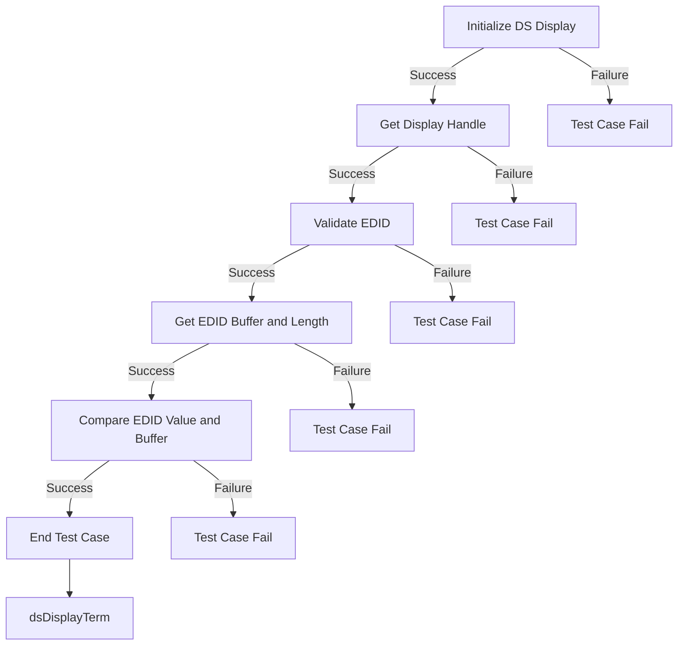

### Test 1

|Title|Details|
|--|--|
|Function Name|`test_l2_dsDisplay_ValidateEDID`|
|Description|For sink devices, validate the predefined the EDID value coming from the TV HDMI port1 EDID|
|Test Group|Module : 02|
|Test Case ID|001|
|Priority|High|

**Pre-Conditions :**
None

**Dependencies :**
None

**User Interaction :**
If user chose to run the test in interactive mode, then the test case has to be selected via console.

#### Test Procedure :

| Variation / Steps | Description | Test Data | Expected Result | Notes|
| -- | --------- | ---------- | -------------- | ----- |
| 01 | Initialize DS Display using dsDisplayInit | None | dsERR_NONE | Should be successful |
| 02 | Get Display Handle using dsGetDisplay | dsVIDEOPORT_TYPE_HDMI, 0, &handle | dsERR_NONE | Should be successful |
| 03 | Validate EDID using dsGetEDID | handle, &edid | dsERR_NONE | Should be successful |
| 04 | Get EDID Buffer and Length using dsGetEDIDBytes | handle, edidBuffer, &length | dsERR_NONE | Should be successful |
| 05 | Compare EDID Value and Buffer using memcmp | edidBuffer, &edid, length | 0 | Should be successful |
| 06 | Terminate the DS Display using dsDisplayTerm() | None | dsERR_NONE | Should be successful |

